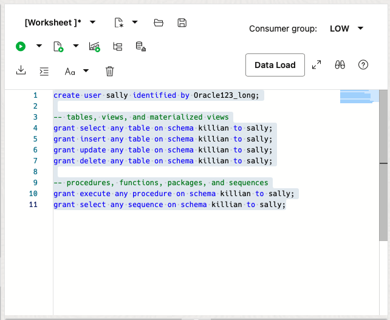
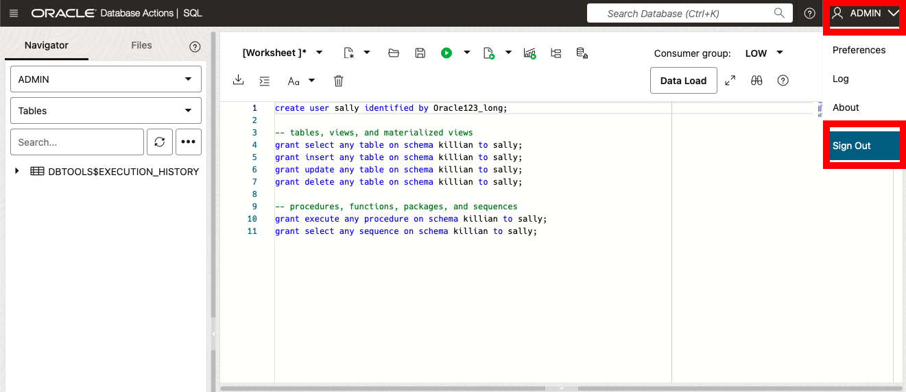
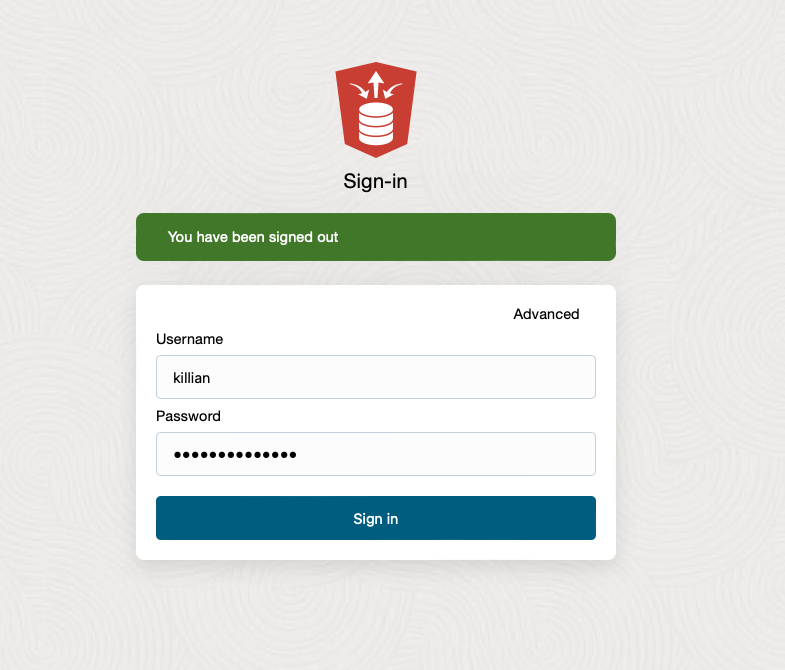
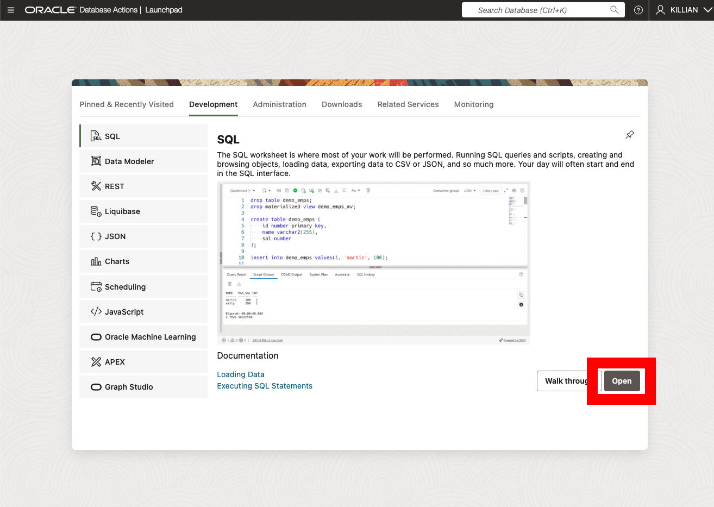
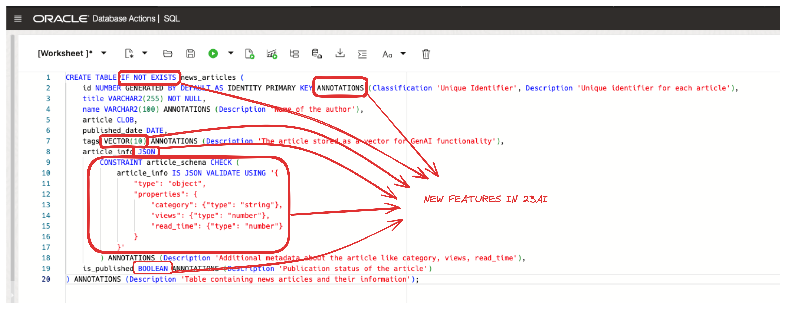

# Exploring New Features in Oracle Database 23ai

## Introduction

Welcome to the Oracle Database 23ai Quick Start workshop. In this lab, you will learn about a handful of new features in the Oracle Database.

Estimated Lab Time: 15 minutes

### Objective:

The objective of this workshop is to familiarize you with some of the new features in Oracle Database 23ai. You will learn how to:

* Create a table with the new vector, boolean, and JSON data types
* Create Schema Annotations
* Create and use Data Use Case Domains
* Grant schema-level privileges
* Assign the new Developer Role
* Employ the IF [NOT] EXISTS statement for conditional SQL execution
* Utilize Table Value Constructors for simplified multi-row operations
* Use the new AI Vector Search `vector_distance` functions and operators to perform similarity search

Please note, this lab provides a high-level overview of some of Oracle Database 23ai’s new features. This is a small set of the 300+ new features in the database. For a comprehensive workshop, please visit the [23ai New Features](https://livelabs.oracle.com/pls/apex/r/dbpm/livelabs/view-workshop?wid=3950&clear=RR,180&session=106510486911799).

### Prerequisites:

- Access to Oracle Database 23ai environment.
- Basic understanding of SQL.

## Task 1: Granting Developer Role and Schema Level Privileges

1. Let's first sign into Database Actions. Database Actions give you development tools, data tools, administration, and monitoring features for Autonomous Database. Using Database Actions, you can run SQL statements, queries, and scripts in a worksheet. 

    From the Autonomous Database home page, **click** Database action and then **click** SQL.

    >**Hint**: If the SQL editor doesn’t open, double-check that your browser didn’t block the new tab from opening.

    

2. Throughout this lab, you'll need a user. Let’s create a user and REST-enable the schema so that we can connect as the user.

    ```
    <copy>

    -- Create USER SQL
    CREATE USER KILLIAN IDENTIFIED BY Oracle123_long;

    -- Grant roles
    GRANT CONNECT TO KILLIAN;
    GRANT RESOURCE TO KILLIAN;

    -- Enable REST
    BEGIN
        ORDS_ADMIN.ENABLE_SCHEMA(
            p_enabled => TRUE,
            p_schema => 'KILLIAN',
            p_url_mapping_type => 'BASE_PATH',
            p_url_mapping_pattern => 'killian',
            p_auto_rest_auth => TRUE
        );

        -- Enable data sharing
        C##ADP$SERVICE.DBMS_SHARE.ENABLE_SCHEMA(
            SCHEMA_NAME => 'KILLIAN',
            ENABLED => TRUE
        );
        COMMIT;
    END;
    /

    -- Set quota
    ALTER USER KILLIAN QUOTA 100M ON DATA;

    </copy>
    ```

3. Now you can grant them the **NEW** Developer Role.

    Typically, you may want to grant all resources and roles at once. However, to highlight this new role in this demo, it’s been separated from the SQL statements above.

    The Developer Role gives you a full set of system privileges, object privileges, predefined roles, PL/SQL package privileges, and tracing privileges required by application developers. It simplifies privilege management and helps keep the database as secure as possible for the development environment. As always, please review the privileges granted in this role and compare them with your organization’s security protocols.

4. To grant the Developer Role to another user, use the GRANT statement.

    ```
    <copy>
    grant db_developer_role to killian;
    </copy>
    ```

    

    You can also 'REVOKE' this role if necessary.

5. Now let's check out the **NEW** Schema Level Privileges. Before looking at the code, let's briefly talk about the traditional methods of privilege management in Oracle databases.

    Individual Privilege Grants: This involves granting individual privileges on each table or view in the application schema. While granular, it's cumbersome and could cause user errors, especially with schema changes.

    ANY Privileges: Granting "ANY" privileges (e.g., SELECT ANY TABLE) provides broad access but compromises security by granting excessive permissions.

    Oracle Database 23ai introduces a simpler approach: Schema-Level Privileges. This allows granting privileges at the schema level, offering a balance between granularity and convenience.

    Schema-level privileges dynamically adapt to schema changes. If new tables or views are added to the schema, users granted schema-level privileges instantly gain access without additional management.

6. Now create a user named `sally` and grant them access to Killian's schema.

    ```
    <copy>
    create user sally identified by Oracle123_long;

    -- tables, views, and materialized views
    grant select any table on schema killian to sally;
    grant insert any table on schema killian to sally;
    grant update any table on schema killian to sally;
    grant delete any table on schema killian to sally;

    -- procedures, functions, packages, and sequences
    grant execute any procedure on schema killian to sally;
    grant select any sequence on schema killian to sally;
    </copy>
    ```
    You can also 'REVOKE' as well.

    

7. Now let's sign in as our user Killian. You can sign out of the admin user by clicking on the admin profile located in the top right hand of the screen and then click Sign Out. 

    **Username:** Killian

    **Password:** Oracle123_long

    
    

8. From the launch pad of SQL Developer Web, we can open the SQL editor by clicking open.

    

9. Oracle has introduced **NEW** functionality that eliminates the need for the `FROM DUAL' clause, making queries more intuitive and more compatible with other database offerings. You can still use from dual without any impact.

    We can check our user has the developer role without having to specify `FROM DUAL`.

    ```
    <copy>
    -- Syntax prior to 23ai
    SELECT SYS_CONTEXT('SYS_SESSION_ROLES', 'DB_DEVELOPER_ROLE') FROM DUAL;

    -- Syntax in 23ai
    SELECT SYS_CONTEXT('SYS_SESSION_ROLES', 'DB_DEVELOPER_ROLE');
    </copy>
    ```

## Task 2: Creating our 23ai table and adding Data Use Case Domains

1. Imagine you work for a news company and have been asked to create a table to store news articles. You'll create a relational table with the **NEW** schema annotations, **NEW** vector data type, **NEW** Boolean data type, **NEW** if [not] exists statement and **NEW 21c** JSON data type.

    ```
    <copy>
    CREATE TABLE IF NOT EXISTS news_articles (
        id NUMBER GENERATED BY DEFAULT AS IDENTITY PRIMARY KEY ANNOTATIONS (Classification 'Unique Identifier', Description 'Unique identifier for each article'),
        title VARCHAR2(255) NOT NULL,
        name VARCHAR2(100) ANNOTATIONS (Description 'Name of the author'),
        article CLOB,
        published_date DATE,
        tags VECTOR(10) ANNOTATIONS (Description 'The article stored as a vector for GenAI functionality'),
        article_info JSON 
            CONSTRAINT article_schema CHECK (
                article_info IS JSON VALIDATE USING '{
                    "type": "object",
                    "properties": {
                        "category": {"type": "string"},
                        "views": {"type": "number"},
                        "read_time": {"type": "number"}
                    }
                }'
            ) ANNOTATIONS (Description 'Additional metadata about the article like category, views, read_time'),
        is_published BOOLEAN ANNOTATIONS (Description 'Publication status of the article')
    ) ANNOTATIONS (Description 'Table containing news articles and their information');
    </copy>
    ```

    

    Let's take a closer look at the new features:

    * **Schema Annotations** are a great tool for documenting and classifying database objects, along with providing insights into their purpose and usage. Schema annotations in Oracle Database 23ai are like labels or notes added to objects to provide extra information. 

        Annotations clause typically follows this format: 
        ```
        ANNOTATIONS ( {ADD|DROP} annotation_name {'annotation_value'} {,} )
        ```
        
        We can also take a look at the views associated with annotations. 

        ```
        <copy>
        select object_name,
            object_type,
            column_name,
            annotation_name,
            annotation_value
        from   user_annotations_usage;
        </copy>
        ```
    * **Vector Data type** - Before we add data to our table, let's understand what vectors are (mathematically) and how they relate to Generative AI.

        A vector is simply an array of numbers. Mathematically, a vector is an object that has both magnitude and direction (think of an arrow plotted on a graph). In generative AI, vectors represent the semantic meaning of objects, such as pictures, documents, audio files, or other large unstructured objects.

        How do we get vectors?

        Vectors are created by 'processing' your large unstructured objects through an embedding model. The models transform or 'embed' the data into numerical representations (vectors) that represent the semantic meaning of the original object.

        ![grant roles](images