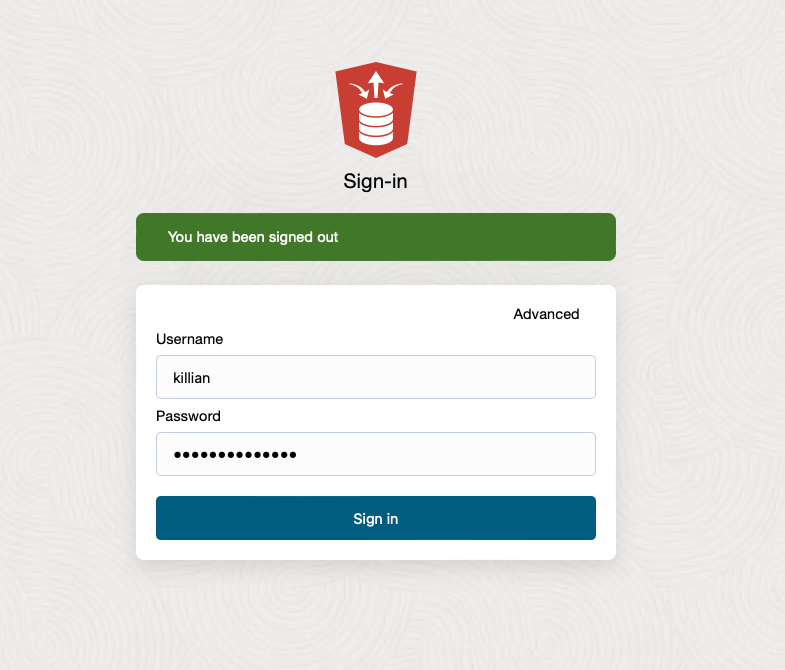
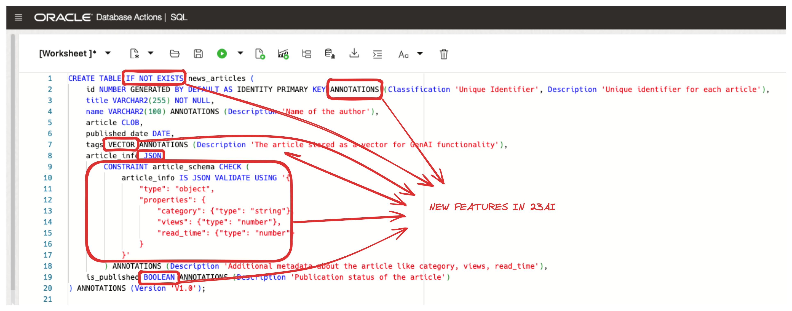

# Exploring New Features in Oracle Database 23ai

## Introduction

Welcome to the Oracle Database 23ai Quick Start workshop. In this lab, you will learn about a handful of new features in the Oracle Database.


Estimated Lab Time: 15 minutes

### Objective:

The objective of this workshop is to familiarize you with some of the new features in Oracle Database 23ai. You will learn how to:

*	Create a table with the new vector, boolean and JSON data types
*	Create Schema Annotations
*	Create and use Data Use Case Domains
*	Grant schema-level privileges
*	Assign the new Developer Role
*   Enforce a JSON Schema
*	Employ the IF [NOT] EXISTS statement for conditional SQL execution
*	Utilize Table Value Constructors for simplified multi-row operations
*	Use the new AI Vector Search `vector_distance` functions and operators to perform similarity search
    
    Please note, this lab provides a high-level overview of some of Oracle Database 23ai’s new features. This is a small set of the 300+ new features in the database.  For a comprehensive workshop, please visit the [23ai New Features](https://livelabs.oracle.com/pls/apex/r/dbpm/livelabs/view-workshop?wid=3950&clear=RR,180&session=106510486911799).

### Prerequisites:

- Access to Oracle Database 23ai environment.
- Basic understanding of SQL.

## Task 1: Granting Developer Role and Schema Level Privileges

1. Let's first sign into Database Actions. Database Actions gives you development tools, data tools, administration, and monitoring features for Autonomous Database. Using Database Actions you can run SQL statements, queries, and scripts in a worksheet. 
    
    From the Autonomous Database home page, **click** Database action and then **click** SQL.

    >**Hint**: If the SQL editor doesn’t open, double-check that your browser didn’t block the new tab from opening.

    


2. Throughout this lab, you'll need a user. Let’s create a user and REST-enable the schema so that we can connect as the user.

    ```
    <copy>

    -- Create USER SQL
    CREATE USER KILLIAN IDENTIFIED BY Oracle123_long;

    -- Grant roles
    GRANT CONNECT TO KILLIAN;
    GRANT RESOURCE TO KILLIAN;

    -- Enable REST
    BEGIN
        ORDS_ADMIN.ENABLE_SCHEMA(
            p_enabled => TRUE,
            p_schema => 'KILLIAN',
            p_url_mapping_type => 'BASE_PATH',
            p_url_mapping_pattern => 'killian',
            p_auto_rest_auth=> TRUE
        );

        -- Enable data sharing
        C##ADP$SERVICE.DBMS_SHARE.ENABLE_SCHEMA(
                SCHEMA_NAME => 'KILLIAN',
                ENABLED => TRUE
        );
        COMMIT;
    END;
    /

    -- Set quota
    ALTER USER KILLIAN QUOTA 100M ON DATA;

    </copy>
    ```

3. Now you can grant them the **NEW** Developer Role.

    Typically, you may want to grant all resources and roles at once. However, to highlight this new role in this demo, it’s been separated from the SQL statements above.

    The Developer Role gives you a full set of system privileges, object privileges, predefined roles, PL/SQL package privileges, and tracing privileges required by application developers. It simplifies privilege management and helps keep the database as secure as possible for the development environment. As always, please review the privileges granted in this role and compare them with your organization’s security protocols.

4. To grant the Developer Role to another user, use the GRANT statement.

    ```
    <copy>
    grant db_developer_role to killian;
    </copy>
    ```
    
    

    You can also 'REVOKE' this role if necessary.


5. Now let's check out the **NEW** Schema Level Privileges. Before looking at the code, let's briefly talk about the traditional methods of privilege management in Oracle databases.

    Individual Privilege Grants: This involves granting individual privileges on each table or view in the application schema. While granular, it's cumbersome and could cause user errors, especially with schema changes.

    ANY Privileges: Granting "ANY" privileges (e.g., SELECT ANY TABLE) provides broad access but compromises security by granting excessive permissions.

    Oracle Database 23ai introduces a simpler approach: Schema-Level Privileges. This allows granting privileges at the schema level, offering a balance between granularity and convenience. 
    
    Schema-level privileges dynamically adapt to schema changes. If new tables or views are added to the schema, users granted schema-level privileges instantly gain access without additional management.

6. Now create a user named `sally` and grant them access to killian's schema.

    ```
    <copy>
    create user sally identified by Oracle123_long;

    -- tables, views, and materialized views
    grant select any table on schema killian to sally;
    grant insert any table on schema killian to sally;
    grant update any table on schema killian to sally;
    grant delete any table on schema killian to sally;

    -- procedures, functions, packages, and sequences
    grant execute any procedure on schema killian to sally;
    grant select any sequence on schema killian to sally;
    </copy>
    ```
    You can also 'REVOKE' as well.

    

7. Now let's sign in as our user Killian. You can sign out of the admin user by clicking on the admin profile located in the top right hand of the screen and then click Sign Out. 

    **Username:** Killian 
    
    **Password:** Oracle123_long

    
    

8. From the launch pad of SQL Developer Web, we can open the SQL editor by clicking open.

    

9. Oracle has introduced **NEW** functionality that eliminates the need for the `FROM DUAL' clause, making queries more intuitive and more compatible with other database offerings. You can still use from dual without any impact.

    We can check our user has the developer role without having to specify `FROM DUAL`.

    ```
    <copy>
    -- Syntax prior to 23ai
    SELECT SYS_CONTEXT('SYS_SESSION_ROLES', 'DB_DEVELOPER_ROLE') FROM DUAL;

    -- Syntax in 23ai
    SELECT SYS_CONTEXT('SYS_SESSION_ROLES', 'DB_DEVELOPER_ROLE');
    </copy>
    ```

## Task 2: Creating our 23ai table and adding Data Use Case Domains

1. Imagine you work for a news company and have been asked to create a table to store news articles. You'll create a relational table with the **NEW** schema annotations, **NEW** vector data type, **NEW** Boolean data type, **NEW** if [not] exists statement and **NEW 21c** JSON data type.

    ```
    <copy>
    CREATE TABLE IF NOT EXISTS news_articles (
        id NUMBER GENERATED BY DEFAULT AS IDENTITY PRIMARY KEY ANNOTATIONS (Classification 'Unique Identifier', Description 'Unique identifier for each article'),
        title VARCHAR2(255) NOT NULL,
        name VARCHAR2(100) ANNOTATIONS (Description 'Name of the author'),
        article CLOB,
        published_date DATE,
        tags VECTOR(10) ANNOTATIONS (Description 'The article stored as a vector for GenAI functionality'),
        article_info JSON 
            CONSTRAINT article_schema CHECK (
                article_info IS JSON VALIDATE USING '{
                    "type": "object",
                    "properties": {
                        "category": {"type": "string"},
                        "views": {"type": "number"},
                        "read_time": {"type": "number"}
                    }
                }'
            ) ANNOTATIONS (Description 'Additional metadata about the article like category, views, read_time'),
        is_published BOOLEAN ANNOTATIONS (Description 'Publication status of the article')
    ) ANNOTATIONS (Description 'Table containing news articles and their information');
    </copy>
    ```

    


    Let's take a closer look at the new features:

    * **Schema Annotations** are a great tool for documenting and classifying database objects, along with providing insights into their purpose and usage. Schema annotations in Oracle Database 23ai are like labels or notes added to objects to provide extra information. 

        Annotations clause typically follows this format: 
            ```
            ANNOTATIONS ( {ADD|DROP} annotation_name {'annotation_value'} {,} )
            ```
        
        We can also take a look at the views associated with annotations. 

        ```
        <copy>
        select object_name,
            object_type,
            column_name,
            annotation_name,
            annotation_value
        from   user_annotations_usage;
        </copy>
        ```
    * **Vector Data type** - Before we add data to our table, let's understand what vectors are (mathematically) and how they relate to Generative AI.

        A vector is simply an array of numbers. Mathematically, a vector is an object that has both magnitude and direction (think of an arrow plotted on a graph). In generative AI, vectors represent the semantic meaning of objects, such as pictures, documents, audio files, or other large unstructured objects.

        How do we get vectors?

        Vectors are created by 'processing' your large unstructured objects through an embedding model. The models transform or 'embed' the data into numerical representations (vectors) that represent the semantic meaning of the original object.

        

        Okay, so what?

        At a high level, vectors are what these large language models use under the covers. Through storing vectors in the Oracle database, you can create countless applications that utilize generative AI capabilities and build the next generation of AI applications. The following diagram shows a VERY high-level overview of how you would create a chatbot application that can use an LLM in combination with private company data to answer questions specific to YOUR data. This process is called Retrieval Augmented Generation, or RAG.

        

        If you take a look at our vector column, you'll notice we set the dimensionality at 1536.
            ```
            tags VECTOR(1536)            
            ```

        What is dimensionality?

        This is going to be a very simple example. Dimensionality is the 'plane' in which something exists. For example, we exist in a world of three dimensions. Everything we interact with has three dimensions: height, length, and width.

        How does this relate to Generative AI?

        Remember the diagrams above showing the vectors that get created when we pass our unstructured objects through an embedding model? Each model creates the vectors with a different number of dimensions. For example, a vector [1, 2, 3, 4, 5, 6] has 6 dimensions.

        Different embedding models create a different number of vectors. Here are some common ones:

        * OpenAI has a handful of embedding models.
            * text-embedding-3-small - dimensions or 'length' of the vector is 1536
            * text-embedding-3-large - dimensions or 'length' of the vector is 3072
        The Oracle Database currently allows you to use up to 64K dimensions when storing vectors.

    * **Boolean Data type** - Oracle Database 23ai introduces native support for boolean data types which expands the capabilities of SQL and PL/SQL. The boolean data type standardizes the storage of true and false values and makes it easier to develop on the Oracle Database.
    
        In the table above, we will store the 'true', 'false' values for the 'is_published' column.

    * **JSON Data type** - Introduced in Oracle Database 21c, the JSON data type is highly optimized for query and DML processing. It can yield significant database performance improvements for processing JSON data. You can use the JSON data type in most places where a SQL data type is allowed, including: (1) As the column type for table or view DDL. (2) With SQL/JSON functions and conditions, and with PL/SQL procedures and functions. (3) In Oracle dot-notation query syntax. (4) For creation of functional and search indexes. Oracle Call Interface (OCI) and Java Database Connectivity (JDBC) clients now provide APIs that can work directly with binary JSON data, significantly saving network costs and server CPU cycles.

    * **JSON Schema** - Support for JSON in Oracle Database offers developers a flexible method for storing and working with semi-structured data within a relational database. However, there are situations where a more structured approach to data storage is needed. For these cases, Oracle Database 23ai introduces support for JSON Schemas. This feature provides a simple but powerful method to validate JSON data. Adding JSON Schema can help maintain data integrity and consistency in your Oracle databases.

        We can try and insert a news article into our table. This fails because we used "tons" as our number of views. It's the wrong data type
        ```
        <copy>
        INSERT INTO news_articles (title, name, article, published_date, tags, article_info, is_published)
        VALUES (
        'The Rise of AI in Everyday Life',
        'Alex Brown',
        'Artificial intelligence is increasingly being integrated into various aspects of our daily lives. From smart home devices to automated customer service, AI is transforming how we interact with technology and the world around us.',
        TO_DATE('2024-08-01', 'YYYY-MM-DD'),
        NULL,
        '{ "category": "technology", "views": "tons", "read_time": 6 }',
        TRUE
        );
        </copy>
        ```
        

    
    * **IF [NOT] EXISTS** are powerful tools for executing SQL commands based on the existence or non-existence of certain conditions or objects inside the database. We used `if not exists` above when creating our table. We can also drop objects using the IF EXISTS clause. This means that we can drop non-existent and existing objects without receiving an error. 

        ```
        <copy>
        DROP TABLE if exists fake_table;
        </copy>
        ```

2. Let's now add the **NEW** data use case domains to our table.

    **Overview of Data Usecase Domains**: Data Usecase Domains serve as a way for defining properties and constraints associated with columns. They ensure consistency in data representation and validation throughout the application.

    **Types of Data Usecase Domains:**

    * Single Column Domain: Applies constraints to a single column.
    * Multi-Column Domain: Applies constraints to multiple columns.
    * Flexible Domain: Allows dynamic selection of Data Usecase Domains based on specific conditions.
    * Enumeration Domain: An enumeration domain is a list of names with associated values defined automatically or manually.

3. In this quick start guide we will add a single column domain. If you're interested in Multi-Column Domains or Flexible Domains, check out the [full version of this lab.](https://livelabs.oracle.com/pls/apex/r/dbpm/livelabs/view-workshop?wid=3950&clear=RR,180&session=106510486911799)

4. Let’s add a new column review_status to indicate the review status of the article, using a domain to enforce specific values and provide a default value. Here we are saying the status of an article is pending by default unless another value is specified.
    ```
    <copy>
    CREATE DOMAIN IF NOT EXISTS review_status_domain AS VARCHAR2(20)
    DEFAULT 'pending'
    CONSTRAINT review_status_check CHECK (VALUE IN ('pending', 'approved', 'rejected'));    
    </copy>
    ```
5. Let's add our column and domain to the table.

    ```
    <copy>
    ALTER TABLE news_articles ADD (review_status review_status_domain);
    </copy>
    ```
6. Two user views, USER\_DOMAINS and USER\_DOMAIN\_CONSTRAINTS allow us to query the definitions of our domains.

    ```
    <copy>
    select * from USER_DOMAINS;
    </copy>
    ```

    ```
    <copy>
    select * from USER_DOMAIN_CONSTRAINTS;
    </copy>
    ```
    

## Task 3: Inserting into our table and using Similarity Search

1. Now that we have our table, we can add some data to it using the **NEW** Table Value Constructors 
    ```
    <copy>
    INSERT INTO news_articles (title, name, article, published_date, tags, article_info, is_published, review_status)
    VALUES 
    ('Advances in Quantum Computing', 'Jane Smith', 'In a groundbreaking development, scientists have unveiled significant advancements in quantum computing, paving the way for unprecedented computational power and potentially revolutionizing industries from cryptography to finance.', TO_DATE('2024-07-23', 'YYYY-MM-DD'), '[0.15689825606030283, 0.8766605695719316, 0.5626820860144027, 0.6373684636160022, 0.2753863374465272, 0.66283652941284, 0.830379118594548, 0.8126997978941853, 0.9008106172404009, 0.9171534598660311]', '{ "category": "science", "views": 250, "read_time": 10 }', FALSE, 'approved'),
    ('New Discoveries in AI', 'John Doe', 'Recent breakthroughs in artificial intelligence have opened new frontiers, with cutting-edge innovations poised to transform various sectors, from healthcare to autonomous systems, enhancing efficiency and decision-making processes.', TO_DATE('2024-07-24', 'YYYY-MM-DD'), '[0.14695501073658157, 0.891586187036063, 0.5760537368552343, 0.6498092576839286, 0.2699809147776842, 0.6655646373658968, 0.8229744447619449, 0.8065350910401595, 0.916200360446937, 0.939859950954786]', '{ "category": "technology", "views": 100, "read_time": 5 }', TRUE, 'pending'),
    ('Health Benefits of Meditation', 'Alice Brown', 'Scientific research increasingly supports the health benefits of meditation, revealing its positive impact on both physical and mental well-being, and offering a compelling case for incorporating mindfulness practices into daily life.', TO_DATE('2024-07-22', 'YYYY-MM-DD'), '[0.16121656824345176, 0.1863741187566752, 0.6028018296050792, 0.6649079784919301, 0.19991232001016912, 0.05298217705830921, 0.8481628647239365, 0.5890764814712126, 0.25613850722735665, 0.8945610885639074]', '{ "category": "health", "views": 0, "read_time": 8 }', FALSE, 'rejected'),
    ('Future of Space Travel', 'Eve White', 'The future of space travel is set to be transformed by new technologies and missions, promising to extend humanitys reach into the cosmos and unlock the mysteries of the universe in ways previously unimaginable.', TO_DATE('2024-07-20', 'YYYY-MM-DD'), '[0.16306903753102703, 0.9130229721612848, 0.653422720429483, 0.595379024776032, 0.25080491587080256, 0.6511102405608074, 0.8095061264618025, 0.8004240907797086, 0.8963370307179214, 0.9581458579992368]', '{ "category": "space", "views": 500, "read_time": 15 }', TRUE, 'approved'),
    ('Climate Change Impacts', 'Tom Green', 'Recent research has brought attention to natural factors influencing climate change, such as volcanic eruptions, variations in solar radiation, and changes in ocean currents, demonstrating their significant impact on Earths climate system over geological timescales.', TO_DATE('2024-07-21', 'YYYY-MM-DD'), '[0.179442527534773, 0.8703585173612022, 0.5625210825683787, 0.6527513043187642, 0.3052557309263864, 0.6475245100313912, 0.9070312124781627, 0.8960132666451174, 0.8862016782850639, 0.9106926096176268]', '{ "category": "environment", "views": 300, "read_time": 12 }', TRUE, 'approved');
    </copy>
    ```

    Table value constructors, also known as row value constructors, allow you to specify multiple rows of data within a single INSERT, SELECT, UPDATE, or MERGE statement. This feature simplifies the process of working with multiple rows of data, eliminating the need for multiple INSERT or SELECT statements.

    The syntax for using table value is as follows:

    ```
    VALUES (value_list_1), (value_list_2), ... (value_list_n)
    ```

    Each value\_list represents a set of values for a single row, enclosed within parentheses. Multiple value\_lists can be specified, separated by commas.

2. If you remember from above, our domain has a default value set so we don't need to specify it. Let's add another row without specifying the review status 
    ```
    <copy>
    INSERT INTO news_articles (title, name, article, published_date, tags, article_info, is_published)
    VALUES (
    'Exploring Renewable Energy',
    'Alex Brown',
    'The latest advancements in renewable energy sources, examine how solar, wind, and other green technologies are becoming increasingly viable alternatives to fossil fuels, and their potential to significantly reduce global carbon emissions.',
    TO_DATE('2024-08-01', 'YYYY-MM-DD'),
    '[0.13579150541866153, 0.9003273941020475, 0.5982369541204713, 0.648723748171852, 0.3278634041783164, 0.6562984345020122, 0.9010997972552405, 0.8945314740010138, 0.861279041083845, 0.9032538572947326]',
    '{ "category": "environment", "views": 150, "read_time": 7 }',
    TRUE
    );
    </copy>
    ```
3. We can also look at the **NEW** vector_distance functions and operators in 23ai. 

    Before we jump into the code, what is the vector_distance function?

    First, we need to understand what similarity search is and its role in generative AI and that will explain the vector_distance.

    Similarity search is the process of finding items that are similar to a given item we're looking for (hence the name). Think of it as trying to find items in a database that closely resemble a specific object, based on their vector representations. For example, similarity search can help identify products, documents, or customer profiles that closely match a given query.

    How Does Similarity Search Work? (hint: you use vector_distance)

    It follows the process of:

    * Vectors: Remember how we looked at how vectors represent the semantic meaning of objects? When we embed our data (like text, images, or audio) into vectors, each object gets a unique numerical representation (a vector).

    * Finding Similarity: Once we have these vectors, we need a way to measure how similar they are. This is typically done using * mathematical metrics like cosine similarity or Euclidean distance (we'll do this in the example below). This helps us determine how close or far apart two vectors are in the high-dimensional space.

    * Retrieving Similar Items: Using these similarity metrics, we can query our database to find vectors that are closest to our query vector. The closer the vectors, the more similar the objects they represent.

    Let's take a look at this.

4. Let's imagine that we've already created embeddings for the news articles in our table. Here we can use the vector_distance function to find articles that are similar to each other.
    ```
    <copy>
    SELECT na.*
    FROM news_articles na
    CROSS JOIN (
        SELECT tags AS vector
        FROM news_articles
        WHERE title = 'Advances in Quantum Computing'
    ) tv
    ORDER BY VECTOR_DISTANCE(na.tags, tv.vector, EUCLIDEAN) ASC; 
    </copy>
    ```
    

    This SQL statement lists the articles from most similar to least similar using the euclidean vector_distance function. We see that New Discoveries in AI and Future of Space Travel are closest to our Advances in Quantum Computing article.

    Measuring distances in a vector space is at the heart of identifying the most relevant results for a given query vector. When working with vectors, there are several ways you can calculate distances to determine how similar, or dissimilar, two vectors are. Each distance metric is computed using different mathematical formulas. Generally, it's best to match the distance metric you use to the one that was used to train the vector embedding model that generated the vectors.

    To learn all about AI Vector Search in Oracle Database 23ai, check out the [Oracle AI Vector Search User's Guide](https://docs.oracle.com/en/database/oracle/oracle-database/23/vecse/oracle-ai-vector-search-users-guide.pdf).


5. **Congratulations**! You’ve completed the Oracle Database 23ai Quick Start workshop. In this lab, we explored a range of new features introduced in Oracle Database 23ai. Here’s a recap of what we covered:

	1.	**New Data Types:** We created tables using new vector, boolean, and JSON data types. These new data types (and many others) can all be used natively inside Oracle Database 23ai.
	2.	**Schema Annotations:** We learned how to use schema annotations to document and classify database objects, providing insights into their purpose and usage.
	3.	**Data Use Case Domains:** We added a single-column domain to our table, ensuring consistent data representation and validation across the application.
	4.	**Schema-Level Privileges:** We granted schema-level privileges, which simplify privilege management and dynamically adapt to schema changes.
	5.	**Developer Role**: We assigned the new Developer Role, which includes a comprehensive set of privileges required by application developers, making privilege management simpler and more secure.
	6.	**IF [NOT] EXISTS Statement:** We used the IF [NOT] EXISTS statement for conditional SQL execution, which helps avoid errors when creating or dropping objects.
	7.	**Table Value Constructors:** We inserted multiple rows of data using the new Table Value Constructors, streamlining the process of working with multiple rows.
	8.	**AI Vector Search:** We explored the new vector_distance functions and operators to perform similarity searches. This functionality only scrapes the surface of what Oracle Database 23ai offers for AI in database operations.
    9.  **Removal of FROM DUAL:** We utilized the new feature that eliminates the need for the FROM DUAL clause, making queries more intuitive and cleaner.
    10. **JSON Schema:** We learned how to define JSON schema constraints during table creation and validate JSON data upon insertion.

This lab provided a high-level overview of some of the new features in Oracle Database 23ai, but there are over 300 new features to explore. For a comprehensive workshop, please visit the [23ai New Features](https://livelabs.oracle.com/pls/apex/r/dbpm/livelabs/view-workshop?wid=3950&clear=RR,180&session=106510486911799).

Thank you for participating, and happy coding!

## Learn More

* [23ai New Features Workshop](https://livelabs.oracle.com/pls/apex/r/dbpm/livelabs/view-workshop?wid=3950&clear=RR,180&session=106510486911799).
* [Announcing Oracle Database 23ai : General Availability](https://blogs.oracle.com/database/post/oracle-23ai-now-generally-available) 
* [Oracle Database Features and Licensing](https://apex.oracle.com/database-features/)
* [Oracle Database 23ai : Where to find information](https://blogs.oracle.com/database/post/oracle-database-23ai-where-to-find-more-information)
* [Free sandbox to practice upgrading to 23ai!](https://livelabs.oracle.com/pls/apex/dbpm/r/livelabs/view-workshop?wid=3943)
* [Oracle AI Vector Search User's Guide](https://docs.oracle.com/en/database/oracle/oracle-database/23/vecse/oracle-ai-vector-search-users-guide.pdf)

## Acknowledgements
* **Author** - Killian Lynch, Database Product Management
* **Contributors** - Dom Giles, Distinguished Database Product Manager
* **Last Updated By/Date** - Killian Lynch, July 2024
