# Query Duality Views with REST

## Introduction

Now that our tables been populated, we will view the data as JSON documents with GET calls and query-by-example (QBE) calls. The duality view `team_dv` joins the team table with the driver table, so the insert from the previous lab ensured data was populated on both tables. Now you can query the `driver_dv` duality view to see the data in its documents.

You will also learn how to use the OpenAPI View to create REST calls on your views. This provides a clean GUI interface with which you can not only create the REST calls, but run them to test return results. 

Estimated Time: 5 minutes


### Objectives

In this lab, you will:

- Use a GET call to view the driver_dv duality view
- Use a GET call to query a specific document
- Use query parameter to view a single document from the race_dv duality view
- Familiarize yourself with the OpenAPI View included in SQL Developer Web

### Prerequisites

This lab assumes you have:
- Oracle Database 23c Free Developer Release
- All previous labs successfully completed
- Oracle REST Data Service (ORDS) 23.1


## Task 1: Use a GET call to query a duality view


Throughout this lab and the ones that follow, you will see the use of ` | json_pp` at the end of some cURL commands. This is simply a tool to help you better visualize the data that is returned. In some cases, this tool isn't used so that you may see the HTTP Codes that come in response to our cURL commands. When experimenting, you can use ` | json_pp` to better visualize the data, but note that it will not work when the returned values don't adhere to JSON syntax (such as when you use the `-i` parameter in cURL). 

This tool is installed by default when using the _Run on LiveLabs_ option. It is included with the Perl install. 

1. View the contents of the `driver_dv` duality view. Because we are not specifying an ID, this query will return the entire view. 

    ```
    $ <copy>curl -X GET http://localhost:8080/ords/hol23c/driver_dv/ | json_pp</copy>
    ```

    Documents corresponding to six drivers now appear in the driver_dv duality view. For each document, the following fields are automatically computed and included in the result: 
    - etag - Document eTag. Used for optimistic locking. Automatically computed by the duality view.
    - asof - The asof is a Table System Change Number (SCN) and can be used for Flashback queries. 
    - links - The links contain references to the other calls, such as "self", "describedby", and "collection". Using them in a GET call would return the single document, a description of the view, or the entire collection, respectively.  

    **Note:** The "race" field under each driver is empty. This is because no information connecting the driver to the races has been entered yet. That information will be added in the next lab. 

    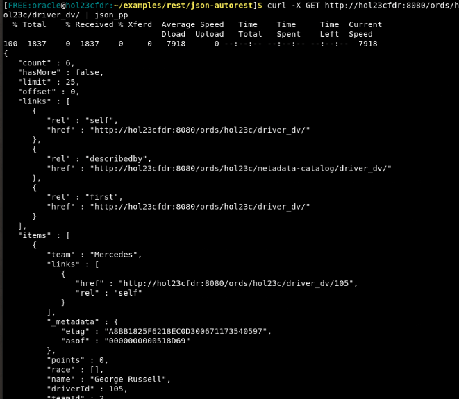

## Task 2: Use a GET call to query a specific document

1. To view only one document from a duality view, simply append the document's ID to the end of your GET call URL. 

    ```
    $ <copy>curl -X GET http://localhost:8080/ords/hol23c/driver_dv/105 | json_pp</copy>
    ```

    This call has hardcoded the document ID for George Russell, but you can exchange the ID with another driver to GET their information. 

    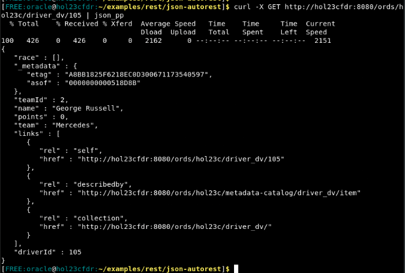

## Task 3: Find a document matching a Query Parameter

Documents can be fetched by supplying a query parameter. Only documents matching the query parameter will be returned. 

1. This operation uses query parameters with the following content: 

    ```
    {"name":{"$eq":"Bahrain Grand Prix"}}
    ```

2. Fetch the documents that match this filter.

    **NOTE:** We have encoded the brackets, quotes, colons, and spaces in the query to make this a valid URL. This is required for cURL. 

    ```
    $ <copy>curl -v --location -g "http://localhost:8080/ords/hol23c/race_dv/?q=%7B%22name%22%3A%7B%22%24eq%22%3A%22Bahrain%20Grand%20Prix%22%7D%7D" | json_pp</copy>
    ```

    Notice that the podium and result fields are empty. This is again because the information for "Bahrain Grand Prix" has not been entered. In the next lab, this information will be added. 

    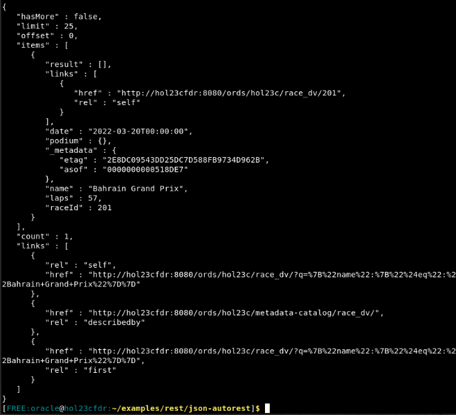


## Task 4: Use OpenAPI to run REST Calls in an IDE

The ORDS install comes with SQL Developer Web, an online tool for managing your database. In this tool, we can use OpenAPI to query our REST enabled views with a GUI. Follow these steps to use the IDE. 

You can continue to use this tool for the rest of the workshop, but the instructions will continue with the Terminal commands. 

1. Open a browser and navigate to this URL:  

    ```
    <copy>http://localhost:8080/ords/hol23c/_sdw</copy>
    ```

    Use the username and password you have setup for this workshop. In our case, our user is `hol23c`. 

    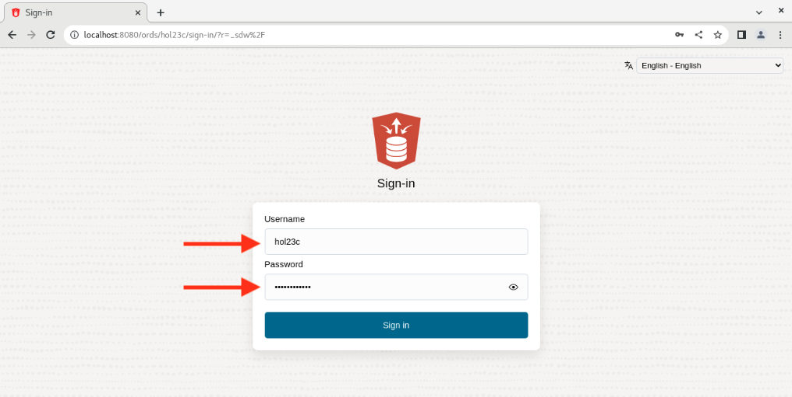

2. Click on **Rest** and then **AutoREST**.

    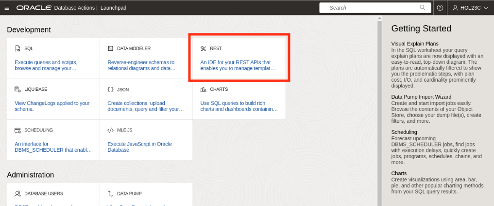

    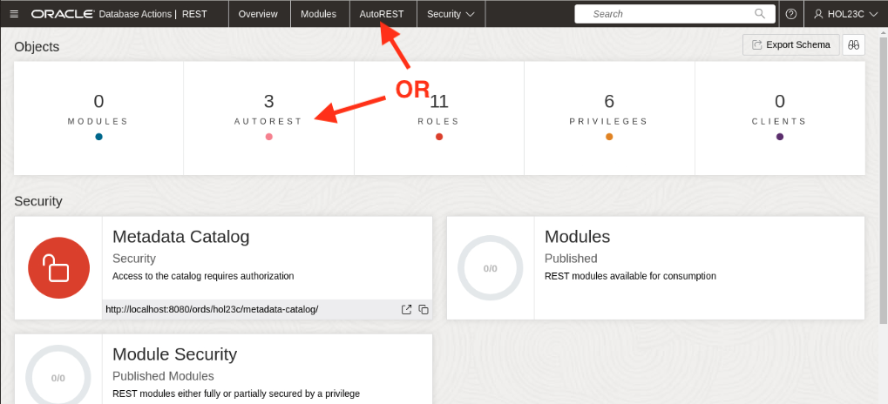

3. Now on any one of the views, you can click the three dots on the right and click **OpenAPI View**. Do this now for the `RACE_DV` view. 

    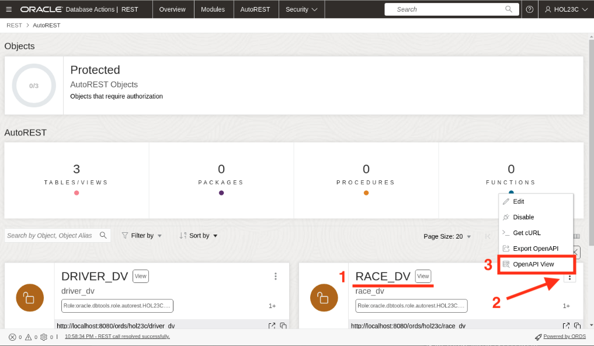

4. Here you can see the automatically configured REST calls that were enabled on the view. Let's run the same code in this environment as we just did on the Terminal. 

    Expand the **GET** section. 

    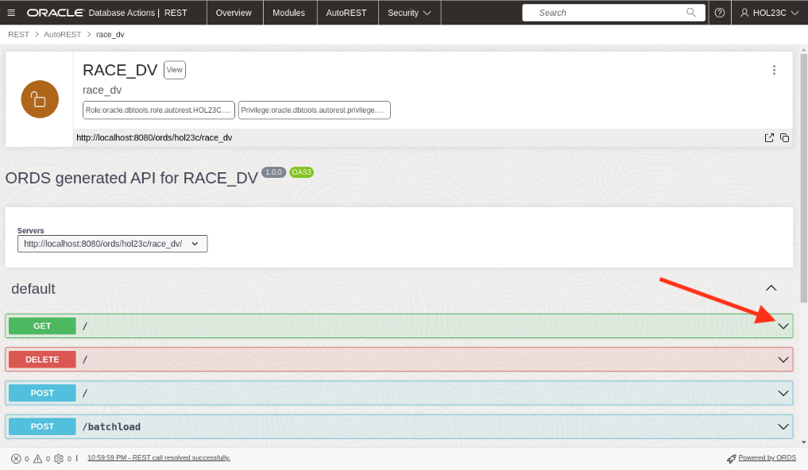

5. By default, this section shows sample parameters and responses, but we can use it to try the calls themselves. 

    Click on **Try it out**. 

    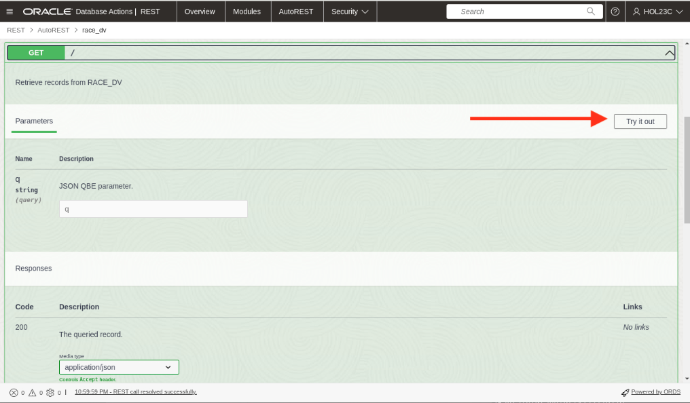

6. Fill in the **q** field with the query parameters we just used to find the "Bahrain Grand Prix".

    ```
    <copy>{"name":{"$eq":"Bahrain Grand Prix"}}</copy>
    ```

7. Now click **Execute** to run the REST call with the given parameters. 

    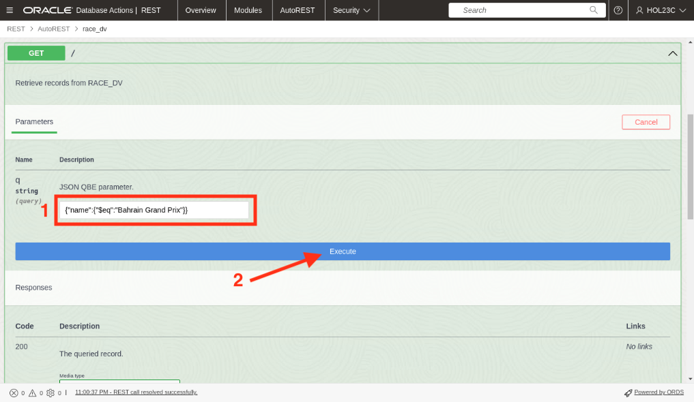

8. In the Responses section, you can now see that OpenAPI has built the call for you. You can see the cURL command and the request URL built from the query parameters you put in. 

    You can also see the response from the server below. As expected, we see the same information on the "Bahrain Grand Prix".

    You may continue using this tool for the rest of the workshop, but please be aware that the instructions will continue to use the Terminal and cURL commands. 

    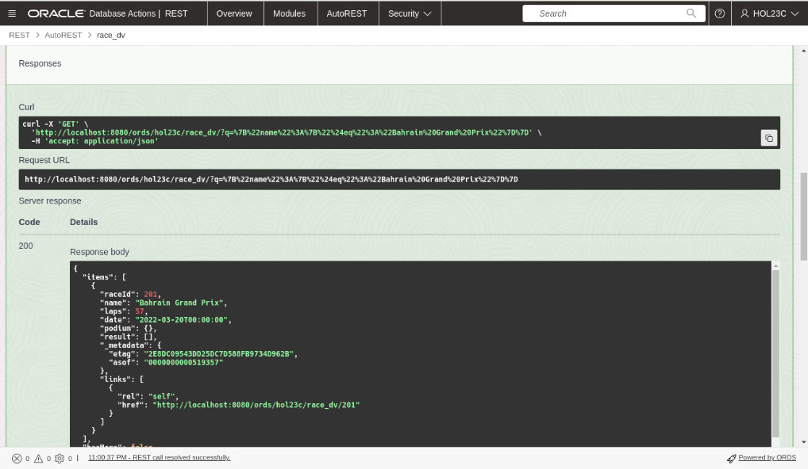

You may **proceed to the next lab.**

## Learn More

- [JSON Relational Duality Blog](https://blogs.oracle.com/database/post/json-relational-duality-app-dev)
- [23c Beta Docs - TO BE CHANGED](https://docs-stage.oracle.com/en/database/oracle/oracle-database/23/index.html)
- [Overview of SODA Filter Specifications](https://docs.oracle.com/en/database/oracle/simple-oracle-document-access/adsdi/overview-soda-filter-specifications-qbes.html)

## Acknowledgements

- **Authors**- William Masdon, Product Manager, Database; Jeff Smith, Distinguished Product Manager, Database 
- **Last Updated By/Date** - William Masdon, Product Manager, Database, April 2023
