# Update Duality Views with REST

## Introduction

In this lab you will update the data you have already inserted via duality views. You will update with a document ID, remap 2 drivers to different teams, attempt to update a non-updatable field, and delete a couple documents. 

Estimated Time: 10 minutes


### Objectives

In this lab, you will:

- Replace a document identified by ID
- Re-parent sub-objects between documents
- Attempt to update a non-updatable field
- Delete documents with an ID and with a query

### Prerequisites

This lab assumes you have:
- Oracle Database 23c Free Developer Release
- All previous labs successfully completed
- Oracle REST Data Service (ORDS) 23.1


## Task 1: Replace a document identified by ID with an eTag


1. First you must determine the ID and eTag of the document to replace. Run this command to query on the Bahrain Grand Prix as we did in the last lab.  

    ```
    $ <copy>curl -v --location -g "http://localhost:8080/ords/hol23c/race_dv/?q=%7B%22name%22%3A%7B%22%24eq%22%3A%22Bahrain%20Grand%20Prix%22%7D%7D" | json_pp</copy>
    ```

    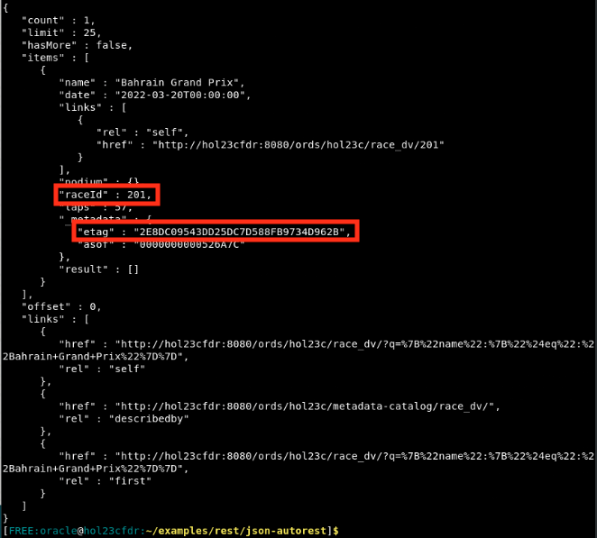

    Take note of the ID (which is 201) and the eTag (which will be different for everyone). 

2. You need to modify the `updateRace.json` file to include the right eTag. Open the file and insert the current eTag value. Make sure to save before closing. 

    ```
    $ <copy>gedit updateRace.json</copy>
    ```

    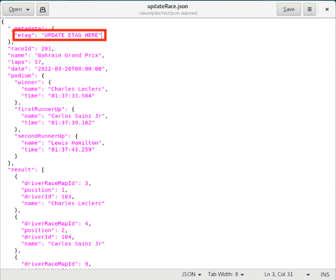

4. Now that the eTag is accurate, replace the target document with the contents in the file `updateRace.json`. 

    ```
    $ <copy>curl -i -X PUT --data-binary @updateRace.json -H "Content-Type: application/json" http://localhost:8080/ords/hol23c/race_dv/201</copy>
    ```

    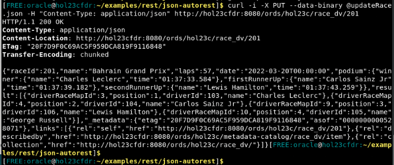

5. The command returns HTTP error code 200, indicating a successful replace. 

    The update eTag appears in the response header as well. Note that the “etag” value supplied in the content is used for “out of the box” optimistic locking, to prevent the well-known “lost update” problem that can occur with concurrent operations. During the replace by ID operation, the database checks that the eTag provided in the replacement document matches the latest eTag of the target duality view document. If the eTags do not match, which can occur if another concurrent operation updated the same document, an error is thrown. In case of such an error, you can reread the updated value (including the updated eTag), and retry the replace operation again, adjusting it (if desired) based on the updated value.

6. To verify that a replace using an eTag that is not the most recent fails, run the same command again. 

    ```
    $ <copy>curl -i -X PUT --data-binary @updateRace.json -H "Content-Type: application/json" http://localhost:8080/ords/hol23c/race_dv/201</copy>
    ```

    Because updateRace.json content has an "etag" field value that has been obsoleted by the preceding successful replace, the command now outputs 400 (bad request). 

    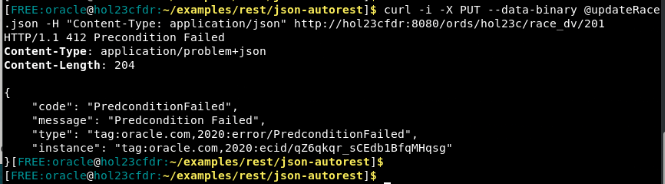


## Task 2: Re-parent sub-objects between two documents

In this task, you will switch Charles Leclerc's and George Russell's teams by updating the driver arrays in the Mercedes and Ferrari documents of the `team_dv` duality view. 

1. First you must find the IDs of each document. We will use this query parameter with the following content: 

    ```
    {"name":{"$in":["Mercedes","Ferrari"]}}
    ```

2. Query the team_dv to find the documents' IDs. Then copy them down for each document.

    ```
    $ <copy>curl -v --location -g "http://localhost:8080/ords/hol23c/team_dv/?q=%7B%22name%22%3A%7B%22%24in%22%3A%5B%22Mercedes%22%2C%22Ferrari%22%5D%7D%7D" | json_pp
    </copy>
    ```

    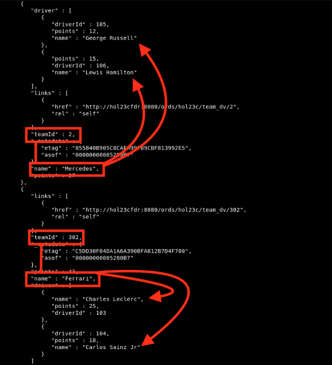

    The ID for Mercedes is 2 and the ID for the Ferrari team is 302. 

3. `updateMercedes.json` contains the replacement document for the Mercedes team.

    ```
    {
        "teamId": 2,
        "name": "Mercedes",
        "points": 0,
        "driver": [
        {
            "driverId": 105,
            "name": "George Russell",
            "points": 0
        },
        {
            "driverId": 106,
            "name": "Lewis Hamilton",
            "points": 0
        }
        ]
    }
    ```

4. `updateFerrari.json` contains the replacement document for the Ferrari team.

    ```
    {
    "teamId": 302,
    "name": "Ferrari",
    "points": 30,
    "driver": [
        {
        "driverId": 105,
        "name": "George Russell",
        "points": 12
        },
        {
        "driverId": 104,
        "name": "Carlos Sainz Jr",
        "points": 18
        }
    ]
    }
    ```

    **NOTE:** You are not using eTags during this update. You could use eTags; however, after the first update call to change the Mercedes team, you would need to query again and get the eTag in order to update the Ferrari team, as its eTag has changed (one of its drivers has been removed). 

6. Run this command to update the Mercedes team, using the corresponding ID: 

    ```
    $ <copy>curl -i -X PUT --data-binary @updateMercedes.json -H "Content-Type: application/json" http://localhost:8080/ords/hol23c/team_dv/2</copy>
    ```

    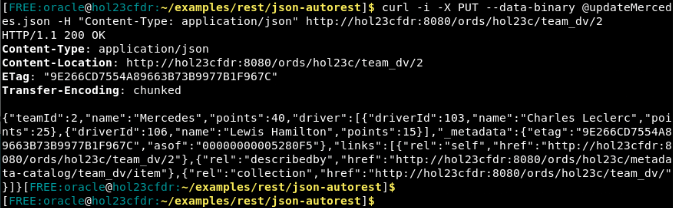

7. Now do the same for the Ferrari team: 

    ```
    $ <copy>curl -i -X PUT --data-binary @updateFerrari.json -H "Content-Type: application/json" http://hol2localhost3cfdr:8080/ords/hol23c/team_dv/302</copy>
    ```

    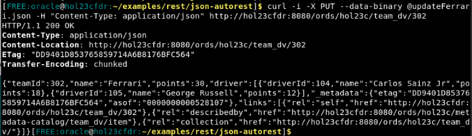

8. To show the changes to Ferrari and Mercedes teams, query the team_dv duality view. 

    ```
    $ <copy>curl -v --location -g "http://localhost:8080/ords/hol23c/team_dv/?q=%7B%22name%22%3A%7B%22%24in%22%3A%5B%22Mercedes%22%2C%22Ferrari%22%5D%7D%7D" | json_pp
    </copy>
    ```

    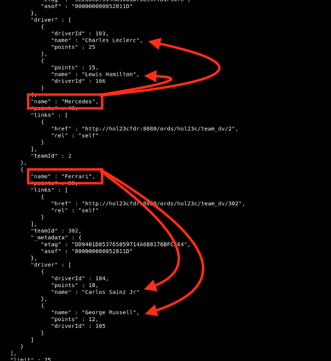

9. To see the changes in the drivers duality view as well, you can use a new query which contains the following: 

    ```
    {"$or":[{"name":{"$like":"George%"}},{"name":{"$like":"Charles%"}}]}
    ```

    To see the changes, run: 

    ```
    $ <copy>curl -v --location -g  "http://localhost:8080/ords/hol23c/driver_dv/?q=%7B%22%24or%22:%5B%7B%22name%22:%7B%22%24like%22:%22George%25%22%7D%7D%2C%7B%22name%22:%7B%22%24like%22:%22Charles%25%22%7D%7D%5D%7D" | json_pp</copy>
    ```

    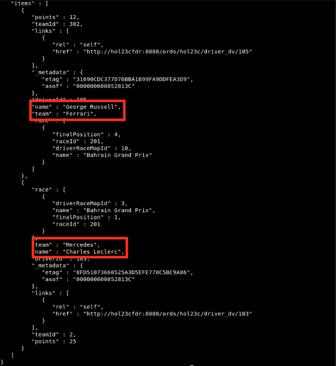


## Task 3: Update a non-updatable field

From the previous command, ID of the Charles Leclerc document in the driver duality view is 103. The "team" field is non-updatable because the team table is marked with NOUPDATE annotation in the team_dv duality view definition.

1. Using `updateLeclerc.json`, you will attempt to set the team of Leclerc back to Ferrari. 

    ```
    $ <copy>curl -i -X PUT --data-binary @updateLeclerc.json -H "Content-Type: application/json" http://localhost:8080/ords/hol23c/driver_dv/103</copy>
    ```

    Because the team is not updatable through the driver_dv view, the command outputs a failure with HTTP 400. 

    This shows that while the team of the driver can be updated using the TEAM\_DV duality view, as described in the preceding step, it cannot be updated through the DRIVER\_DV duality view. This illustrates how the same underlying relational data can be made updateable or non-updateable, as needed for the different use-cases, by creating different duality views.

    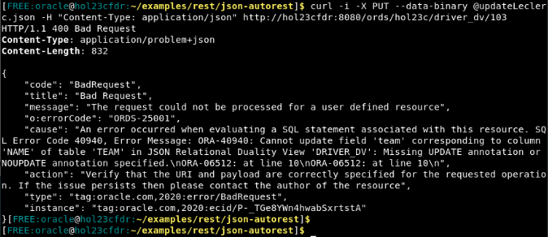


## Task 4: Delete Documents

You can delete a document with a given ID. Earlier, you replace "Bahrain Grand Prix" with its primary key value 201. 

1. Now use the ID to delete the document. 

    ```
    $ <copy>curl --request DELETE --url http://localhost:8080/ords/hol23c/race_dv/201</copy>
    ```

    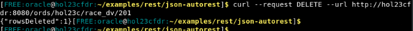

2. You can also delete records matching a query parameter. Let's us this query:

    ```
    {"raceId":{"$eq":202}}
    ```

3. To delete the document(s) matching this query, run this command. 

    ```
    $ <copy>curl -v --location -g -X DELETE "http://localhost:8080/ords/hol23c/race_dv/?q=%7B%22raceId%22%3A%7B%22%24eq%22%3A202%7D%7D" </copy>
    ```

    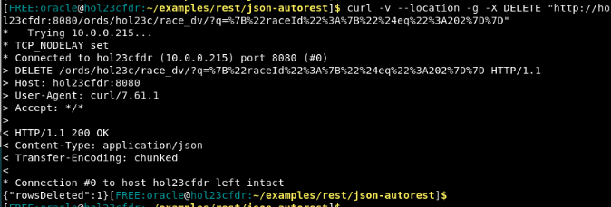

Congratulations! You have finished this workshop. 

## Learn More

- [JSON Relational Duality Blog](https://blogs.oracle.com/database/post/json-relational-duality-app-dev)
- [23c Beta Docs - TO BE CHANGED](https://docs-stage.oracle.com/en/database/oracle/oracle-database/23/index.html)

## Acknowledgements

- **Author**- William Masdon, Product Manager, Database; Jeff Smith, Distinguished Product Manager, Database 
- **Last Updated By/Date** - William Masdon, Product Manager, Database, April 2023
