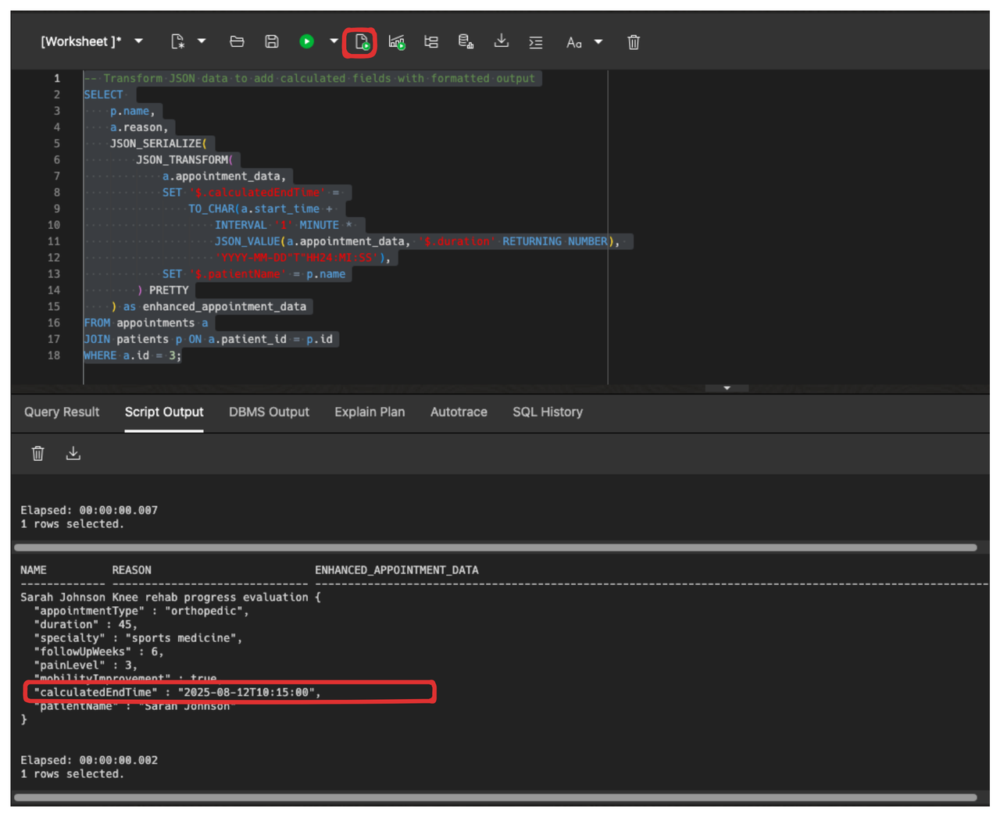

# JSON and SQL

## Introduction

Welcome to the **JSON and SQL Data Type** lab! This hands-on session explores Oracle AI Database 26ai's native JSON data type and its capabilities for storing, querying, and managing complex business data across any industry alongside relationally stored data.

Building on the domains and annotations concepts from the previous lab, this lab covers how to combine structured data validation with flexible document storage.

Estimated Lab Time: 15 minutes

The 26ai release significantly expanded JSON capabilities beyond basic constructors to include advanced schema validation, collection management, and bi-directional JSON-relational duality views.

### Objective:
The objective of this lab is to showcase Oracle AI Database 26ai's native JSON data type capabilities for enterprise applications. By the end of this lab, you will understand how to create tables with JSON columns, query JSON data efficiently, and leverage advanced JSON features for flexible business data management.

### Prerequisites:
- Access to Oracle AI Database 26ai.
- Basic understanding of SQL concepts.
- Completion of Domains & Annotations lab.

## Task 1: Using the JSON Data Type 


1. Let's enhance our workshop. Let's start by inserting our three base patients that will be used throughout the lab examples.

    **Note**: This lab assumes you have completed the **Domains & Annotations** lab.

    ```sql
    <copy>
    -- BASE PATIENTS (as provided)
    INSERT INTO patients (id, name, dob, sex, primary_reason) 
    VALUES 
            (3, 'Courtney Henry', DATE '1988-06-10', 'Female', 'Knee rehab follow-up'),
            (4, 'Ronald Richards', DATE '1982-02-01', 'Male', 'Back-to-running check-in'),
            (5, 'Leslie Alexander', DATE '1976-11-03', 'Female', 'Blood pressure review');
    
    COMMIT;
    </copy>
    ```
    
2. Last lab, we created a table with a JSON datatype `appointment_data  JSON`. Now we'll add appointments for each patient, showcasing how JSON can store varied metadata structures for different appointment types.


    #### Courtney Henry - Knee Rehabilitation Journey

    ```sql
    <copy>
    -- APPOINTMENTS FOR COURTNEY HENRY (Patient ID 1 - Knee Rehab)

    -- Courtney Henry appointments using Oracle 26ai TABLE VALUE clause
    INSERT INTO appointments (patient_id, start_time, reason, status, provider_name, appointment_data)
    VALUES 
        (1, TIMESTAMP '2025-08-12 09:30:00', 'Knee rehab progress evaluation', 'Completed', 'Dr. Jennifer Park',
        JSON('{
            "appointmentType": "orthopedic",
            "duration": 45,
            "specialty": "sports medicine",
            "followUpWeeks": 6,
            "painLevel": 3,
            "mobilityImprovement": true
        }')),
        (1, TIMESTAMP '2025-08-15 14:00:00', 'Physical therapy session', 'Completed', 'Mike Thompson, PT',
        JSON('{
            "appointmentType": "physicalTherapy",
            "duration": 60,
            "exercisesFocused": ["quad strengthening", "range of motion"],
            "homeExerciseUpdate": true
        }')),
        (1, TIMESTAMP '2025-08-22 10:15:00', 'Knee function assessment', 'Scheduled', 'Dr. Jennifer Park',
        JSON('{
            "appointmentType": "orthopedic",
            "duration": 30,
            "imagingNeeded": false,
            "returnToActivityDiscussion": true
        }')),
        (1, TIMESTAMP '2025-08-26 15:30:00', 'Advanced strengthening exercises', 'Scheduled', 'Mike Thompson, PT',
        JSON('{
            "appointmentType": "physicalTherapy",
            "duration": 60,
            "phase": "strengthening",
            "sportSpecificTraining": true
        }'));
    </copy>
    ```

    #### Ronald Richards - Running Assessment Program &  Leslie Alexander - Blood Pressure Management

    ```sql
    <copy>
    -- APPOINTMENTS FOR RONALD RICHARDS (Patient ID 2 - Running Assessment)
    -- APPOINTMENTS FOR LESLIE ALEXANDER (Patient ID 3 - Blood Pressure)
    -- Appointments using Oracle 26ai TABLE VALUE clause
    INSERT INTO appointments (patient_id, start_time, reason, status, provider_name, appointment_data)
    VALUES 
        (2, TIMESTAMP '2025-08-09 08:00:00', 'Running gait analysis and biomechanics', 'Completed', 'Dr. Sarah Kim',
        JSON('{
            "appointmentType": "sportsMedicine",
            "duration": 60,
            "gaitAnalysis": true,
            "videoAnalysis": true,
            "currentMileage": 25,
            "goalMileage": 40
        }')),
        (2, TIMESTAMP '2025-08-14 11:45:00', 'Foot mechanics and shoe fitting', 'Completed', 'Dr. Michael Torres, DPM',
        JSON('{
            "appointmentType": "podiatry",
            "duration": 45,
            "footScan": true,
            "shoeRecommendation": "motion control",
            "customOrthotics": false
        }')),
        (2, TIMESTAMP '2025-08-21 16:30:00', 'Training plan optimization', 'Scheduled', 'Dr. Sarah Kim',
        JSON('{
            "appointmentType": "sportsMedicine",
            "duration": 30,
            "trainingPlanReview": true,
            "injuryPrevention": true,
            "racePreparation": "10K"
        }')),
        (2, TIMESTAMP '2025-08-28 13:00:00', 'Sports nutrition and hydration', 'Scheduled', 'Lisa Chen, RD',
        JSON('{
            "appointmentType": "nutrition",
            "duration": 45,
            "focus": "endurance nutrition",
            "supplementDiscussion": true,
            "hydratorStrategy": true
        }')),
        (3, TIMESTAMP '2025-08-07 10:00:00', 'Blood pressure monitoring and medication review', 'Completed', 'Dr. Rivera',
        JSON('{
            "appointmentType": "primaryCare",
            "duration": 30,
            "bpReading": "138/86",
            "medicationAdjustment": true,
            "homeMonitoringReview": true
        }')),
        (3, TIMESTAMP '2025-08-16 14:30:00', 'Hypertension management consultation', 'Completed', 'Dr. Robert Chen, MD',
        JSON('{
            "appointmentType": "cardiology",
            "duration": 45,
            "echocardiogram": true,
            "arteryAssessment": true,
            "lifestyleModifications": true
        }')),
        (3, TIMESTAMP '2025-08-20 09:30:00', 'DASH diet counseling', 'Scheduled', 'Maria Rodriguez, RD',
        JSON('{
            "appointmentType": "nutrition",
            "duration": 60,
            "dietType": "DASH",
            "sodiumReduction": true,
            "mealPlanning": true,
            "weightManagement": false
        }')),
        (3, TIMESTAMP '2025-08-30 08:45:00', 'Blood pressure recheck', 'Scheduled', 'Dr. Rivera',
        JSON('{
            "appointmentType": "primaryCare",
            "duration": 15,
            "bpRecheck": true,
            "medicationEffectiveness": true,
            "homeLogReview": true
        }'));

    COMMIT;
    </copy>
    ```

    **Key JSON Features Demonstrated:**
    - **Native JSON Type**: `appointment_data JSON` uses optimized the JSON data type for storage
    - **Schema Flexibility**: No predefined structure required for JSON documents  
    - **Integration**: Simple integration with relational columns and constraints
    - **Schema Evolution**: New business requirements can add fields without altering table structure or application downtime

## Task 2: JSON Querying in 26ai


1. Oracle AI Database 26ai lets you easily access data inside JSON columns using dot notation. Dot notation allows you to refer directly to properties inside a JSON object, just like you would with a regular column. You simply use a period (`.`) to separate the column name from the field name.

    For example, we have a column called **`appointment_data`** that stores JSON, we can get the value of the **`appointmentType`** field like this:

    ```sql
    SELECT a.appointment_data.appointmentType
    FROM appointments a;
    ```
    This is what one of our document from earlier looks like:
    
    


2. You can use dot notation in your `SELECT` list, `WHERE` clause, `ORDER BY`, and more. Here is a practical example that shows how to select patient names, appointment reasons, and specific JSON properties using dot notation:

    ```sql
    <copy>
    -- Access JSON properties using dot notation
    SELECT 
        p.name AS patient_name,
        a.reason,
        a.status,
        a.appointment_data.appointmentType AS appointment_type,
        a.appointment_data.duration AS duration_minutes
    FROM appointments a
    JOIN patients p ON a.patient_id = p.id
    ORDER BY a.start_time;
    </copy>
    ```

    In this query, **`a.appointment_data.appointmentType`** and **`a.appointment_data.duration`** use dot notation to directly access the **`appointmentType`** and **`duration`** properties inside the JSON document stored in the **`appointment_data`** column.

    You do not need to use any special JSON functions for simple property access.


2. Let's see how Oracle dot notation can be used to access a specific property inside the JSON document, such as **`painLevel`**. This is a scalar (single value) property, not an array. For example, to list all appointments that recorded a pain level:

    ```sql
    <copy>
    -- Find appointments with a recorded pain level using dot notation
    SELECT 
        p.name AS patient_name,
        a.reason,
        a.appointment_data.painLevel AS pain_level
    FROM appointments a
    JOIN patients p ON a.patient_id = p.id
    WHERE a.appointment_data.painLevel IS NOT NULL;
    </copy>
    ```

    In this query, `a.appointment_data.painLevel` uses dot notation to directly access the `painLevel` property inside the JSON document. This approach works for any property that is present in your JSON data.

4. We'll perform aggregation queries on JSON data to analyze appointment patterns and generate business insights.

    ```sql
    <copy>
    -- Analyze appointment patterns by type
    SELECT 
        JSON_VALUE(a.appointment_data, '$.appointmentType') as appointment_type,
        COUNT(*) as appointment_count,
        AVG(JSON_VALUE(a.appointment_data, '$.duration' RETURNING NUMBER)) as avg_duration_minutes,
        MIN(JSON_VALUE(a.appointment_data, '$.duration' RETURNING NUMBER)) as min_duration,
        MAX(JSON_VALUE(a.appointment_data, '$.duration' RETURNING NUMBER)) as max_duration
    FROM appointments a
    WHERE JSON_VALUE(a.appointment_data, '$.appointmentType') IS NOT NULL
    GROUP BY JSON_VALUE(a.appointment_data, '$.appointmentType')
    ORDER BY appointment_count DESC;
    </copy>
    ```

## Task 3: Advanced JSON Operations

1. In this task, you'll see how to use the `JSON_TRANSFORM` function to modify existing JSON documents by adding new, calculated fields. This is useful for generating enhanced JSON output for reporting or APIs, without changing the original data in the table.

    For example, the query below:
    - Adds a new field called **`calculatedEndTime`** to each appointment’s JSON document. This field is calculated by adding the **`duration`** (in minutes) to the **`start_time`** of the appointment, resulting in the end time of the appointment.
    - Adds another field called **`patientName`** to the JSON, setting it to the patient’s name from the relational table.

    The result is a new JSON document for each row, with these extra fields included, returned as part of the query result.

2. Let's use JSON_TRANSFORM to modify existing JSON documents and add calculated fields.

    ```sql
    <copy>
    -- Transform JSON data to add calculated fields with formatted output
    SELECT 
        p.name,
        a.reason,
        JSON_SERIALIZE(
            JSON_TRANSFORM(
                a.appointment_data,
                SET '$.calculatedEndTime' = 
                    TO_CHAR(a.start_time + 
                        INTERVAL '1' MINUTE * 
                        JSON_VALUE(a.appointment_data, '$.duration' RETURNING NUMBER), 
                        'YYYY-MM-DD"T"HH24:MI:SS'),
                SET '$.patientName' = p.name
            ) PRETTY
        ) as enhanced_appointment_data
    FROM appointments a
    JOIN patients p ON a.patient_id = p.id
    WHERE a.id = 3;
    </copy>
    ```


    


2. Let's use JSON_MERGEPATCH to update existing JSON documents with new information.

    **`JSON_MERGEPATCH`** is a powerful new function in Oracle 26ai that lets you update JSON documents by merging in new fields or changing existing ones. Think of it like "patching" a JSON document with updates.

    For example, let's say we want to add follow-up information to completed appointments:

    ```sql
    <copy>
    -- Use JSON_MERGEPATCH to add follow-up notes to completed appointments
    SELECT 
        p.name,
        a.reason,
        a.status,
        JSON_SERIALIZE(
            JSON_MERGEPATCH(
                a.appointment_data,
                JSON('{
                    "followUpAdded": true,
                    "nextAppointmentRecommended": "2 weeks"
                }')
            ) PRETTY
        ) as updated_appointment_data
    FROM appointments a
    JOIN patients p ON a.patient_id = p.id
    WHERE a.status = 'Completed'
    AND a.patient_id = 1;
    </copy>
    ```

    **What JSON_MERGEPATCH does:**
    - **Adds new fields**: **`followUpAdded`** and **`nextAppointmentRecommended`** are added to the JSON
    - **Preserves other data**: All other fields in the original JSON remain unchanged

    This shows how you can create enhanced versions of your JSON data for reporting or analysis while keeping the original data unchanged.

3. Let's create patient summary reports by building new JSON documents from our data.

    Sometimes you need to create JSON reports that combine information from both your regular table columns (like patient name and date of birth) and your JSON columns (like appointment types and durations). Oracle 26ai's **`JSON_OBJECT`** and **`JSON_ARRAYAGG`** functions make this happen.

    The query below creates a complete patient summary that includes:
    - Patient demographics from the relational columns
    - A count of their total appointments
    - A list of all their appointment types
    - Their total appointment time

    ```sql
    <copy>
        -- Generate JSON summaries from relational data
        SELECT 
            p.name,
            JSON_OBJECT(
                'patientInfo' VALUE JSON_OBJECT(
                    'name' VALUE p.name,
                    'dob' VALUE p.dob,
                    'sex' VALUE p.sex,
                    'primaryReason' VALUE p.primary_reason
                ),
                'appointmentCount' VALUE COUNT(*),
                'appointmentTypes' VALUE JSON_ARRAYAGG(
                    JSON_VALUE(a.appointment_data, '$.appointmentType')
                ),
                'totalDuration' VALUE SUM(JSON_VALUE(a.appointment_data, '$.duration' RETURNING NUMBER))
            ) as patient_summary
        FROM patients p
        LEFT JOIN appointments a ON p.id = a.patient_id
        GROUP BY p.id, p.name, p.dob, p.sex, p.primary_reason;
    </copy>
    ```

## Task 4: JSON Schema Validation

1. Sometimes you want to ensure that JSON data follows certain rules. For example, with appointment data, you might want to guarantee that every appointment has a type and that durations are always positive numbers.

    Oracle 26ai's **JSON Schema validation** lets you set these rules directly on your table. If someone tries to insert JSON that doesn't follow the rules, the database will reject it and show an error.

2. Let's create a new appointments table with validation rules:

    ```sql
    <copy>
        CREATE TABLE appointments_with_schema (
            id NUMBER GENERATED BY DEFAULT AS IDENTITY PRIMARY KEY,
            patient_id NUMBER,
            start_time TIMESTAMP,
            reason VARCHAR2(100),
            status VARCHAR2(30),
            provider_name VARCHAR2(100),
            appointment_data JSON VALIDATE '{
                "type": "object",
                "properties": {
                    "appointmentType": {"type": "string"},
                    "duration": {"type": "number", "exclusiveMinimum": 0}
                },
                "required": ["appointmentType"]
            }'
        );
    </copy>
    ```

    **What the validation rules do:**
    - **Required field**: Every JSON document must have an **`appointmentType` **field
    - **String type**: The **`appointmentType`** must be text (like "orthopedic" or "cardiology")
    - **Positive numbers**: If a **`duration`** field exists, it must be a number greater than 0

3. Let's test the validation by trying to insert both valid and invalid data:

    ```sql
    <copy>
        -- This will work: has required appointmentType and valid duration
        INSERT INTO appointments_with_schema (patient_id, start_time, reason, status, provider_name, appointment_data)
        VALUES (1, TIMESTAMP '2025-09-01 10:00:00', 'Test', 'Scheduled', 'Dr. Park',
          JSON('{"appointmentType": "orthopedic", "duration": 30}'));

        -- This will FAIL: missing required appointmentType field
        INSERT INTO appointments_with_schema (patient_id, start_time, reason, status, provider_name, appointment_data)
        VALUES (2, TIMESTAMP '2025-09-01 11:00:00', 'Test', 'Scheduled', 'Dr. Park',
          JSON('{"duration": 30}'));

        -- This will FAIL: duration is negative (must be > 0)
        INSERT INTO appointments_with_schema (patient_id, start_time, reason, status, provider_name, appointment_data)
        VALUES (3, TIMESTAMP '2025-09-01 12:00:00', 'Test', 'Scheduled', 'Dr. Park',
          JSON('{"appointmentType": "orthopedic", "duration": -10}'));
    </copy>
    ```

    When you run the invalid inserts, Oracle will show clear error messages explaining exactly what rule was violated. This helps prevent bad data from entering your database and makes debugging much easier.

4. You can also validate JSON on-the-fly during INSERT statements, even without table-level validation:

    ```sql
    <copy>
    -- Only insert if the JSON passes validation
    INSERT INTO appointments (patient_id, start_time, reason, status, provider_name, appointment_data)
    SELECT 4, TIMESTAMP '2025-09-01 13:00:00', 'Test', 'Scheduled', 'Dr. Park', 
           JSON('{"appointmentType": "cardiology", "duration": 45}')
    WHERE JSON('{"appointmentType": "cardiology", "duration": 45}') IS JSON VALIDATE '{
        "type": "object",
        "properties": {
            "appointmentType": {"type": "string"},
            "duration": {"type": "number", "exclusiveMinimum": 0}
        },
        "required": ["appointmentType"]
    }';
    </copy>
    ```

    This approach lets you validate specific JSON data without enforcing rules on the entire table.


**Learn More:**
- [Oracle 26ai JSON Schema Validation Documentation](https://docs.oracle.com/en/database/oracle/oracle-database/23/adjsn/json-schema.html)


## Conclusion

In this lab, you've experienced Oracle AI Database 26ai's revolutionary JSON capabilities combined with structured domain validation:

1. **Native JSON Type**: OSON binary storage delivers superior performance and space efficiency
2. **Advanced Querying**: SQL/JSON functions provide powerful document manipulation capabilities
3. **Schema Evolution**: Documents adapt to changing requirements without database schema changes


This combination positions Oracle AI Database 26ai as the ideal platform for modern applications that need both the reliability of structured data and the flexibility of document storage.

## Learn More

* [Oracle AI Database 26ai JSON Developer's Guide](https://docs.oracle.com/en/database/oracle/oracle-database/23/adjsn/index.html)
* [JSON Data Type in Oracle AI Database](https://docs.oracle.com/en/database/oracle/oracle-database/23/adjsn/json-data-type.html)
* [Multi-Value Indexes for JSON](https://docs.oracle.com/en/database/oracle/oracle-database/23/adjsn/indexes-for-json-data.html)
* [JSON Schema Validation](https://docs.oracle.com/en/database/oracle/oracle-database/23/adjsn/json-schema.html)

## Acknowledgements
* **Author** - Killian Lynch, Database Product Management
* **Last Updated By/Date** - Killian Lynch, August 2025