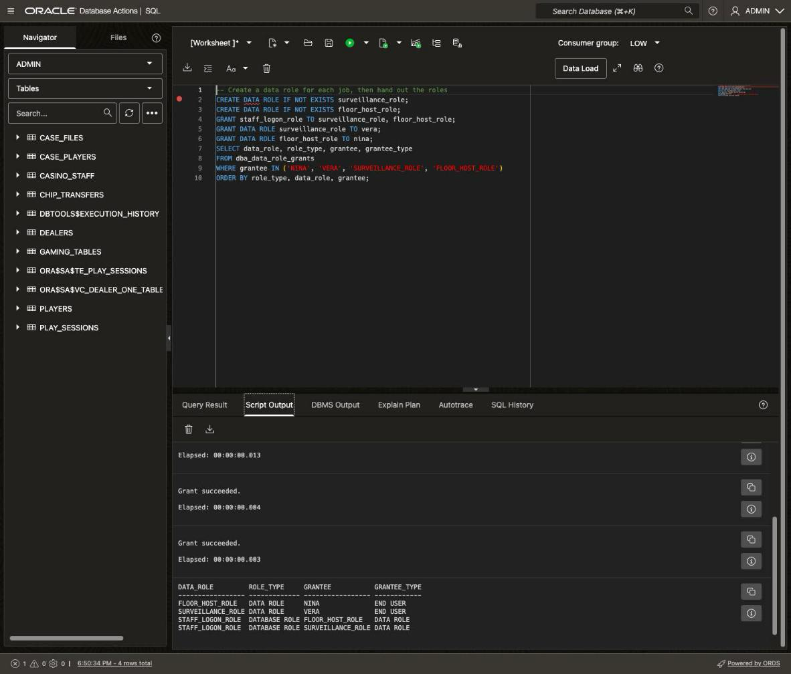
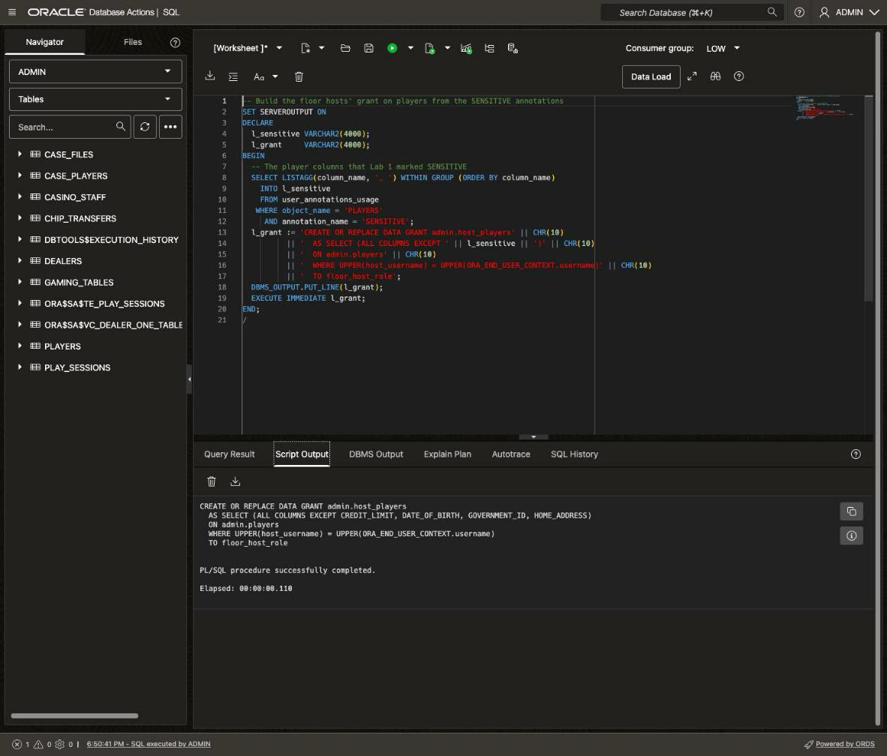
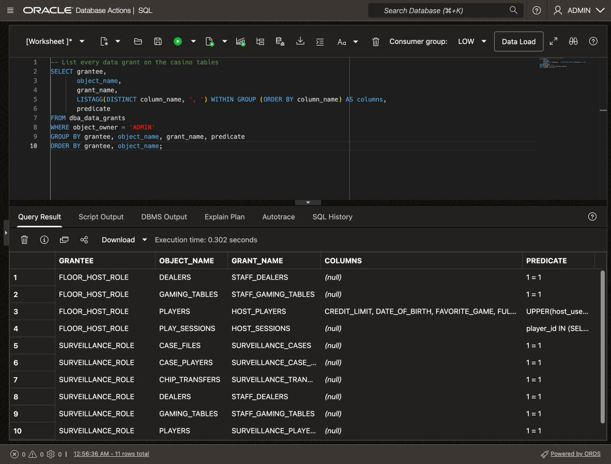
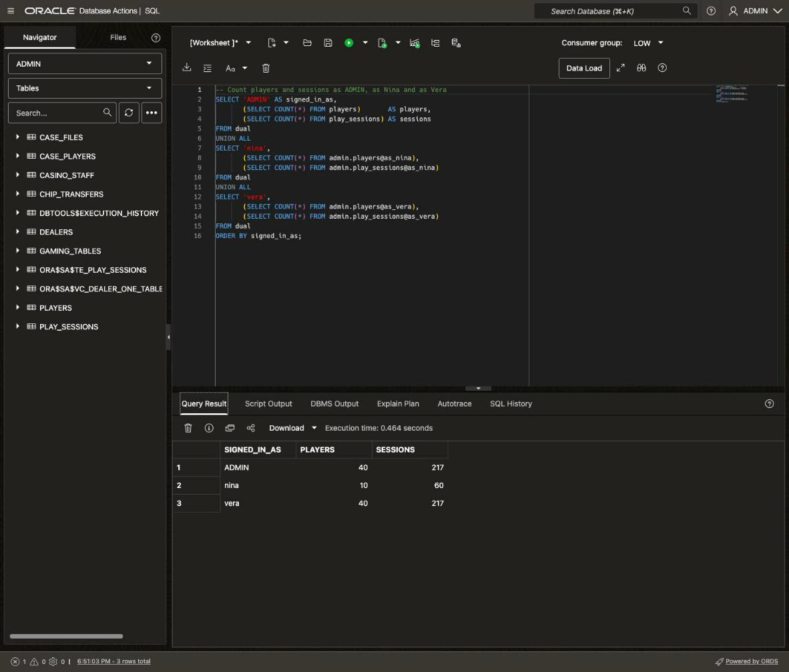
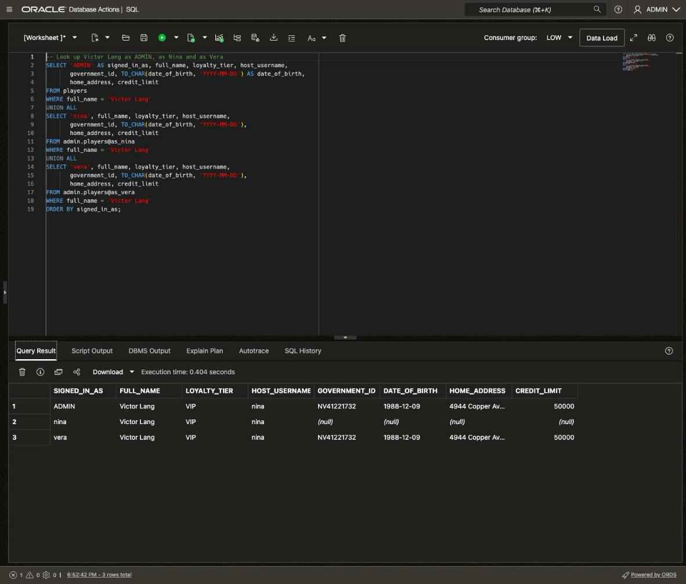
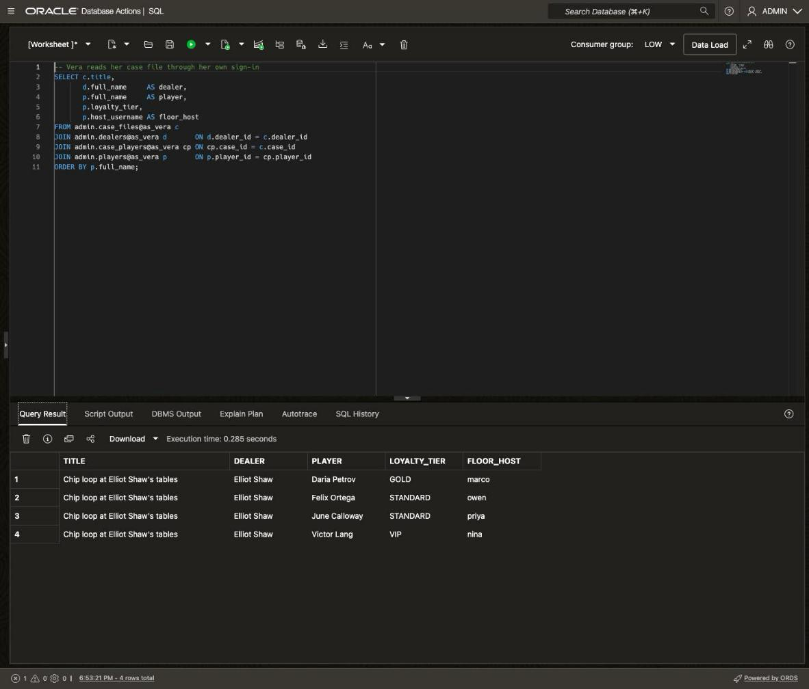
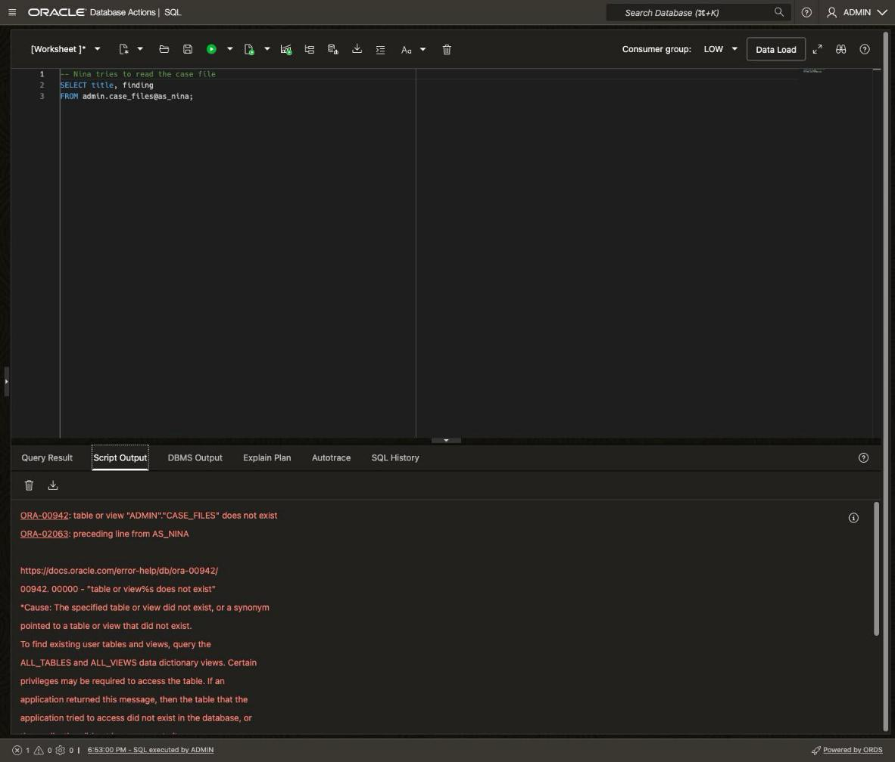

# Protect the Evidence with Deep Data Security

## Introduction

Vera Lindqvist's case file is ready. It names dealer Elliot Shaw and four players, and one of them is Victor Lang. Victor is a VIP, and his floor host is Nina Alvarez. Nina books his dinners, holds his seat and knows him well. If she sees the case file, she could warn him, even by accident, and the investigation would be over.

There's a second risk. This week, the Silverleaf Casino gives each floor host an AI assistant that handles the whole job in one place. Nina asks it questions in plain words, such as "Who are my VIPs today?" It books dinner reservations for her players and saves her notes after she talks with them. Nina no longer switches between apps, so she spends more time with her players.

To answer a question, the AI assistant writes a new SQL query and runs it. No developer writes or checks those queries first. Whatever the AI assistant can read, Nina can read.

Today, the casino's apps decide who sees what. Each app signs in to the database with one shared account that can read every table, and the app's code adds a filter to its queries, such as "only Nina's players". That works for the apps the casino wrote, because a developer put the filter into each query. But the AI assistant writes a new query for every question, so nothing adds the filter, and the shared account lets it read everything, including the case file.

In this lab, you move those rules into the database with Deep Data Security, new in Oracle AI Database 26ai. The database learns who is asking, and it applies that person's rules to every query before any data leaves the database. It doesn't matter which app or AI assistant wrote the query.

Estimated Time: 20 minutes

### Objectives

In this lab, you will:

* Create end users for Vera and Nina, and a data role for each job
* Write data grants that limit each job to the rows and columns it needs
* Sign in as Nina and Vera through database links
* Compare what ADMIN, Nina and Vera see, and keep the case file from Nina

### Prerequisites

This lab assumes you have:

* Completed **Get Started with LiveLabs** and opened the SQL worksheet as ADMIN
* Completed **Lab 1**, **Lab 2** and **Lab 3**

## How Deep Data Security works

Deep Data Security adds three things to the database. Each one answers a question the database needs answered before it runs a query.

**End users: who is asking?** An end user is a person the database knows by name, such as Nina. End users are a new kind of account, separate from the database users that own tables. An end user owns nothing. Nina signs in as herself, so every query from her AI assistant reaches the database as Nina's.

**Data roles: what job do they do?** A data role stands for one job, such as floor host. You give the role to every floor host. When Nina signs in, the database turns on her data role by itself, with no app code.

**Data grants: what may that job see or change?** A data grant is a rule written in SQL. It names a table, the columns the job may use, and a `WHERE` condition that picks the rows. The floor hosts' rule says: only the players you host, and not their government ID or home address. To find the players you host, the rule uses `ORA_END_USER_CONTEXT.username`, which returns the name of whoever is signed in. So one rule works for every floor host, with no names written into it.

**How the pieces fit together.** When Nina signs in, the database turns on her data role. Then, for every query she or her AI assistant runs, the database adds her data grant's `WHERE` condition and hides the columns she isn't allowed to see. However the query was written, Nina gets only her rows and columns. The database enforces the rules, not the app and not the AI assistant.

When a query runs, the database rewrites it to add the data grant's condition. The result is limited to the rows and columns the user may see, however the query was written.

**The trust chain.** When an end user signs in, the database turns on their data role, and their data grants then apply to every query. The database enforces the boundary, not the application and not the agent.

> **Note:** In this lab, you create Nina and Vera in the database with passwords. A real casino wouldn't create every employee there. Its staff already have accounts in an **identity provider**, a service such as Microsoft Entra ID or OCI IAM that stores accounts, checks each sign-in and records which roles each person holds. When Nina signs in, the identity provider gives her a **token**, a block of data that says who she is and which roles she holds. The identity provider signs the token, so the database can check that it's real. The database reads Nina's name and roles from the token and turns on the matching data roles, without storing an account for her. This lab has no identity provider, so it stores Nina and Vera in the database instead. Data roles and data grants work the same either way.

## Task 1: Create the end users and their data roles

1. Today, every app signs in with the same shared account, so the database can't tell Nina from Vera. DDS gives the database an **end user**. Clear the editor, paste the block, and click **Run Script** (F5).

    ```sql
    <copy>
    -- Create end users for Vera and Nina
    CREATE END USER IF NOT EXISTS vera IDENTIFIED BY Silverleaf2026 SCHEMA admin;
    CREATE END USER IF NOT EXISTS nina IDENTIFIED BY Silverleaf2026 SCHEMA admin;
    </copy>
    ```


    > **Note:** End users created with a password, like these two, are **local end users**: the database stores them. Oracle meant them for testing, demos and simple apps, and this lab uses them only because it has no identity provider. In production, Nina and Vera would exist only in the identity provider. 

2. End users have their own place in the data dictionary. First, look for Vera and Nina among end users. Clear the editor, paste the query, and click **Run Statement**.

    ```sql
    <copy>
    -- Look for Vera and Nina among end users
    SELECT username, account_status, authentication_type
    FROM dba_end_users
    WHERE username IN ('NINA', 'VERA')
    ORDER BY username;
    </copy>
    ```

    You should see `NINA` and `VERA` in `DBA_END_USERS`, both `OPEN`, with `PASSWORD` sign-in.

    Notice that the database stores the names in upper case. The casino tables store `nina` and `vera` in lower case, so every rule in this lab compares names with `UPPER()`.

3. Now look for them among ordinary database users, such as ADMIN. Clear the editor, paste the query, and click **Run Statement**.

    ```sql
    <copy>
    -- Look for Vera and Nina among database users
    SELECT COUNT(*) AS database_users_named_nina_or_vera
    FROM dba_users
    WHERE username IN ('NINA', 'VERA');
    </copy>
    ```

    The query returns 0, because neither one is a database user. The database now knows Nina and Vera by name, which the shared account could never tell it.

4. Nina isn't the casino's only floor host. Marco, Priya and Owen do the same job and need the same access. A **data role** holds the access for one job. Data grants go to the role, and the role goes to each person who does that job. When the casino hires a new floor host, one statement gives them every floor-host rule. When a rule changes, you change it once, for the role, not for each person.

    Create a data role for surveillance and one for floor hosts. These data roles are separate from the `staff_role` values in **Lab 1**, which only label each person's job in the casino tables. Clear the editor, paste the block, and click **Run Script**.

    ```sql
    <copy>
    -- New in 26ai: a data role for each job
    CREATE DATA ROLE IF NOT EXISTS surveillance_role;
    CREATE DATA ROLE IF NOT EXISTS floor_host_role;
    </copy>
    ```

    Script Output confirms the two data roles.

5. Data grants decide what someone can read or change. Signing in is different. 
    
    A **privilege** is permission to do one action, and a **database role** is a named set of privileges. You can't give a database role to an end user directly. Instead, you put it inside each data role, and the end user gets it through their data role.

    Create an ordinary database role that holds `CREATE SESSION`, and put it inside both data roles. This block is ordinary Oracle SQL. Clear the editor, paste the block, and click **Run Script**.

    ```sql
    <copy>
    -- Ordinary Oracle SQL: a database role that holds the sign-in privilege
    CREATE ROLE IF NOT EXISTS staff_logon_role;
    GRANT CREATE SESSION TO staff_logon_role;
    -- Put the sign-in role inside both data roles
    GRANT staff_logon_role TO surveillance_role, floor_host_role;
    </copy>
    ```

    Script Output confirms the role and both grants. The last line puts a database role inside the two data roles with the ordinary `GRANT` statement.

6. Now give each person their data role, then check who holds which role. Clear the editor, paste the block, and click **Run Script**.

    ```sql
    <copy>
    -- New in 26ai: give each person their data role
    GRANT DATA ROLE surveillance_role TO vera;
    GRANT DATA ROLE floor_host_role TO nina;
    -- Check who holds which role
    SELECT data_role, role_type, grantee, grantee_type
    FROM dba_data_role_grants
    WHERE grantee IN ('NINA', 'VERA', 'SURVEILLANCE_ROLE', 'FLOOR_HOST_ROLE')
    ORDER BY role_type, data_role, grantee;
    </copy>
    ```

    You should see four rows. Data role `FLOOR_HOST_ROLE` goes to end user `NINA`, and `SURVEILLANCE_ROLE` goes to `VERA`. The database role `STAFF_LOGON_ROLE` goes to both data roles.
    
    Vera and Nina can now sign in, but neither role can read a single row yet. Every end user starts there: no access, until a data grant says otherwise.

    

## Task 2: Write the casino's rules as data grants

1. Start with the rule for floor hosts. Nina books Victor's dinners, plans his birthday and helps arrange his credit, so she needs his name, his tier, his birth date, his credit limit and the fact that she's his host. She has no reason to see his other details, like his government ID or home address. And she should see only her own players, not Marco's or Priya's.

    Before data grants, you had three ways to enforce a rule like that, and each has gaps:

    * **A filter in application code.** Every app adds "only this host's players" to its queries. A query that leaves it out, such as one Nina's AI assistant writes, reads every player.
    * **A view for each rule.** A view can leave out rows and columns. But each rule needs its own view, and every app has to remember to query the view instead of the table.
    * **A Virtual Private Database policy.** A PL/SQL function writes a `WHERE` clause, and the database adds it to every query on the table. It works for every tool, but the rule is hidden in code. With a shared account, the app also has to tell the database who's asking.

    A **data grant** is the rule itself, written in SQL. It names the rows and columns a data role can read or change, and the database already knows which end user is asking. A rule that once needed a PL/SQL function in a Virtual Private Database policy is now a SQL statement you can read.

    This lab writes rules for reading. A data grant that allows `INSERT` would cover the AI assistant's other jobs, so it could book dinners and save notes only for Nina's own players.

    Write the floor hosts' data grant on `players`. Clear the editor, paste the statement, and click **Run Script**.

    ```sql
    <copy>
    -- The floor hosts' grant on players: their own players, without government ID or home address
    CREATE OR REPLACE DATA GRANT host_players
      AS SELECT (ALL COLUMNS EXCEPT government_id, home_address)
      ON players
      WHERE UPPER(host_username) = UPPER(ORA_END_USER_CONTEXT.username)
      TO floor_host_role;
    </copy>
    ```

    Script Output confirms that the database created the data grant. How the grant reads:

    * `ALL COLUMNS EXCEPT` lets floor hosts read every column of `players` except `government_id` and `home_address`.
    * `WHERE` is the row rule. `ORA_END_USER_CONTEXT.username` returns the signed-in end user's name, such as `NINA`. A floor host sees only the players they host, so one grant works for all four floor hosts.
    * `TO floor_host_role` gives the grant to the role, so every floor host follows the same rule.

    

    > **Note:** `ALL COLUMNS EXCEPT` also covers columns added to `players` later. Floor hosts see any new column unless you add it to the list.

2. Now write the rest of the casino's rules, one group at a time. Floor hosts also see the play sessions of their own players, so Nina can see when Victor played. Clear the editor, paste the statement, and click **Run Script**.

    ```sql
    <copy>
    -- The floor hosts' grant on play_sessions: only their own players' sessions
    CREATE OR REPLACE DATA GRANT host_sessions
      AS SELECT
      ON play_sessions
      WHERE player_id IN (SELECT p.player_id
                            FROM admin.players p
                           WHERE UPPER(p.host_username) = UPPER(ORA_END_USER_CONTEXT.username))
      TO floor_host_role;
    </copy>
    ```

    `host_sessions` lets floor hosts read the play sessions of their own players. Its subquery finds those players in `players`.

3. Vera investigates the whole floor, so surveillance sees every player, session and chip transfer, and the case file. Clear the editor, paste the block, and click **Run Script**.

    ```sql
    <copy>
    -- The surveillance grants: every row and column of five tables
    CREATE OR REPLACE DATA GRANT surveillance_players
      AS SELECT ON players TO surveillance_role;
    CREATE OR REPLACE DATA GRANT surveillance_sessions
      AS SELECT ON play_sessions TO surveillance_role;
    CREATE OR REPLACE DATA GRANT surveillance_transfers
      AS SELECT ON chip_transfers TO surveillance_role;
    CREATE OR REPLACE DATA GRANT surveillance_cases
      AS SELECT ON case_files TO surveillance_role;
    CREATE OR REPLACE DATA GRANT surveillance_case_players
      AS SELECT ON case_players TO surveillance_role;
    </copy>
    ```

    The five `surveillance_` grants have no column list and no `WHERE` clause. Vera reads every row and column of those tables.

4. Everyone on staff can read the dealers and gaming tables. Clear the editor, paste the block, and click **Run Script**.

    ```sql
    <copy>
    -- The grants for all staff: dealers and gaming tables
    CREATE OR REPLACE DATA GRANT staff_dealers
      AS SELECT ON dealers TO surveillance_role, floor_host_role;
    CREATE OR REPLACE DATA GRANT staff_gaming_tables
      AS SELECT ON gaming_tables TO surveillance_role, floor_host_role;
    </copy>
    ```

    `staff_dealers` and `staff_gaming_tables` name both roles. Dealers and gaming tables hold nothing sensitive.

    Floor hosts get no grant on `chip_transfers`, `case_files` or `case_players`. They also have no privilege on `casino_graph` or the `chip_loop_players` view. You don't write rules to hide things: whatever a data role isn't granted stays out of reach. In **Lab 3**, the case file said `SURVEILLANCE`, but nothing enforced it. Now only `surveillance_role` can read it.

    These rules live in the database, not in an app. When Nina's AI assistant goes live, it gets them without a line of new code, and so does every app the casino builds later.

5. Every rule now lives in one place that you can query. If the casino's auditors ask who can read the case file, nobody has to dig through each app's code. The data dictionary view `DBA_DATA_GRANTS` records every data grant. This query shows one row per grant and role, with its columns and row rule. Clear the editor, paste the query, and click **Run Statement**.

    ```sql
    <copy>
    -- List every data grant on the casino tables
    SELECT grantee,
           object_name,
           grant_name,
           LISTAGG(DISTINCT column_name, ', ') WITHIN GROUP (ORDER BY column_name) AS columns,
           predicate
    FROM dba_data_grants
    WHERE object_owner = 'ADMIN'
    GROUP BY grantee, object_name, grant_name, predicate
    ORDER BY grantee, object_name;
    </copy>
    ```

    You should see 11 rows: four for `FLOOR_HOST_ROLE` and seven for `SURVEILLANCE_ROLE`. Find `HOST_PLAYERS`. Its `COLUMNS` value lists `CREDIT_LIMIT`, `DATE_OF_BIRTH`, `FAVORITE_GAME`, `FULL_NAME`, `HOST_USERNAME`, `LOYALTY_TIER` and `PLAYER_ID`, but not `GOVERNMENT_ID` or `HOME_ADDRESS`. A NULL `COLUMNS` value means every column, and a `PREDICATE` of `1 = 1` means every row, because 1 always equals 1.

    

## Task 3: Sign in as Nina and Vera

So far, you've been signed in as ADMIN, and ADMIN sees everything. To prove the rules work, you have to ask the database a question as Nina. In the casino, that question comes from Nina's AI assistant, which connects to the database signed in as her. So in this task, we're going to mimic that with a database link, a connection that signs in as one person. Her AI assistant would sign in as Nina the same way, so the end user results are the same. You make one for Nina and one for Vera. From then on, any query ending in `@as_nina` is Nina asking.

1. This block is setup, and you don't need to read the code. It creates a procedure, `connect_as`, that saves an end user's password and creates a database link that signs in as that end user. Clear the editor, paste the block, and click **Run Script**.

    ```sql
    <copy>
    -- Setup: connect_as creates a database link that signs in as an end user
    CREATE OR REPLACE PROCEDURE connect_as (p_end_user VARCHAR2, p_password VARCHAR2)
      AUTHID CURRENT_USER
    AS
      l_link  VARCHAR2(128) := 'AS_' || UPPER(p_end_user);
      l_cred  VARCHAR2(128) := 'AS_' || UPPER(p_end_user) || '_CRED';
      l_found PLS_INTEGER;
    BEGIN
      -- Already connected once: keep the link, just refresh the password
      SELECT COUNT(*) INTO l_found FROM user_db_links
       WHERE db_link = l_link OR db_link LIKE l_link || '.%';
      IF l_found > 0 THEN
        DBMS_CLOUD.UPDATE_CREDENTIAL(l_cred, 'PASSWORD', p_password);
        RETURN;
      END IF;
      BEGIN DBMS_CLOUD.DROP_CREDENTIAL(l_cred); EXCEPTION WHEN OTHERS THEN NULL; END;
      DBMS_CLOUD.CREATE_CREDENTIAL(credential_name => l_cred,
                                   username        => UPPER(p_end_user),
                                   password        => p_password);
      FOR c IN (SELECT 'adb.' || JSON_VALUE(cloud_identity, '$.REGION') || '.oraclecloud.com' AS host,
                       SYS_CONTEXT('USERENV', 'SERVICE_NAME') AS svc
                  FROM v$pdbs) LOOP
        DBMS_CLOUD_ADMIN.CREATE_DATABASE_LINK(
          db_link_name       => l_link,
          hostname           => c.host,
          port               => 1522,
          service_name       => c.svc,
          ssl_server_cert_dn => NULL,
          credential_name    => l_cred,
          directory_name     => 'DBLINK_WALLET_DIR');
      END LOOP;
    END;
    /
    </copy>
    ```

    Script Output shows that the database compiled the `connect_as` procedure.

    > **Note:** In production, Nina has no database password. She signs in through the identity provider, and her AI assistant passes her token to the database with each request. The database checks the token and applies the same data grants. The link is the quickest way to get a real session signed in as Nina in a workshop.

2. Now create a link for each person. Clear the editor, paste the two lines, and click **Run Script**.

    ```sql
    <copy>
    -- Create one link that signs in as Nina and one that signs in as Vera
    EXEC connect_as('nina', 'Silverleaf2026');
    EXEC connect_as('vera', 'Silverleaf2026');
    </copy>
    ```

    You now have two links, `AS_NINA` and `AS_VERA`. A query that ends in `@as_nina` runs in a session signed in as Nina, under her data role. 

    > **Note:** A link signs in on its first query and stays open for the rest of your worksheet session. 

## Task 4: See the floor through Nina's and Vera's eyes

1. Start with a simple question: how many players and play sessions are there? Ask it three times: as ADMIN, as Nina and as Vera. The query is the same each time. Only the person asking changes. Clear the editor, paste the query, and click **Run Statement**.

    ```sql
    <copy>
    -- Count players and sessions as ADMIN, as Nina and as Vera
    SELECT 'ADMIN' AS signed_in_as,
           (SELECT COUNT(*) FROM players)       AS players,
           (SELECT COUNT(*) FROM play_sessions) AS sessions
    FROM dual
    UNION ALL
    SELECT 'nina',
           (SELECT COUNT(*) FROM players@as_nina),
           (SELECT COUNT(*) FROM play_sessions@as_nina)
    FROM dual
    UNION ALL
    SELECT 'vera',
           (SELECT COUNT(*) FROM players@as_vera),
           (SELECT COUNT(*) FROM play_sessions@as_vera)
    FROM dual
    ORDER BY signed_in_as;
    </copy>
    ```

    You should see three rows:

    * **ADMIN:** 40 players and 217 sessions. Data grants don't apply to a database user.
    * **nina:** 10 players and 60 sessions, only the players she hosts.
    * **vera:** 40 players and 217 sessions. Her data role covers the whole floor.

    None of the counts has a `WHERE` clause. The database added Nina's row rule inside her session. With a shared account and filters in app code, this same query would count all 40 players for anyone who ran it.

    

2. Victor Lang lost at roulette tonight, and Nina offered him dinner. She asks her AI assistant to book it, so the AI assistant pulls up his record. Look him up the same three ways. He's one of Nina's players, so she can see his row. Watch the four columns **Lab 1** marked sensitive on Nina's row. Clear the editor, paste the query, and click **Run Statement**.

    ```sql
    <copy>
    -- Look up Victor Lang as ADMIN, as Nina and as Vera
    SELECT 'ADMIN' AS signed_in_as, full_name, loyalty_tier, host_username,
           government_id, TO_CHAR(date_of_birth, 'YYYY-MM-DD') AS date_of_birth,
           home_address, credit_limit
    FROM players
    WHERE full_name = 'Victor Lang'
    UNION ALL
    SELECT 'nina', full_name, loyalty_tier, host_username,
           government_id, TO_CHAR(date_of_birth, 'YYYY-MM-DD'),
           home_address, credit_limit
    FROM admin.players@as_nina
    WHERE full_name = 'Victor Lang'
    UNION ALL
    SELECT 'vera', full_name, loyalty_tier, host_username,
           government_id, TO_CHAR(date_of_birth, 'YYYY-MM-DD'),
           home_address, credit_limit
    FROM admin.players@as_vera
    WHERE full_name = 'Victor Lang'
    ORDER BY signed_in_as;
    </copy>
    ```

    You should see three rows for Victor, a `VIP` hosted by `nina`. ADMIN and Vera see his government ID, `NV41221732`, and his birth date, `1988-12-09`. They also see his address on Copper Ave and his credit limit of 50000. On Nina's row, his birth date and credit limit show, but his government ID and home address are NULL.

    Nina's query didn't fail. Her grant doesn't cover those two columns, so the database returns the row with those values set to NULL. Nina, or any tool working for her, gets the same NULLs.

    The AI assistant still has what it needs to book his dinner: his name, his tier and that Nina is his host. Nina's apps and her AI assistant keep working, because the query and its columns stay the same. Only the private values are missing.

    


## Task 5: Keep the case file from Nina

1. First, make sure the rules don't get in Vera's way. She reads her case file through her own sign-in. This is the **Lab 3** case file query, run through Vera's link. Clear the editor, paste the query, and click **Run Statement**.

    ```sql
    <copy>
    -- Vera reads her case file through her own sign-in
    SELECT c.title,
           d.full_name     AS dealer,
           p.full_name     AS player,
           p.loyalty_tier,
           p.host_username AS floor_host
    FROM admin.case_files@as_vera c
    JOIN admin.dealers@as_vera d       ON d.dealer_id = c.dealer_id
    JOIN admin.case_players@as_vera cp ON cp.case_id = c.case_id
    JOIN admin.players@as_vera p       ON p.player_id = cp.player_id
    ORDER BY p.full_name;
    </copy>
    ```

    You should see the same four rows as in **Lab 3**, each naming dealer Elliot Shaw. The players are Daria Petrov, Felix Ortega, June Calloway and Victor Lang. Vera's data role reads the case tables, the dealers and every player, so her investigation works as before.

    

2. That evening, Victor tells Nina he feels like surveillance is watching him. Nina means no harm. She asks her AI assistant whether surveillance has opened a case on any of her players, and the AI assistant writes a query against `case_files`. This statement should fail. Clear the editor, paste the query, and click **Run Script**.

    ```sql
    <copy>
    -- Nina tries to read the case file
    SELECT title, finding
    FROM admin.case_files@as_nina;
    </copy>
    ```

    **Expected Result:** The query fails with `ORA-00942: table or view "ADMIN"."CASE_FILES" does not exist`, followed by `ORA-02063: preceding line from AS_NINA`.

    Nina's data role holds no grant on `case_files`, so as far as her session can tell, the table doesn't exist. If the AI assistant had answered, Nina could have tipped Victor off without meaning to. That holds for any SQL that she or her AI assistant writes. Victor Lang's case stays with surveillance.

    


## Conclusion

You protected Vera's evidence, and Nina's AI assistant can go live. Nina sees her ten players and their sessions, without their government IDs or home addresses. She can't see other hosts' VIPs, and she can't open the case file. Vera sees everything her investigation needs.


That's the thread through this workshop: the rules live in the database. Domains and an assertion checked every write, including JSON from the tablets at the gaming tables. The graph read the same rows as SQL. Data grants now decide what every end user can see. So every app, JSON document, graph query and AI agent gets the same answers from the same rules.

You may now **proceed to the next lab**.

## Learn More

* [Oracle AI Database Oracle Deep Data Security Guide, 26ai](https://docs.oracle.com/en/database/oracle/oracle-database/26/ddscg/index.html)
* [Create End User](https://docs.oracle.com/en/database/oracle/oracle-database/26/ddscg/create-end-user.html)
* [About Data Grants](https://docs.oracle.com/en/database/oracle/oracle-database/26/ddscg/data-grants.html)
* [Create Data Grants](https://docs.oracle.com/en/database/oracle/oracle-database/26/ddscg/create-data-grants.html)

## Acknowledgements
* **Author** - Killian Lynch, Oracle Database Product Management
* **Last Updated By/Date** - Killian Lynch, October 2026
