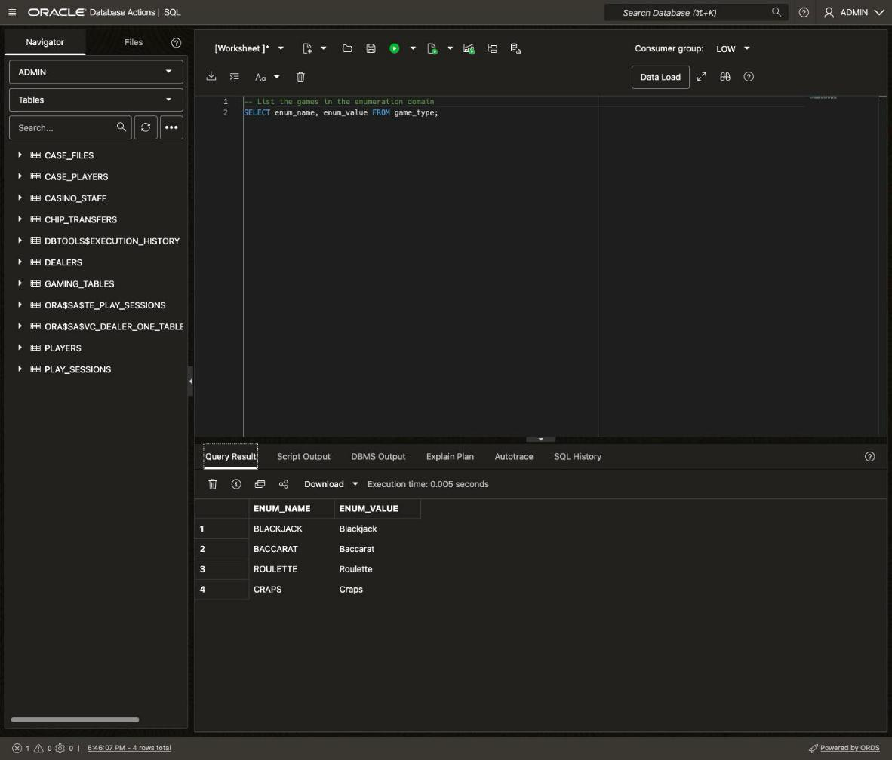
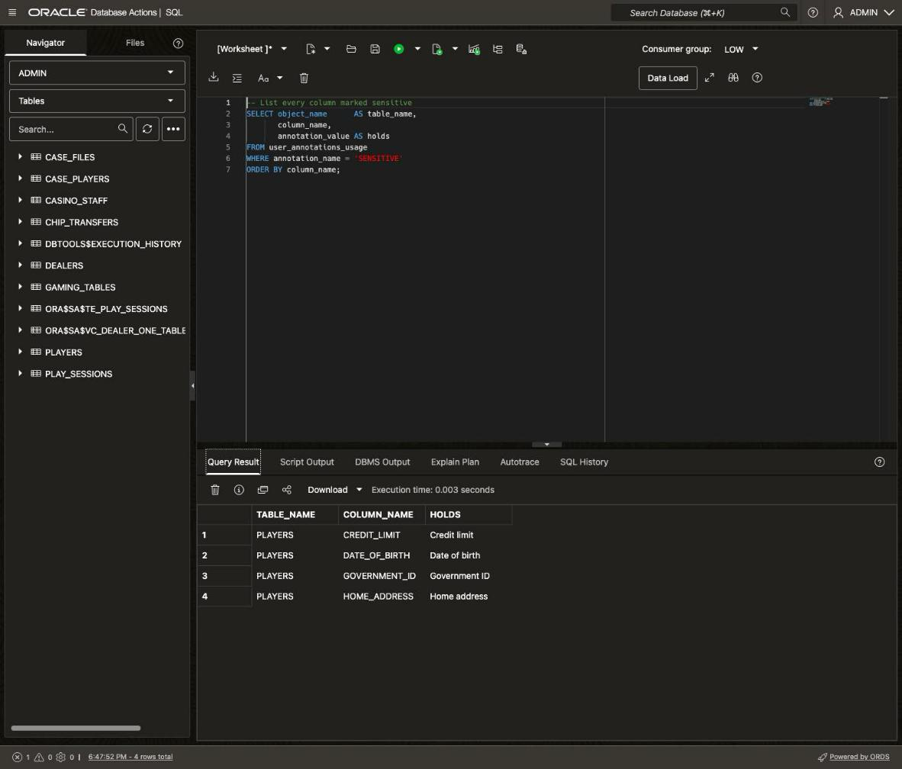
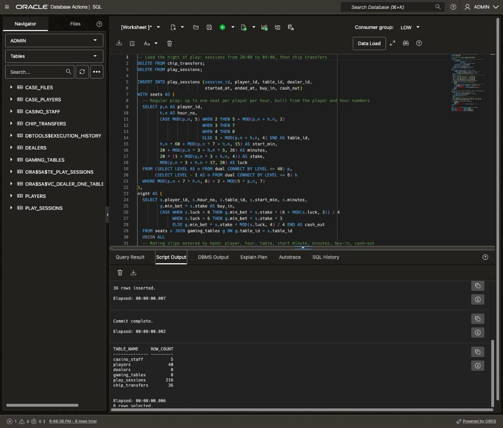
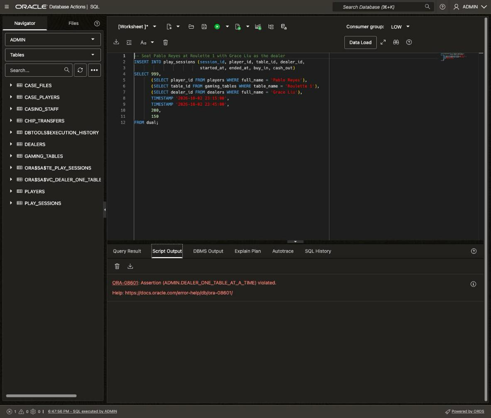
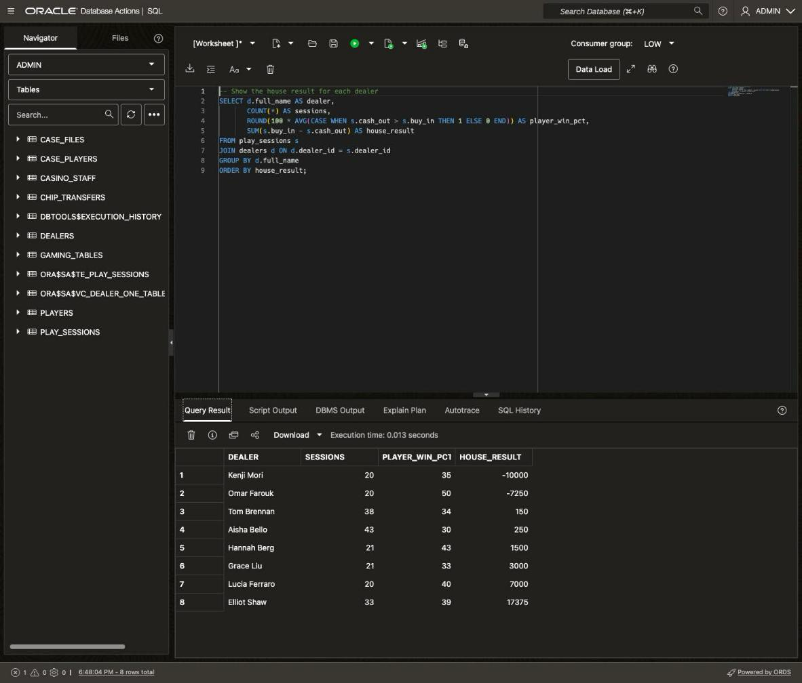

# Build the Casino Floor with Domains, Annotations and Assertions

## Introduction

Surveillance at the Silverleaf Casino has a tip: someone on the floor is cheating, and they aren't working alone. Vera Lindqvist, the casino's surveillance investigator, needs the night's play in one database she can trust.

You build that database in this lab. The floor has 40 players, 8 dealers and 8 gaming tables. Four floor hosts look after the players: Nina Alvarez, Marco Bellini, Priya Raman and Owen Fitch.

Most apps keep their data rules in application code. A form checks that an amount is valid, and a service checks that a dealer is free. That works until another app, a script or an AI agent writes to the same tables and skips the check. In this lab, you put the rules in the database instead. The database enforces them for every writer, including apps you haven't built yet.

This lab uses three features of Oracle AI Database 26ai to do it:

* **Data use case domains.** A domain is a named data type with rules attached, such as a check constraint. You use the domain as a column's data type, and the column gets its rules. You write a rule once, and every column that uses the domain enforces it the same way. Before domains, you copied the same check constraint onto each column, and the copies could drift apart.
* **Annotations.** An annotation is a name and value label on a table, column or domain. The database stores it in the data dictionary, so any app or tool can query it. Annotations let the schema describe itself, such as which columns hold personal data. Comments could already hold notes, but a comment is one free-text string. A column can carry many annotations, and tools can look them up by name.
* **Assertions.** An assertion is a rule written as a query. It can compare many rows and tables, and the database rejects any change that breaks it. Before assertions, rules like this lived in application code or in triggers. Every app had to repeat the code, and triggers are hard to get right. Now you state the rule once, and the database enforces it for every app.

Estimated Time: 20 minutes

### Objectives

In this lab, you will:

* Create data use case domains, including an enumeration domain
* Build the casino tables and annotate the sensitive player columns
* Load one night of play
* Enforce a floor rule with an assertion and watch it reject a bad record
* Check whether anything on the floor looks wrong

### Prerequisites

This lab assumes you have:

* Completed **Get Started with LiveLabs** and opened the SQL worksheet as ADMIN

## Task 1: Create domains for the casino floor

1. A casino stores chip amounts in many places: table limits, credit limits and each session's starting and ending chips. Without domains, each of those columns needs its own copy of the rules. Copies drift, so one table might accept a $7 chip while another rejects it. A domain keeps the data type and its rules in one place.

    Create four domains for the casino. Each one sets a data type and the rules its values must follow. Clear the editor, paste this block, and click **Run Script** (F5).

    ```sql
    <copy>
    -- Create four data use case domains for the casino
    CREATE DOMAIN IF NOT EXISTS game_type AS ENUM (
      blackjack = 'Blackjack',
      baccarat  = 'Baccarat',
      roulette  = 'Roulette',
      craps     = 'Craps'
    );

    CREATE DOMAIN IF NOT EXISTS staff_role AS ENUM (
      surveillance = 'SURVEILLANCE',
      floor_host   = 'FLOOR_HOST'
    );

    CREATE DOMAIN IF NOT EXISTS chip_amount AS NUMBER(10)
      CONSTRAINT chip_amount_ck CHECK (chip_amount >= 0 AND MOD(chip_amount, 5) = 0)
      ANNOTATIONS (currency 'USD', smallest_chip '5');

    CREATE DOMAIN IF NOT EXISTS staff_username AS VARCHAR2(30)
      CONSTRAINT staff_username_ck CHECK (REGEXP_LIKE(staff_username, '^[a-z]+$'))
      ANNOTATIONS (description 'Staff sign-in name, lowercase letters only');
    </copy>
    ```

    Script Output confirms the four new domains:

    * `game_type` is an **enumeration domain**: a fixed list of names, each with a value. A column stores the value, and SQL can write it as `game_type.blackjack`. A typo such as `Blackjak` can't get in. Without enumeration domains, you'd use a lookup table, which adds a table and a join. Or you'd use a check constraint with an `IN` list, which apps can't easily read. An enumeration domain needs neither. If a list changes often, a lookup table is still the better fit.
    * `staff_role` is a second enumeration domain: the two staff jobs, `SURVEILLANCE` and `FLOOR_HOST`. The staff table uses it here, and the case files use it in **Lab 3**, so both columns share one list.
    * `chip_amount` rejects negative amounts and anything that isn't a multiple of $5, the smallest chip the casino uses. Every column that uses it gets this check, plus its `currency` and `smallest_chip` annotations.
    * `staff_username` allows lowercase letters only.

2. An enumeration domain also works as a lookup list that you can query like a table. An app can read the list straight from the database, for example to fill a drop-down, so the app and the data always agree. Clear the editor, paste the query, and click **Run Statement**.

    ```sql
    <copy>
    -- List the games in the enumeration domain
    SELECT enum_name, enum_value FROM game_type;
    </copy>
    ```

    You should see four rows, one per game. `ENUM_NAME` is the name you use in SQL. `ENUM_VALUE` is what a column stores, such as `Blackjack`.

    

3. Domains come with several SQL functions that make them easier to work with. One of them, `DOMAIN_CHECK`, tests a value against a domain's rules without inserting anything. An app can use it to check a form field before saving, with the same rule the database enforces. Without it, the app keeps its own copy of the rule, and the two copies can disagree. Clear the editor and run this query with **Run Statement**.

    ```sql
    <copy>
    -- Test four values against the domains
    SELECT DOMAIN_CHECK(chip_amount, 25)        AS chips_25,
           DOMAIN_CHECK(chip_amount, 7)         AS chips_7,
           DOMAIN_CHECK(staff_username, 'nina') AS nina_lower,
           DOMAIN_CHECK(staff_username, 'Nina') AS nina_capital;
    </copy>
    ```

    You should see TRUE, FALSE, TRUE and FALSE. There's no $7 chip at the Silverleaf, and `Nina` with a capital N isn't a valid username. These are the same checks that every column using these domains will run.

## Task 2: Build the casino tables and mark the sensitive data

1. Create the tables for the people on the floor: staff, players, dealers and gaming tables. Several columns use your domains as their data type. Notice what you don't write: no check constraints for chip amounts, usernames or staff roles. Those columns get their rules from the domains.

    Four player columns also carry a `sensitive` annotation. The older way to label a column is a comment, added with `COMMENT ON`. A comment is one free-text sentence, so a tool has to read it and guess. An annotation is a name and value pair, and a column can have many. A tool can ask for every column marked `sensitive` and get an exact answer. Clear the editor, paste the block, and click **Run Script**.

    ```sql
    <copy>
    -- Create the tables for the people on the floor
    CREATE TABLE IF NOT EXISTS casino_staff (
      username    staff_username PRIMARY KEY,
      full_name   VARCHAR2(60) NOT NULL,
      staff_role  staff_role NOT NULL
    )
    ANNOTATIONS (data_owner 'Casino Operations');

    CREATE TABLE IF NOT EXISTS players (
      player_id      NUMBER PRIMARY KEY,
      full_name      VARCHAR2(60) NOT NULL,
      loyalty_tier   VARCHAR2(10) NOT NULL
                     CONSTRAINT players_tier_ck CHECK (loyalty_tier IN ('STANDARD', 'GOLD', 'VIP')),
      host_username  staff_username NOT NULL REFERENCES casino_staff (username),
      government_id  VARCHAR2(20)  ANNOTATIONS (sensitive 'Government ID'),
      date_of_birth  DATE          ANNOTATIONS (sensitive 'Date of birth'),
      home_address   VARCHAR2(100) ANNOTATIONS (sensitive 'Home address'),
      credit_limit   chip_amount   ANNOTATIONS (sensitive 'Credit limit')
    )
    ANNOTATIONS (data_owner 'Player Services');

    CREATE TABLE IF NOT EXISTS dealers (
      dealer_id  NUMBER PRIMARY KEY,
      full_name  VARCHAR2(60) NOT NULL,
      hired_on   DATE NOT NULL
    )
    ANNOTATIONS (data_owner 'Table Games');

    CREATE TABLE IF NOT EXISTS gaming_tables (
      table_id    NUMBER PRIMARY KEY,
      table_name  VARCHAR2(30) NOT NULL UNIQUE,
      game        game_type NOT NULL,
      min_bet     chip_amount NOT NULL,
      max_bet     chip_amount NOT NULL,
      CONSTRAINT gaming_tables_bet_ck CHECK (max_bet > min_bet)
    )
    ANNOTATIONS (data_owner 'Table Games');
    </copy>
    ```

    A few things to notice:

    * Every player has a floor host. `host_username` uses the `staff_username` domain and references `casino_staff`, so it follows the same lowercase rule as the staff table's key.
    * `credit_limit`, `min_bet` and `max_bet` use `chip_amount`. Three columns in two tables share one rule, and you wrote it once.
    * `gaming_tables.game` uses `game_type`, so every table runs one of the four games.
    * `loyalty_tier` uses a plain check constraint, not a domain. The rule applies to one column in one table, so a check constraint is simpler. A domain pays off when several columns share a rule, or when apps need to read the list.
    * `government_id`, `date_of_birth`, `home_address` and `credit_limit` carry the `sensitive` annotation. An annotation is a name and an optional value, stored in the data dictionary.
    * Each table has a `data_owner` annotation that names the team responsible for its data. That team decides who can see the data and fixes it when it's wrong. When a row looks wrong or someone needs access, anyone can look up which team to ask.

2. Now create the tables for what happens on the floor. A play session is one player's stint at one table with one dealer. A chip transfer records chips that one player hands to another, as surveillance logs it from the cameras. Clear the editor, paste the block, and click **Run Script**.

    ```sql
    <copy>
    -- Create the tables for what happens on the floor
    CREATE TABLE IF NOT EXISTS play_sessions (
      session_id  NUMBER PRIMARY KEY,
      player_id   NUMBER NOT NULL REFERENCES players (player_id),
      table_id    NUMBER NOT NULL REFERENCES gaming_tables (table_id),
      dealer_id   NUMBER NOT NULL REFERENCES dealers (dealer_id),
      started_at  TIMESTAMP NOT NULL,
      ended_at    TIMESTAMP NOT NULL,
      buy_in      chip_amount NOT NULL,
      cash_out    chip_amount NOT NULL,
      CONSTRAINT play_sessions_time_ck CHECK (ended_at > started_at)
    )
    ANNOTATIONS (data_owner 'Table Games', description 'One player at one table with one dealer');

    CREATE TABLE IF NOT EXISTS chip_transfers (
      transfer_id     NUMBER PRIMARY KEY,
      from_player_id  NUMBER NOT NULL REFERENCES players (player_id),
      to_player_id    NUMBER NOT NULL REFERENCES players (player_id),
      amount          chip_amount NOT NULL,
      transferred_at  TIMESTAMP NOT NULL,
      CONSTRAINT chip_transfers_amount_ck CHECK (amount > 0),
      CONSTRAINT chip_transfers_players_ck CHECK (from_player_id <> to_player_id)
    )
    ANNOTATIONS (data_owner 'Surveillance', description 'Chips passed from one player to another');
    </copy>
    ```

    `buy_in`, `cash_out` and `amount` also use `chip_amount`. Six columns across four tables now share one chip rule, defined in one place.

    Every table has a primary key, and every link between tables is a foreign key. These keys tell the database how the tables connect. **Lab 2** uses them to nest data into JSON documents, and **Lab 3** uses them to build a graph.

3. Annotations live in the data dictionary, so any tool or person can ask which columns are sensitive. A privacy tool, a reporting app or an AI agent can find personal data this way, without reading code or guessing from column names. Many teams track this in a spreadsheet or a separate data catalog instead. Those copies go stale when someone adds a column. An annotation is part of the column's definition. It's created and dropped with the column, and you read it with the same SQL you use for data. Clear the editor, paste the query, and click **Run Statement**.

    ```sql
    <copy>
    -- List every column marked sensitive
    SELECT object_name      AS table_name,
           column_name,
           annotation_value AS holds
    FROM user_annotations_usage
    WHERE annotation_name = 'SENSITIVE'
    ORDER BY column_name;
    </copy>
    ```

    You should see four rows, all from `PLAYERS`: `CREDIT_LIMIT`, `DATE_OF_BIRTH`, `GOVERNMENT_ID` and `HOME_ADDRESS`.

    

## Task 3: Load a night of play

1. Load the cast: five staff members, eight dealers, eight gaming tables and 40 players. Each player gets a floor host and a loyalty tier of `STANDARD`, `GOLD` or `VIP`. Clear the editor, paste the block, and click **Run Script**.

    ```sql
    <copy>
    -- Load the staff, dealers, gaming tables and players
    DELETE FROM chip_transfers;
    DELETE FROM play_sessions;
    DELETE FROM players;
    DELETE FROM dealers;
    DELETE FROM gaming_tables;
    DELETE FROM casino_staff;

    INSERT INTO casino_staff (username, full_name, staff_role) VALUES
      ('vera',  'Vera Lindqvist', 'SURVEILLANCE'),
      ('nina',  'Nina Alvarez',   'FLOOR_HOST'),
      ('marco', 'Marco Bellini',  'FLOOR_HOST'),
      ('priya', 'Priya Raman',    'FLOOR_HOST'),
      ('owen',  'Owen Fitch',     'FLOOR_HOST');

    INSERT INTO dealers (dealer_id, full_name, hired_on) VALUES
      (1, 'Grace Liu',     DATE '2014-03-10'),
      (2, 'Omar Farouk',   DATE '2019-08-26'),
      (3, 'Elliot Shaw',   DATE '2023-06-12'),
      (4, 'Hannah Berg',   DATE '2017-01-09'),
      (5, 'Kenji Mori',    DATE '2012-05-21'),
      (6, 'Lucia Ferraro', DATE '2025-02-03'),
      (7, 'Tom Brennan',   DATE '2009-10-05'),
      (8, 'Aisha Bello',   DATE '2021-07-19');

    INSERT INTO gaming_tables (table_id, table_name, game, min_bet, max_bet) VALUES
      (1, 'Blackjack 1', game_type.blackjack,  25,  2500),
      (2, 'Blackjack 2', game_type.blackjack,  25,  2500),
      (3, 'Blackjack 3', game_type.blackjack,  50,  5000),
      (4, 'Blackjack 4', game_type.blackjack, 100, 10000),
      (5, 'Baccarat 1',  game_type.baccarat,  100, 10000),
      (6, 'Baccarat 2',  game_type.baccarat,  100, 10000),
      (7, 'Roulette 1',  game_type.roulette,   10,  1000),
      (8, 'Craps 1',     game_type.craps,      10,  1000);

    INSERT INTO players (player_id, full_name, loyalty_tier, host_username,
                         government_id, date_of_birth, home_address, credit_limit) VALUES
      (1,  'Ava Brooks',    'VIP',      'marco', 'NV41007919', DATE '1959-04-19', '273 Lantern Way, Las Vegas, NV',  50000),
      (2,  'Ben Carter',    'STANDARD', 'priya', 'NV41015838', DATE '1960-05-24', '446 Mesa Dr, Las Vegas, NV',       2500),
      (3,  'Chloe Nguyen',  'GOLD',     'owen',  'NV41023757', DATE '1961-06-29', '619 Copper Ave, Las Vegas, NV',   10000),
      (4,  'Diego Santos',  'STANDARD', 'nina',  'NV41031676', DATE '1962-08-04', '792 Sage Ct, Las Vegas, NV',       2500),
      (5,  'Ella Fischer',  'STANDARD', 'marco', 'NV41039595', DATE '1963-09-09', '965 Juniper St, Las Vegas, NV',    2500),
      (6,  'Farid Rahman',  'GOLD',     'priya', 'NV41047514', DATE '1964-10-14', '1138 Lantern Way, Las Vegas, NV', 10000),
      (7,  'Gemma Doyle',   'STANDARD', 'owen',  'NV41055433', DATE '1965-11-19', '1311 Mesa Dr, Las Vegas, NV',      2500),
      (8,  'Hiro Tanaka',   'STANDARD', 'nina',  'NV41063352', DATE '1966-12-25', '1484 Copper Ave, Las Vegas, NV',   2500),
      (9,  'Isla McKenzie', 'GOLD',     'marco', 'NV41071271', DATE '1968-01-30', '1657 Sage Ct, Las Vegas, NV',     10000),
      (10, 'Jonah Weiss',   'VIP',      'priya', 'NV41079190', DATE '1969-03-06', '1830 Juniper St, Las Vegas, NV',  50000),
      (11, 'Keira Walsh',   'STANDARD', 'owen',  'NV41087109', DATE '1970-04-11', '2003 Lantern Way, Las Vegas, NV',  2500),
      (12, 'Liam Foster',   'GOLD',     'nina',  'NV41095028', DATE '1971-05-17', '2176 Mesa Dr, Las Vegas, NV',     10000),
      (13, 'Maya Patel',    'STANDARD', 'marco', 'NV41102947', DATE '1972-06-21', '2349 Copper Ave, Las Vegas, NV',   2500),
      (14, 'Noah Lindgren', 'STANDARD', 'priya', 'NV41110866', DATE '1973-07-27', '2522 Sage Ct, Las Vegas, NV',      2500),
      (15, 'Olivia Grant',  'GOLD',     'owen',  'NV41118785', DATE '1974-09-01', '2695 Juniper St, Las Vegas, NV',  10000),
      (16, 'Pablo Reyes',   'STANDARD', 'nina',  'NV41126704', DATE '1975-10-07', '2868 Lantern Way, Las Vegas, NV',  2500),
      (17, 'Quinn Harper',  'STANDARD', 'marco', 'NV41134623', DATE '1976-11-11', '3041 Mesa Dr, Las Vegas, NV',      2500),
      (18, 'Rosa Martins',  'GOLD',     'priya', 'NV41142542', DATE '1977-12-17', '3214 Copper Ave, Las Vegas, NV',  10000),
      (19, 'Samir Haddad',  'VIP',      'owen',  'NV41150461', DATE '1979-01-22', '3387 Sage Ct, Las Vegas, NV',     50000),
      (20, 'Tara Novak',    'STANDARD', 'nina',  'NV41158380', DATE '1980-02-27', '3560 Juniper St, Las Vegas, NV',   2500),
      (21, 'Daria Petrov',  'GOLD',     'marco', 'NV41166299', DATE '1981-04-03', '3733 Lantern Way, Las Vegas, NV', 10000),
      (22, 'Uma Desai',     'STANDARD', 'priya', 'NV41174218', DATE '1982-05-09', '3906 Mesa Dr, Las Vegas, NV',      2500),
      (23, 'Wes Turner',    'STANDARD', 'owen',  'NV41182137', DATE '1983-06-14', '4079 Copper Ave, Las Vegas, NV',   2500),
      (24, 'Yusuf Demir',   'GOLD',     'nina',  'NV41190056', DATE '1984-07-19', '4252 Sage Ct, Las Vegas, NV',     10000),
      (25, 'Zoe Adams',     'STANDARD', 'marco', 'NV41197975', DATE '1985-08-24', '4425 Juniper St, Las Vegas, NV',   2500),
      (26, 'Aaron Blake',   'STANDARD', 'priya', 'NV41205894', DATE '1986-09-29', '4598 Lantern Way, Las Vegas, NV',  2500),
      (27, 'Bianca Rossi',  'GOLD',     'owen',  'NV41213813', DATE '1987-11-04', '4771 Mesa Dr, Las Vegas, NV',     10000),
      (28, 'Victor Lang',   'VIP',      'nina',  'NV41221732', DATE '1988-12-09', '4944 Copper Ave, Las Vegas, NV',  50000),
      (29, 'Caleb Wright',  'STANDARD', 'marco', 'NV41229651', DATE '1990-01-14', '5117 Sage Ct, Las Vegas, NV',      2500),
      (30, 'Dana Kowalski', 'GOLD',     'priya', 'NV41237570', DATE '1991-02-19', '5290 Juniper St, Las Vegas, NV',  10000),
      (31, 'Felix Ortega',  'STANDARD', 'owen',  'NV41245489', DATE '1992-03-26', '5463 Lantern Way, Las Vegas, NV',  2500),
      (32, 'Greta Holm',    'STANDARD', 'nina',  'NV41253408', DATE '1993-05-01', '5636 Mesa Dr, Las Vegas, NV',      2500),
      (33, 'Hector Ruiz',   'GOLD',     'marco', 'NV41261327', DATE '1994-06-06', '5809 Copper Ave, Las Vegas, NV',  10000),
      (34, 'Ingrid Sato',   'STANDARD', 'priya', 'NV41269246', DATE '1995-07-12', '5982 Sage Ct, Las Vegas, NV',      2500),
      (35, 'Jasper Cole',   'STANDARD', 'owen',  'NV41277165', DATE '1996-08-16', '6155 Juniper St, Las Vegas, NV',   2500),
      (36, 'Kara Mensah',   'GOLD',     'nina',  'NV41285084', DATE '1997-09-21', '6328 Lantern Way, Las Vegas, NV', 10000),
      (37, 'Leo Marchetti', 'VIP',      'marco', 'NV41293003', DATE '1998-10-27', '6501 Mesa Dr, Las Vegas, NV',     50000),
      (38, 'June Calloway', 'STANDARD', 'priya', 'NV41300922', DATE '1999-12-02', '6674 Copper Ave, Las Vegas, NV',   2500),
      (39, 'Mila Horvat',   'GOLD',     'owen',  'NV41308841', DATE '2001-01-06', '6847 Sage Ct, Las Vegas, NV',     10000),
      (40, 'Nate Ellison',  'STANDARD', 'nina',  'NV41316760', DATE '2002-02-11', '7020 Juniper St, Las Vegas, NV',   2500);

    COMMIT;
    </copy>
    ```

    In the gaming tables insert, `game_type.blackjack` stands in for its stored value. Vera Lindqvist signs in as `vera` with the `SURVEILLANCE` role. Each floor host looks after ten players.

    The domains checked every row as it loaded. Each bet limit and credit limit is a multiple of $5, and each host username is lowercase. A bad value would have stopped the insert.

2. Now load the night itself, from 8 PM on Sunday, October 25, 2026, until 4 AM. This is the record Vera needs, and it comes from two places:

    * **Play sessions** come from the tablets at each table. Staff log a session every time a player sits down: the table, the dealer, the start and end times, and the chips the player started and finished with. Dealers rotate tables every two hours, so each session records who was dealing.
    * **Chip transfers** come from surveillance. When a camera catches one player handing chips to another, surveillance logs who gave, who received, how much and when. Most handoffs are innocent, such as friends sharing chips. Surveillance logs them anyway, because a cheating team can pass chips to move winnings between its members.

    Clear the editor, paste the block, and click **Run Script**.

    ```sql
    <copy>
    -- Load the night of play: sessions from 20:00 to 04:00, then chip transfers
    DELETE FROM chip_transfers;
    DELETE FROM play_sessions;

    INSERT INTO play_sessions (session_id, player_id, table_id, dealer_id,
                               started_at, ended_at, buy_in, cash_out)
    WITH seats AS (
      -- Regular play: up to one seat per player per hour, built from the player and hour numbers
      SELECT p.n AS player_id,
             h.n AS hour_no,
             CASE MOD(p.n, 5) WHEN 2 THEN 5 + MOD(p.n + h.n, 2)
                              WHEN 3 THEN 7
                              WHEN 4 THEN 8
                              ELSE 1 + MOD(p.n + h.n, 4) END AS table_id,
             h.n * 60 + MOD(p.n * 7 + h.n, 15) AS start_min,
             20 + MOD(p.n * 3 + h.n * 5, 26) AS minutes,
             20 * (1 + MOD(p.n * 3 + h.n, 4)) AS stake,
             MOD(p.n * 3 + h.n * 17, 20) AS luck
      FROM (SELECT LEVEL AS n FROM dual CONNECT BY LEVEL <= 40) p,
           (SELECT LEVEL - 1 AS n FROM dual CONNECT BY LEVEL <= 8) h
      WHERE MOD(p.n + 7 * h.n, 8) < 2 + MOD(5 * p.n, 7)
    ),
    night AS (
      SELECT s.player_id, s.hour_no, s.table_id, s.start_min, s.minutes,
             g.min_bet * s.stake AS buy_in,
             CASE WHEN s.luck < 6 THEN g.min_bet * s.stake * (6 + MOD(s.luck, 3)) / 4
                  WHEN s.luck = 6 THEN g.min_bet * s.stake * 3
                  ELSE g.min_bet * s.stake * MOD(s.luck, 4) / 4 END AS cash_out
      FROM seats s JOIN gaming_tables g ON g.table_id = s.table_id
      UNION ALL
      -- Sessions entered by hand: player, hour, table, start minute, minutes, buy_in, cash_out
      SELECT * FROM (VALUES
        (21, 0, 3,   4, 50,  500,  875), (28, 0, 3,   6, 48, 1000, 1500),
        (31, 0, 3,   5, 52,  500,  750), (38, 0, 3,   8, 45,  500,  875),
        (21, 1, 3,  63, 50,  500,  750), (28, 1, 3,  65, 46, 1000, 1750),
        (31, 1, 3,  62, 51,  500,  875), (38, 1, 3,  66, 47,  500,  750),
        (21, 2, 4, 128, 44, 1000, 1500), (28, 2, 4, 125, 50, 1000, 1750),
        (31, 2, 4, 127, 46, 1000, 1750), (38, 2, 4, 126, 48, 1000, 1500)
      ) v (player_id, hour_no, table_id, start_min, minutes, buy_in, cash_out)
    )
    SELECT ROW_NUMBER() OVER (ORDER BY start_min, table_id, player_id),
           player_id,
           table_id,
           -- Dealers rotate every two hours: 1-4 across the blackjack tables, 5-6 across baccarat
           CASE WHEN table_id <= 4 THEN 1 + MOD(table_id + 3 - TRUNC(hour_no / 2), 4)
                WHEN table_id <= 6 THEN 5 + MOD(table_id - 5 + TRUNC(hour_no / 2), 2)
                ELSE table_id END,
           TIMESTAMP '2026-10-25 20:00:00' + NUMTODSINTERVAL(start_min, 'MINUTE'),
           TIMESTAMP '2026-10-25 20:00:00' + NUMTODSINTERVAL(start_min + minutes, 'MINUTE'),
           buy_in,
           cash_out
    FROM night;

    -- Chip handoffs surveillance logged from the cameras: transfer, from player, to player, amount, time
    INSERT INTO chip_transfers (transfer_id, from_player_id, to_player_id, amount, transferred_at) VALUES
      (1,  14, 18, 2000, TIMESTAMP '2026-10-25 20:16:00'),
      (2,  17, 20,  750, TIMESTAMP '2026-10-25 20:27:00'),
      (3,  14, 18, 2000, TIMESTAMP '2026-10-25 20:42:00'),
      (4,  17, 20,  750, TIMESTAMP '2026-10-25 20:53:00'),
      (5,  20, 22, 2500, TIMESTAMP '2026-10-25 21:04:00'),
      (6,  17, 20,  750, TIMESTAMP '2026-10-25 21:19:00'),
      (7,  20, 22, 2500, TIMESTAMP '2026-10-25 21:30:00'),
      (8,  23, 24, 1250, TIMESTAMP '2026-10-25 21:41:00'),
      (9,  20, 22, 2500, TIMESTAMP '2026-10-25 21:56:00'),
      (10, 23, 24, 1250, TIMESTAMP '2026-10-25 22:07:00'),
      (11, 23, 24, 1250, TIMESTAMP '2026-10-25 22:33:00'),
      (12, 26, 30, 3000, TIMESTAMP '2026-10-25 22:44:00'),
      (13, 28, 21, 1500, TIMESTAMP '2026-10-25 23:05:00'),
      (14, 26, 30, 3000, TIMESTAMP '2026-10-25 23:10:00'),
      (15, 21, 38, 1500, TIMESTAMP '2026-10-25 23:12:00'),
      (16, 38, 31, 1500, TIMESTAMP '2026-10-25 23:20:00'),
      (17, 29, 32, 1750, TIMESTAMP '2026-10-25 23:21:00'),
      (18, 31, 28, 1500, TIMESTAMP '2026-10-25 23:26:00'),
      (19, 29, 32, 1750, TIMESTAMP '2026-10-25 23:47:00'),
      (20, 32, 34,  500, TIMESTAMP '2026-10-25 23:58:00'),
      (21, 32, 34,  500, TIMESTAMP '2026-10-26 00:24:00'),
      (22, 35, 36, 2250, TIMESTAMP '2026-10-26 00:35:00'),
      (23, 35, 36, 2250, TIMESTAMP '2026-10-26 01:01:00'),
      (24,  2,  6, 1000, TIMESTAMP '2026-10-26 01:12:00'),
      (25, 28, 21, 1000, TIMESTAMP '2026-10-26 01:35:00'),
      (26,  2,  6, 1000, TIMESTAMP '2026-10-26 01:38:00'),
      (27, 21, 38, 1000, TIMESTAMP '2026-10-26 01:41:00'),
      (28, 38, 31, 1000, TIMESTAMP '2026-10-26 01:48:00'),
      (29,  5,  8, 2750, TIMESTAMP '2026-10-26 01:49:00'),
      (30, 31, 28, 1000, TIMESTAMP '2026-10-26 01:56:00'),
      (31,  5,  8, 2750, TIMESTAMP '2026-10-26 02:15:00'),
      (32,  8, 10, 1500, TIMESTAMP '2026-10-26 02:26:00'),
      (33,  8, 10, 1500, TIMESTAMP '2026-10-26 02:52:00'),
      (34, 11, 12,  250, TIMESTAMP '2026-10-26 03:03:00'),
      (35, 11, 12,  250, TIMESTAMP '2026-10-26 03:29:00'),
      (36, 14, 18, 2000, TIMESTAMP '2026-10-26 03:40:00');

    COMMIT;

    SELECT 'casino_staff' AS table_name, COUNT(*) AS row_count FROM casino_staff
    UNION ALL SELECT 'players',        COUNT(*) FROM players
    UNION ALL SELECT 'dealers',        COUNT(*) FROM dealers
    UNION ALL SELECT 'gaming_tables',  COUNT(*) FROM gaming_tables
    UNION ALL SELECT 'play_sessions',  COUNT(*) FROM play_sessions
    UNION ALL SELECT 'chip_transfers', COUNT(*) FROM chip_transfers;
    </copy>
    ```

    The last query counts the rows. You should see 5 staff, 40 players, 8 dealers, 8 gaming tables, 216 play sessions and 36 chip transfers. Every `buy_in` and `cash_out` amount in the 216 sessions passed the `chip_amount` check on the way in. Vera now has the whole night in one database: every seat, every dealer and every handoff the cameras caught.

    

## Task 4: Enforce a floor rule with an assertion

1. Every casino has this rule: a dealer can't deal at two tables at the same time. A check constraint can't enforce it, because a check constraint sees one row at a time. This rule compares rows. Before assertions, you had two options, and both have gaps:

    * **Application code.** Every app that writes sessions has to repeat the check. A script or a new app that skips it can save a bad row.
    * **A trigger.** A trigger runs in the database, but it's hard to get right. A trigger on `play_sessions` that reads `play_sessions` can fail with a mutating-table error, ORA-04091. Two sessions saving at the same moment also can't see each other's new rows, so both can pass the check.

    First, follow dealer Grace Liu through the night. Clear the editor, paste the query, and click **Run Statement**.

    ```sql
    <copy>
    -- Follow Grace Liu from table to table
    SELECT g.table_name,
           TO_CHAR(MIN(s.started_at), 'HH24:MI') AS first_seat,
           TO_CHAR(MAX(s.ended_at), 'HH24:MI')   AS last_seat,
           COUNT(*) AS sessions
    FROM play_sessions s
    JOIN dealers d       ON d.dealer_id = s.dealer_id
    JOIN gaming_tables g ON g.table_id = s.table_id
    WHERE d.full_name = 'Grace Liu'
    GROUP BY g.table_name
    ORDER BY MIN(s.started_at);
    </copy>
    ```

    You should see four rows. Grace dealt Blackjack 1 until 21:45, then Blackjack 2 from 22:02 to 23:27. After midnight she moved to Blackjack 3, and at 02:01 to Blackjack 4. Her times never overlap, so today's data follows the rule. Nothing stops a bad row from breaking it, though.

2. An **assertion** is a rule written as a query, and it can span many rows and tables. You state what must always be true, and the database checks it after every statement that changes the data. Nobody has to remember to call it. The database also catches two sessions that would break the rule together, the case that hand-written triggers miss. Use a check constraint when a rule needs only one row, and an assertion when it compares rows. Clear the editor, paste the block, and click **Run Script**.

    ```sql
    <copy>
    -- A dealer can deal at only one table at a time
    CREATE ASSERTION IF NOT EXISTS dealer_one_table_at_a_time
    CHECK (
      NOT EXISTS (
        SELECT 'a dealer at two tables at once'
        FROM play_sessions s1, play_sessions s2
        WHERE s1.dealer_id = s2.dealer_id
        AND s1.table_id <> s2.table_id
        AND s1.started_at < s2.ended_at
        AND s1.ended_at > s2.started_at
      )
    );
    </copy>
    ```

    How the rule reads:

    * The subquery looks for two sessions with the same dealer at different tables.
    * The two time conditions mean those sessions overlap.
    * `NOT EXISTS` says such a pair must never exist.

    Creating the assertion checked all 216 sessions you loaded, and none broke the rule. From now on, every change to `play_sessions` must keep it true.

3. Now a mistake arrives from the casino floor. A clerk's tablet seats Pablo Reyes at Roulette 1 at 23:15, with Grace Liu as the dealer. Grace is still dealing Blackjack 2. This statement should fail. Clear the editor, paste the statement, and click **Run Script**.

    ```sql
    <copy>
    -- Seat Pablo Reyes at Roulette 1 with Grace Liu as the dealer
    INSERT INTO play_sessions (session_id, player_id, table_id, dealer_id,
                               started_at, ended_at, buy_in, cash_out)
    SELECT 999,
           (SELECT player_id FROM players WHERE full_name = 'Pablo Reyes'),
           (SELECT table_id FROM gaming_tables WHERE table_name = 'Roulette 1'),
           (SELECT dealer_id FROM dealers WHERE full_name = 'Grace Liu'),
           TIMESTAMP '2026-10-25 23:15:00',
           TIMESTAMP '2026-10-25 23:45:00',
           200,
           150;
    </copy>
    ```

    **Expected Result:** The insert fails with error ORA-08601, and the message names the assertion `ADMIN.DEALER_ONE_TABLE_AT_A_TIME`. Grace has sessions at Blackjack 2 until 23:27, so a seat at Roulette 1 at 23:15 breaks the rule.

    Without the assertion, this row would have saved, and every report built on it would be wrong. The rule lives in the database, not in the tablet's app. Every app, script and person that writes to `play_sessions` gets the same check. In **Lab 2**, it stops a bad JSON write too.

    

## Task 5: Walk the floor

1. Vera starts where any investigator would: who won big last night? Look for anyone who stands out. Clear the editor, paste the query, and click **Run Statement**.

    ```sql
    <copy>
    -- Find the night's biggest winners
    SELECT p.full_name,
           p.loyalty_tier,
           COUNT(*) AS sessions,
           SUM(s.cash_out - s.buy_in) AS net_win
    FROM play_sessions s
    JOIN players p ON p.player_id = s.player_id
    GROUP BY p.full_name, p.loyalty_tier
    ORDER BY net_win DESC
    FETCH FIRST 5 ROWS ONLY;
    </copy>
    ```

    You should see Ben Carter on top at $19,000, followed by Farid Rahman, Uma Desai, Gemma Doyle and Ava Brooks. Ben's big win came at baccarat. A few lucky players are normal on any night.

2. Next, check how the casino did with each dealer. A dealer who lets players win would cost the house money. Clear the editor, paste the query, and click **Run Statement**.

    ```sql
    <copy>
    -- Show the house result for each dealer
    SELECT d.full_name AS dealer,
           COUNT(*) AS sessions,
           ROUND(100 * AVG(CASE WHEN s.cash_out > s.buy_in THEN 1 ELSE 0 END)) AS player_win_pct,
           SUM(s.buy_in - s.cash_out) AS house_result
    FROM play_sessions s
    JOIN dealers d ON d.dealer_id = s.dealer_id
    GROUP BY d.full_name
    ORDER BY house_result;
    </copy>
    ```

    You should see eight dealers. The house lost money with Kenji Mori and Omar Farouk, and won with the other six. Elliot Shaw earned the house the most, $17,375. With every dealer, players won between 30 and 50 percent of their sessions.

    

    Nothing here looks like cheating. Totals and averages can't show who plays with whom, and that's where Vera needs to look next.

## Conclusion

You built the Silverleaf Casino floor and loaded a night of play. Along the way, you put four rules in the database instead of in application code.

Because these rules live in the database, every app, script and user gets them without extra code. That includes apps you add later, including an AI agent. In **Lab 2**, the same assertion stops a bad JSON write.

Vera's tip says someone is cheating, but the usual reports show an ordinary night. Before she digs in, **Lab 2** finishes the build: it connects the casino's website and tablets to these tables, so every way in follows the same rules.

You may now **proceed to the next lab**.

## Learn More

* [Application Data Usage](https://docs.oracle.com/en/database/oracle/oracle-database/26/cncpt/application-data-usage.html)
* [CREATE DOMAIN](https://docs.oracle.com/en/database/oracle/oracle-database/26/sqlrf/create-domain.html)
* [annotations_clause](https://docs.oracle.com/en/database/oracle/oracle-database/26/sqlrf/annotations_clause.html)
* [CREATE ASSERTION](https://docs.oracle.com/en/database/oracle/oracle-database/26/sqlrf/create-assertion.html)
* [How to optimize assertion performance](https://blogs.oracle.com/sql/how-to-optimize-assertion-performance)

## Acknowledgements
* **Author** - Killian Lynch, Oracle Database Product Management
* **Last Updated By/Date** - Killian Lynch, October 2026
