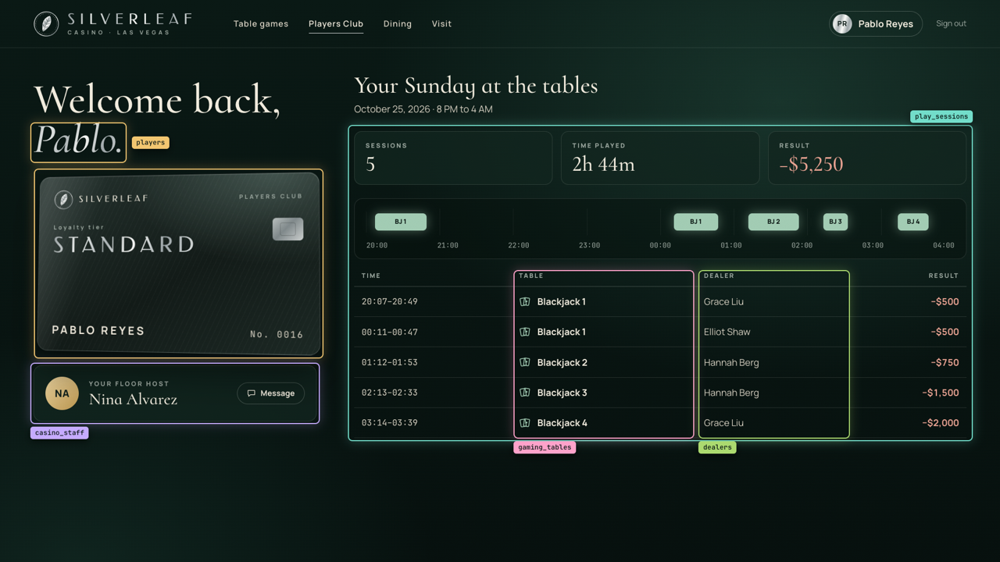
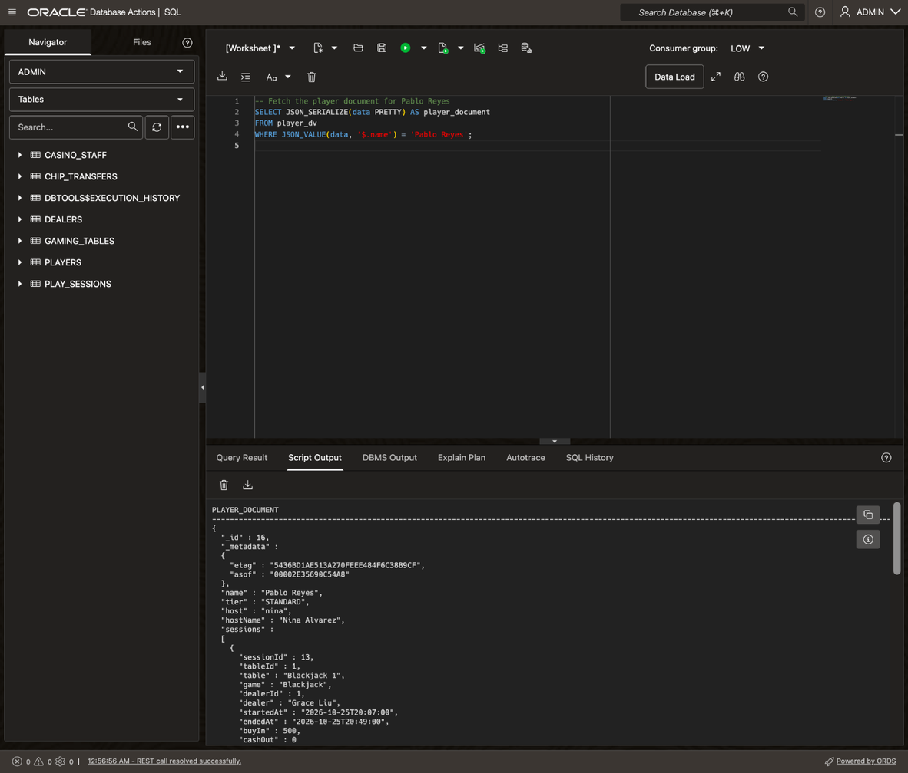
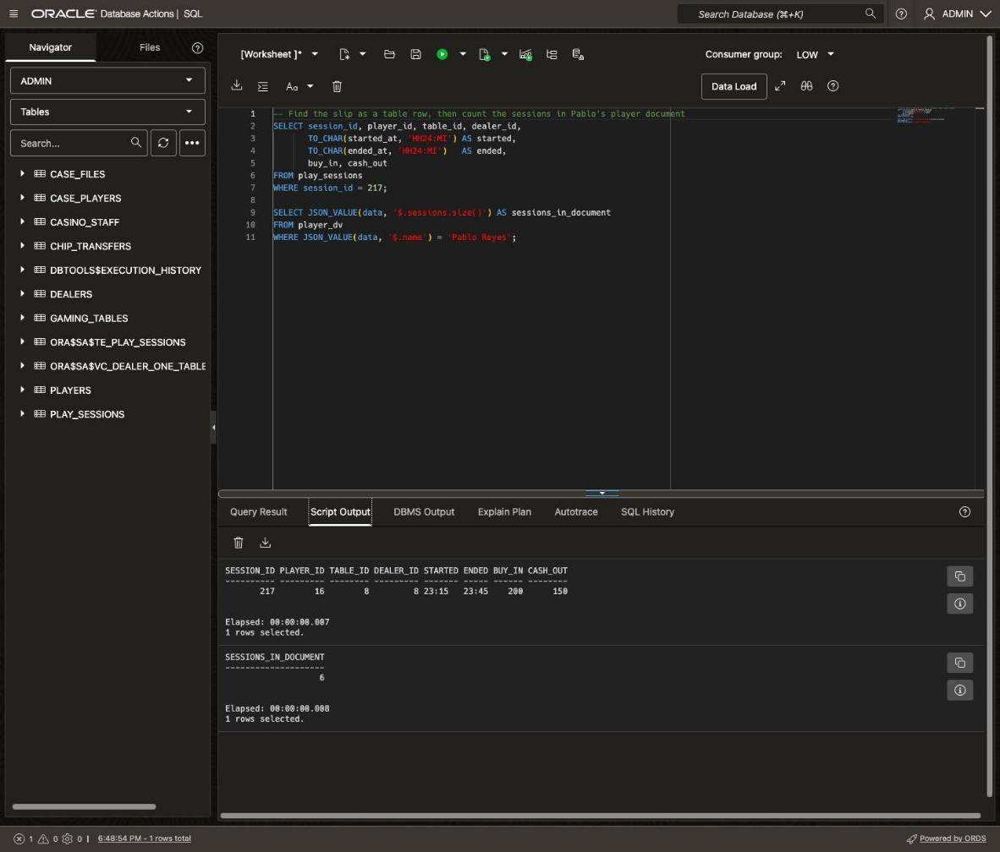
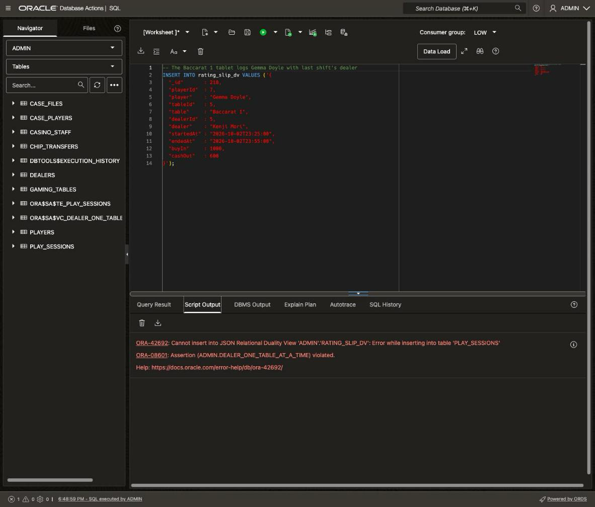

# Serve the Casino App with JSON Relational Duality Views

## Introduction

In **Lab 1**, you built the Silverleaf Casino's database and loaded the night. But the casino's records don't arrive through a SQL worksheet. They come in through the casino's website, the tablets at the tables, surveillance cameras, and other devices. Vera can only trust the data if every way in follows the same rules. This lab goes back to Sunday night, while the website and the tablets are in use, and finishes the build before the investigation starts in **Lab 3**.

Imagine the casino has a website. Players use it to check their loyalty tier, their floor host and their night at the tables. 

When a casino goer, Pablo Reyes, signs into the web app (pictured below), the website needs his profile as one document: his tier, his host's name, and every session with its table and dealer. Those facts live in five tables. Without help from the database, the website's own code would read the five tables and build the document. Or the casino would keep the documents in a separate document database, a second copy of the night that has to be kept in step with the tables.

Oracle AI Database 26ai does that work for you, with a **JSON Relational Duality View**. The view reads Pablo's rows from the five tables and hands the website one **JSON** document, the format most modern web apps send and receive data in. The document isn't stored anywhere, so there's nothing to keep in sync: the database builds it fresh from the tables you built in **Lab 1** each time it's read. The view is also updatable. When an app saves a document, the database writes the changes back to the tables, and every rule on them still applies. You decide what each app may do: only read, or also add, change and remove documents.

Estimated Time: 10 minutes

### Objectives

In this lab, you will:

* Create a read-only duality view of player documents that leaves out the sensitive columns
* Create a duality view that lets the tablets at the gaming tables insert session records
* Insert a JSON document and find it in the relational tables
* Watch the **Lab 1** assertion reject a bad JSON write

### Prerequisites

This lab assumes you have:

* Completed **Get Started with LiveLabs** and opened the SQL worksheet as ADMIN
* Completed **Lab 1**

## Task 1: Serve player documents to the website

1. The website shows each player a profile with their tier, floor host and sessions, and it builds the whole page from one JSON document. Here is Pablo Reyes's page. Each color shows a different database table that part of the website comes from. As you read the view below, match each color to its table.

    

    This duality view builds that document from five tables. The website greets each player with their host's full name, so the view also reads the staff table, `casino_staff`. It uses GraphQL syntax. GraphQL is a language for describing the shape of nested data, and Oracle supports a version of it for duality views. The view follows the foreign keys from **Lab 1** to nest the data. Clear the editor, paste the block, and click **Run Script** (F5).

    ```sql
    <copy>
    -- Player documents for the website: read-only, with no sensitive columns
    CREATE OR REPLACE JSON RELATIONAL DUALITY VIEW player_dv AS
    players
    {
      _id      : player_id,
      name     : full_name,
      tier     : loyalty_tier,
      casino_staff @unnest
      {
        host     : username,
        hostName : full_name
      },
      sessions : play_sessions
      [
        {
          sessionId : session_id,
          gaming_tables @unnest
          {
            tableId : table_id,
            table   : table_name,
            game    : game
          },
          dealers @unnest
          {
            dealerId : dealer_id,
            dealer   : full_name
          },
          startedAt : started_at,
          endedAt   : ended_at,
          buyIn     : buy_in,
          cashOut   : cash_out
        }
      ]
    };
    </copy>
    ```

    How the document is built:

    * `players` is the root, and `_id` holds the player ID. Every document in a duality view has an `_id` field, which identifies that document.
    * `casino_staff` adds the player's host from **Lab 1**. `@unnest` puts the host's fields, `host` and `hostName`, directly in Pablo's document next to his name and tier, instead of in a separate object. The website reads Nina's name the same way it reads Pablo's.
    * `sessions` is an array of the player's rows in `play_sessions`. Inside each session, `@unnest` brings the table and dealer fields up beside the session's own fields.
    * The four sensitive columns from **Lab 1** aren't listed, so they aren't in the document. The website can't read or write a column the view leaves out.
    * No table carries `@insert`, `@update` or `@delete`, so the view is read-only. That's all the website needs to display a profile. A regular view that builds JSON with SQL functions could serve this much too, and for read-only documents it's still a fine choice. The tablets in Task 2 need to write, though, and a regular JSON view can't take writes back.

2. Now fetch one document, the way the website does when a player signs in. Pablo Reyes, whose session the database rejected in **Lab 1**, is checking his profile. Look at what the document holds, and at what it leaves out. Clear the editor, paste the query, and click **Run Script**.

    ```sql
    <copy>
    -- Fetch the player document for Pablo Reyes
    SELECT JSON_SERIALIZE(data PRETTY) AS player_document
    FROM player_dv
    WHERE JSON_VALUE(data, '$.name') = 'Pablo Reyes';
    </copy>
    ```

    You should see one document. Pablo is `_id` 16, tier `STANDARD`, and his floor host is `nina`, with `hostName` `Nina Alvarez`. He played five sessions, all at blackjack, and lost every one. Each session names its table, game and dealer, although `play_sessions` stores only their IDs.

    Each session also carries `sessionId`, `tableId` and `dealerId`, which the website never shows. A duality view must include the key of every table it reads, so the database knows which row each part of the document came from. It needs that to write a change back to the right row and to compute the `etag` below. `host` does the same job for the staff table. Leave a key out, and the database refuses to create the view with error ORA-40607.

    Notice what's missing: no government ID, date of birth, home address or credit limit. Leaving columns out of a view keeps them away from this app.

    The database also adds a `_metadata` field. Its `etag` guards against a quiet mistake: imagine an app where two people open the same document, and the second one's save undoes the first one's change. The `etag` is a hash value, a short code the database computes from the document's content. An app sends back the `etag` it read when it saves. If the document changed in the meantime, the codes don't match, and the database rejects the save. Apps used to prevent this by locking the rows while someone edits, which makes everyone else wait, and Pablo's document alone spans five tables. Locking can still fit better when many people edit the same data at once.

    

## Task 2: Record a session as JSON

1. The website shows players their night, but it doesn't record it. Another source of data is the staff at the gaming tables. They log every session on a tablet: the player, table, dealer, times and chips. The tablet app sends each session record as a JSON document, so it needs a duality view it can write through. You name this view `rating_slip_dv`, because casinos call one session's record a rating slip. This time you write the view in SQL instead of GraphQL. Both create the same kind of view. Clear the editor, paste the block, and click **Run Script**.

    ```sql
    <copy>
    -- Session records for the tablets at the gaming tables: insert only
    CREATE OR REPLACE JSON RELATIONAL DUALITY VIEW rating_slip_dv AS
    SELECT JSON {'_id'       : s.session_id,
                 UNNEST (SELECT JSON {'playerId' : p.player_id,
                                      'player'   : p.full_name}
                         FROM players p
                         WHERE p.player_id = s.player_id),
                 UNNEST (SELECT JSON {'tableId' : g.table_id,
                                      'table'   : g.table_name}
                         FROM gaming_tables g
                         WHERE g.table_id = s.table_id),
                 UNNEST (SELECT JSON {'dealerId' : d.dealer_id,
                                      'dealer'   : d.full_name}
                         FROM dealers d
                         WHERE d.dealer_id = s.dealer_id),
                 'startedAt' : s.started_at,
                 'endedAt'   : s.ended_at,
                 'buyIn'     : s.buy_in,
                 'cashOut'   : s.cash_out}
    FROM play_sessions s WITH INSERT;
    </copy>
    ```

    What this view allows:

    * `WITH INSERT` on `play_sessions` lets the tablets add session records. There's no `UPDATE` or `DELETE`, so nobody can change or remove a session record through this view.
    * `players`, `gaming_tables` and `dealers` have no `WITH` clause, so they're read-only here. A session record can name an existing player, table and dealer, but can't create or change one.
    * Each `UNNEST` puts the player, table or dealer fields at the top level of the document.

    The tablets get one permission, to add session records, and the view states it in two words. Letting an app write through a JSON view used to take an INSTEAD OF trigger: code, written and tested by hand, that turns each change to the view into changes to the tables. Here the database does the writing.

2. Remember Pablo Reyes from **Lab 1**? At 23:15, a tablet tried to seat him at Roulette 1 with a dealer who was busy at another table, and the database rejected the record. So Pablo played craps instead, at Craps 1 with dealer Aisha Bello. When he leaves at 23:45, the Craps 1 tablet sends his session as a JSON document, with `_id` 217, the next free session number. That's why his profile in Task 1 showed only blackjack: this session hadn't been logged yet. Clear the editor, paste the block, and click **Run Script**.

    ```sql
    <copy>
    -- The Craps 1 tablet logs Pablo Reyes with Aisha Bello
    INSERT INTO rating_slip_dv VALUES ('{
      "_id"       : 217,
      "playerId"  : 16,
      "player"    : "Pablo Reyes",
      "tableId"   : 8,
      "table"     : "Craps 1",
      "dealerId"  : 8,
      "dealer"    : "Aisha Bello",
      "startedAt" : "2026-10-25T23:15:00",
      "endedAt"   : "2026-10-25T23:45:00",
      "buyIn"     : 200,
      "cashOut"   : 150
    }');
    COMMIT;
    </copy>
    ```

    The insert succeeds. The tablet sent one JSON document, and the database wrote it as one new row in `play_sessions`. The IDs come from the tablet's menus. Pablo is player 16, and Craps 1 and Aisha Bello are both number 8.

    > **Note:** If you run this block a second time, it fails because session 217 already exists. That's expected, and you can carry on.

3. Now look for the new session from both sides: as a row in `play_sessions`, and inside Pablo's player document. Clear the editor, paste both queries, and click **Run Script**.

    ```sql
    <copy>
    -- Find session 217 as a table row, then count the sessions in Pablo's player document
    SELECT session_id, player_id, table_id, dealer_id,
           TO_CHAR(started_at, 'HH24:MI') AS started,
           TO_CHAR(ended_at, 'HH24:MI')   AS ended,
           buy_in, cash_out
    FROM play_sessions
    WHERE session_id = 217;

    SELECT JSON_VALUE(data, '$.sessions.size()') AS sessions_in_document
    FROM player_dv
    WHERE JSON_VALUE(data, '$.name') = 'Pablo Reyes';
    </copy>
    ```

    The first result is an ordinary row: player 16 at table 8 with dealer 8, from 23:15 to 23:45. The second shows that Pablo's player document now has 6 sessions, up from 5.

    You wrote one session record, and both the table and the other document show it. There's one copy of the data, with two document shapes over it.

    

## Task 3: Catch a bad session record written as JSON

1. At 23:25, the tablet at Baccarat 1 logs a session record for Gemma Doyle. Its dealer list is out of date and still shows the first shift, so the record names Kenji Mori. Kenji moved to Baccarat 2 at 22:00 and is dealing there now. This statement should fail. Clear the editor, paste the statement, and click **Run Script**.

    ```sql
    <copy>
    -- The Baccarat 1 tablet logs Gemma Doyle with last shift's dealer
    INSERT INTO rating_slip_dv VALUES ('{
      "_id"       : 218,
      "playerId"  : 7,
      "player"    : "Gemma Doyle",
      "tableId"   : 5,
      "table"     : "Baccarat 1",
      "dealerId"  : 5,
      "dealer"    : "Kenji Mori",
      "startedAt" : "2026-10-25T23:25:00",
      "endedAt"   : "2026-10-25T23:55:00",
      "buyIn"     : 1000,
      "cashOut"   : 600
    }');
    </copy>
    ```

    **Expected Result:** The insert fails. Script Output shows `ORA-42692: Cannot insert into JSON Relational Duality View 'ADMIN'.'RATING_SLIP_DV'`, and inside it the cause: `ORA-08601: Assertion (ADMIN.DEALER_ONE_TABLE_AT_A_TIME) violated.`

    Kenji has sessions at Baccarat 2 until 23:57, so this session would put him at two tables at once.

    The website never wrote SQL against `play_sessions`, and it doesn't know the rule exists. The duality view turned the document into a row, and the **Lab 1** assertion checked it. The rule lives in the database, so JSON apps can't get around it either. Had the tablets saved their records to a separate document database, Gemma's record would have gone in, because the assertion only checks the casino's tables.

    

## Conclusion

The Silverleaf Casino's website and tablets now run on the tables you built in **Lab 1**. Pablo's profile came back as one JSON document built from five tables. His craps session went in as a JSON document and landed as one row. Neither app needed code to turn tables into documents or back, and there's no second copy of the night to keep in step.

Because the data is stored once, every app sees the same night. The session the Craps 1 tablet logged showed up in Pablo's profile straight away. Each view also decides what its app may do. The website can only read, and never sees the sensitive columns. The tablets can only add session records. And every document carries an `etag`, so two people can't quietly overwrite each other's changes.

The rules held, too. Gemma Doyle's record broke the **Lab 1** assertion, so the database rejected it, even though the tablet only ever sent JSON. That finishes the build: every way into the casino's data follows the same rules. In **Lab 3**, Vera starts investigating.

You may now **proceed to the next lab**.

## Learn More

* [CREATE JSON RELATIONAL DUALITY VIEW](https://docs.oracle.com/en/database/oracle/oracle-database/26/sqlrf/create-json-relational-duality-view.html)
* [Creating Car-Racing Duality Views Using GraphQL](https://docs.oracle.com/en/database/oracle/oracle-database/26/jsnvu/creating-car-racing-duality-views-using-graphql.html)
* [Annotations (NO)UPDATE, (NO)INSERT, (NO)DELETE, To Allow/Disallow Updating Operations](https://docs.oracle.com/en/database/oracle/oracle-database/26/jsnvu/annotations-no-update-no-insert-no-delete-allow-disallow-updating-operations.html)
* [Inserting Documents/Data Into Duality Views](https://docs.oracle.com/en/database/oracle/oracle-database/26/jsnvu/inserting-documents-data-duality-views.html)

## Acknowledgements
* **Author** - Killian Lynch, Oracle Database Product Management
* **Last Updated By/Date** - Killian Lynch, October 2026
