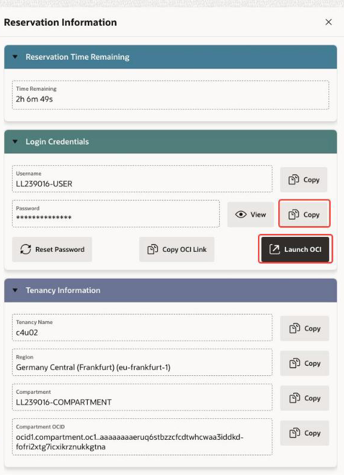
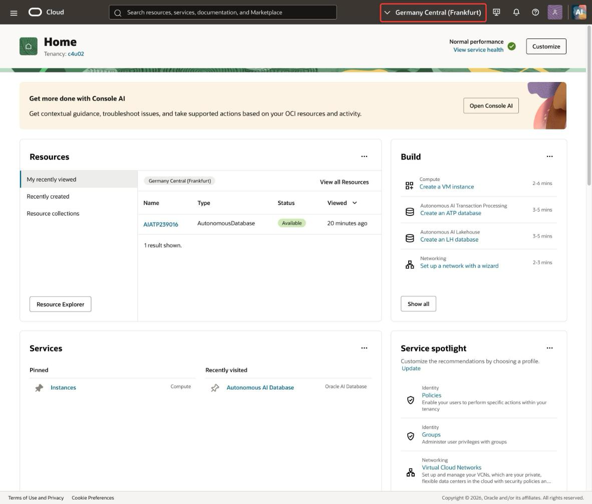
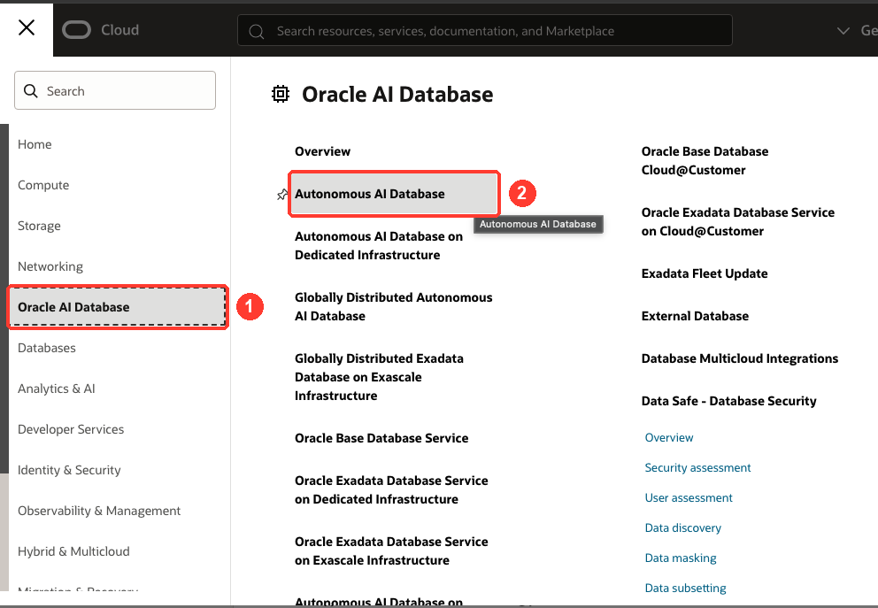
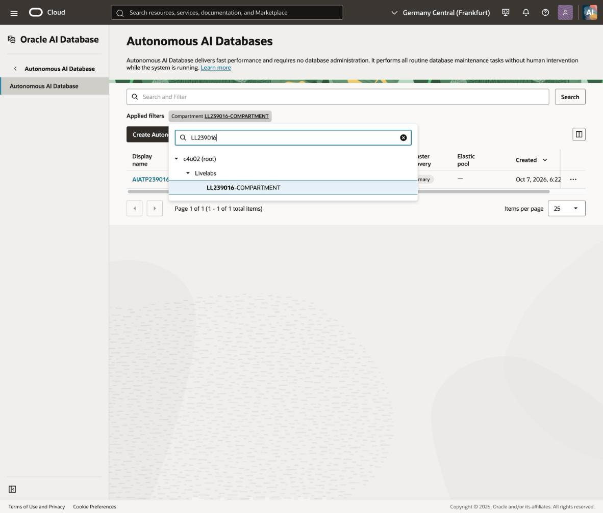
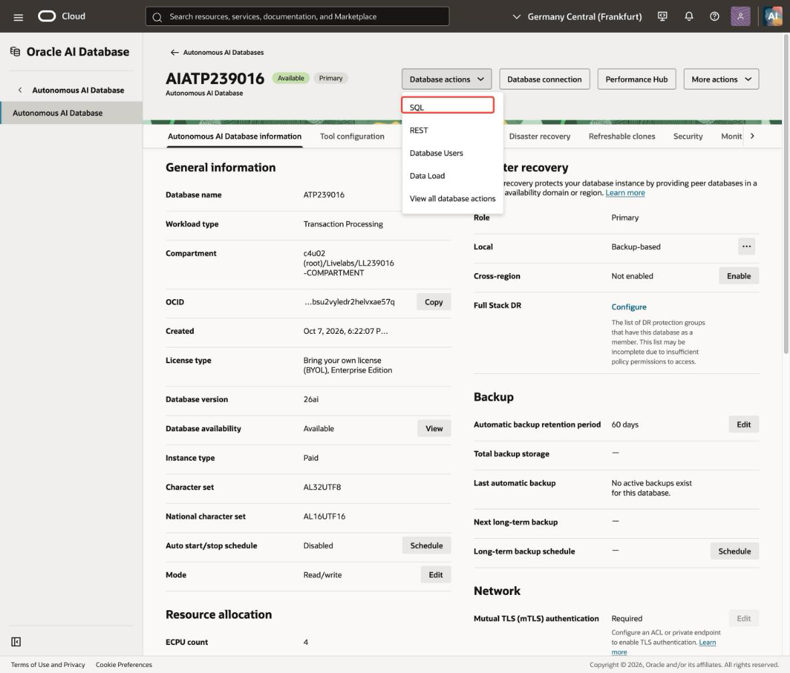
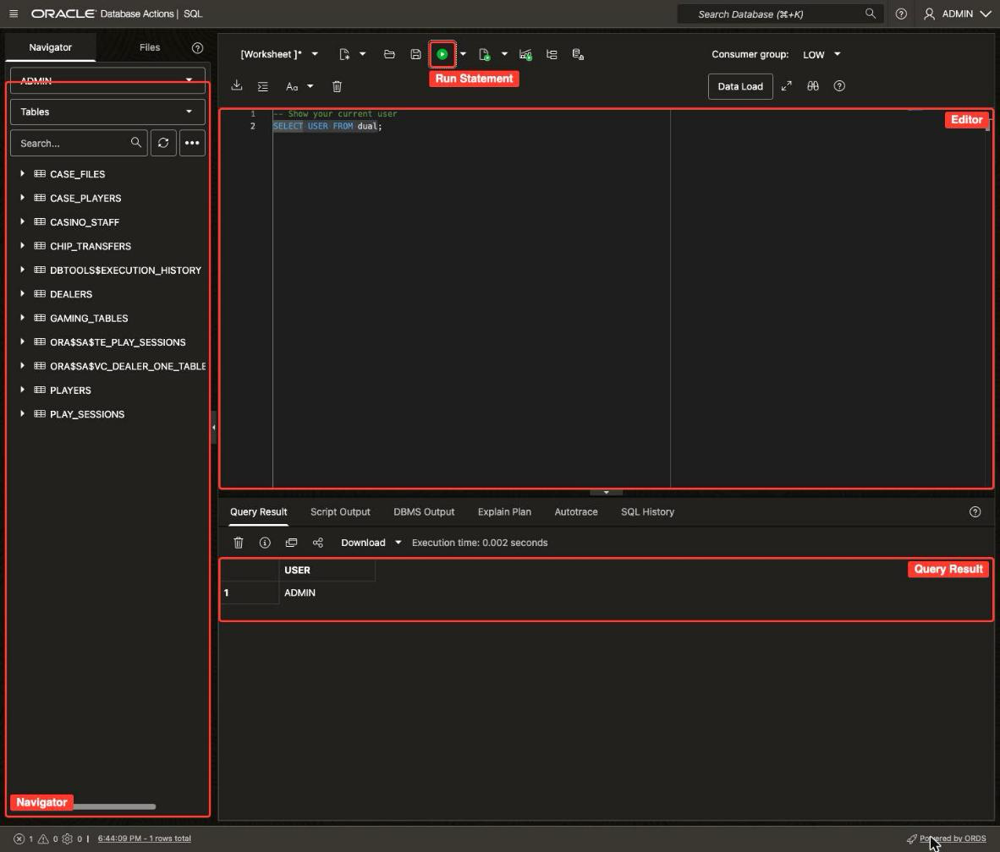
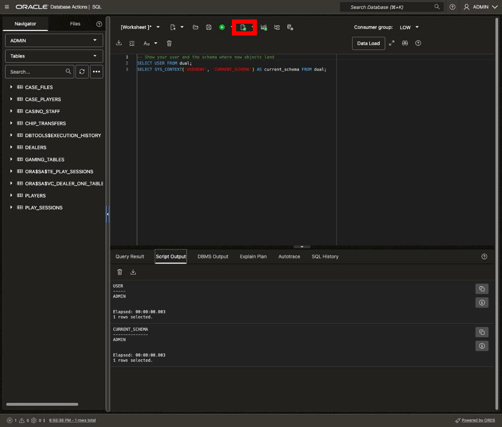

# Get Started with LiveLabs

## Introduction

Someone at the Silverleaf Casino is cheating, and the next five labs build the database that catches them. This lab gets you into that database.

Your LiveLabs sandbox includes an Autonomous AI Database running Oracle AI Database 26ai. You sign in to the Oracle Cloud Console, open the database, and run your first statements in the SQL worksheet. Every lab in this workshop runs in that worksheet.

Estimated Time: 5 minutes

### Objectives

In this lab, you will:

* Sign in to the Oracle Cloud Console with your LiveLabs reservation
* Open your Autonomous AI Database in Database Actions
* Run a statement and a script in the SQL worksheet

### Prerequisites

This lab assumes you have:

* A LiveLabs sandbox reservation for this workshop

## Task 1: Log in to the Oracle Cloud Console

1. Click **View Login Info** in the banner at the top of the workshop page. The **Reservation Information** panel opens. It holds the details you need for this workshop, including your password, compartment and region.

    

2. Click **Copy Password**, then click **Launch OCI**.

3. On the sign-in page, find the **Oracle Cloud Infrastructure Direct Sign-In** section. Your username is already in the **User Name** field. Paste your password into the **Password** field, then click **Sign In**.

4. If the **Change Password** dialog box appears, paste the password you copied into **Current Password**. Enter a new password in **New Password** and **Confirm New Password**, then click **Save New Password**. Write down your new password, because you need it if you sign in again.

5. The Oracle Cloud Console home page opens. Check that the region at the top of the page matches the region in **Reservation Information**. If it doesn't, select your assigned region from the region menu.

    

    > **Note:** Bookmark the workshop page so you can get back to it quickly.

## Task 2: Open your Autonomous AI Database

1. Open the **Navigation** menu at the top left, then click **Oracle AI Database**. Under **Oracle AI Database**, click **Autonomous AI Database**.

    

2. Select your assigned compartment. Your database lives in your LiveLabs compartment, not the root compartment. If you see an error or an empty list, you're in the wrong compartment. Click the **Compartment** list, search for your compartment, and select it. Its name looks like `LL#####-COMPARTMENT`, with five digits.

    > **Note:** The **Reservation Information** panel on the workshop page shows your assigned compartment and region.


    

3. On the **Autonomous AI Databases** page, click your database. Its name starts with `AIATP`, followed by a number.

4. On the **Autonomous AI Database details** page, click **Database actions**, then click **SQL**. The SQL worksheet opens, already signed in as **ADMIN**. You don't need a password.

    

## Task 3: Get to know the SQL worksheet

1. Take a quick look around the worksheet. The **Navigator** on the left lists the objects in your schema. You type SQL in the editor, and results appear in the tabs below it. Copy the statement below into the editor, then click **Run Statement** (Ctrl+Enter, or Cmd+Enter on a Mac).

    ```sql
    <copy>
    -- Show your current user
    SELECT USER;
    </copy>
    ```

    **Run Statement** runs the statement under your cursor and shows the rows in the **Query Result** tab. You should see one row: `ADMIN`.

    

2. Clear the editor before you paste the next block. Click **Clear** on the worksheet toolbar, or press Ctrl+A (Cmd+A on a Mac) and then Delete. Copy this two-statement block into the editor, then click **Run Script** (F5, or Fn+F5 on a Mac).

    ```sql
    <copy>
    -- Show your user and the schema where new objects land
    SELECT USER FROM dual;
    SELECT SYS_CONTEXT('USERENV', 'CURRENT_SCHEMA') AS current_schema FROM dual;
    </copy>
    ```

    **Run Script** runs every statement in the editor, top to bottom, and writes the results to the **Script Output** tab. You should see two results, and both read `ADMIN`. The first is your user. The second is your current schema, where a new table goes when you don't name a schema.

    Use **Run Script** for any block with more than one statement. It reruns everything in the editor, so clear the editor before each new block.

    

    > **Note:** You work as **ADMIN** for the whole workshop. ADMIN is a superuser, which is fine here because this sandbox is temporary and yours alone. Every object you create lives in ADMIN's own schema, so the labs use plain table names with no schema prefix.

## Conclusion

You're signed in as ADMIN, and you know when to use **Run Statement** and when to use **Run Script**. Keep this worksheet open, because every lab runs here. In **Lab 1**, you build the Silverleaf Casino floor and load a night of play.

You may now **proceed to the next lab**.

## Learn More

* [Connect with Built-In Oracle Database Actions](https://docs.oracle.com/en/cloud/paas/autonomous-database/serverless/adbsb/connect-database-actions.html)
* [The SQL Page](https://docs.oracle.com/en/database/oracle/sql-developer-web/sdwad/sql-page.html)
* [Using Oracle Autonomous AI Database Serverless](https://docs.oracle.com/en/cloud/paas/autonomous-database/serverless/adbsb/index.html)

## Acknowledgements
* **Author** - Killian Lynch, Oracle Database Product Management
* **Contributors** - Mike Matthews and Marty Gubar, Autonomous AI Database Product Management; Lauran K. Serhal, Consulting User Assistance Developer
* **Last Updated By/Date** - Killian Lynch, October 2026
