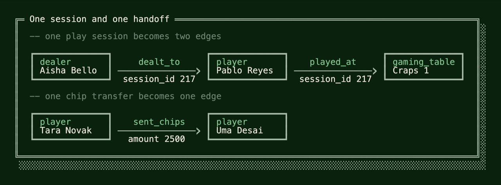
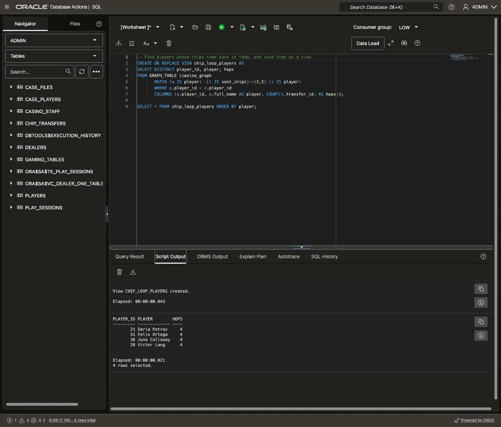
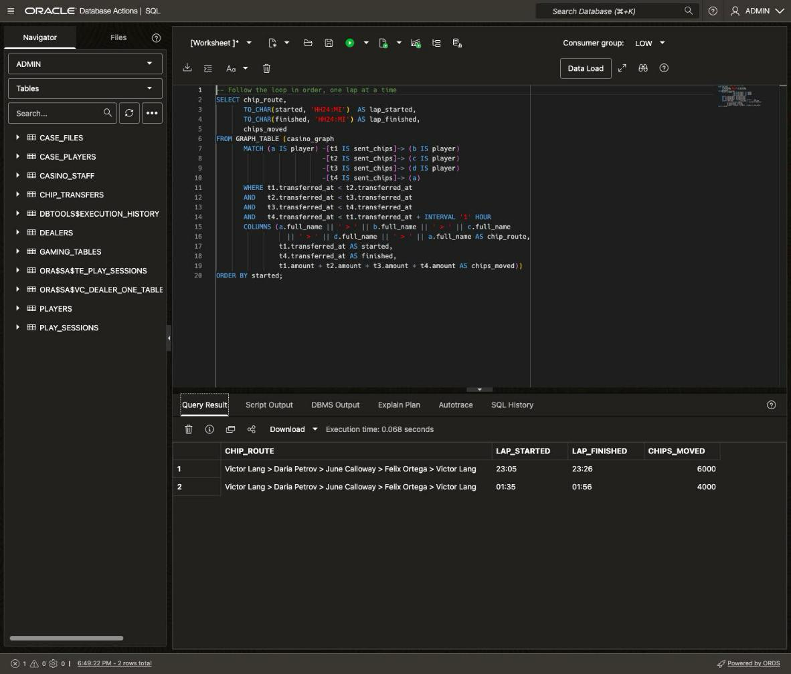
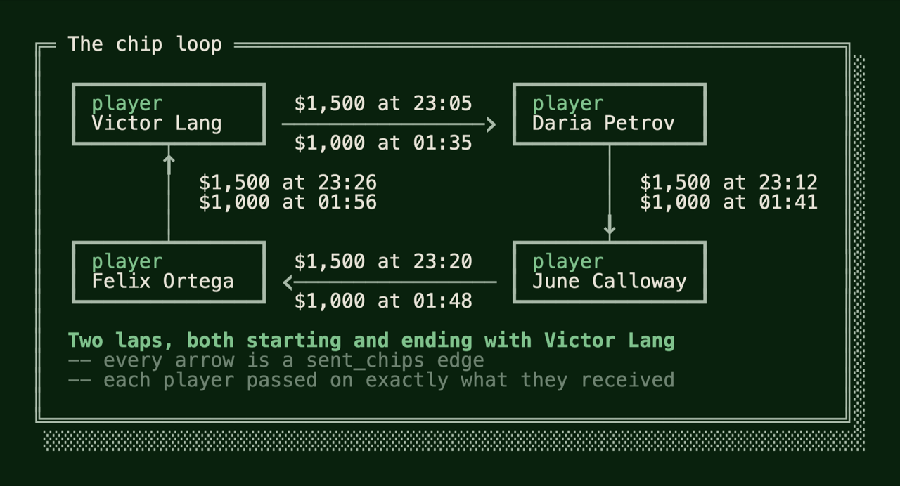
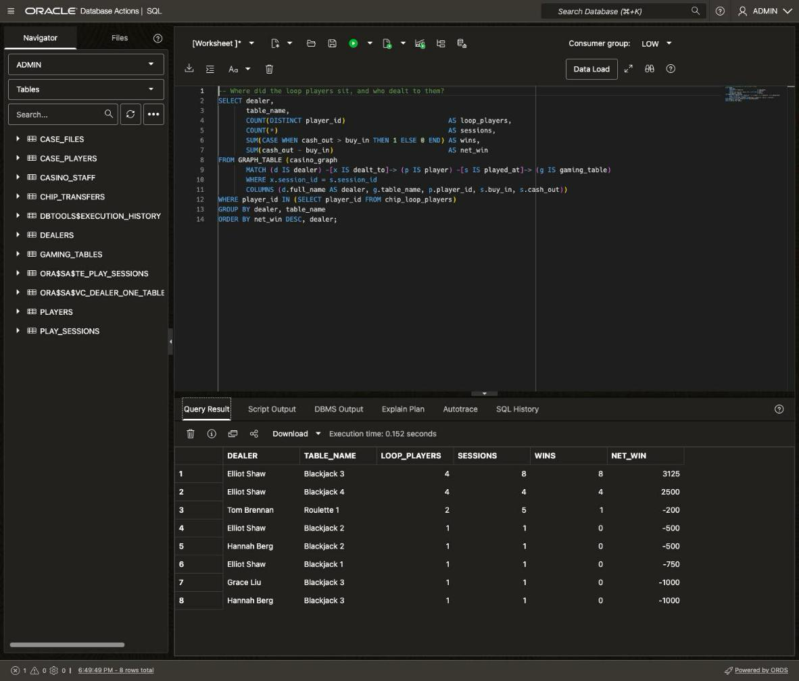
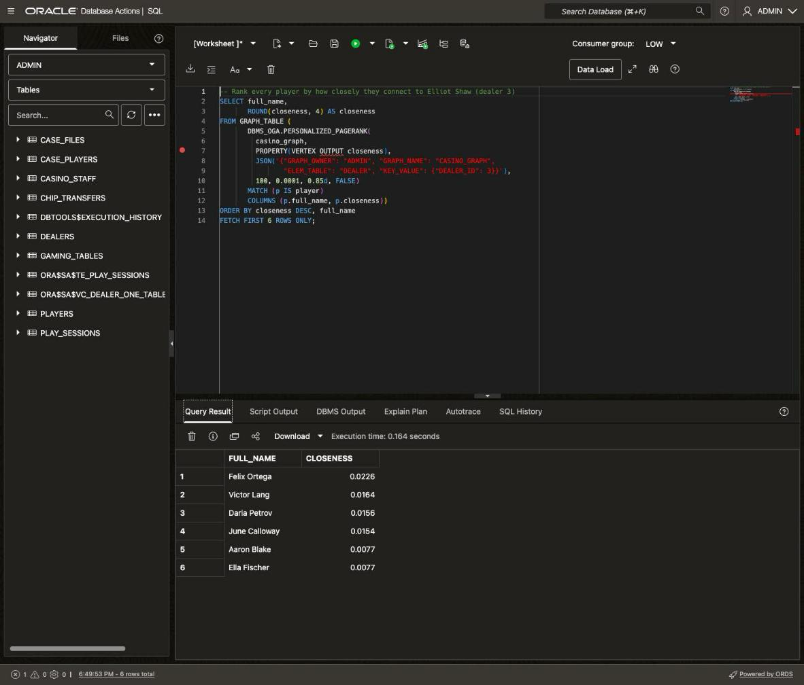
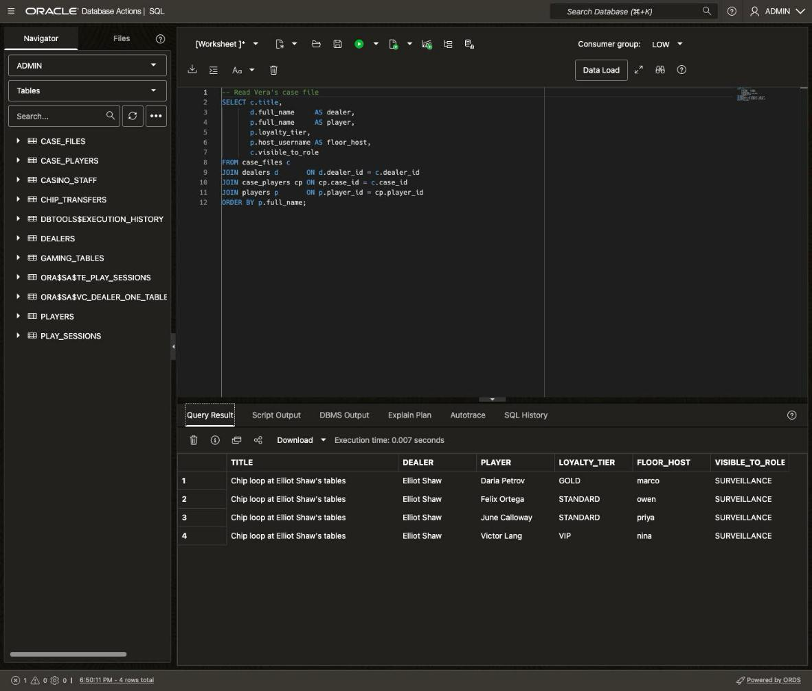

# Uncover the Collusion Ring with Property Graphs

## Introduction

It's Monday morning at the Silverleaf Casino, and Sunday night is over. You built the database that holds it in **Lab 1** and **Lab 2**. The usual reports say the night was ordinary, and Elliot Shaw even looks like the house's best dealer. But the tip said the cheater isn't working alone. A team leaves a trail that totals can't show: its members play together and pass chips to each other. Passing chips is a common way to fool a casino. When a team wins, its members hand the chips around, so no one player looks like a big winner and the chips are hard to trace back to the table that paid them. Surveillance logged every chip handoff the cameras caught, so Vera Lindqvist starts there, following the chips from player to player.

Following chips is hard in plain SQL. Finding who passed chips to whom takes one join. Following the chips one step further, to whoever got them next, joins the same table again, and every step after that adds another join. You also have to decide in advance how many steps to follow. The other option is to copy the data into a separate graph database, a second copy of the night to keep in step with the tables, much like the document database you avoided in **Lab 2**.

Oracle AI Database 26ai lets you look at the tables you already have as a **property graph**. Here, a graph isn't a chart. It's data seen as entities, such as players and dealers, and the relationships between them. The entities are called **vertices**. The relationships are called **edges**, such as a chip handoff from one player to another. Both can carry **properties**, such as a name or an amount. A **SQL property graph** is defined over your tables, so no data is copied and the graph is never out of date. You query it in SQL with `GRAPH_TABLE`: you write the shape you're looking for, such as "a player sends chips to a player", and the database returns every match as rows. The database can also run **graph algorithms**, ready-made calculations that score every vertex by how it connects to the rest.

Estimated Time: 15 minutes

### Objectives

In this lab, you will:

* Create a SQL property graph over the casino tables, without copying any data
* Follow chip transfers from player to player with `GRAPH_TABLE`, and find a loop
* Tie the loop to a dealer through the play sessions
* Rank players by how closely they connect to that dealer, with Personalized PageRank
* Record the finding in a case file

### Prerequisites

This lab assumes you have:

* Completed **Get Started with LiveLabs** and opened the SQL worksheet as ADMIN
* Completed **Lab 1** and **Lab 2**

## Task 1: Turn the casino floor into a graph

1. To create a graph, you tell the database which tables hold the entities and which hold the relationships. A **vertex table** is a table whose rows are entities: each player, dealer and gaming table becomes a vertex. An **edge table** is a table whose rows connect two entities. Each edge runs in one direction, from a **source** vertex to a **destination** vertex, and the foreign keys you built in **Lab 1** say which two. So each chip transfer becomes an edge from the player who gave the chips to the player who got them.

    A play session connects three entities: a dealer, a player and a gaming table. An edge connects only two, so each session becomes two edges: the dealer `dealt_to` the player, and the player `played_at` the table.

    Here is Pablo's craps session from **Lab 2** and one of Tara Novak's chip transfers, drawn as a graph. Each box is a vertex, with its label in green and its name below. Each arrow is an edge, with its label above it and a property below it:

    

    Clear the editor, paste the block, and click **Run Script** (F5).

    ```sql
    <copy>
    -- Turn the casino tables into a property graph
    CREATE OR REPLACE PROPERTY GRAPH casino_graph
      VERTEX TABLES (
        players AS player
          KEY (player_id)
          PROPERTIES (player_id, full_name),
        dealers AS dealer
          KEY (dealer_id)
          PROPERTIES (dealer_id, full_name),
        gaming_tables AS gaming_table
          KEY (table_id)
          PROPERTIES (table_id, table_name)
      )
      EDGE TABLES (
        chip_transfers AS sent_chips
          KEY (transfer_id)
          SOURCE      KEY (from_player_id) REFERENCES player (player_id)
          DESTINATION KEY (to_player_id)   REFERENCES player (player_id)
          PROPERTIES (transfer_id, amount, transferred_at),
        play_sessions AS dealt_to
          KEY (session_id)
          SOURCE      KEY (dealer_id) REFERENCES dealer (dealer_id)
          DESTINATION KEY (player_id) REFERENCES player (player_id)
          PROPERTIES (session_id),
        play_sessions AS played_at
          KEY (session_id)
          SOURCE      KEY (player_id) REFERENCES player (player_id)
          DESTINATION KEY (table_id)  REFERENCES gaming_table (table_id)
          PROPERTIES (session_id, started_at, buy_in, cash_out)
      );
    </copy>
    ```

    What this creates:

    

    * **Labels.** The name after `AS` becomes a label: the name a query uses for that kind of vertex or edge, such as `player` or `sent_chips`.
    * **Two edges per session.** `dealt_to` and `played_at` both come from `play_sessions`, so each session row appears in the graph twice.
    * **Keys.** `KEY` names the column that identifies each vertex or edge. `SOURCE KEY` and `DESTINATION KEY` name the columns that say where an edge starts and ends. They're the primary and foreign keys from **Lab 1**.
    * **Properties.** `PROPERTIES` lists the columns that graph queries can read. The four sensitive player columns from **Lab 1** aren't listed, so the graph can't return them.

    The database stores only the graph's definition, not a copy of the rows. Every graph query reads the tables underneath, so the graph is always up to date. Like the duality views in **Lab 2**, it's one more way to look at the same tables.

## Task 2: Follow the chips

1. Start with the simplest shape: one player sends chips to another. `GRAPH_TABLE` takes the graph and a `MATCH` clause with a **path pattern**, the shape to look for, written with parentheses and arrows. It finds every match in the graph and returns each one as a row. Clear the editor, paste the query, and click **Run Statement**.

    ```sql
    <copy>
    -- Who passed chips to whom?
    SELECT sender,
           receiver,
           COUNT(*)    AS transfers,
           SUM(amount) AS chips
    FROM GRAPH_TABLE (casino_graph
           MATCH (a IS player) -[t IS sent_chips]-> (b IS player)
           COLUMNS (a.full_name AS sender, b.full_name AS receiver, t.amount))
    GROUP BY sender, receiver
    ORDER BY chips DESC, sender;
    </copy>
    ```

    How the pattern reads:

    * `(a IS player)` is a vertex: any vertex with the `player` label. `a` is the name the rest of the query uses for it.
    * `-[t IS sent_chips]->` is an edge: one chip transfer, named `t`. The arrow points from the player who gave the chips to the player who got them.
    * `COLUMNS` lists what each match returns, such as `a.full_name` for the sender's name.

    Separate graph databases usually have their own query language. Here, the pattern sits inside an ordinary SQL query, and its syntax is part of the SQL standard. `GRAPH_TABLE` returns rows, so the outer query groups and adds them up like any table.

    You should see 16 pairs of players. Tara Novak moved the most: $7,500 to Uma Desai in three transfers. Every pair passed chips two or three times, so no pair stands out.

    For one hop, a join would have given you the same rows. The graph pays off when you follow the chips further.

2. One handoff at a time, nothing stands out. Vera's hunch is that the team keeps passing the same chips along, so they come back to the player who started them. Look for players whose chips return to them.

    In plain SQL, a path of four transfers is four copies of `chip_transfers` joined end to end, and every other length needs its own query. In a path pattern, you add the number of hops to the edge. The block also wraps the query in a view, `chip_loop_players`, so later steps can use the list of players without repeating the pattern. Clear the editor, paste the block, and click **Run Script**.

    ```sql
    <copy>
    -- Find players whose chips come back to them, and save them as a view
    CREATE OR REPLACE VIEW chip_loop_players AS
    SELECT DISTINCT player_id, player, hops
    FROM GRAPH_TABLE (casino_graph
           MATCH (a IS player) -[t IS sent_chips]->{2,5} (z IS player)
           WHERE a.player_id = z.player_id
           COLUMNS (a.player_id, a.full_name AS player, COUNT(t.transfer_id) AS hops));

    SELECT * FROM chip_loop_players ORDER BY player;
    </copy>
    ```

    How the pattern reads:

    * `->{2,5}` repeats the `sent_chips` edge two to five times. One pattern covers paths of two, three, four and five transfers.
    * `(z IS player)` is the player at the end of the path. `WHERE a.player_id = z.player_id` keeps only paths that end with the player who started them. That's a loop.
    * Because the edge repeats, `t` stands for every transfer along the path, and `COUNT(t.transfer_id)` counts them.

    You should see four players: Daria Petrov, Felix Ortega, June Calloway and Victor Lang. Each one's chips come back in exactly four hops. Out of 36 transfers on the floor, this is the only loop.

    <details>
    <summary style="color: #0055ffff";><kbd style="font-size: 10px;">(click) </kbd><strong>See the same search written with joins</strong></summary>
    <p></p>

    This is the search you just ran, loops of two to five transfers, written with joins instead of a path pattern. Each length needs its own query, and each hop adds one more copy of `chip_transfers`. `UNION` combines the four queries and removes duplicate rows. A search up to ten hops would need nine queries, the longest with ten copies. You don't need to run it.

    ```sql
    -- Loops of two to five transfers, written with joins instead of a path pattern
    -- 2 hops
    SELECT a.player_id, a.full_name AS player, 2 AS hops
    FROM players a
    JOIN chip_transfers t1 ON t1.from_player_id = a.player_id
    JOIN chip_transfers t2 ON t2.from_player_id = t1.to_player_id
    WHERE t2.to_player_id = a.player_id
    UNION
    -- 3 hops
    SELECT a.player_id, a.full_name, 3
    FROM players a
    JOIN chip_transfers t1 ON t1.from_player_id = a.player_id
    JOIN chip_transfers t2 ON t2.from_player_id = t1.to_player_id
    JOIN chip_transfers t3 ON t3.from_player_id = t2.to_player_id
    WHERE t3.to_player_id = a.player_id
    UNION
    -- 4 hops
    SELECT a.player_id, a.full_name, 4
    FROM players a
    JOIN chip_transfers t1 ON t1.from_player_id = a.player_id
    JOIN chip_transfers t2 ON t2.from_player_id = t1.to_player_id
    JOIN chip_transfers t3 ON t3.from_player_id = t2.to_player_id
    JOIN chip_transfers t4 ON t4.from_player_id = t3.to_player_id
    WHERE t4.to_player_id = a.player_id
    UNION
    -- 5 hops
    SELECT a.player_id, a.full_name, 5
    FROM players a
    JOIN chip_transfers t1 ON t1.from_player_id = a.player_id
    JOIN chip_transfers t2 ON t2.from_player_id = t1.to_player_id
    JOIN chip_transfers t3 ON t3.from_player_id = t2.to_player_id
    JOIN chip_transfers t4 ON t4.from_player_id = t3.to_player_id
    JOIN chip_transfers t5 ON t5.from_player_id = t4.to_player_id
    WHERE t5.to_player_id = a.player_id;
    ```
    </details>

    Each of the four hops happened twice, at different times. The pattern doesn't look at times, so it can take either transfer at each hop: 2 × 2 × 2 × 2 = 16 paths for each player. `DISTINCT` keeps one row per player. The next step puts the transfers in time order.

    

3. Now follow the loop the way it happened, one lap at a time. This pattern writes out the four hops and names each transfer, `t1` to `t4`, so the `WHERE` clause can compare their times. The last vertex is `(a)` again. A name used twice in a pattern means the same vertex, so the path has to end where it started. That's a second way to write a loop. The time conditions keep each transfer after the one before it, and the whole lap within one hour. Clear the editor, paste the query, and click **Run Statement**.

    ```sql
    <copy>
    -- Follow the loop in order, one lap at a time
    SELECT chip_route,
           TO_CHAR(started, 'HH24:MI')  AS lap_started,
           TO_CHAR(finished, 'HH24:MI') AS lap_finished,
           chips_moved
    FROM GRAPH_TABLE (casino_graph
           MATCH (a IS player) -[t1 IS sent_chips]-> (b IS player)
                               -[t2 IS sent_chips]-> (c IS player)
                               -[t3 IS sent_chips]-> (d IS player)
                               -[t4 IS sent_chips]-> (a)
           WHERE t1.transferred_at < t2.transferred_at
           AND   t2.transferred_at < t3.transferred_at
           AND   t3.transferred_at < t4.transferred_at
           AND   t4.transferred_at < t1.transferred_at + INTERVAL '1' HOUR
           COLUMNS (a.full_name || ' > ' || b.full_name || ' > ' || c.full_name
                      || ' > ' || d.full_name || ' > ' || a.full_name AS chip_route,
                    t1.transferred_at AS started,
                    t4.transferred_at AS finished,
                    t1.amount + t2.amount + t3.amount + t4.amount AS chips_moved))
    ORDER BY started;
    </copy>
    ```

    You should see two laps, and both start and end with Victor Lang. At 23:05, Victor passed $1,500 to Daria Petrov. Daria passed it to June Calloway, June to Felix Ortega, and Felix back to Victor by 23:26.

    At 01:35, the same four did it again with $1,000 a hop. Each player passed on exactly what they received, so nobody gained or lost a chip. Chips that travel in a circle have no honest reason to move. These four are acting as one team.

    

    Drawn as a graph, both laps follow the same circle:

    

## Task 3: Tie the loop to a dealer

1. A team that only passes chips among its members can't take money from the casino. To win, they need help at the table, and the tip said someone on the floor is in on it. Find where the four played and who dealt to them.

    This pattern walks two edges: from a dealer to a player, then from that player to a gaming table. Both edges come from `play_sessions`, and `x.session_id = s.session_id` makes them come from the same session. Without it, the pattern could pair the dealer from one session with the table from another. Outside `GRAPH_TABLE`, an ordinary `WHERE` keeps only the four players in your `chip_loop_players` view. Clear the editor, paste the query, and click **Run Statement**.

    ```sql
    <copy>
    -- Where did the loop players sit, and who dealt to them?
    SELECT dealer,
           table_name,
           COUNT(DISTINCT player_id)                          AS loop_players,
           COUNT(*)                                           AS sessions,
           SUM(CASE WHEN cash_out > buy_in THEN 1 ELSE 0 END) AS wins,
           SUM(cash_out - buy_in)                             AS net_win
    FROM GRAPH_TABLE (casino_graph
           MATCH (d IS dealer) -[x IS dealt_to]-> (p IS player) -[s IS played_at]-> (g IS gaming_table)
           WHERE x.session_id = s.session_id
           COLUMNS (d.full_name AS dealer, g.table_name, p.player_id, s.buy_in, s.cash_out))
    WHERE player_id IN (SELECT player_id FROM chip_loop_players)
    GROUP BY dealer, table_name
    ORDER BY net_win DESC, dealer;
    </copy>
    ```

    You should see eight rows. The top two are both Elliot Shaw, with all four loop players at his table. They won all 8 sessions at Blackjack 3, starting at 20:04. At 22:00, Elliot rotated to Blackjack 4, and the four followed him there: 4 more sessions, 4 more wins.

    With every other dealer, the four won 1 session in 8. The other two Elliot rows are Felix Ortega after midnight, without the other three, and he lost both.

    Twelve wins in twelve sessions isn't luck. In **Lab 1**, Elliot looked like the house's best dealer, earning it $17,375. His other players lost $21,750 at his tables, and that hid the ring's wins. A total for each dealer couldn't show it, but following the connections did.

    

2. You found the loop because you knew what shape to look for. But a team can hide in other shapes, such as a member who never passes a chip. Vera wants to ask the question the other way round: starting from Elliot, which players are most closely connected to him, by any route?

    That's a job for a **graph algorithm**, a ready-made calculation that runs over the whole graph and gives each vertex a score. **Personalized PageRank** scores how closely each vertex connects to one starting vertex. It walks the graph from the start, one edge at a time. At each step, the walk either moves along an edge or jumps back to the start. The vertices it reaches most often score highest. So a player who sat with Elliot many times scores high, and so does a player who got chips from one of those players.

    Before, you ran an algorithm like this outside the database. You loaded the graph into a separate graph server or tool, ran it there, and brought the scores back. Here, the `DBMS_OGA` package runs it inside a SQL query. Start from Elliot Shaw and see who scores highest. Clear the editor, paste the query, and click **Run Statement**.

    ```sql
    <copy>
    -- Rank every player by how closely they connect to Elliot Shaw (dealer 3)
    SELECT full_name,
           ROUND(closeness, 4) AS closeness
    FROM GRAPH_TABLE (
           DBMS_OGA.PERSONALIZED_PAGERANK(
             casino_graph,
             PROPERTY(VERTEX OUTPUT closeness),
             JSON('{"GRAPH_OWNER": "ADMIN", "GRAPH_NAME": "CASINO_GRAPH",
                    "ELEM_TABLE": "DEALER", "KEY_VALUE": {"DEALER_ID": 3}}'),
             100, 0.0001, 0.85d, FALSE)
           MATCH (p IS player)
           COLUMNS (p.full_name, p.closeness))
    ORDER BY closeness DESC, full_name
    FETCH FIRST 6 ROWS ONLY;
    </copy>
    ```

    How the call works:

    * `DBMS_OGA.PERSONALIZED_PAGERANK` takes `casino_graph` and returns it with one new vertex property, `closeness`, that holds each vertex's score. `GRAPH_TABLE` then queries the result like any graph.
    * The JSON names the starting vertex: element table `DEALER`, key `DEALER_ID` 3. That's Elliot Shaw.
    * `100` and `0.0001` say when to stop. The algorithm repeats its calculation until the scores change by less than 0.0001 between rounds, or for at most 100 rounds.
    * `0.85d` is the damping factor: at each step, the walk moves along an edge 85 percent of the time and jumps back to Elliot the rest of the time. 0.85 is the usual value, and the `d` makes it the `BINARY_DOUBLE` number type this argument takes.
    * `FALSE` means the scores don't have to add up to 1. Only their order matters here.

    You should see the same four players whose chips went around in a circle in **Task 2**: Felix Ortega, Victor Lang, Daria Petrov and June Calloway. They hold the top four places. Felix leads, and he sat with Elliot five times. Then the scores drop: the next players, starting with Aaron Blake, score 0.0077, half of June Calloway's 0.0154.

    This time you didn't tell the database what shape to look for. You gave it only Elliot, and it followed his deals and the chips his players passed. It still found the same team. Two different methods, one starting from the chips and one starting from the dealer, point at the same four players. And because the algorithm follows every route, not one shape, a team member who never passed a chip but kept sitting at Elliot's table would score high too.

    It also ran where the data lives. With a separate graph server, you'd export the tables, run the algorithm there and load the scores back, and that copy goes out of date as soon as the tables change. Here it was one SQL query on the casino's own tables, and the scores came back as rows you can sort, filter and join like any others. The `closeness` property exists only for this query, so the graph itself doesn't change. In **Task 4**, Vera puts Elliot and these four players on file.

    

## Task 4: Open the case file

1. Vera has her evidence: a loop of chips, the dealer it leads to, and an algorithm that agrees. She needs it on file, where she can control who reads it. Create a table for cases and a table for the players each case names. These are ordinary tables, and they reuse the domains and annotations from **Lab 1**. Clear the editor, paste the block, and click **Run Script**.

    ```sql
    <copy>
    -- Create the case file tables
    CREATE TABLE IF NOT EXISTS case_files (
      case_id          NUMBER PRIMARY KEY,
      title            VARCHAR2(80) NOT NULL,
      opened_by        staff_username NOT NULL REFERENCES casino_staff (username),
      opened_on        DATE NOT NULL,
      dealer_id        NUMBER NOT NULL REFERENCES dealers (dealer_id),
      visible_to_role  staff_role DEFAULT 'SURVEILLANCE' NOT NULL,
      finding          VARCHAR2(400) NOT NULL
    )
    ANNOTATIONS (data_owner 'Surveillance');

    CREATE TABLE IF NOT EXISTS case_players (
      case_id    NUMBER NOT NULL REFERENCES case_files (case_id),
      player_id  NUMBER NOT NULL REFERENCES players (player_id),
      PRIMARY KEY (case_id, player_id)
    )
    ANNOTATIONS (data_owner 'Surveillance');
    </copy>
    ```

    What the tables hold:

    * `case_files` has one row per case, including the dealer under suspicion.
    * `visible_to_role` says which staff role may read the case. It uses the `staff_role` domain from **Lab 1**, so it shares one list with `casino_staff.staff_role`.
    * `case_players` lists the players a case names. Its foreign keys accept only real cases and real players.

2. Open the case. The block looks up the dealer by name and takes the four players straight from the `chip_loop_players` view. Nobody types a player's name, so the case names exactly the players the graph found. Clear the editor, paste the block, and click **Run Script**.

    ```sql
    <copy>
    -- Open Vera's case: the dealer by name, the players straight from the graph
    INSERT INTO case_files (case_id, title, opened_by, opened_on, dealer_id, visible_to_role, finding)
    SELECT 1,
           'Chip loop at Elliot Shaw''s tables',
           'vera',
           DATE '2026-10-26',
           dealer_id,
           'SURVEILLANCE',
           'Four players passed chips in a closed loop and won all 12 sessions they played together at this dealer''s tables.'
    FROM dealers
    WHERE full_name = 'Elliot Shaw';

    INSERT INTO case_players (case_id, player_id)
    SELECT 1, player_id
    FROM chip_loop_players;

    COMMIT;
    </copy>
    ```

    Script Output shows one row inserted into `case_files` and four rows into `case_players`, then the commit.

    > **Note:** If you run this block a second time, both inserts fail because case 1 already exists. That's expected, and you can carry on.

3. Read the case file the way Vera would, with each player's loyalty tier and floor host. Clear the editor, paste the query, and click **Run Statement**.

    ```sql
    <copy>
    -- Read Vera's case file
    SELECT c.title,
           d.full_name     AS dealer,
           p.full_name     AS player,
           p.loyalty_tier,
           p.host_username AS floor_host,
           c.visible_to_role
    FROM case_files c
    JOIN dealers d       ON d.dealer_id = c.dealer_id
    JOIN case_players cp ON cp.case_id = c.case_id
    JOIN players p       ON p.player_id = cp.player_id
    ORDER BY p.full_name;
    </copy>
    ```

    You should see four rows, one per player, and each names Elliot Shaw. Each floor host has exactly one player in this case. Nina Alvarez (`nina`) hosts Victor Lang, the VIP who started both laps.

    The case says `SURVEILLANCE` in `VISIBLE_TO_ROLE`, but nothing enforces that yet. Right now, anyone who can query the table can read it.

    

## Conclusion

You turned the Silverleaf Casino's tables into a property graph and found what the reports in **Lab 1** couldn't show. A path pattern found four players passing chips in a loop. Their play sessions tied them to Elliot Shaw, and Personalized PageRank, starting from Elliot alone, ranked the same four players at the top. Vera's case file names all five.

The graph copied no data. It's a definition over the **Lab 1** tables, so every query read the night straight from them, through the same keys and without the sensitive columns. One short pattern followed chips across two to five transfers, where plain SQL needs a join for every hop and a query for every length. The algorithm ran inside a SQL query, with no separate graph server to load. And every graph result came back as ordinary rows, so you grouped them, put them in a view and inserted them into the case file with plain SQL.

Now the file needs protecting. Victor Lang is Nina Alvarez's VIP, so Nina must never see this case. Each floor host should see only their own players. First, in **Lab 4**, Vera checks whether anyone on the floor noticed. Then, in **Lab 5**, you make the database enforce both rules.

You may now **proceed to the next lab**.

## Learn More

* [CREATE PROPERTY GRAPH](https://docs.oracle.com/en/database/oracle/oracle-database/26/sqlrf/create-property-graph.html)
* [Examples for SQL Graph Queries](https://docs.oracle.com/en/database/oracle/property-graph/26.3/spgdg/examples-sql-property-graph-queries.html)
* [Running Graph Algorithm Functions in SQL Graph Queries](https://docs.oracle.com/en/database/oracle/property-graph/26.3/spgdg/running-graph-algorithm-functions-sql-graph-queries.html)
* [DBMS_OGA](https://docs.oracle.com/en/database/oracle/oracle-database/26/arpls/dbms_oga1.html)

## Acknowledgements
* **Author** - Killian Lynch, Oracle Database Product Management
* **Last Updated By/Date** - Killian Lynch, October 2026
