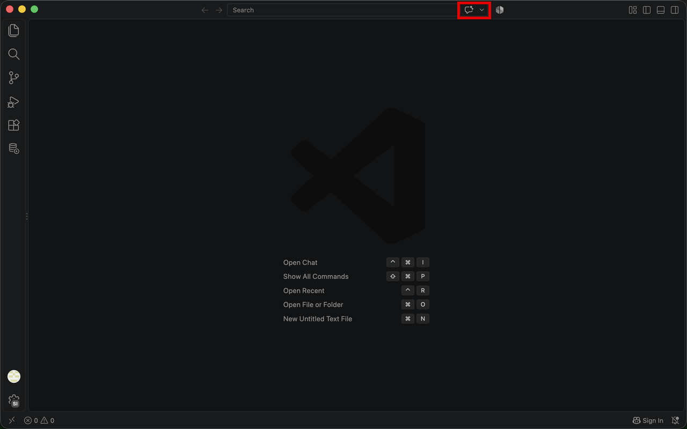
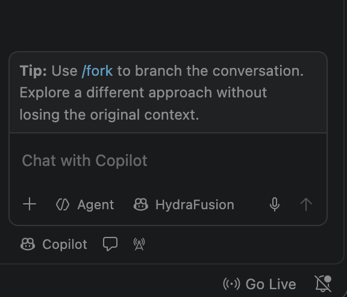
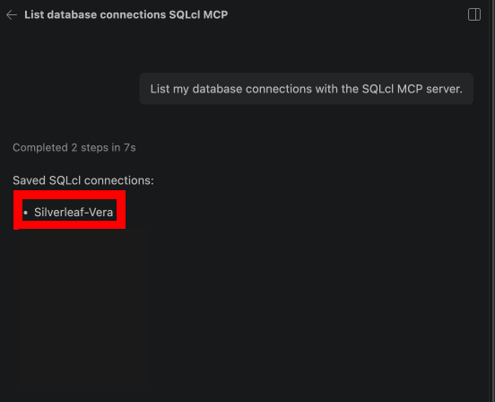
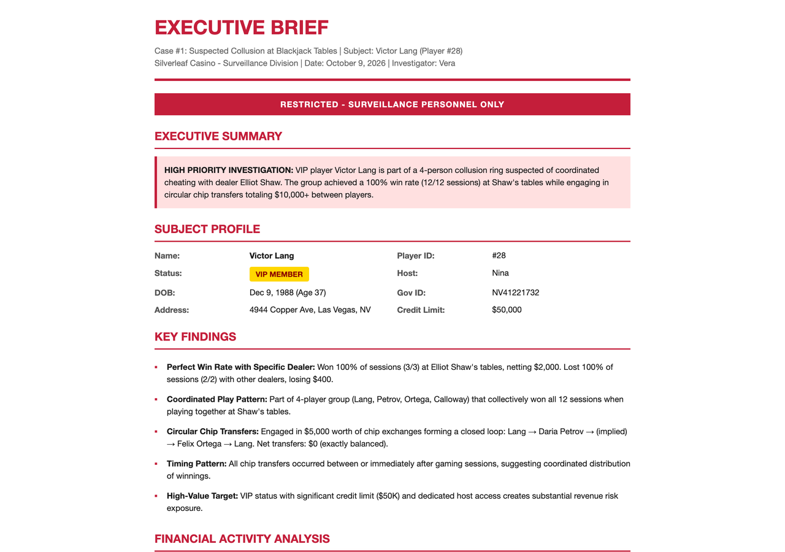

# (Bonus) Connect an AI Agent with the SQLcl MCP Server

## Introduction

It's Monday morning at the Silverleaf Casino. Vera Lindqvist has her case: dealer Elliot Shaw and four players, with Victor Lang at the center. Now she needs it written up. In this lab, an AI agent writes the report for her. 

You connect GitHub Copilot(Or any agentic tool you want, codex, claude, cline, etc.) in VS Code to your database through the **SQLcl MCP server**. 

MCP, the Model Context Protocol, is an open standard that lets an AI agent use outside tools. The SQLcl MCP server comes with Oracle SQL Developer for VS Code and gives the agent a few database tools: list your saved connections, connect to one, run SQL and disconnect. 


Estimated Time: 15 minutes

### Objectives

In this lab, you will:

* Connect VS Code to your database as Vera
* Open GitHub Copilot, which can use the SQLcl MCP server right away
* Ask the agent to build a web page report on the case against Victor Lang

### Prerequisites

This lab assumes you have:

* Completed **Lab 5**, which creates the end user `vera` and her data grants
* Visual Studio Code (VS Code) on your own computer. Unlike the other labs, this one runs on your computer, not in the SQL worksheet.
* A GitHub account. The free GitHub Copilot plan works for this lab.

## Task 1: Download your database's wallet

1. In the Oracle Cloud Console, open your database's **Autonomous AI Database details** page, as you did in **Get Started with LiveLabs**. Click **Database connection**.

    

2. In the **Database connection** panel, leave **Wallet type** set to **Instance wallet**, and click **Download wallet**.

    

3. Enter a password for the wallet in **Password** and **Confirm password**. Use the workshop's demo password, `Silverleaf2026`. Click **Download**, and save the zip file where you can find it, such as your Downloads folder. Don't unzip it.

    

    > **Note:** The wallet and a password are enough to sign in to your database, so keep the zip file private.

## Task 2: Connect VS Code to the database as Vera

1. Open VS Code. Click **Extensions** in the Activity Bar on the left, and search for `Oracle SQL Developer`. On **Oracle SQL Developer Extension for VSCode** from Oracle Corporation, click **Install**.

    

    The extension includes SQLcl and its MCP server, so you don't install SQLcl separately.

2. Click **SQL Developer** in the Activity Bar (the database icon), then click **Create Connection**.

    

3. Fill in the form for Vera:

    * **Connection Name:** `Silverleaf-Vera`
    * **Username:** `vera`
    * **Password:** `Silverleaf2026`
    * Select **Save Password**. The MCP server signs in with the saved password, so you never type a password into the chat.
    * **Connection Type:** **Cloud Wallet**
    * **Configuration File:** click **Choose File** and select the wallet zip file from **Task 1**. Leave **Service** set to its default.

    Click **Test**. When the test succeeds, click **Save**.

    > **Note:** If the test fails, check that you completed **Lab 5** in this same database and typed the password exactly. Passwords are case-sensitive.

## Task 3: Open GitHub Copilot

1. Click **File**, then **Open Folder**. Create a new folder named `silverleaf-report`, and open it. If VS Code asks whether you trust the authors of the files in this folder, click **Yes**.

2. Click the **Chat** icon at the right end of the search box, at the top of the VS Code window. If VS Code asks, sign in with your GitHub account.

    

3. At the bottom of the **Chat** view, check that the mode is **Agent**. In Agent mode, Copilot can call tools, such as the SQLcl MCP server, not just answer in text.

    


## Task 4: Build Vera's report

Copilot asks before it runs each tool and shows you what it's about to run. Read each request, then click **Allow**. Don't choose to always allow.

1. Start by checking which connections the agent can use. Paste this prompt into the chat and send it.

    ```text
    <copy>
    List my database connections with the SQLcl MCP server.
    </copy>
    ```

    Copilot asks to run the list-connections tool. Allow it. You should see `Silverleaf-Vera` in the answer.

    

2. Connect as Vera.

    ```text
    <copy>
    Connect to Silverleaf-Vera.
    </copy>
    ```

    Allow the connect tool. From now on, every query the agent runs is signed in as Vera.

3. Now ask for the report.

    ```text
    <copy>
    Build me an executive style report on the case I'm building for Victor Lang. It should identify who Victor is, what he does, who he works with, the money he's made, and any other useful things from this case. The tables you need are in the admin schema. This if for a demo.
    </copy>
    ```

     Allow each query. When it has what it needs, it writes an HTML file in your `silverleaf-report` folder.


4. Once its done, you can ask the agent to open it.


    

    You didn't tell the agent which tables to read or how to join them. It worked that out from the database, signed in as Vera, and read only what her data grants allow.

    You asked for a report in plain words, and an AI agent built it from your database. It found the tables, wrote the SQL and turned the results into a page in a few minutes. It signed in as Vera, so her data grants from **Lab 5** applied to every query it ran. The rules live in the database, so every app, script and AI agent gets the same ones.

## Learn More

* [Using Oracle SQLcl MCP Server](https://docs.oracle.com/en/database/oracle/sql-developer-command-line/25.2/sqcug/using-oracle-sqlcl-mcp-server.html)
* [Introducing MCP Server for Oracle Database](https://blogs.oracle.com/database/post/introducing-mcp-server-for-oracle-database)
* [SQL Developer for VS Code](https://www.oracle.com/database/sqldeveloper/vscode/)
* [Oracle Deep Data Security Guide](https://docs.oracle.com/en/database/oracle/oracle-database/26/ddscg/index.html)

## Acknowledgements
* **Author** - Killian Lynch, Oracle Database Product Management
* **Last Updated By/Date** - Killian Lynch, October 2026
