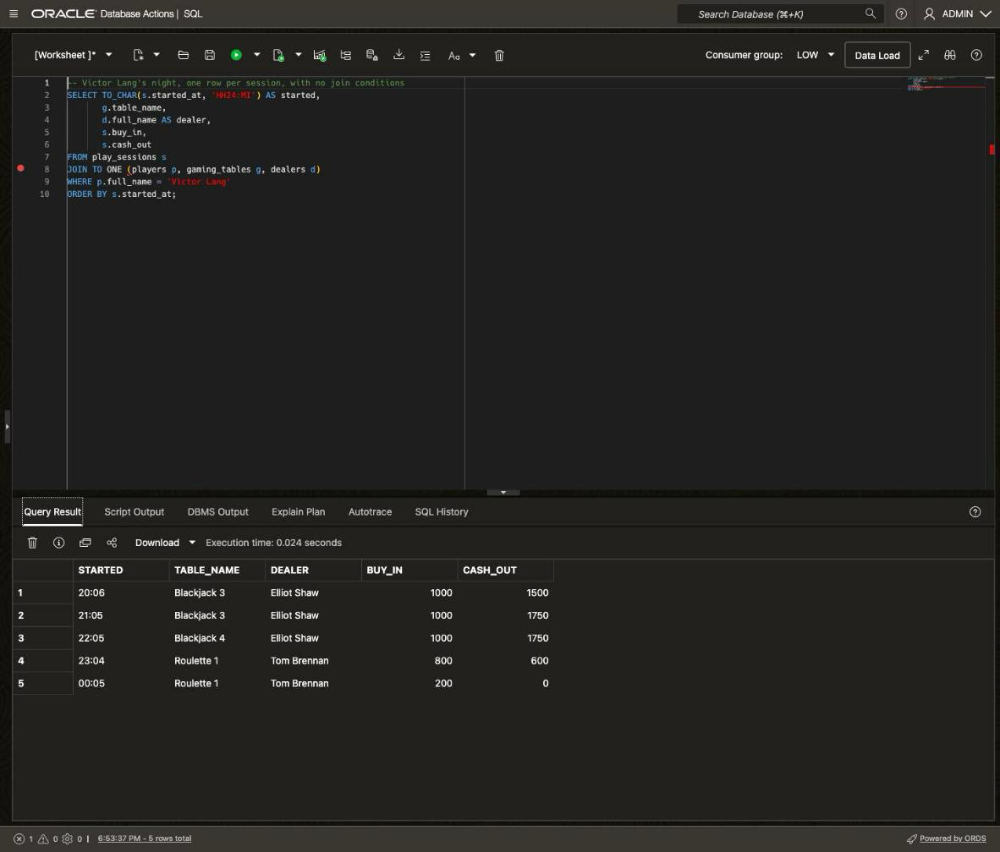
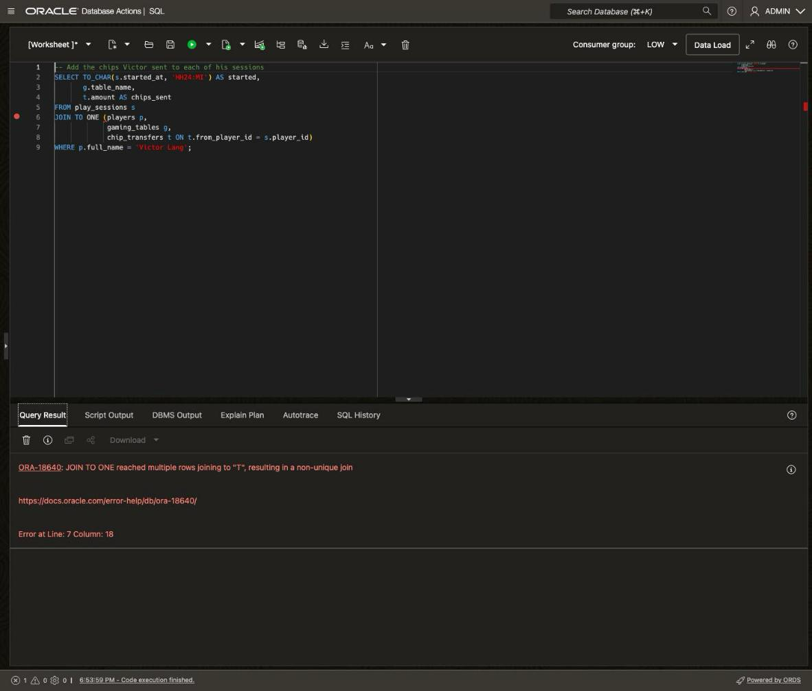
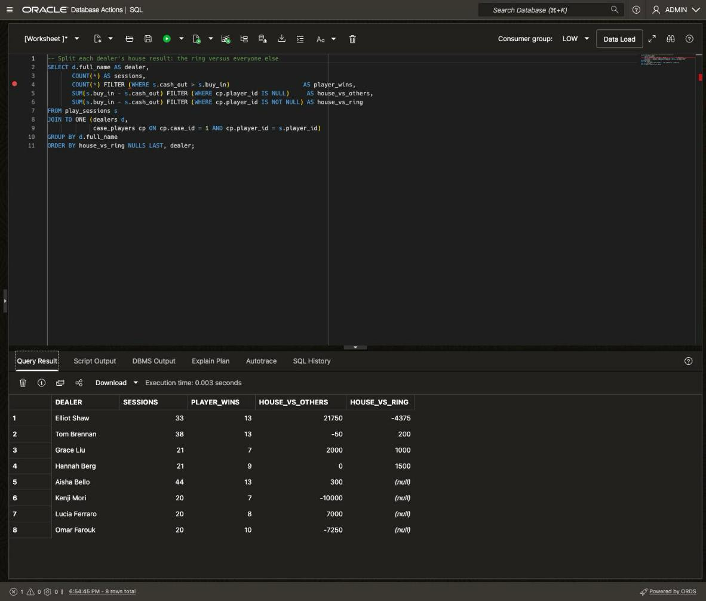
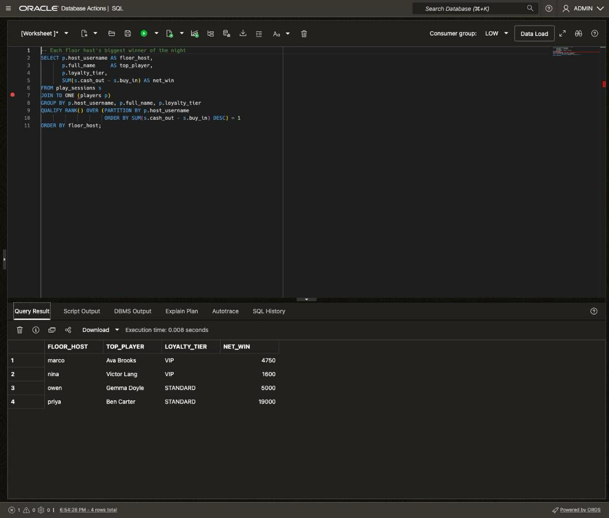
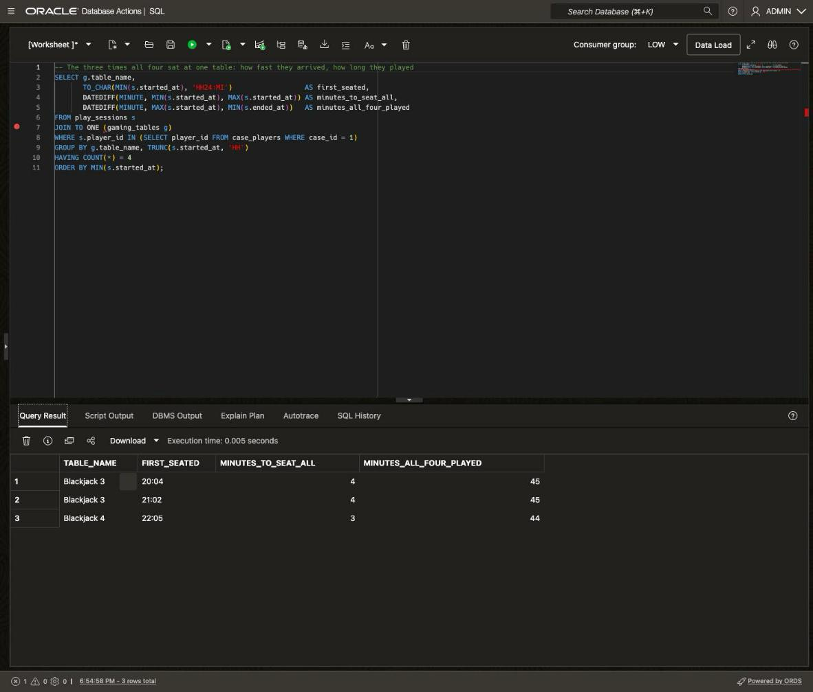

# (Bonus) New SQL Features

## Introduction

It's Monday morning at the Silverleaf Casino. Before Vera Lindqvist writes her report, she has a few more questions about Sunday night.

Oracle AI Database 26ai keeps adding new SQL. In this bonus lab, you answer Vera's questions with five of the new additions. Each one makes a common query shorter or safer. These queries only read data, and you're signed in as ADMIN, so you see every row.

Estimated Time: 10 minutes

### Objectives

In this lab, you will:

* Join tables without writing `ON` clauses, using `JOIN TO ONE`
* Add up only some of the rows in a total, using `FILTER`
* Keep only the top row in each group, using `QUALIFY`
* Work with times using `DATEDIFF` and `DATEADD`

### Prerequisites

This lab assumes you have:

* Completed **Get Started with LiveLabs** and opened the SQL worksheet as ADMIN
* Completed **Lab 1**, **Lab 2** and **Lab 3**

## Task 1: Join tables with JOIN TO ONE

1. Vera wants a list of Victor Lang's sessions, with the table and dealer names. The `play_sessions` table stores only ID numbers for the player, the table and the dealer. The names live in three other tables, so the query has to join them. With `JOIN TO ONE`, you just list the tables. The database works out how to join them from the foreign keys you created in **Lab 1**, so you don't write any `ON` clauses. Clear the editor, paste the query, and click **Run Statement**.

    ```sql
    <copy>
    -- Victor Lang's sessions, with table and dealer names, and no ON clauses
    SELECT TO_CHAR(s.started_at, 'HH24:MI') AS started,
           g.table_name,
           d.full_name AS dealer,
           s.buy_in,
           s.cash_out
    FROM play_sessions s
    JOIN TO ONE (players p, gaming_tables g, dealers d)
    WHERE p.full_name = 'Victor Lang'
    ORDER BY s.started_at;
    </copy>
    ```

    You should see five rows, one for each session Victor played. He won his three sessions with Elliot Shaw dealing, then lost twice at Roulette 1. Overall, he's up $1,600.

    Before, you wrote one `ON` clause for each table, such as `JOIN dealers d ON d.dealer_id = s.dealer_id`. `JOIN TO ONE` reads those links from the foreign keys instead.

    

2. `JOIN TO ONE` also checks your join. Each table you list may match at most one row for each session. If it matches more, the query stops with an error instead of repeating rows. Try it: Vera adds the chips Victor passed to other players. He passed chips twice, so each session matches two transfers. This statement should fail. Clear the editor, paste the query, and click **Run Statement**. Use **Run Statement**, not **Run Script**, or you won't see the error.

    ```sql
    <copy>
    -- Add the chips Victor sent to each of his sessions
    SELECT TO_CHAR(s.started_at, 'HH24:MI') AS started,
           g.table_name,
           t.amount AS chips_sent
    FROM play_sessions s
    JOIN TO ONE (players p,
                 gaming_tables g,
                 chip_transfers t ON t.from_player_id = s.player_id)
    WHERE p.full_name = 'Victor Lang';
    </copy>
    ```

    **Expected Result:** The query fails with `ORA-18640: JOIN TO ONE reached multiple rows joining to "T", resulting in a non-unique join`. `T` is the query's short name for `chip_transfers`.

    No foreign key links a session to a chip transfer, so this join needs an `ON` clause. Each of Victor's five sessions matches both of his transfers. A plain `JOIN` would quietly return 10 rows, each session twice. Add up his winnings from those rows, and $1,600 turns into $3,200. `JOIN TO ONE` stops the query, so you never see the wrong total.

    

## Task 2: Split totals with FILTER and pick winners with QUALIFY

1. In **Lab 3**, Elliot Shaw looked like the casino's best dealer: the casino made $17,375 at his tables. Vera wants that number split in two: what the casino made from the four players in her case, and what it made from everyone else. `FILTER` lets each total in a query add up only the rows you choose. Clear the editor, paste the query, and click **Run Statement**.

    ```sql
    <copy>
    -- Split each dealer's house result: the ring versus everyone else
    SELECT d.full_name AS dealer,
           COUNT(*) AS sessions,
           COUNT(*) FILTER (WHERE s.cash_out > s.buy_in)                     AS player_wins,
           SUM(s.buy_in - s.cash_out) FILTER (WHERE cp.player_id IS NULL)     AS house_vs_others,
           SUM(s.buy_in - s.cash_out) FILTER (WHERE cp.player_id IS NOT NULL) AS house_vs_ring
    FROM play_sessions s
    JOIN TO ONE (dealers d,
                 case_players cp ON cp.case_id = 1 AND cp.player_id = s.player_id)
    GROUP BY d.full_name
    ORDER BY house_vs_ring NULLS LAST, dealer;
    </copy>
    ```

    You should see eight dealers, with Elliot Shaw first. The casino made $21,750 from his other players (`HOUSE_VS_OTHERS`) and lost $4,375 to the four players in the case (`HOUSE_VS_RING`). Together, that's the $17,375 from **Lab 1**, which is why his total looked fine.

    Each `FILTER (WHERE ...)` works like a `WHERE` clause for one column. `HOUSE_VS_RING` adds up only the sessions of the four players in the case, and `HOUSE_VS_OTHERS` adds up the rest. Four dealers never dealt to those four players, so their `HOUSE_VS_RING` is empty. Before, you put a `CASE` expression inside each total, such as `SUM(CASE WHEN ... THEN ... END)`.

    

2. Floor hosts like to thank their biggest winner of the night. This query finds each host's top player. `RANK()` numbers each host's players from the biggest winner down, and `QUALIFY` keeps only number 1. Look at Nina's row. Clear the editor, paste the query, and click **Run Statement**.

    ```sql
    <copy>
    -- Each floor host's biggest winner of the night
    SELECT p.host_username AS floor_host,
           p.full_name     AS top_player,
           p.loyalty_tier,
           SUM(s.cash_out - s.buy_in) AS net_win
    FROM play_sessions s
    JOIN TO ONE (players p)
    GROUP BY p.host_username, p.full_name, p.loyalty_tier
    QUALIFY RANK() OVER (PARTITION BY p.host_username
                         ORDER BY SUM(s.cash_out - s.buy_in) DESC) = 1
    ORDER BY floor_host;
    </copy>
    ```

    You should see four rows, one per host. Ben Carter tops Priya's list at $19,000. Nina's top player is Victor Lang, her VIP, at $1,600. If Nina thanked her biggest winner, she'd be thanking one of the four players in the case. That's why **Lab 5** keeps the case file from her.

    Before `QUALIFY`, you ranked the players in a subquery, then kept rank 1 in an outer query.

    

## Task 3: Measure time with DATEDIFF and DATEADD

1. Vera's report needs timing. How quickly did the four players sit down together, and how long did they play side by side? `DATEDIFF` gives the time between two moments in the unit you ask for, such as minutes. Clear the editor, paste the query, and click **Run Statement**.

    ```sql
    <copy>
    -- The three times all four sat at one table: how fast they arrived, how long they played
    SELECT g.table_name,
           TO_CHAR(MIN(s.started_at), 'HH24:MI')                  AS first_seated,
           DATEDIFF(MINUTE, MIN(s.started_at), MAX(s.started_at)) AS minutes_to_seat_all,
           DATEDIFF(MINUTE, MAX(s.started_at), MIN(s.ended_at))   AS minutes_all_four_played
    FROM play_sessions s
    JOIN TO ONE (gaming_tables g)
    WHERE s.player_id IN (SELECT player_id FROM case_players WHERE case_id = 1)
    GROUP BY g.table_name, TRUNC(s.started_at, 'HH')
    HAVING COUNT(*) = 4
    ORDER BY MIN(s.started_at);
    </copy>
    ```

    You should see three rows: Blackjack 3 at 20:04 and 21:02, then Blackjack 4 at 22:05. Each time, all four sat down within 4 minutes, then played together for 44 or 45 minutes.

    The query groups the sessions by table and hour, and `HAVING COUNT(*) = 4` keeps the hours when all four played. `MINUTES_TO_SEAT_ALL` runs from the first player sitting down to the last. `MINUTES_ALL_FOUR_PLAYED` runs from the last player sitting down to the first one leaving. Before `DATEDIFF`, getting minutes between two times took `EXTRACT(HOUR FROM ...) * 60 + EXTRACT(MINUTE FROM ...)`.

    

2. Last, Vera asks the camera room for video of the chip loop from **Lab 3**. She wants each trip around the loop, plus 5 minutes before and after. `DATEADD` adds or subtracts time, such as 5 minutes, from a date or time. Clear the editor, paste the query, and click **Run Statement**.

    ```sql
    <copy>
    -- Camera footage for each lap of the chip loop, with 5 minutes either side
    SELECT TO_CHAR(DATEADD(MINUTE, -5, MIN(t.transferred_at)), 'HH24:MI') AS footage_from,
           TO_CHAR(DATEADD(MINUTE, 5, MAX(t.transferred_at)), 'HH24:MI')  AS footage_to,
           DATEDIFF(MINUTE, MIN(t.transferred_at), MAX(t.transferred_at)) AS lap_minutes,
           SUM(t.amount) AS chips_moved
    FROM chip_transfers t
    WHERE t.from_player_id IN (SELECT player_id FROM case_players WHERE case_id = 1)
    GROUP BY TRUNC(t.transferred_at, 'HH')
    ORDER BY MIN(t.transferred_at);
    </copy>
    ```

    You should see two rows, one for each trip around the loop. The video runs from 23:00 to 23:31, then from 01:30 to 02:01. Each trip took 21 minutes. The first moved $6,000 in chips and the second $4,000.

    Each trip happened within one hour, so the query groups the transfers by hour. In **Lab 3**, you added an hour with `+ INTERVAL '1' HOUR`. `DATEADD(HOUR, 1, ...)` does the same, and it works the same way for any unit.

## Conclusion

You answered Vera's questions with five new pieces of SQL. `JOIN TO ONE` joined tables without `ON` clauses and stopped a join that would have counted Victor's winnings twice. `FILTER`, `QUALIFY`, `DATEDIFF` and `DATEADD` made common queries shorter.

That completes the workshop. You built the Silverleaf Casino floor, served it as JSON, uncovered the collusion ring and protected the evidence. Every step ran in one Oracle AI Database 26ai.

## Learn More

* [SQL (Oracle AI Database New Features)](https://docs.oracle.com/en/database/oracle/oracle-database/26/nfcoa/appdev_sql.html)
* [Building Queries with Correct JOINS More Easily](https://docs.oracle.com/en/database/oracle/oracle-database/26/adfns/building-queries-correct-joins-more-easily.html)
* [Advanced SQL Extensions: Calendar Functions and Aggregation Filters](https://docs.oracle.com/en/database/oracle/oracle-database/26/adfns/advanced-sql-extensions-calendar-and-aggregation-filters.html)
* [DATEDIFF](https://docs.oracle.com/en/database/oracle/oracle-database/26/sqlrf/datediff.html)

## Acknowledgements
* **Author** - Killian Lynch, Oracle Database Product Management
* **Last Updated By/Date** - Killian Lynch, October 2026
