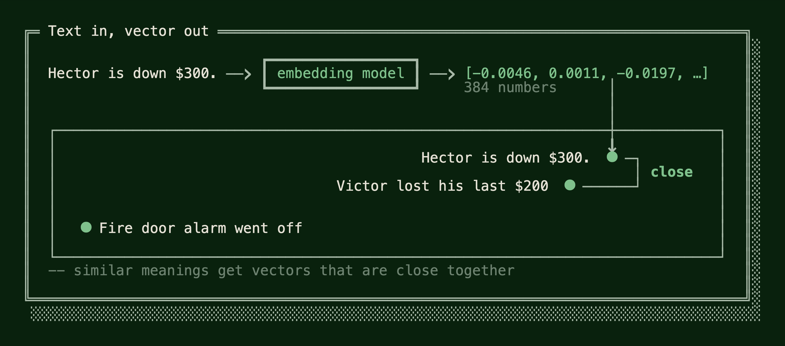
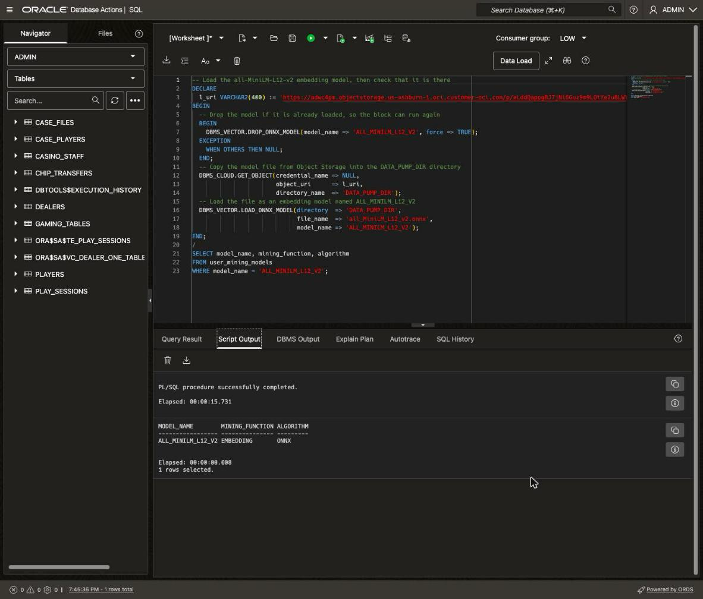
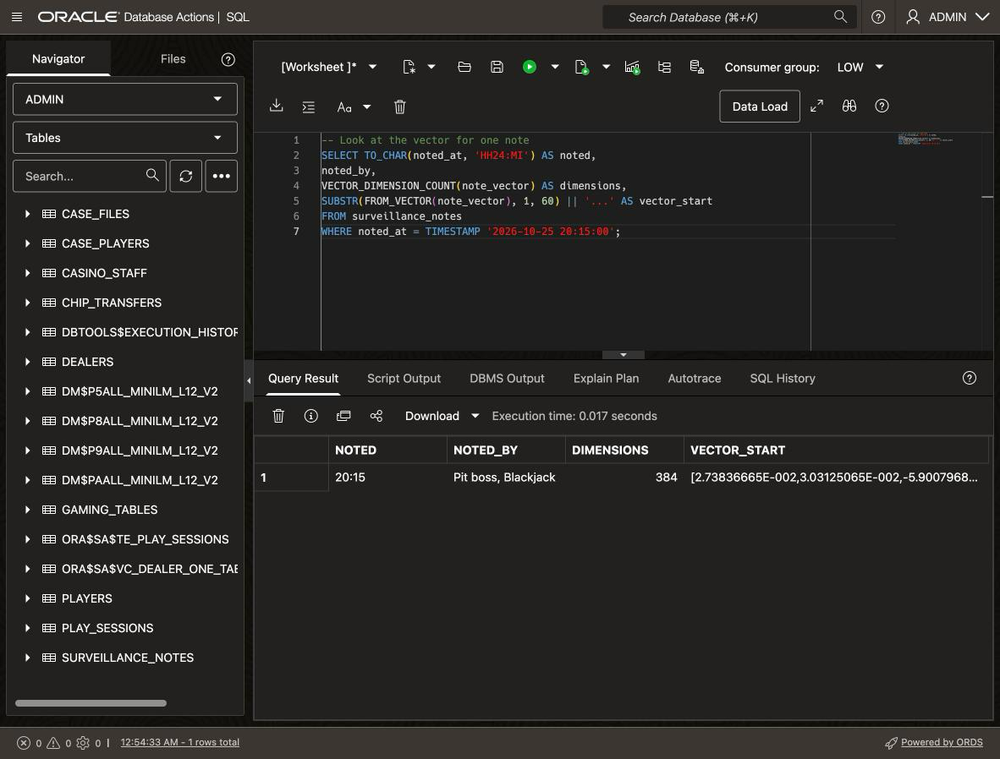
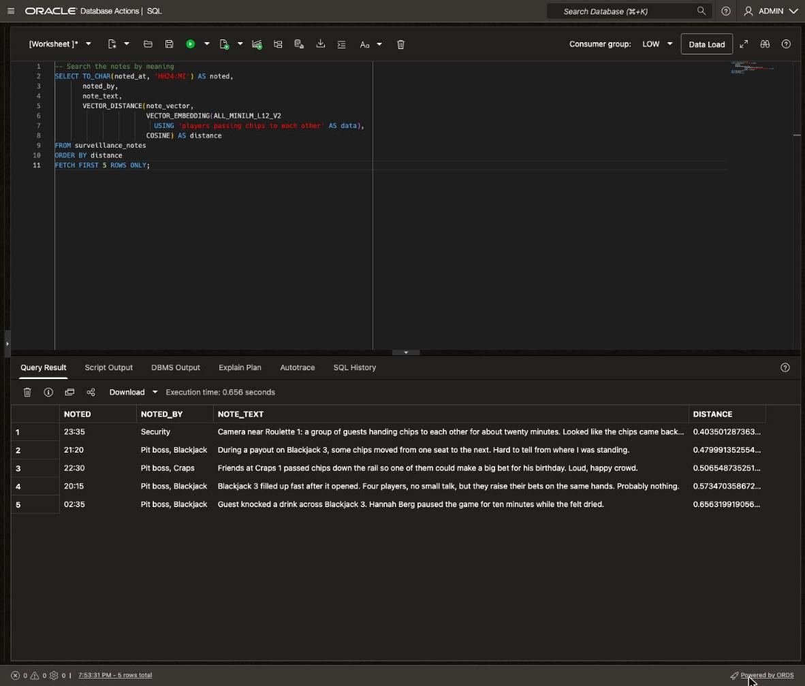
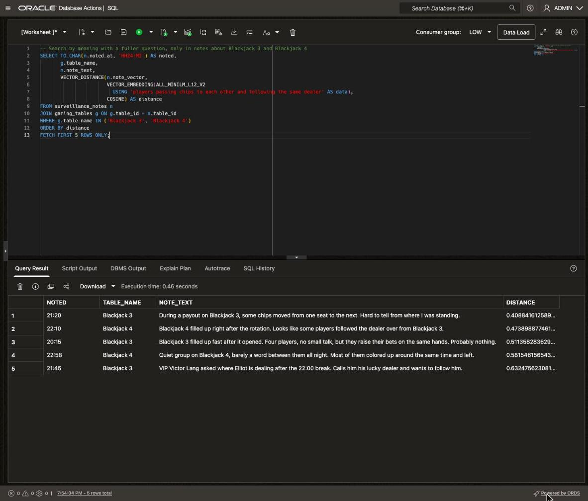

# Search the Surveillance Log with AI Vector Search

## Introduction

In **Lab 3**, the graph found four players passing chips in a loop and tied them to dealer Elliot Shaw. Before Vera Lindqvist takes the case further, she wants to know whether anyone on the floor noticed. Table supervisors and security staff log short notes all night. 

Oracle AI Database 26ai includes AI Vector Search. An embedding model turns each note into a vector, a list of numbers that captures what the note means. Notes with similar meanings get vectors that sit close together. So you can search by meaning (rather than just keyword), with plain SQL, inside the database.

Estimated Time: 15 minutes

### Objectives

In this lab, you will:

* Load an embedding model into the database
* Store the night's floor notes, each with a vector
* Compare a keyword search with a search by meaning
* Combine a vector search with an ordinary join and filter
* Create a vector index and run an approximate search

### Prerequisites

This lab assumes you have:

* Completed **Get Started with LiveLabs** and opened the SQL worksheet as ADMIN
* Completed **Lab 1**, **Lab 2** and **Lab 3**

## Task 1: Load an embedding model

1. An **embedding model** reads text and returns a **vector**, a fixed-length list of numbers that captures what the text means. Texts with similar meanings get vectors that are close together, even when they share no words. You'll use all-MiniLM-L12-v2, a small open-source text model, in ONNX format.

    Here is the model at work on a few sentences from Sunday night's notes, which you'll load in **Task 2**. Hector's note and Victor Lang's note share no words, but both say a player lost money, so their vectors are close:

    

    This block copies the model file from Object Storage and loads it into the database. It can take a minute. Clear the editor, paste the block, and click **Run Script** (F5).

    ```sql
    <copy>
    -- Load the all-MiniLM-L12-v2 embedding model, then check that it is there
    DECLARE
      l_uri VARCHAR2(400) := 'https://adwc4pm.objectstorage.us-ashburn-1.oci.customer-oci.com/p/eLddQappgBJ7jNi6Guz9m9LOtYe2u8LWY19GfgU8flFK4N9YgP4kTlrE9Px3pE12/n/adwc4pm/b/OML-Resources/o/all_MiniLM_L12_v2.onnx';
    BEGIN
      -- Drop the model if it is already loaded, so the block can run again
      BEGIN
        DBMS_VECTOR.DROP_ONNX_MODEL(model_name => 'ALL_MINILM_L12_V2', force => TRUE);
      EXCEPTION
        WHEN OTHERS THEN NULL;
      END;
      -- Copy the model file from Object Storage into the DATA_PUMP_DIR directory
      DBMS_CLOUD.GET_OBJECT(credential_name => NULL,
                            object_uri      => l_uri,
                            directory_name  => 'DATA_PUMP_DIR');
      -- Load the file as an embedding model named ALL_MINILM_L12_V2
      DBMS_VECTOR.LOAD_ONNX_MODEL(directory  => 'DATA_PUMP_DIR',
                                  file_name  => 'all_MiniLM_L12_v2.onnx',
                                  model_name => 'ALL_MINILM_L12_V2');
    END;
    /
    SELECT model_name, mining_function, algorithm
    FROM user_mining_models
    WHERE model_name = 'ALL_MINILM_L12_V2';
    </copy>
    ```

    Script Output ends with one row: `ALL_MINILM_L12_V2`, with mining function `EMBEDDING` and algorithm `ONNX`. What the block does:

    * `DBMS_CLOUD.GET_OBJECT` copies the file `all_MiniLM_L12_v2.onnx` into the database's `DATA_PUMP_DIR` directory.
    * `DBMS_VECTOR.LOAD_ONNX_MODEL` loads the file as a model named `ALL_MINILM_L12_V2`. SQL calls the model by that name.
    * The first call drops any earlier copy of the model, so you can run the block again.

    The model now lives in the database, like a table or a view. Your notes never leave the database to become vectors.

    

## Task 2: Store the floor notes with their vectors

1. Create a table for the night's notes. Each note records when it was written, who wrote it, and which gaming table it's about. The last column holds the note's vector. Clear the editor, paste the block, and click **Run Script**.

    ```sql
    <copy>
    -- Create the table for the notes from the casino floor
    CREATE TABLE IF NOT EXISTS surveillance_notes (
      note_id      NUMBER PRIMARY KEY,
      noted_at     TIMESTAMP NOT NULL,
      noted_by     VARCHAR2(40) NOT NULL,
      table_id     NUMBER REFERENCES gaming_tables (table_id),
      note_text    VARCHAR2(400) NOT NULL,
      note_vector  VECTOR(384, FLOAT32)
    )
    ANNOTATIONS (data_owner 'Surveillance');
    </copy>
    ```

    What the table holds:

    * `note_vector` uses the `VECTOR` data type. `VECTOR(384, FLOAT32)` stores 384 numbers, each a 32-bit floating-point value. all-MiniLM-L12-v2 returns vectors of exactly that size.
    * `table_id` points to the **Lab 1** `gaming_tables` table. It can be NULL, because many security notes aren't about one gaming table.
    * The `data_owner` annotation marks the notes as surveillance data, like `chip_transfers` in **Lab 1**.

    > **Note:** Silverleaf keeps its notes in a table. In a real company, notes live in many places. With **external tables**, the database can also read files kept outside it, such as files in Object Storage, and search them by meaning alongside the tables inside it.

2. Now load the notes from Sunday night, 20:00 to 04:00. Table supervisors wrote most of them, and security wrote the rest. The `note_vector` column stays empty for now. Clear the editor, paste the block, and click **Run Script**.

    ```sql
    <copy>
    -- Load the notes the table supervisors and security wrote on Sunday night
    DELETE FROM surveillance_notes;
    INSERT INTO surveillance_notes (note_id, noted_at, noted_by, table_id, note_text) VALUES
      ( 1, TIMESTAMP '2026-10-25 20:05:00', 'Security',            NULL,
           'Sunday crowd is building fast. Opened the second entrance and put an extra guard at the valet stand.'),
      ( 2, TIMESTAMP '2026-10-25 20:15:00', 'Pit boss, Blackjack',    3,
           'Blackjack 3 filled up fast after it opened. Four players, no small talk, but they raise their bets on the same hands. Probably nothing.'),
      ( 3, TIMESTAMP '2026-10-25 20:20:00', 'Pit boss, Craps',        8,
           'Guest at Craps 1 asked for a drink menu and a dinner comp. Passed the request to Nina Alvarez.'),
      ( 4, TIMESTAMP '2026-10-25 20:35:00', 'Pit boss, Baccarat',     6,
           'Player at Baccarat 2 tipped Lucia Ferraro $100 after a winning hand.'),
      ( 5, TIMESTAMP '2026-10-25 20:45:00', 'Pit boss, Baccarat',     5,
           'Couple at Baccarat 1 sharing one bankroll and talking through every hand. Both well up.'),
      ( 6, TIMESTAMP '2026-10-25 20:50:00', 'Pit boss, Roulette',     7,
           'Wheel on Roulette 1 checked and leveled before the rush. Tom Brennan reports no problems.'),
      ( 7, TIMESTAMP '2026-10-25 21:05:00', 'Pit boss, Blackjack',    2,
           'VIP Ava Brooks asked us to hold her usual seat at Blackjack 2 after dinner. Marco Bellini approved it.'),
      ( 8, TIMESTAMP '2026-10-25 21:10:00', 'Security',            NULL,
           'Slot machine 214 by the north bar jammed and swallowed a ticket. The attendant reset it and paid the guest $40.'),
      ( 9, TIMESTAMP '2026-10-25 21:20:00', 'Pit boss, Blackjack',    3,
           'During a payout on Blackjack 3, some chips moved from one seat to the next. Hard to tell from where I was standing.'),
      (10, TIMESTAMP '2026-10-25 21:45:00', 'Pit boss, Blackjack',    3,
           'VIP Victor Lang asked where Elliot is dealing after the 22:00 break. Calls him his lucky dealer and wants to follow him.'),
      (11, TIMESTAMP '2026-10-25 21:50:00', 'Security',            NULL,
           'Lost phone handed in at the north bar. The owner came back for it twenty minutes later.'),
      (12, TIMESTAMP '2026-10-25 22:10:00', 'Pit boss, Blackjack',    4,
           'Blackjack 4 filled up right after the rotation. Looks like some players followed the dealer over from Blackjack 3.'),
      (13, TIMESTAMP '2026-10-25 22:30:00', 'Pit boss, Craps',        8,
           'Friends at Craps 1 passed chips down the rail so one of them could make a big bet for his birthday. Loud, happy crowd.'),
      (14, TIMESTAMP '2026-10-25 22:40:00', 'Pit boss, Baccarat',     6,
           'VIP Leo Marchetti asked for a private baccarat salon next Friday. Sent the request to Marco Bellini.'),
      (15, TIMESTAMP '2026-10-25 22:58:00', 'Pit boss, Blackjack',    4,
           'Quiet group on Blackjack 4, barely a word between them all night. Most of them colored up around the same time and left.'),
      (16, TIMESTAMP '2026-10-25 23:05:00', 'Security',            NULL,
           'Guest at the north bar was cut off after too many drinks. A friend took him home in a taxi.'),
      (17, TIMESTAMP '2026-10-25 23:20:00', 'Pit boss, Craps',        8,
           'Pablo Reyes joined Craps 1 at 23:15 after missing out on a roulette seat. Small bets, quiet player.'),
      (18, TIMESTAMP '2026-10-25 23:35:00', 'Security',            NULL,
           'Camera near Roulette 1: a group of guests handing chips to each other for about twenty minutes. Looked like the chips came back around to where they started. Could not make out amounts.'),
      (19, TIMESTAMP '2026-10-26 00:10:00', 'Pit boss, Roulette',     7,
           'Roulette 1 is full with seven players. Several are regulars who have been on the wheel since 20:00.'),
      (20, TIMESTAMP '2026-10-26 00:30:00', 'Pit boss, Roulette',     7,
           'VIP Victor Lang lost his last $200 at Roulette 1. Nina Alvarez offered him a dinner comp.'),
      (21, TIMESTAMP '2026-10-26 00:35:00', 'Pit boss, Blackjack',    3,
           'Big winner on Blackjack 3 tonight, tripled his buy-in. Grace Liu says he plays basic strategy by the book.'),
      (22, TIMESTAMP '2026-10-26 00:45:00', 'Security',            NULL,
           'Fire door alarm on the east stairs went off. Faulty sensor, reset by maintenance.'),
      (23, TIMESTAMP '2026-10-26 00:55:00', 'Pit boss, Blackjack',    4,
           'Card shuffler on Blackjack 4 jammed. Omar Farouk shuffled by hand until a technician swapped the machine.'),
      (24, TIMESTAMP '2026-10-26 01:30:00', 'Pit boss, Craps',        8,
           'A die bounced off Craps 1 and rolled under a slot stool. Aisha Bello put a fresh set in play.'),
      (25, TIMESTAMP '2026-10-26 01:45:00', 'Pit boss, Blackjack',    1,
           'Guest on Blackjack 1 asked Elliot Shaw for a fresh deck after a losing run. Deck changed, no issues.'),
      (26, TIMESTAMP '2026-10-26 01:50:00', 'Security',            NULL,
           'Two guests argued over a taxi at the valet stand. They settled it before we stepped in.'),
      (27, TIMESTAMP '2026-10-26 02:35:00', 'Pit boss, Blackjack',    3,
           'Guest knocked a drink across Blackjack 3. Hannah Berg paused the game for ten minutes while the felt dried.'),
      (28, TIMESTAMP '2026-10-26 02:45:00', 'Security',            NULL,
           'North bar closed at 02:30 for cleaning. Guests sent to the lobby bar.'),
      (29, TIMESTAMP '2026-10-26 02:58:00', 'Pit boss, Baccarat',     6,
           'Gemma Doyle played her first baccarat session tonight. Kenji Mori walked her through the rules, and she won $4,000.'),
      (30, TIMESTAMP '2026-10-26 03:40:00', 'Pit boss, Roulette',     7,
           'Tom Brennan and a regular named Hector chat like old friends at Roulette 1. Tom says they worked together at another casino years ago. Hector is down $300.'),
      (31, TIMESTAMP '2026-10-26 03:45:00', 'Pit boss, Craps',        8,
           'Player on Craps 1 tripled her buy-in just before closing. Marco Bellini approved a breakfast comp.'),
      (32, TIMESTAMP '2026-10-26 03:55:00', 'Security',            NULL,
           'Closing walk-through done. Drop boxes collected from every table.');
    COMMIT;
    </copy>
    ```

    Script Output shows 32 rows inserted, then the commit. In `table_id`, 3 and 4 are Blackjack 3 and Blackjack 4, the IDs from **Lab 1**. Skim a few notes. Most describe an ordinary Sunday: free meals, a jammed slot machine, a spilled drink.

    > **Note:** The block starts by deleting earlier notes, so you can run it again. If you do, run step 3 again too.

3. `VECTOR_EMBEDDING` runs the model on a piece of text and returns its vector. This `UPDATE` stores a vector for every note. The query then shows part of one vector, from the 20:15 note by the blackjack supervisor. Clear the editor, paste the block, and click **Run Script**.

    ```sql
    <copy>
    -- Turn every note into a vector, then look at one of them
    UPDATE surveillance_notes
    SET note_vector = VECTOR_EMBEDDING(ALL_MINILM_L12_V2 USING note_text AS data);
    COMMIT;
    SELECT TO_CHAR(noted_at, 'HH24:MI') AS noted,
           noted_by,
           VECTOR_DIMENSION_COUNT(note_vector) AS dimensions,
           SUBSTR(FROM_VECTOR(note_vector), 1, 60) || '...' AS vector_start
    FROM surveillance_notes
    WHERE noted_at = TIMESTAMP '2026-10-25 20:15:00';
    </copy>
    ```

    Script Output shows 32 rows updated, then one row. `DIMENSIONS` is 384. `VECTOR_START` shows the first few numbers in scientific notation, so `2.73836795E-002` means about 0.027.

    

## Task 3: Search the notes by meaning

1. Vera starts the way most people would, with a **keyword search**. This one looks for "cheat", "collu" (as in collude or collusion) and "scam". `LIKE '%cheat%'` matches the word anywhere in a note, so it also catches "cheating". Clear the editor, paste the query, and click **Run Statement**.

    ```sql
    <copy>
    -- Keyword search: look for the obvious words
    SELECT TO_CHAR(noted_at, 'HH24:MI') AS noted, noted_by, note_text
    FROM surveillance_notes
    WHERE LOWER(note_text) LIKE '%cheat%'
       OR LOWER(note_text) LIKE '%collu%'
       OR LOWER(note_text) LIKE '%scam%';
    </copy>
    ```

    Query Result shows no rows. The keyword search found nothing.

2. Now Vera tries a **search by meaning**. She describes the first thing the graph found in **Lab 3**, in plain words: players passing chips to each other. `VECTOR_EMBEDDING` turns her question into a vector with the same model. `VECTOR_DISTANCE` measures how far each note's vector is from it.

    A smaller distance means a closer meaning, so the query sorts by distance and keeps the closest five. Clear the editor, paste the query, and click **Run Statement**.

    ```sql
    <copy>
    -- Search the notes by meaning
    SELECT TO_CHAR(noted_at, 'HH24:MI') AS noted,
           noted_by,
           note_text,
           VECTOR_DISTANCE(note_vector,
                           VECTOR_EMBEDDING(ALL_MINILM_L12_V2
                             USING 'players passing chips to each other' AS data),
                           COSINE) AS distance
    FROM surveillance_notes
    ORDER BY distance
    FETCH FIRST 5 ROWS ONLY;
    </copy>
    ```

    You should see five notes, closest first, with distances from about 0.40 to 0.66:

    * **23:35**, Security: on camera, a group of guests handed chips to each other until they seemed to come back around.
    * **21:20**, Blackjack supervisor: during a payout on Blackjack 3, some chips moved from one seat to the next.
    * **22:30**, Craps supervisor: friends passed chips along the table for a birthday bet.
    * **20:15**, Blackjack supervisor: four quiet players at Blackjack 3 raise their bets on the same hands.
    * **02:35**, Blackjack supervisor: a guest knocked a drink across Blackjack 3.

    Three of the five could be about the team. None of them contains the words from step 1, yet each one is close in meaning to Vera's question. The 23:35 note is the **Lab 3** chip loop, caught on camera.

    On its own, each note is vague: "Hard to tell", "Looks like", "Probably nothing". Different people wrote them hours apart, among dozens of ordinary notes, so nobody put them together that night. The search does, because their meanings are close to Vera's question.

    The other two are innocent. The craps note is friends pooling chips for a birthday bet. It sounds like the question, so it ranks high. The spilled drink is far from the question, at about 0.66. It's on the list only because the query always returns five notes, so the distance tells you how close each one really is.

    

3. The graph found two things in **Lab 3**: chips passing around a loop of players, and the dealer those players followed. Step 2 asked only about the chips. Now Vera asks a fuller question: players passing chips to each other and following the same dealer.

    She also narrows the search. A vector search is ordinary SQL, so you can join and filter it like any other query. The four players won at Blackjack 3 and Blackjack 4, so the query joins `gaming_tables` and keeps only notes about those two tables. Clear the editor, paste the query, and click **Run Statement**.

    ```sql
    <copy>
    -- Search by meaning with a fuller question, only in notes about Blackjack 3 and Blackjack 4
    SELECT TO_CHAR(n.noted_at, 'HH24:MI') AS noted,
           g.table_name,
           n.note_text,
           VECTOR_DISTANCE(n.note_vector,
                           VECTOR_EMBEDDING(ALL_MINILM_L12_V2
                             USING 'players passing chips to each other and following the same dealer' AS data),
                           COSINE) AS distance
    FROM surveillance_notes n
    JOIN gaming_tables g ON g.table_id = n.table_id
    WHERE g.table_name IN ('Blackjack 3', 'Blackjack 4')
    ORDER BY distance
    FETCH FIRST 5 ROWS ONLY;
    </copy>
    ```

    You should see five notes, and all five are about the team. The birthday at Craps 1 is gone, because it's about another table. 

    Two notes about following the dealer are new: 22:10, where players seem to follow the dealer to Blackjack 4, and 21:45, where Victor Lang calls Elliot his lucky dealer. 

    The closest is the 21:20 note, then 22:10, 20:15, 22:58 and 21:45. Read together, the five tell the story of the night:

    * **21:20:** during a payout, some chips move from one seat to the next.
    * **22:10:** some players seem to follow the dealer to Blackjack 4.
    * **20:15:** four quiet players at Blackjack 3 raise their bets on the same hands.
    * **22:58:** the quiet group on Blackjack 4 swaps their small chips for larger ones at about the same time and leaves.
    * **21:45:** VIP Victor Lang asks where Elliot deals after the break. He calls Elliot his lucky dealer.


    No single note says what happened. Side by side, and next to the chip loop and the dealer from **Lab 3**, they do.

    

## Task 4: Speed up the search with a vector index

1. Every search so far compared Vera's question with all 32 notes, one by one. That's an **exact search**, and with 32 notes it's instant. But a real casino keeps every night's notes for years. To find out whether this team has worked Silverleaf before, Vera would search millions of notes, and an exact search would compare her question with every one of them. The more notes there are, the slower each search gets.

    A **vector index** solves that. An IVF (Inverted File Flat) index sorts the vectors into groups of similar vectors, called partitions, each around a center point. A search first finds the partitions whose centers are nearest the question, then compares the question only with the notes in those partitions. Most notes are never checked, so the search stays fast as the log grows.

    The index is an ordinary database object, like the indexes you'd create on any table. One SQL statement creates it. Clear the editor, paste the block, and click **Run Script**.

    ```sql
    <copy>
    -- Create an IVF vector index on the note vectors
    DROP INDEX IF EXISTS surveillance_notes_ivf;
    CREATE VECTOR INDEX surveillance_notes_ivf
      ON surveillance_notes (note_vector)
      ORGANIZATION NEIGHBOR PARTITIONS
      DISTANCE COSINE
      WITH TARGET ACCURACY 95;
    SELECT index_name, index_type, index_subtype, status
    FROM user_indexes
    WHERE index_name = 'SURVEILLANCE_NOTES_IVF';
    </copy>
    ```

    Script Output ends with one row: `SURVEILLANCE_NOTES_IVF`, type `VECTOR`, subtype `NEIGHBOR_PARTITIONS_IVF`, status `VALID`. How the statement reads:

    * `DROP INDEX IF EXISTS` removes the index from an earlier run, so you can run the block again.
    * `ORGANIZATION NEIGHBOR PARTITIONS` makes this an IVF index.
    * `DISTANCE COSINE` matches the searches. The database uses the index only when the distance metrics match.
    * `WITH TARGET ACCURACY 95` asks a search to find, on average, 95 percent of the rows an exact search would.

2. Now run the search from Task 3 step 2 as an **approximate search**. The query changes in one place: `FETCH APPROX` instead of `FETCH`. That one word lets the database use the index. Clear the editor, paste the query, and click **Run Statement**.

    ```sql
    <copy>
    -- The same search, now allowed to use the vector index
    SELECT TO_CHAR(noted_at, 'HH24:MI') AS noted,
           noted_by,
           note_text,
           VECTOR_DISTANCE(note_vector,
                           VECTOR_EMBEDDING(ALL_MINILM_L12_V2
                             USING 'players passing chips to each other' AS data),
                           COSINE) AS distance
    FROM surveillance_notes
    ORDER BY distance
    FETCH APPROX FIRST 5 ROWS ONLY;
    </copy>
    ```

    You should see the same five notes as in Task 3 step 2, in the same order. `FETCH APPROX` lets the database use the index, but it doesn't force it. The database chooses how to run each query, and with only 32 notes, reading every note is faster than using the index, so that's what it does here. On millions of notes, it would use the index and check only the partitions nearest Vera's question.

    That's the trade an approximate search makes. An exact search compares the question with every vector, so it always returns the true closest notes, but it gets slower as the notes pile up. An approximate search skips most of the notes, so it stays fast on millions of rows, but now and then it can miss a close one. `TARGET ACCURACY 95` sets how much of that you accept. On Sunday's 32 notes, the answer is exactly the same. On years of notes, Vera would still get her answer quickly.

    Think about what you just did. The casino's players, play sessions, chip transfers and case files were already in this database from **Lab 1** to **Lab 3**. To add AI search, you didn't set up a new system or move any of that data. You loaded a model, stored the notes with one `VECTOR` column beside their text, and created one index. AI Vector Search is part of Oracle AI Database itself, so it extended what the casino already had.

    Many teams instead add a separate vector database, a product built only to store and search vectors. Then the notes live in two places. Every new or changed note has to be copied across, or the two copies drift apart. The second system needs its own security rules, its own backups and its own plan for when a server fails. And a question like Vera's in Task 3 step 3 needs application code: search the vector database, look up each result's table in the casino database, then filter.

    Here, there's one copy of the data. A new note can be searched as soon as it's stored with its vector. Vera's question from Task 3 step 3, a search by meaning joined and filtered with business data, is one SQL query, and it runs the same way with `FETCH APPROX`. The vectors also get everything the database already gives the casino's other tables: the same security, the same backups, the same protection when a server fails, and the same room to grow. So any app that uses this database, old or new, can add a search by meaning with plain SQL. That includes an AI assistant that looks up the right notes before it answers a staff member's question.

    

    > **Note:** On Autonomous AI Database, a search without `APPROX` can also use a vector index once one exists. Write `FETCH EXACT` when you need every row compared.

## Conclusion

You loaded an embedding model into the database and stored a vector for every note from the floor. A keyword search found nothing. A search by meaning, joined and filtered with ordinary SQL, found five notes about the team. In the staff's own words, they back up the chip loop and dealer the graph found in **Lab 3**.

A search by meaning found what a keyword search couldn't: notes written in each person's own words, with none of the words Vera would have guessed. And all of it happened inside the database. The model runs there, so the notes never left the database to become vectors. Each vector sits in the same row as its note, so there's no separate vector database to copy notes into and keep in step. One SQL query searched by meaning and joined and filtered like any other query. And one SQL statement created the vector index that keeps that search fast as the log grows.

Vera's case file is stronger now, and it still names Victor Lang, Nina Alvarez's VIP. In **Lab 5**, you control who can see it.

You may now **proceed to the next lab**.

## Learn More

* [Oracle AI Vector Search User's Guide](https://docs.oracle.com/en/database/oracle/oracle-database/26/vecse/index.html)
* [VECTOR_EMBEDDING](https://docs.oracle.com/en/database/oracle/oracle-database/26/sqlrf/vector_embedding.html)
* [VECTOR_DISTANCE](https://docs.oracle.com/en/database/oracle/oracle-database/26/sqlrf/vector_distance.html)
* [Understand Inverted File Flat Vector Indexes](https://docs.oracle.com/en/database/oracle/oracle-database/26/vecse/understand-inverted-file-flat-vector-indexes.html)

## Acknowledgements
* **Author** - Killian Lynch, Oracle Database Product Management
* **Last Updated By/Date** - Killian Lynch, October 2026
