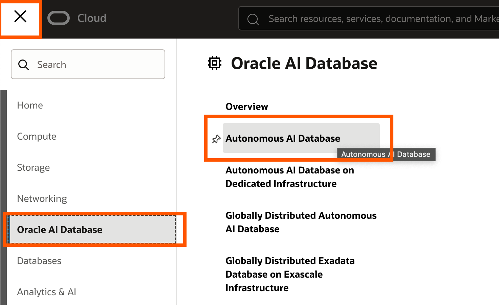
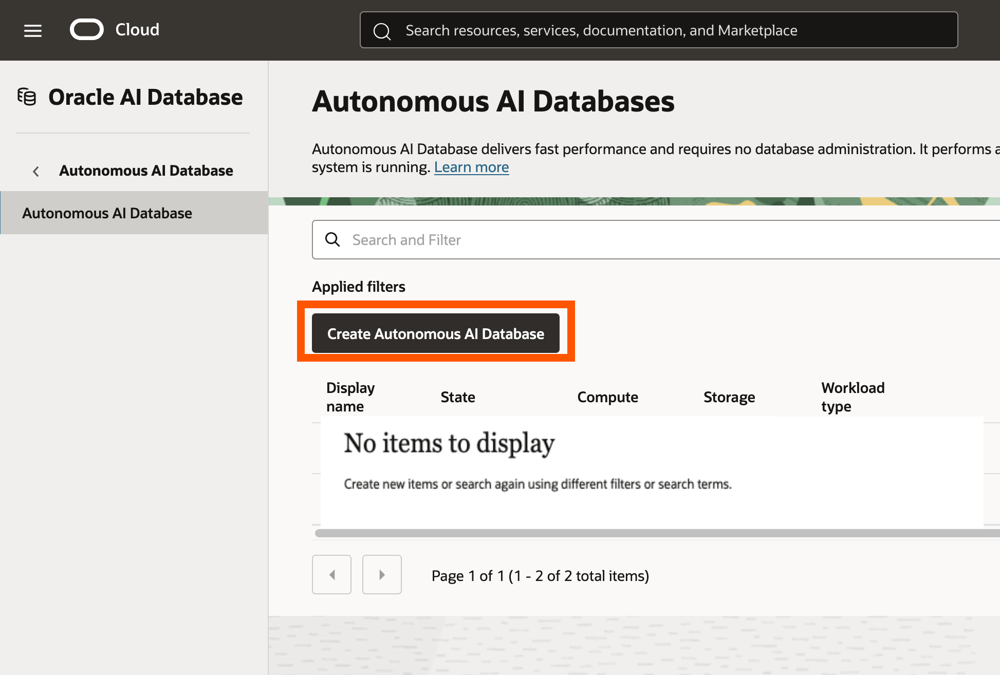
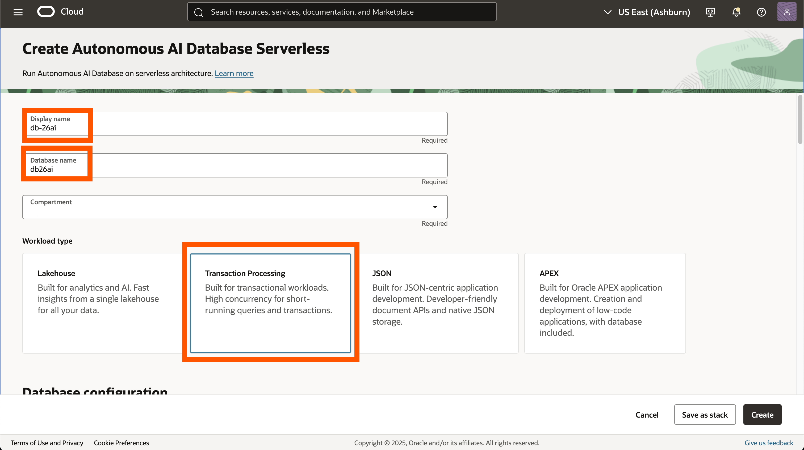
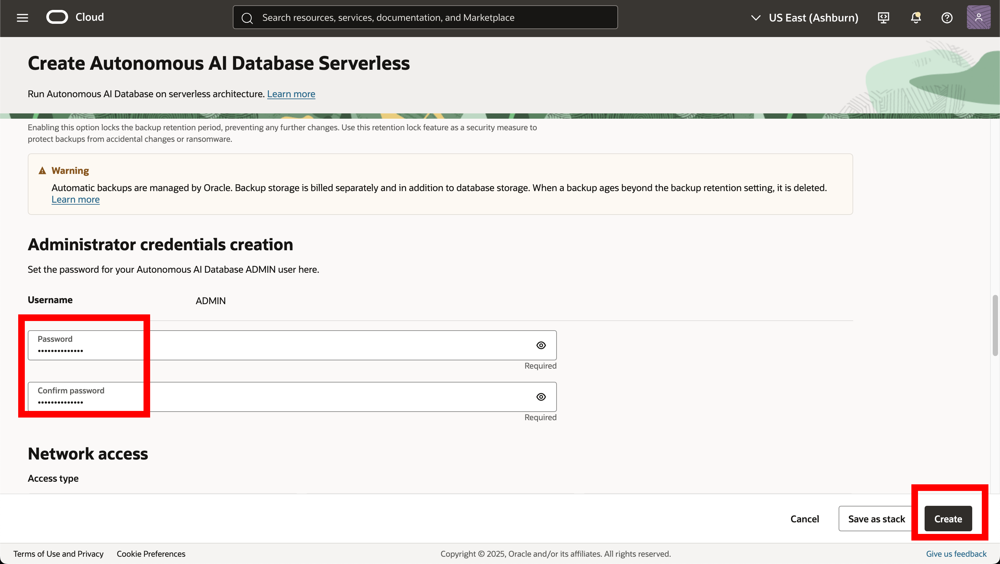
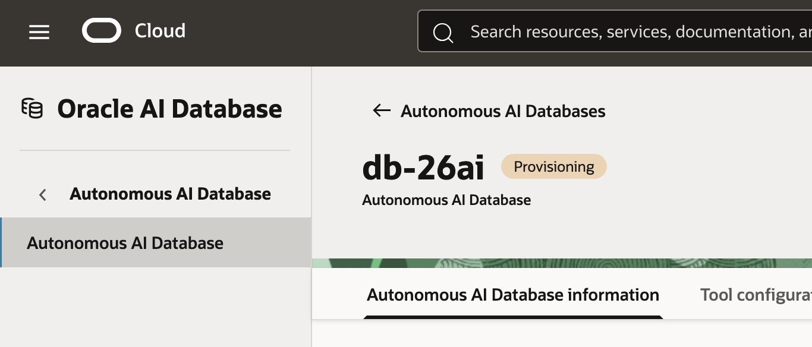

# Introduction

In this lab we will setup an Oracle AI Database. For this LiveLab, we will create an Always Free Oracle Autonomous AI Database 26ai (26ai always free ADB). All of the labs in this LiveLab and all of the features we are going to work with today are available and work on any 26ai database, regardless of the deployment style.

Estimated Lab Time: 10 minutes

### Objective:
The objective of this workshop is to set up the 26ai always free ADB. The following steps will guide you through the simple installation.

### Prerequisites:
- Complete the Get Started Lab.
- Basic understanding of SQL is helpful.

## Task 1: Database creation
1. Using the hamburger menu in the top left hand of the screen, **click** Oracle AI Database and then click Autonomous AI Database.

    

2. Now **select** Create Autonomous AI Database.

    

3. Keep the default compartment and give the database a display name and database name. Let's name it db26ai. Next **click** transaction Processing and keep the serverless option for the database.

    

4. Give your database a password and let's keep the defaults for the rest and create our database. **Click** Create Autonomous AI Database at the bottom of the screen.
    > The password must be 12 to 30 characters and contain at least one uppercase letter, one lowercase letter, and one number. The password cannot contain the double quote (") character or the username "admin".

    

5. The database in now being created for us. It should take around 5 min or less.  Explore any of the labs at your own pace. There's no specific order to follow, so feel free to pick an choose whichever ones catch your interest. Whether you want to try them all or focus on specific features, the choice is yours.

    

## Learn More

* [Introducing Oracle AI Database 26ai](https://blogs.oracle.com/database/post/oracle-database-23ai-the-next-long-term-support-release)
* [Oracle AI Database Features and Licensing](https://apex.oracle.com/pls/apex/r/features/dbfeatures/home)

## Acknowledgements
* **Author** - Killian Lynch, Database Product Management
* **Contributors** - Dom Giles, Distinguished Database Product Manager
* **Last Updated By/Date** - Killian Lynch, October 2025
