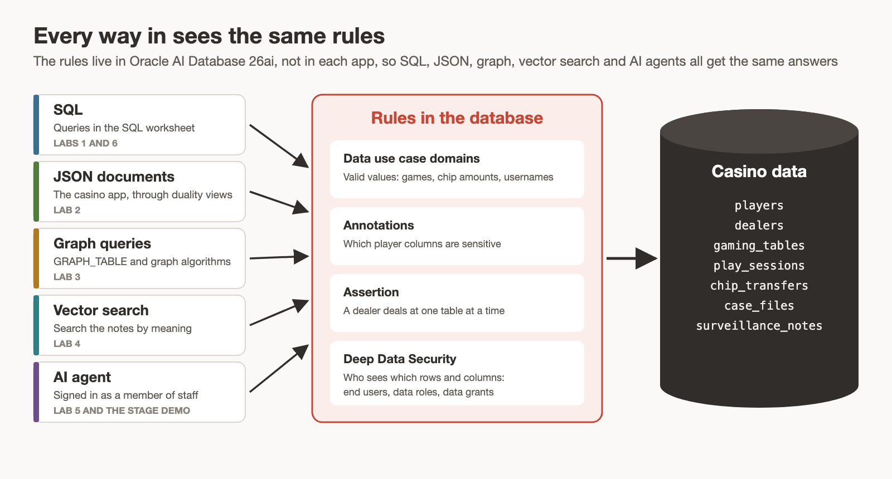

# Try What's New in Oracle AI Database 26ai: The Silverleaf Hustle

## Introduction

Welcome to the Oracle AI World 2026 hands-on lab for Oracle AI Database 26ai. The story takes place at the Silverleaf Casino, a fictional casino where you build the casino's database using 26ai features and try to uncover a hidden casino hustle.

Estimated Workshop Time: 85 minutes

### Objectives

In this workshop, you will:

* Build the casino floor with domains, annotations and an assertion
* Serve JSON documents to the casino website through duality views, and watch the assertion reject a bad JSON write
* Uncover the collusion ring with a SQL property graph, path patterns and Personalized PageRank
* Search the surveillance notes by meaning with AI Vector Search and an in-database embedding model
* Protect the evidence with end users, data roles and data grants, then compare what each person sees
* (Bonus) Connect an AI agent to the casino database through the SQLcl MCP server, and watch the data grants decide what it sees
* (Bonus) Write shorter, safer queries with `JOIN TO ONE`, aggregation filters, `QUALIFY`, `DATEDIFF` and `DATEADD`

### Prerequisites

This workshop assumes you have:

* A LiveLabs sandbox reservation for this workshop
* A web browser. There's nothing to install for Labs 1 to 5 or Lab 7, because they run in the Database Actions SQL worksheet.
* For the bonus Lab 6 only: Visual Studio Code on your own computer and a GitHub account

## The Silverleaf Casino

It's Sunday night, October 25, 2026. Forty players spend the night at eight gaming tables, served by eight dealers. Four floor hosts look after the players. Surveillance has a tip: someone on the floor is cheating, and they aren't working alone. Vera Lindqvist, the casino's surveillance investigator, needs to find out who.

The session opens with a demo of the casino's website. In the labs, you build the database behind it and load the night of play. Then you find who's cheating and keep the evidence away from anyone who shouldn't see it.

The labs tell the story in three parts:

* **Build** (Labs 1 and 2): create the casino's database, then connect the website, where players read their own night, and the tablets at the tables, which log every session under the same rules.
* **Investigate** (Labs 3 and 4): run the usual reports, follow the connections between players and dealers, and search the staff's notes.
* **Protect** (Lab 5): keep the evidence away from anyone who shouldn't see it.

Labs 6 and 7 are bonus labs.

## Rules That Live in the Database

In Oracle AI Database 26ai, the same rows can be read as relational tables, JSON documents or a property graph. This workshop puts the casino's rules in the database too:

* **Data use case domains** are named data types with rules attached, such as a chip amount that must be a multiple of $5.
* **Annotations** mark the sensitive player columns.
* An **assertion** stops a dealer from dealing at two tables at the same time.
* **Data grants** decide which rows and columns each staff member can read.

Because the rules live in the database, every way in gets the same rules. That covers SQL in the worksheet, JSON documents from the tablets, graph queries, vector search and AI agents. In the closing stage demo, an AI agent signs in as different casino staff through the SQLcl MCP server. It sees only what each person may see.

## Workshop Labs

| Lab | Time |
|---|---|
| Get Started with LiveLabs | 5 minutes |
| Lab 1: Build the Casino Floor with Domains, Annotations and Assertions | 20 minutes |
| Lab 2: Serve the Casino App with JSON Relational Duality Views | 10 minutes |
| Lab 3: Uncover the Collusion Ring with Property Graphs | 15 minutes |
| Lab 4: Search the Surveillance Log with AI Vector Search | 15 minutes |
| Lab 5: Protect the Evidence with Deep Data Security | 20 minutes |
| Lab 6: (Bonus) Connect an AI Agent with the SQLcl MCP Server | 15 minutes |
| Lab 7: (Bonus) New SQL Features | 10 minutes |

You may now **proceed to the next lab**.

## Learn More

* [Oracle AI Database 26ai New Features](https://docs.oracle.com/en/database/oracle/oracle-database/26/nfcoa/index.html)
* [Application Data Usage](https://docs.oracle.com/en/database/oracle/oracle-database/26/cncpt/application-data-usage.html)
* [CREATE ASSERTION](https://docs.oracle.com/en/database/oracle/oracle-database/26/sqlrf/create-assertion.html)
* [JSON-Relational Duality Developer's Guide](https://docs.oracle.com/en/database/oracle/oracle-database/26/jsnvu/index.html)
* [Oracle AI Vector Search User's Guide](https://docs.oracle.com/en/database/oracle/oracle-database/26/vecse/index.html)
* [Graph Developer's Guide for Property Graph](https://docs.oracle.com/en/database/oracle/property-graph/26.3/spgdg/index.html)
* [Oracle Deep Data Security Guide](https://docs.oracle.com/en/database/oracle/oracle-database/26/ddscg/index.html)

## Acknowledgements
* **Author** - Killian Lynch, Oracle Database Product Management
* **Last Updated By/Date** - Killian Lynch, October 2026
