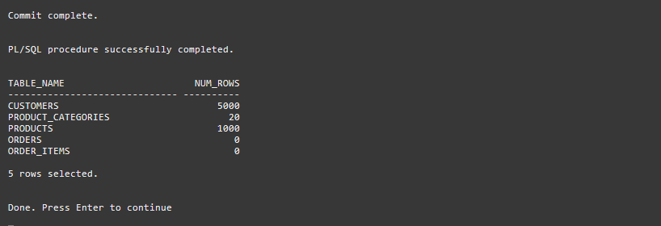
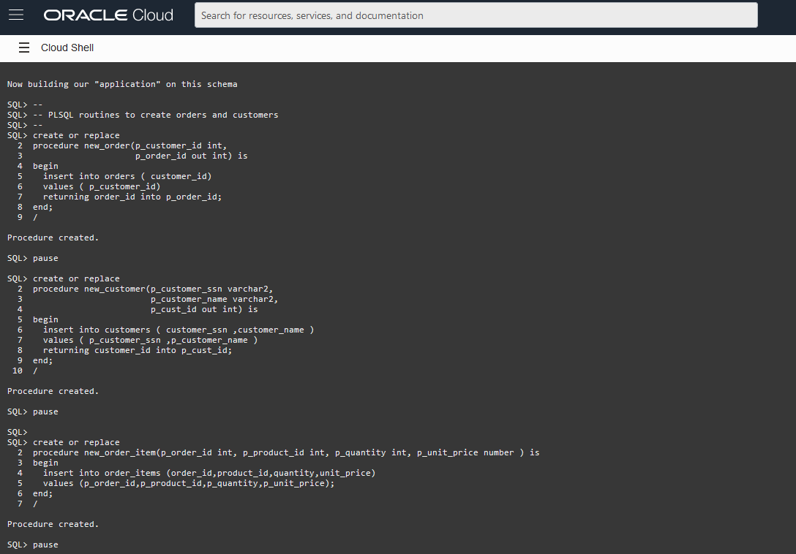
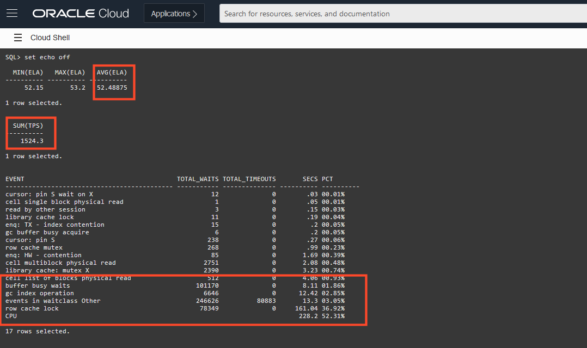

<!-- Updated March 24, 2020 -->


# Run the base Performance Benchmark


## Introduction

In this lab, you run a performance benchmark on your DEVLIVE schema to assess the throughput and scalability of your current database schema design.

Estimated lab time: 15 minutes

### Prerequisites

-   This lab requires completion of the preceding labs in the Contents menu on the left.

## Task 1: Understand and Run the Benchmark via Cloud Shell

1. Using Cloud Shell, run the benchmark1 shell script. If you are already in the home directory, you can skip the initial CD command.

    ```
    <copy>
    cd ~
    ./benchmark1.sh
    </copy>
    ```

    

    The script will connect to your autonomous database, and rebuilds the schema from scratch, just in case you inadvertently modified it or the data whilst you were exploring it with Database Actions. You will see this rebuild-from-scratch in the subsequent benchmarks to ensure a consistent base for measuring the benchmark results.

    

    The script will pause when it has rebuilt the schema back to the state to when you explored it via Data Modeler.

    

    Do not exit the script, simply press Enter to move onto item 2 below.

2. Creating APIs for the benchmark

    The benchmark will call some simple PL/SQL APIs to perform typical activities in the schema, namely,

      - Creating a new order (into the ORDERS table)
      - Creating a new customer (into the CUSTOMERS table)
      - Creating new items for an order (into the ORDER_ITEMS table)

    

    Do not exit the script, simply press Enter to move onto item 3 below.

3. Creating the benchmark test harness

    The benchmark will be driven by a PL/SQL package (called BENCHMARK) which consists of two routines:

    - INIT - sets all the random data in advance so that is does not interfere with performance.  There is a cost to generating lots of random data, so this is done before the benchmark timing is done and stored in memory.  The seed for the random data generator is a constant so each time the benchmark is run, the same "random" data will be used to ensure comparisons are valid.

    - RUN - this is the true benchmark routine.  It will through 'n' iterations of randomized customer and order creation using the APIs created. There are two key variables in the source code, 'iter' and 'new_cust' that determine volume of orders created, and how often a new customer is created, (eg every 200 orders). These can be edited depending on how large a autonomous database instance you have created. The defaults are chosen for the smallest always-free database as to not create massive execution times for the benchmark.  Typically execution will be less then 2 minutes.

    

    Do not exit the script, simply press Enter to move onto item 4 below.

4. Commencing the benchmark

    The benchmark launches 8 concurrent SQL*Plus sessions in the background, each of which will run an instance of the BENCHMARK PL/SQL package, each of which in turn will go through 'iter' (see above) iterations of creating orders and customers. However, to ensure all 8 sessions commence at the same time, they each try to obtain a lock on a row in the RESULTS table, which is pre-seeded before the benchmark starts.  The calling session (the script you are currently in) locks the entire RESULTS table before launching the 8 sessions, thus halting them from commencing.  

     

    At this point, you can press Enter which will commit this parent session, thus releasing the lock on the RESULTS table, and all 8 sessions will commence their benchmark. The calling script will then wait for all 8 sessions to complete before producing a summary. This may take several minutes.

## Task 2: Analyzing the benchmark results

1. The benchmark will summarize the performance with three metrics:

      - The total transactions per second achieved (TPS)
      - The average elapsed time in seconds across the 8 benchmark sessions (ELA)
      - A cumulative breakdown of where the 8 sessions utilized the elapsed time

    

    An exhaustive explanation of the each of the elements in the session breakdown is beyond the scope of this lab, but the general guiding principle for obtaining the best performance is:

      - Any component that is **not** CPU is potentially something that can tuned to be either minimize or eliminated. A program running exclusively on CPU is going to be best positioned to maximize the available resources on the database.
      - The aim is then to shrink the CPU component so that the program is as efficient as possible. This will increase the overall performance and scalability of the program being tuned.

    Your results will be different depending on the CPU size you have chosen for your autonomous database, but using the results in the image above, you can observe that this first benchmark achieved

    - **1524** transactions per second
    - **52** seconds average elapsed time per session
    - Only **52** percent of the benchmark time was productive CPU

    This is the baseline from which changes in the design will be made to boost performance.

    If you have not done so already, press Enter to exit the benchmark and please **proceed to the next lab.**

## Want to Learn More?

For more information on the locking as a means of controlling concurrency, see the documentation on [Concurrency](https://docs.oracle.com/en/database/oracle/oracle-database/19/cncpt/data-concurrency-and-consistency.html#GUID-E8CBA9C5-58E3-460F-A82A-850E0152E95C) and for general performing tuning information, see the [Performance Tuning] (https://docs.oracle.com/en/database/oracle/oracle-database/19/tgdba/index.html) guide.

## Acknowledgements

- **Author** - Connor McDonald, Database Advocate
- **Last Updated By/Date** - Connor McDonald, April 2021
