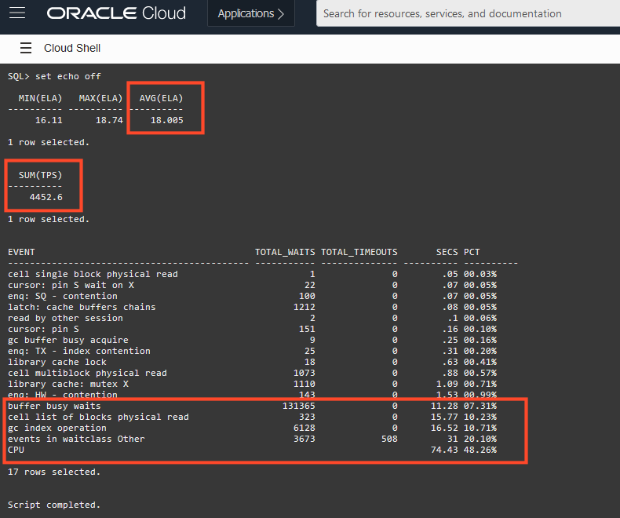
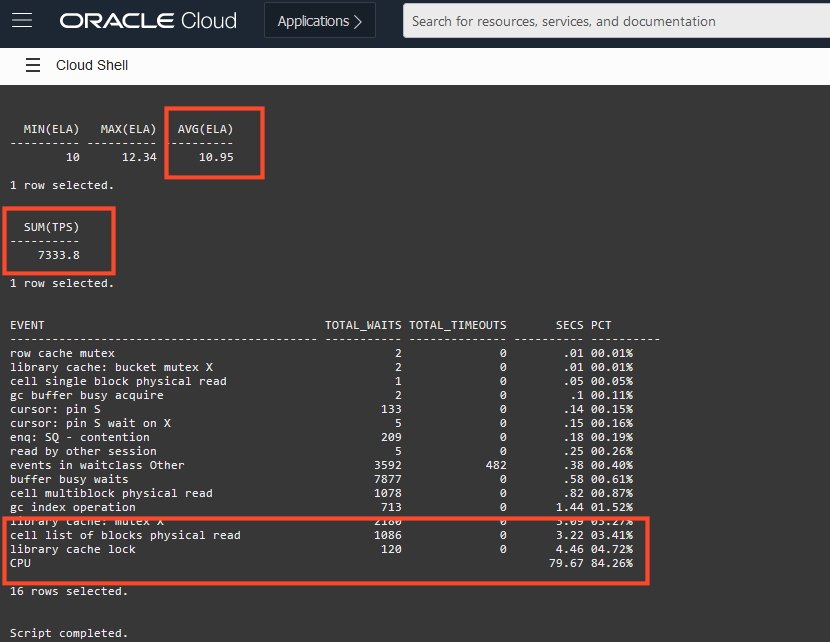

<!-- Updated March 24, 2020 -->


# Optimize the Design for Concurrency

## Introduction

In this lab, you will continue to modify the physical design to improve benchmark performance without any changes to the application code.

Estimated lab time: 15 minutes

### Prerequisites

-   This lab requires completion of the preceding labs in the Contents menu on the left.

## Task 1: Run Benchmark3 via Cloud Shell

1. Using Cloud Shell, run the benchmark3 shell script.

    If you are already in the home directory, you can skip the initial CD command.

    ```
    <copy>
    cd ~
    ./benchmark3.sh
    </copy>
    ```

    The script will connect to your autonomous database, and rebuilds the schema from scratch.  The only elements that will be presented verbosely on screen are those that have been changed from the initial baseline.

    From the previous benchmark, you may have noticed the element _enq: SQ contention_. This performance inhibitor occurs when multiple sessions are attempting to manage the the dictionary objects for sequences. They are all competing for exclusive access to an internal table which manages the current sequence number. This number of times a session must access this internal object be reduced by increasing the cache size. For any high activity sequence, consider raising the cache size above the default.

    

    Every index you create in a database schema adds to the overhead of creating rows. Of course, this is not to say that all indexes can be dropped because they are vital for query performance and to implement declarative data integrity, such as primary key and unique constraints. Similarly, foreign key indexes are important but it is easy to go "overboard" an adopt a position of having an index on _every_ column that is involved in a foreign key relation back to parent table. In early versions of the Oracle Database, this was best practice because there were locking implications associated with any DML (insert, update, delete) on columns that were also foreign keys.

    However, many of these locking concerns have been removed in more recent versions, and foreign indexes solely for the purpose of reducing locks, are only required for the scenarios when you might modify the _parent table primary key_ (eg update it, or delete the row). If this will never be the case, then the justification for a foreign key index falls back to that of the justification for _any_ index, namely, is there is a use case where it will improve query performance.

    In our database schema, since it is highly likely that a customer will want to query their own orders, we will be _keeping_ the foreign key index that links ORDERS to CUSTOMERS. However, it is unlikely (for this lab scenario) that there will be queries exclusively on just the product ID, or if there were, they are likely to be analytic style queries (eg total sales by product for the year) and thus an index on PRODUCT\_ID on the ORDER\_ITEMS table is probably superfluous. Similarly, it is very unlikely that if we wanted to delete a product entirely from the shop catalogue that we would ever delete the associated orders.  The product would simply be flagged as no longer available so that the orders would remain in the database for financial reporting etc.

    Thus the index linking ORDER\_ITEMS to PRODUCT will _not_ be retained, because it is just an inhibitor of performance without any justifiable benefit.

    

    Remember your goal should always to have *just enough indexes*

    The script will load the rest of the schema and launch the benchmark without further input required.

    

    The 8 sessions will be launched and the initiating commit will occur automatically, thus you simply need to wait for the benchmark to complete.

## Task 2: Review the Results

1. The benchmark will produce a similar performance summary to the previous executions.

    

    As mentioned earlier, your results will be different, but using the results in the image above, you can observe that with the revised design which has lifted the caching sizes for the critical sequences, and eliminated unnecessary indexes:

    - Throughput has improved **4452** transactions per second (up from 2609)
    - Elapsed time per session has improved to **18** seconds (down from 31)
    - CPU time is still at only **48** percent of the total benchmark time

    The performance benefits are very good, but the CPU utilization is still approximately half of the machine capacity which suggests there are still benefits to be found by adjusting the design.

2. If you not have done so already, press Enter to exit the benchmark.


## Task 3: Final benchmark

1. Using Cloud Shell, run the benchmark4 shell script. This is the final set of changes to the database design to improve performance.

    If you are already in the home directory, you can skip the initial CD command.

    ```
    <copy>
    cd ~
    ./benchmark4.sh
    </copy>
    ```

    The script will connect to your autonomous database, and rebuilds the schema from scratch.  The only elements that will be presented verbosely on screen are those that have been changed from the initial baseline.

    From the previous benchmark, components _gc index operation_ and _buffer busy waits_ are indicators that multiple session are competing for common blocks in memory. A block is the fundamental unit of Oracle Database storage for both tables and indexes. As sessions are trying to rapidly insert rows into the database, common blocks are being competed for in memory.

    By utilizing the _Partitioning_ facilities available in the Oracle Database, a single database object (such as a table or index) can be split into multiple physical objects in the database. This has the effect of distributing competition for the blocks across multiple physical objects, thus reducing contention and allowing for greater performance.

    

    In this example, hash partitioning is being used to split tables into equi-sized segments to distribute contention for blocks. Indexes can be split like-wise, and often it is indexes that are the best candidates for partitioning to ease contention even if the underlying table is not partitioned. Indexes entries must be stored in key order, so for index keys that are always ascending (eg sequence values or timestamps), there is a greater risk of contention for the leading index blocks. Hash partitioning a primary or unique key index can often be the ideal solution.

    The script will pause when it has rebuilt the schema back to the state and is ready to launch the benchmark. The 8 sessions will be launched and the initiating commit will occur automatically, thus you simply need to wait for the benchmark to complete.

## Task 4: Review the results

1. The benchmark will produce a similar performance summary to the previous executions.

    

    As mentioned earlier, your results will be different, but using the results in the image above, you can observe that with the revised design which has lifted the caching sizes for the critical sequences, and eliminated unnecessary indexes:

    - Throughput has improved **7338** transactions per second (up from 4452)
    - Elapsed time per session has improved to **10** seconds (down from 18)
    - CPU time is now at only **84** percent of the total benchmark time

    The performance benefits are very good, but the CPU utilization is still approximately half of the machine capacity which suggests there are still benefits to be found by adjusting the design.

    If you not have done so already, press Enter to exit the benchmark.

## Summary ##

Take a minute to review the gains made by simply optimizing the database design to suit the required workload. Remember that in this lab, _no changes_ were made to the server configuration, _no changes_ were made to the application code that ran the benchmark. Yet even with no changes, consider the performance benefits obtained from the initial base line benchmark to the final design:

- From **1524** transactions per second to **7338** transactions per second (480%)
- **52** seconds average elapsed time per session to 10 seconds. (520%)

If you prefer to think of this in reverse, an existing workload will use 5 times less server resources, which ultimately equates to cost savings for your business.

Similarly, notice that the final benchmark was predominantly CPU bound. Whilst being CPU bound may sound like a bad thing, being able to utilize _all_ of your CPU without hindrance means that you are getting best return on your Cloud investment, and also is a strong indicator that if you choose to scale up your infrastructure (either manually or via AutoScale) then you will obtain performance benefits rather than hit performance bottlenecks.

**Congratulations! You have completed all labs**


## Want to Learn More?

For more information on the [caching](https://docs.oracle.com/en/database/oracle/oracle-database/19/sqlrf/CREATE-SEQUENCE.html#GUID-E9C78A8C-615A-4757-B2A8-5E6EFB130571) of sequences. Also [indexes](https://docs.oracle.com/en/database/oracle/oracle-database/19/admin/managing-indexes.html#GUID-E4149397-FF37-4367-A12F-675433715904) and their relationship to [foreign keys](https://docs.oracle.com/en/database/oracle/oracle-database/19/cncpt/data-integrity.html#GUID-6A89FF39-AD42-4399-BD1B-E51ECEE50B4E). If you are new partitioning, there is an [introductory](https://asktom.oracle.com/partitioning-for-developers.htm) series, or refer to the standard [documentation](https://docs.oracle.com/en/database/oracle/oracle-database/19/vldbg/)

## Acknowledgements

- **Author** - Connor McDonald, Database Advocate
- **Last Updated By/Date** - Connor McDonald, April 2021
