<!-- Updated March 24, 2020 -->


# Establish the initial schema


## Introduction

In this lab, you will connect to the database using Cloud Shell to build the initial database schema, and then you will connect to the database using Database Actions, a browser-based tool that is easily accessible from the Autonomous Data Warehouse or Autonomous Transaction Processing console, to examine the data model and the sample data.

Estimated lab time: 15 minutes

### Objectives

-   Learn how to connect to your new autonomous database using Cloud Shell and Database Actions

### Prerequisites

-   This lab requires completion of the prior labs in this workshop: **Getting Started** and **Provision an Autonomous Database**, in the Contents menu on the left.

## Task 1: Obtain Database Credentials

In order to perform a secure connection to your autonomous database, you need a database wallet which securely holds those credentials. These can be download from the console of your autonomous database.
1. In your database's details page, click the **DB Connection** button.

    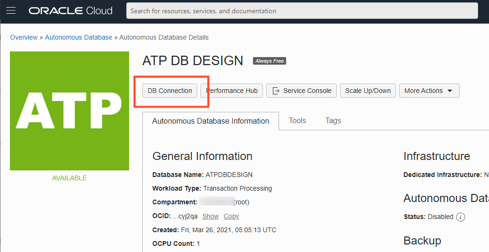

2. Ensure the wallet type is Instance Wallet and click **Download Wallet**

    

3. You will be prompted for a wallet password. Note that this is **not** related to the database password and is only required for particular types of client connections. You will not use this password in this lab, but you should still store this password in a secure place should you need it later. Click **Download** to store the wallet on your local machine, ensuring that you take note of its name and location. (You will need this file again shortly)

    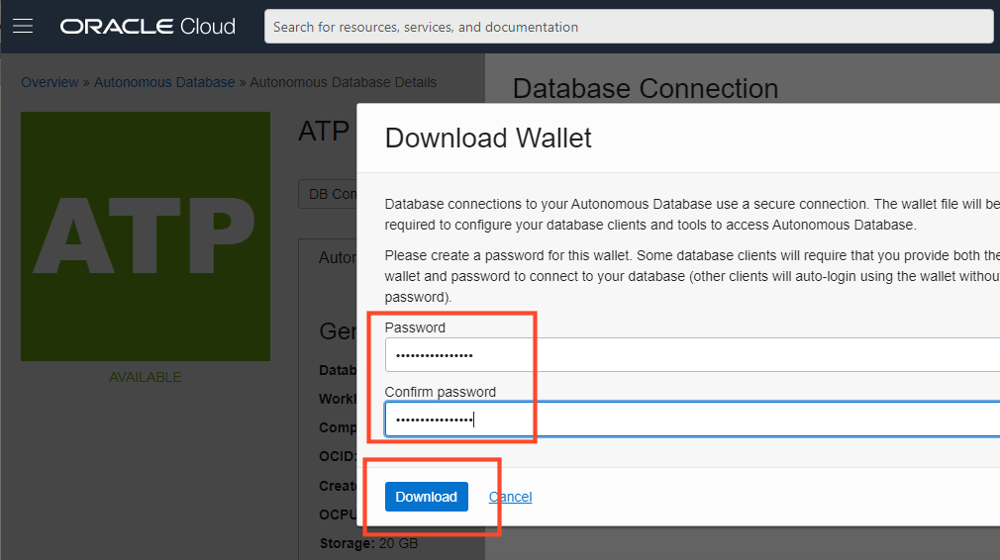

## Task 2: Launch Cloud Shell

Oracle Cloud Infrastructure Cloud (OCI) Shell is a web browser-based terminal accessible from the Oracle Cloud Console. Cloud Shell provides access to a Linux shell, with a pre-authenticated Oracle Cloud Infrastructure CLI, a pre-authenticated Ansible installation, and other useful tools for following Oracle Cloud Infrastructure service tutorials and labs.
1. In your database's details page, click the **Cloud Shell** button at the top right. The bottom portion of the browser page should initiate a cloud shell session.

    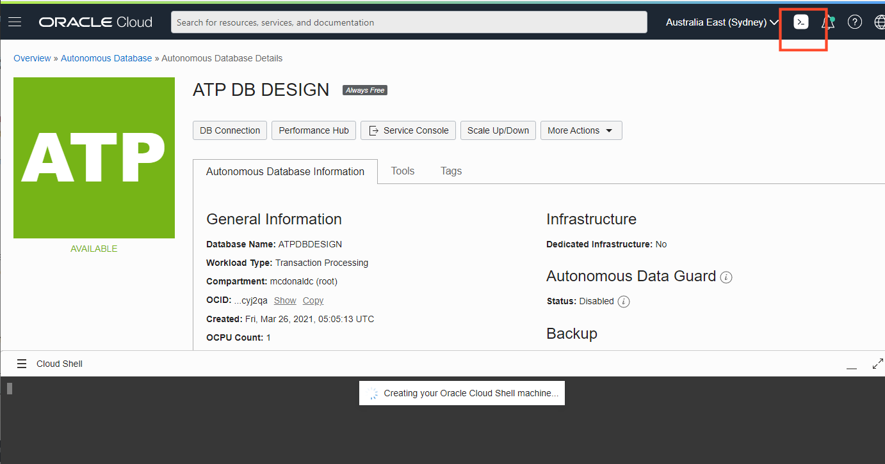

     After a few seconds, a Linux shell interface should be available. Most standard shell commands are available to you from Cloud Shell.

    


2. You will be using SQL tools from the cloud shell to create and run your performance benchmark, so you will need the database credentials you downloaded in the previous step. Click on the three line icon at the top left of the cloud shell to reveal the **File Transfer** option, and choose **Upload**.

    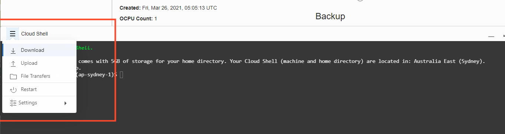

3. Drag (or click "select from your computer") the wallet file you downloaded in the previous step of this lab. Then click **Upload** to transfer the wallet file to your home directory under cloud shell.

    

4. Verify the wallet has been successfully uploaded, by listing the current directory in your cloud shell. The wallet file should be present in the home directory.

    ```
    <copy>
    ls -l
    </copy>
    ```

    

5. Verify connectivity to your autonomous database. You will use the SQLcl command line interface to set your wallet credentials and connect to the database as the ADMIN user. Press enter at the last command and at the prompt, enter your ADMIN password.

    ```
    <copy>
    sql /nolog
    set cloudconfig Wallet_ATPDBDESIGN.zip
    show tns
    connect admin@atpdbdesign_tp
    </copy>
    ```

    

6. Type `exit` to bring you out of SQL and back to the shell.

    ```
    <copy>
    exit
    </copy>
    ```

## Task 3: Create the initial schema

1. Retrieve the zip file that contains all of the supporting files for this lab.

    ```nohighlight
    <copy>
    wget https://objectstorage.us-ashburn-1.oraclecloud.com/p/VEKec7t0mGwBkJX92Jn0nMptuXIlEpJ5XJA-A6C9PymRgY2LhKbjWqHeB5rVBbaV/n/c4u04/b/livelabsfiles/o/data-management-library-files/devlivelab.zip
    unzip devlivelab.zip
    ls -l
    </copy>
    ```

    There should be a listing of numerous files suffixed with SQL and SH. *Note that that listing may be slightly different to the image below as the lab evolves over time.*

    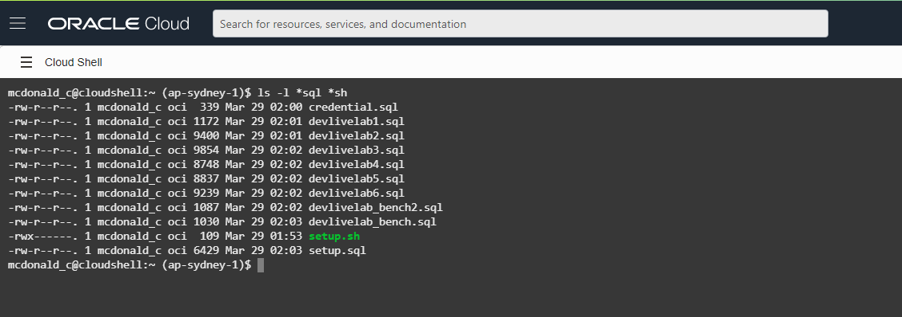

2. The file *credential.sql* is a central place where your database credentials will be stored to avoid the need to continuously re-enter them during the benchmark. Using VI, edit the file so that it reflects the password and service names for your autonomous database. *If you are following this lab "to the letter" it is likely that you do not need to make any changes at all.*

    ```
    <copy>vi credential.sql</copy>
    ```

    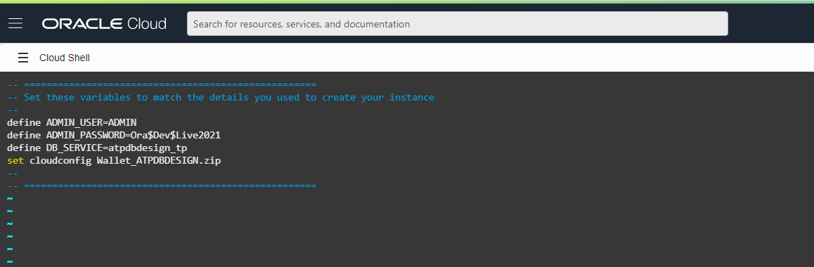

    Save your changes and you are ready to build the initial database schema. To save, type **":wq"** while in VI.

3. Run the schema setup script. This script will connect to the database and create a schema called DEVLIVE. Note that this schema will be dropped if it already exists.

    ```
    <copy>
    ./setup.sh
    </copy>
    ```

    The script will pause at various points throughout execution to let you observe the process.  Whenever you see the phrase *pause*, simply hit Enter to let the script continue running.

    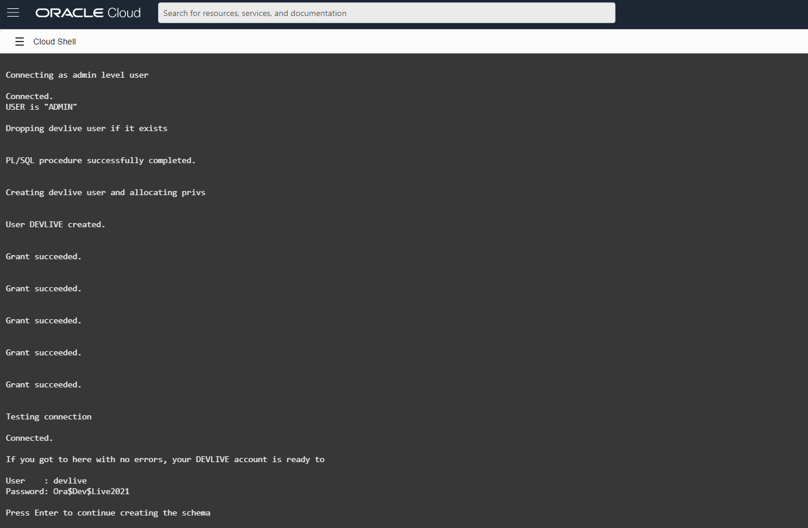


## Task 4: View the data model with Database Actions

Note: This step is not mandatory for your performance benchmark investigation, but offers a glimpse at the web based tools *other* than Cloud Shell in order to interact with your database.

Although you can connect to your autonomous database from local PC desktop tools like Oracle SQL Developer, you can conveniently access the browser-based Database Actions directly from your Autonomous Data Warehouse or Autonomous Transaction Processing console.
1. In your database's details page, click the **Tools** tab, and then in the Database Actions box, click **Open Database Actions**.

    

2. A sign in page opens for Database Actions. For this lab, simply use your database instance's default administrator account, ADMIN, with the admin password you specified when creating the database. Click **Sign in**.

    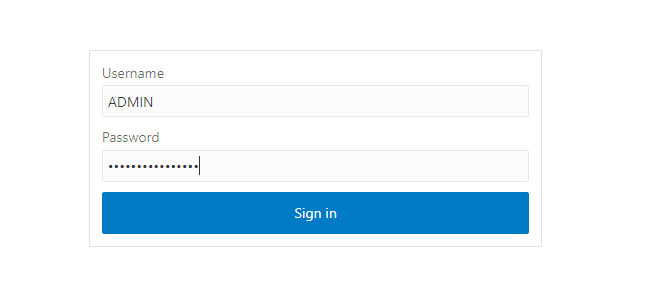

3. Database Actions opens with a launch menu with the various actions available to you on your database. Choose **Data Modeller** to launch the web based data modelling tool.

    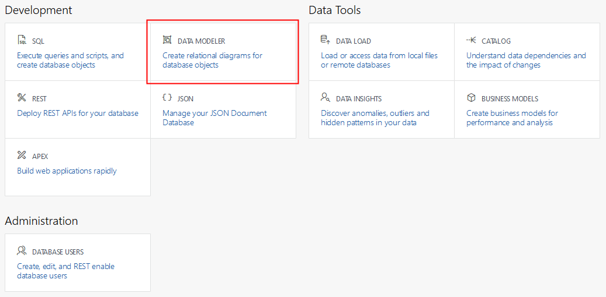

    The data modeller tool with open with a blank canvas for building your own database schema design.

    

4. Your database schema has already been built via the setup.sh command you ran earlier, so you will bring that schema into the modeller to see the relationships between the tables.  From the schema drop-down at the left, choose the **DEVLIVE** schema.

    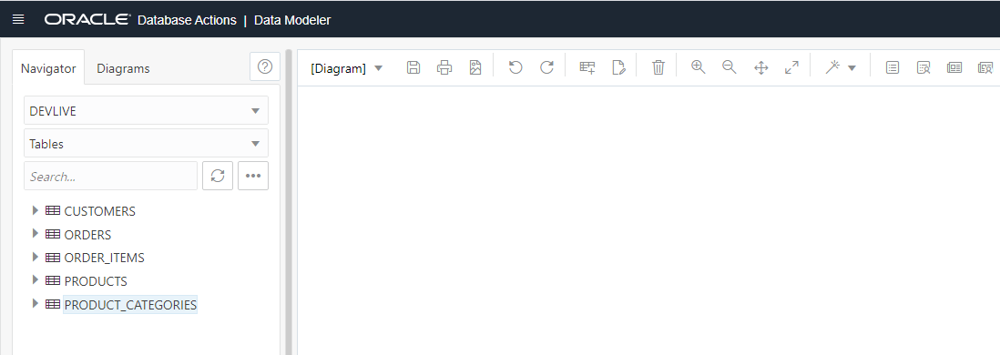

5. Right-click on the CUSTOMERS table and choose **Add object to diagram**.

    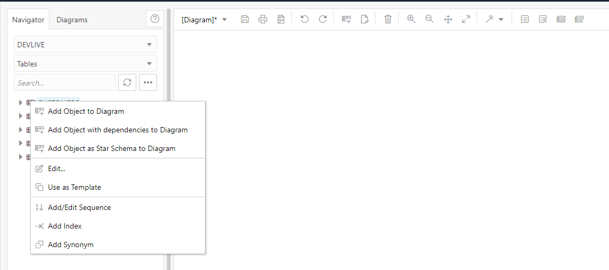

6. The CUSTOMERS table will appear on the diagram with its columns and other metadata revealed.

    

7. Perform the same for each of the remaining tables in the listing at the left. Don't worry about the display yet as many of the tables will overlap.

    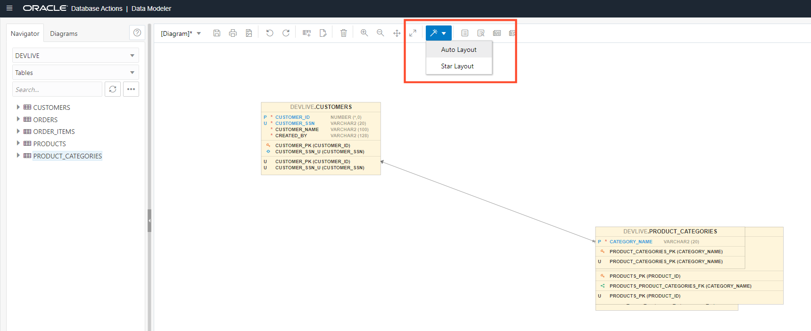

   Once all of the tables have been imported, click the **Auto-Layout** button. The tables will be re-arranged on the diagram to form a neat relationship model. You can also drag and/or resize tables on the diagram to suit your perferences.

    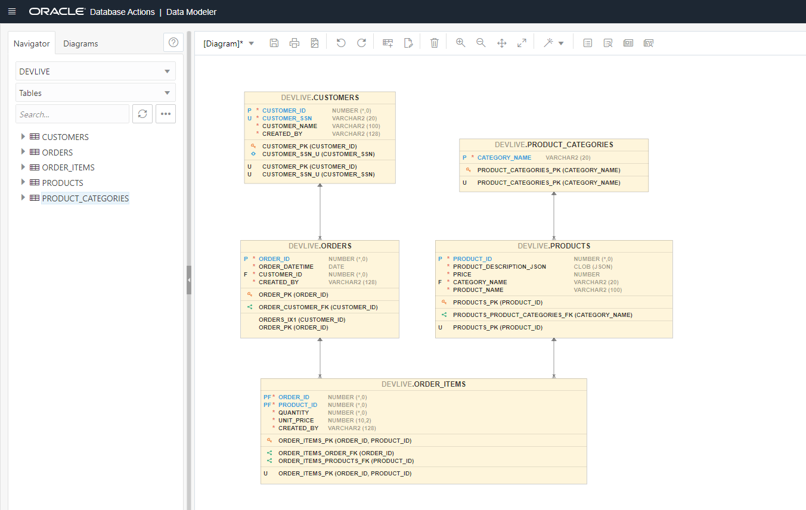

    Exit Database Modeler and Database Actions and please **proceed to the next lab.**

## Want to Learn More?

Click [here](https://docs.oracle.com/en/cloud/paas/autonomous-data-warehouse-cloud/user/sql-developer-web.html#GUID-102845D9-6855-4944-8937-5C688939610F) for documentation on connecting with the built-in Database Actions.

## Acknowledgements

- **Author** - Connor McDonald, Database Advocate
- **Last Updated By/Date** - Connor McDonald, April 2021
