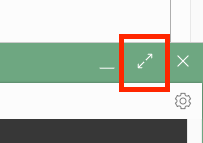
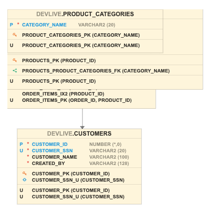

# Establish the initial schema


## Introduction

In this lab, you will connect to the database using Cloud Shell to build the initial database schema, and then you will connect to the database using Database Actions, a browser-based tool that is easily accessible from the Autonomous Data Warehouse or Autonomous Transaction Processing console, to examine the data model and the sample data.

Estimated lab time: 15 minutes

### Objectives

-   Learn how to connect to your new autonomous database using Cloud Shell and Database Actions

### Prerequisites

-   This lab requires completion of the prior labs in this workshop: **Getting Started** and **Provision an Autonomous Database**, in the Contents menu on the left.

## Task 1: Obtain Database Credentials

In order to perform a secure connection to your autonomous database, you need a database wallet which securely holds those credentials. These can be download from the console of your autonomous database.
1. In your database's details page, click the **DB Connection** button.

    

2. Ensure the wallet type is Instance Wallet and click **Download Wallet**

    

3. You will be prompted for a wallet password. Note that this is **not** related to the database password and is only required for particular types of client connections. You will not use this password in this lab, but you should still store this password in a secure place should you need it later. Click **Download** to store the wallet on your local machine, ensuring that you take note of its name and location. (You will need this file again shortly)

    

## Task 2: Launch Cloud Shell

Oracle Cloud Infrastructure Cloud (OCI) Shell is a web browser-based terminal accessible from the Oracle Cloud Console. Cloud Shell provides access to a Linux shell, with a pre-authenticated Oracle Cloud Infrastructure CLI, a pre-authenticated Ansible installation, and other useful tools for following Oracle Cloud Infrastructure service tutorials and labs.

1. In your database's details page, click the **Cloud Shell** button at the top right. The bottom portion of the browser page should initiate a cloud shell session.

    

     After a few seconds, a Linux shell interface should be available. Most standard shell commands are available to you from Cloud Shell.

    

    You can maximize and normalize the Linux shell interface by clicking on the Arrow icons on the right side of the screen (in the green header). When maximized, the output of the screen will be easier to see and follow. 

    

You can also change the font size and other attributes using the settings option.


2. You will be using SQL tools from the cloud shell to create and run your performance benchmark, so you will need the database credentials you downloaded in the previous step. Click on the gear-icon at the top right side of the cloud shell to reveal the **File Transfer** option, and choose **Upload**.

    

3. Drag (or click "select from your computer") the wallet file you downloaded in the previous step of this lab. Then click **Upload** to transfer the wallet file to your home directory under cloud shell.

    

4. Verify the wallet has been successfully uploaded, by listing the current directory in your cloud shell. The wallet file should be present in the home directory.

    ```nohighlight
    $ <copy>ls -l</copy>
    ```

    ```nohighlight
    mcdonald_c@cloudshell:~ (ap-sydney-1)$ ls -l 
    total 28
    -rw-r--r--. 1 mcdonald_c oci 26422 Sep  7 16:08 Wallet_ATPDBDESIGN.zip
    ````
 
5. Verify connectivity to your autonomous database. You will use the SQLcl command line interface to set your wallet credentials and connect to the database as the ADMIN user. Press enter at the last command and at the prompt, enter your ADMIN password.

    ```nohighlight
    <copy>sql /nolog</copy>
    ````

    Once logged in, set the configuration to use your uploaded wallet and connect to the database:

    ```nohighlight
    <copy>set cloudconfig Wallet_ATPDBDESIGN.zip
    show tns
    connect admin@atpdbdesign_tp
    </copy>
    ```

    Use the password you choose while creating the database. If you have used the default password, you can copy it here:

    ```nohighlight
    <copy>Ora$Dev$Live2021</copy>
    ```

    

6. If you have successfully logged into the database, type `exit` to leave SQLcl and return to the shell.

    ```nohighlight
    <copy>exit</copy>
    ```

## Task 3: Create the initial schema

1. Retrieve the zip file that contains all of the supporting files for this lab.

    ```nohighlight
    <copy>
    wget https://objectstorage.us-ashburn-1.oraclecloud.com/p/VEKec7t0mGwBkJX92Jn0nMptuXIlEpJ5XJA-A6C9PymRgY2LhKbjWqHeB5rVBbaV/n/c4u04/b/livelabsfiles/o/data-management-library-files/devlivelab.zip
    unzip devlivelab.zip
    ls -1

    </copy>
    ```

    There should be a listing of numerous files suffixed with SQL and SH. *Note that that listing may be slightly different to the image below as the lab evolves over time.*

    ```nohighlight
    mcdonald_c@cloudshell:~ (ap-sydney-1)$ ls -l 
    benchmark1.sh
    benchmark2.sh
    benchmark3.sh
    benchmark4.sh
    credential.sql
    devlivelab1.sql
    devlivelab2.sql
    devlivelab3.sql
    devlivelab4.sql
    devlivelab5.sql
    devlivelab6.sql
    devlivelab_bench2.sql
    devlivelab_bench.sql
    devlivelab.zip
    setup.sh
    setup.sql
    sqlp
    sql_plus
    Wallet_ATPDBDESIGN.zip
    ```

2. The file *credential.sql* is a central place where your database credentials will be stored to avoid the need to continuously re-enter them during the benchmark. Using VI, edit the file so that it reflects the password and service names for your autonomous database. *If you are following this lab "to the letter" it is likely that you do not need to make any changes at all.*

    ```nohighlight
    <copy>vi credential.sql</copy>
    ```

    ```
    -- ====================================================
    -- Set these variables to match the details you used to create your instance
    --
    define ADMIN_USER=ADMIN
    define ADMIN_PASSWORD=Ora$Dev$Live2021
    define DB_SERVICE=atpdbdesign_tp
    set cloudconfig Wallet_ATPDBDESIGN.zip
    --
    -- ====================================================
    ~                                                                                                                                                                                                                                                                                                                                                                                                                                   
    ~                                                                          
    ```

    Save your changes and you are ready to build the initial database schema. To save, type **":wq"** while in VI.

3. Run the schema setup script. This script will connect to the database and create a schema called DEVLIVE. Note that this schema will be dropped if it already exists.

    ```nohighlight
    <copy>nohighlight
    ./setup.sh
    </copy>
    ```

    ````nohighlight
    mcdonald_c@cloudshell:~ (ap-sydney-1)$ ./setup.sh
    Unzipping wallet for sqlplus usage
    Running SQLcl to create user

    SQLcl: Release 21.4 Production on Thu Sep 08 14:29:47 2022

    Copyright (c) 1982, 2022, Oracle.  All rights reserved.

    Connecting as admin level user

    Connected.
    USER is "ADMIN"

    Dropping devlive user if it exists

    PL/SQL procedure successfully completed.

    Creating devlive user and allocating privs

    User DEVLIVE created.

    Grant succeeded.

    Grant succeeded.

    Grant succeeded.

    Grant succeeded.

    Grant succeeded.

    Testing connection

    Connected.

    If you got to here with no errors, your DEVLIVE account is ready for schema generation

    User    : devlive
    Password: Ora$Dev$Live2021

    Press Enter to continue creating the schema.
    ````

    The script will pause throughout execution to let you observe the process.  Press Enter to continue.

## Task 4: View the data model with Database Actions

Note: This step is not mandatory for your performance benchmark investigation but offers a glimpse at the web-based tools *other* than Cloud Shell to interact with your database.

Although you can connect to your autonomous database from local PC desktop tools like Oracle SQL Developer, you can conveniently access the browser-based Database Actions directly from your Autonomous Data Warehouse or Autonomous Transaction Processing console.

1. In your database's details page, click the **Database Actions** button, and then in the Database Actions box, click **Open Database Actions**.

    

2. After the Database Actions have been initialised and the various actions are displayed on your screen, choose **Data Modeller** to launch the web-based data modelling tool.

    

    The data modeller tool with open with a blank canvas for building your database schema design.

    

3. Your database schema has already been built via the setup.sh command you ran earlier, so you will bring that schema into the modeller to see the relationships between the tables.  From the schema drop-down at the left, choose the **DEVLIVE** schema.

    

4. Right-click on the CUSTOMERS table and choose **Add object to diagram**.

    

5. The CUSTOMERS table will appear on the diagram with its columns and other metadata revealed.

    

6. Perform the same step for each remaining table in the listing at the left. You cannot select all tables and do the action for all tables simultaneously; it needs to be done one table at a time. Don't worry about the display, as many tables will overlap.

    

   Once all tables have been imported, click the **Auto-Layout** button. The tables will be re-arranged on the diagram to form a neat relationship model. You can also drag and resize tables on the diagram to suit your preferences.

    

    The result will look similar to this:

    

    Close the Data Modeler window, and please **proceed to the next lab.**

## Want to Learn More?

Click [here](https://docs.oracle.com/en/cloud/paas/autonomous-data-warehouse-cloud/user/sql-developer-web.html#GUID-102845D9-6855-4944-8937-5C688939610F) for documentation on connecting with the built-in Database Actions.

## Acknowledgements

- **Author** - Connor McDonald, Database Advocate
- **Last Updated By/Date** - Connor McDonald, April 2021
