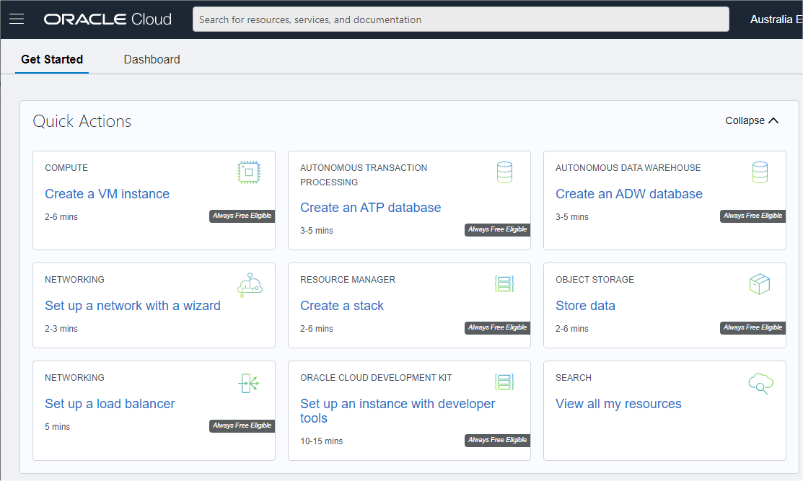
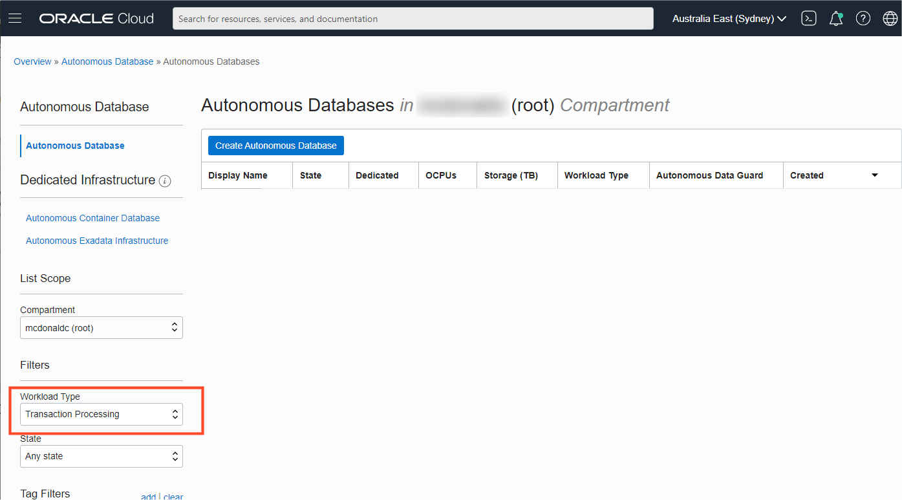
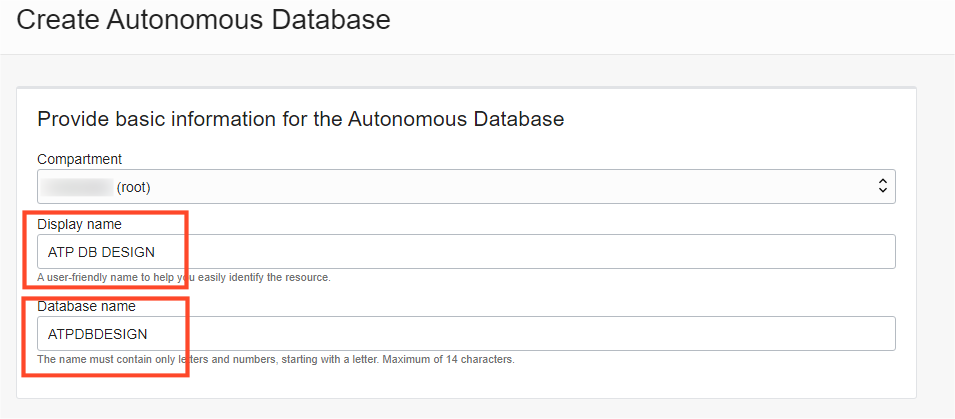
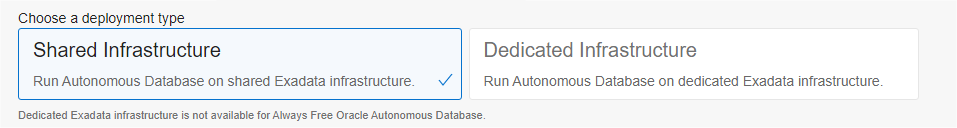
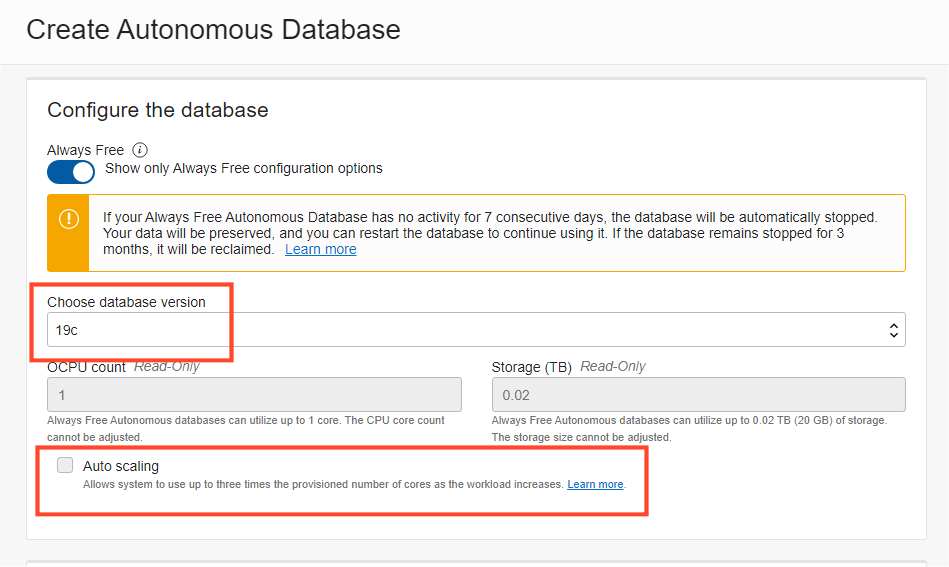
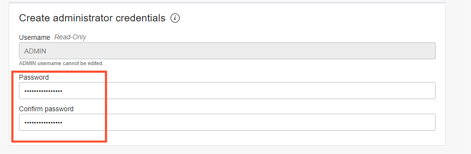
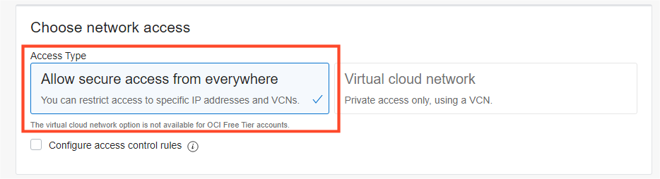
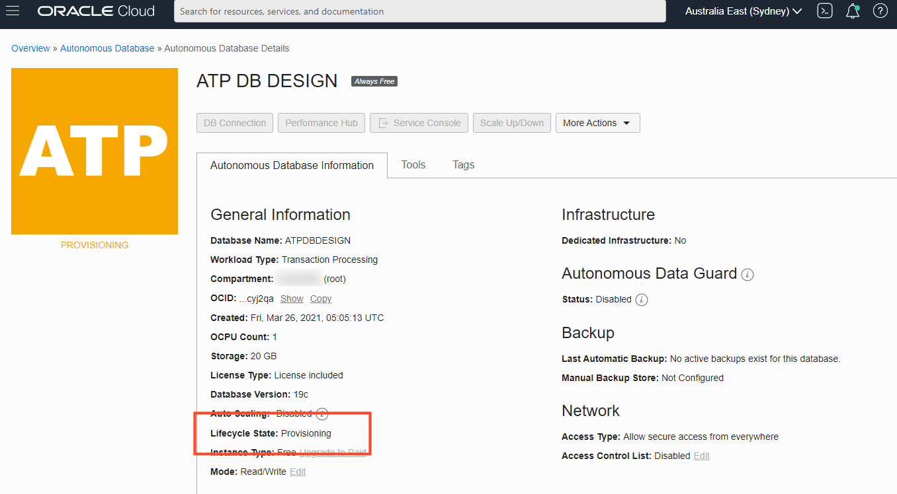

<!-- Updated March 24, 2020 -->

# Provision an Autonomous Database

## Introduction

This lab walks you through the steps to quickly provision an Oracle Autonomous Database. There are two types of Autonomous Database to match your workload type, namely, Autonomous Data Warehouse (ADW) for large scale data analytic workloads, and Autonomous Transaction Processing (ATP) for transactional-style workloads. Since this lab is focussed on using Database Design to optimize **transactional** performance, you will provision an Autonomous Transaction Processing [ATP] Database on Oracle Cloud. You will use this database in subsequent labs of this workshop.

Estimated Lab Time: 10 minutes

### Objectives

-   Provision a new Autonomous Transaction Processing [ATP] Database.

### Prerequisites

-   This lab requires completion of the **Getting Started** lab in the Contents menu on the left.  

### Video Preview

Watch a video demonstration of provisioning a new autonomous database:

*Note: While this video uses ADW, the steps are identical for creating and connecting to an ATP database.*

## Task 1: Choosing ATP from the Services Menu

1. Login to the Oracle Cloud, as shown in the previous lab.
2. Once you are logged in, you are taken to the cloud services dashboard where you can see all the services available to you. Click the navigation menu in the upper left to show top level navigation choices.

    __Note:__ You can also directly access your Autonomous Transaction Processing service in the __Quick Actions__ section of the dashboard.

    

3. The following steps apply similarly to either Autonomous Transaction Processing or Autonomous Data Warehouse. This lab shows provisioning of an Autonomous  Transaction Processing database, so click the **Navigation Menu** in the upper left, navigate to **Oracle Database**, and select **Autonomous Transaction Processing**.

	

4. Make sure your workload type is __Transaction Processing__ or __All__ to see your Autonomous Transaction Processing instances. You can use the __List Scope__ drop-down menu to select a compartment. Select your __root compartment__, or __another compartment of your choice__ where you will create your new ATP instance. If you want to create a new compartment, click <a href="https://docs.cloud.oracle.com/iaas/Content/Identity/Tasks/managingcompartments.htm#three" target="\_blank">here</a>. To learn more about compartments, click <a href="https://docs.cloud.oracle.com/en-us/iaas/Content/GSG/Concepts/settinguptenancy.htm#Setting_Up_Your_Tenancy" target="\_blank">here</a>.

 __Note__ - Avoid the use of the `ManagedCompartmentforPaaS` compartment as this is an Oracle default used for Oracle Platform Services.

5. This console shows that no databases yet exist. If there were a long list of databases, you could filter the list by the state of the databases (available, stopped, terminated, and so on). You can also sort by __Workload Type__. Here, the __Transaction Processing__ workload type is selected.

    

## Task 2: Creating the Autonomous Database Instance

1. Click **Create Autonomous Database** to start the instance creation process.

    

2.  This brings up the __Create Autonomous Database__ screen where you will specify the configuration of the instance.
3. Provide basic information for the autonomous database:

    - __Choose a compartment__ - Select a compartment for the database from the drop-down list.
    - __Display Name__ - Enter a memorable name for the database for display purposes. For this lab, use __ATP DB DESIGN__.
    - __Database Name__ - Use letters and numbers only, starting with a letter. Maximum length is 14 characters. (Underscores not initially supported.) For this lab, use __ATPDBDESIGN__.

    

4. Choose a workload type. Select the workload type for your database from the choices:

    - __Transaction Processing__ - For this lab, choose __Transaction Processing__ as the workload type.
    - __Data Warehouse__ - Data Warehouse for analytic workload types.
    - __JSON__ - for document store workload types.
    - __APEX__ - for rapid low-cod development workload types.

    

5. Choose a deployment type. Select the deployment type for your database from the choices:

    - __Shared Infrastructure__ - For this lab, choose __Shared Infrastructure__ as the deployment type.
    - __Dedicated Infrastructure__ - Alternately, you could have chosen Dedicated Infrastructure as the workload type.

    

6. Configure the database:

    - __Always Free__ - For this lab, you can select this option to create an always free autonomous database, or not select this option and create a database using your paid subscription. An always free database comes with 1 CPU and 20 GB of storage.
    - __Choose database version__ - Select a database version from the available versions.
    - __OCPU count__ - Number of CPUs for your service. For this lab, specify __2 CPUs__. Or, if you choose an always free database, it comes with 1 CPU.
    - __Storage (TB)__ - Select your storage capacity in terabytes. For this lab, specify __1 TB__ of storage. Or, if you choose an always free database, it comes with 20 GB of storage.
    - __Auto Scaling__ - For this lab, ensure auto scaling is disabled, to give a fixed allocation of resources to perform your benchmarks under the same conditions.
    - __New Database Preview__ - If a checkbox is available to preview a new database version, do __not__ select it.

    

7. Create administrator credentials:

    *Tip: If you choose to use a default password Ora$Dev$Live2021 then you will not have to make changes to scripts later in this lab.*   

    - __Password and Confirm Password__ - Specify the password for ADMIN user of the service instance. The password must meet the following requirements:
    - The password must be between 12 and 30 characters long and must include at least one uppercase letter, one lowercase letter, and one numeric character.
    - The password cannot contain the username.
    - The password cannot contain the double quote (") character.
    - The password must be different from the last 4 passwords used.
    - The password must not be the same password that is set less than 24 hours ago.
    - Re-enter the password to confirm it. Make a note of this password.

    

8. Choose network access:
    - For this lab, accept the default, "Allow secure access from everywhere".
    - If you want a private endpoint, to allow traffic only from the VCN you specify - where access to the database from all public IPs or VCNs is blocked, then select "Virtual cloud network" in the Choose network access area.
    - You can control and restrict access to your Autonomous Database by setting network access control lists (ACLs). You can select from 4 IP notation types: IP Address, CIDR Block, Virtual Cloud Network, Virtual Cloud Network OCID).

    

9. Choose a license type. For this lab, choose __License Included__. The two license types are:

    - __Bring Your Own License (BYOL)__ - Select this type when your organization has existing database licenses.
    - __License Included__ - Select this type when you want to subscribe to new database software licenses and the database cloud service.

    

10. Click __Create Autonomous Database__.

11.  Your instance will begin provisioning. In a few minutes the state will turn from Provisioning to Available. At this point, your Autonomous Data Warehouse database is ready to use! Have a look at your instance's details here including its name, database version, CPU count and storage size.

    

You may now **proceed to the next lab.**

## Want to Learn More?

Click [here](https://www.oracle.com/pls/topic/lookup?ctx=en/cloud/paas/autonomous-database&id=ADBSA-GUID-0B230036-0A05-4CA3-AF9D-97A255AE0C08) for documentation on the typical workflow for using Autonomous Transaction Processing.

## Acknowledgements

- **Author** - Connor McDonald, Database Advocate
- **Last Updated By/Date** - Connor McDonald, April 2021
