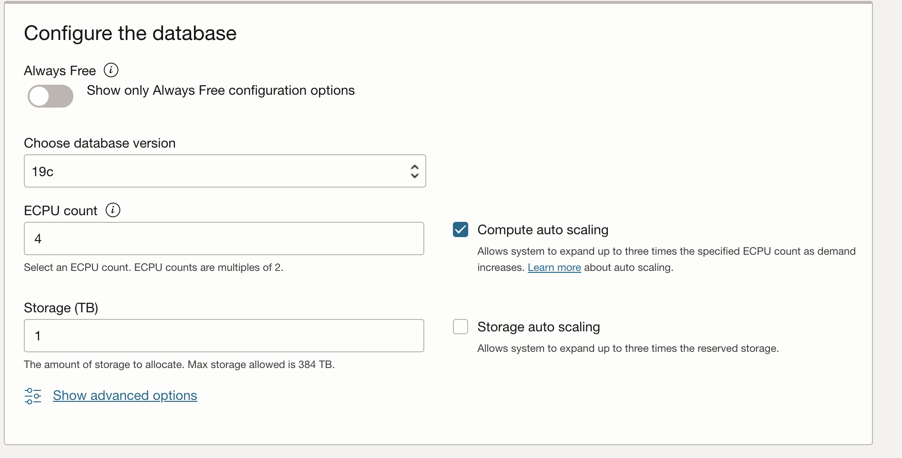

# Provision an Autonomous Database

## Introduction

This lab walks you through the steps to quickly provision an Oracle Autonomous Database. There are two types of Autonomous Databases to match your workload type: Autonomous Data Warehouse (ADW) for large-scale data analytic workloads and Autonomous Transaction Processing (ATP) for transactional-style workloads. Since this lab is focused on using Database Design to optimise **transactional** performance, you will provision an Autonomous Transaction Processing [ATP] Database on Oracle Cloud. You will use this database in subsequent labs of this workshop.

Estimated Lab Time: 10 minutes

### Objectives

-   Provision of a new Autonomous Transaction Processing [ATP] Database.

### Prerequisites

-   This lab requires completing the **Getting Started** lab in the Contents menu on the left.  

<!-- Removed because the video is outdated - 

### Video Preview>

- Watch a video demonstration of provisioning a new autonomous database:>

[](youtube:Q6hxMaAPghI)

*Note: While this video uses ADW, the steps are identical for creating and connecting to an ATP database.*

-->

## Task 1: Choosing ATP from the Services Menu

1. log in to the Oracle Cloud, as shown in the previous lab.
2. Once logged in, you are taken to the cloud services dashboard, where you can see all available services. Click the navigation menu in the upper left to show top-level navigation choices.
<if type="freetier">
	__Note:__ You can also directly access your Autonomous Transaction Processing service in the __Quick Actions__ section of the dashboard.

	
</if>

3. The following steps apply similarly to either Autonomous Transaction Processing or Autonomous Data Warehouse. This lab shows the provisioning of an Autonomous Transaction Processing database, so click the **Navigation Menu** in the upper left, navigate to **Oracle Database**, and select **Autonomous Transaction Processing**.

	

4. Use the __List scope__ drop-down menu to select a compartment. 

<if type="freetier">
	Select your __root compartment__, or __another compartment of your choice__ where you will create your new ATP instance. If you want to create a new compartment, click <a href="https://docs.cloud.oracle.com/iaas/Content/Identity/Tasks/managingcompartments.htm#three" target="\_blank">here</a>. To learn more about compartments, click <a href="https://docs.cloud.oracle.com/en-us/iaas/Content/GSG/Concepts/settinguptenancy.htm#Setting_Up_Your_Tenancy" target="\_blank">here</a>.

    __Note__ - Avoid using the `ManagedCompartmentforPaaS` compartment as this is an Oracle default used for Oracle Platform Services.
</if>
<if type="livelabs">
	A compartment has been assigned to you during the setup of your Livelabs Sandbox. 

    - You only have permission to create objects in this assigned compartment. 
    - Check your Login Info, make a note of the compartment that has been assigned
    - Use the drop-down list under __Compartment__ to select the compartment. 

    If you see the below picture with the "Forbidden" sign, you __do not have access__ to the resources required and need to check the allocated compartment:

	
</if>
5. Make sure your __Workload type__ filter is set to __Transaction Processing__ or __All__ to see your Autonomous Transaction Processing instances. 

	

6. This console shows that no databases yet exist. If there were a long list of databases, you could filter the list by the state of the databases (available, stopped, terminated, and so on). You can also sort by __Workload Type__. 

    

## Task 2: Creating the Autonomous Database Instance

1. Click **Create Autonomous Database** to start the instance creation process.

    

2.  This brings up the __Create Autonomous Database__ screen, where you will specify the instance's configuration.
3. Provide basic information for the autonomous database:

    - __Compartment__ - Make sure your compartment is displayed; if not, select it from the drop-down box.
    - __Display Name__ - Enter a memorable name for the database for display purposes. For this lab, use __ATP-DB-DESIGN__.
<if type="freetier">
    - __Database Name__ - Use letters and numbers only, starting with a letter. The maximum length is 14 characters. (Underscores not initially supported.) For this lab, use __ATPDBDESIGN__.
</if>
<if type="livelabs">
    - __Database Name__ - Enter a memorable name for the database. Use letters and numbers only, starting with a letter. The maximum length is 14 characters. (Underscores not initially supported.). In our examples, we use ATPDBDESIGN. __Do not use this name__ as it will already exist in the Livelabs tenancies (and needs to be unique for your tenancy).
</if>

    

4. Choose a workload type. Make sure the Select the workload type for your database from the choices:

    - __Transaction Processing__ - For this lab, make sure __Transaction Processing__ has been selected.

    

5. Choose a deployment type. Select the deployment type for your database from the choices:

    - __Shared Infrastructure__ - For this lab, choose __Shared Infrastructure__ as the deployment type.

    

6. Configure the database:

<if type="freetier">
    - __Always Free__ - For this lab, you can select this option to create an always free autonomous database, or not choose this option and create a database using your paid subscription. An always-free database comes with 1 CPU and 20 GB of storage.
</if>
<if type="livelabs">
    - __Always Free__ - If visible, do not select this option.
</if>
    - __Choose database version__ - Select a database version 19c from the available versions.
<if type="freetier">
    - __OCPU count__ - Number of CPUs for your service. For this lab, specify __2 CPUs__. Or, if you choose an always-free database, it comes with 1 CPU.
</if>
<if type="livelabs">
    - __OCPU count__ - Number of CPUs for your service. For this lab, specify __2 CPUs__.
</if>
    - __Storage (TB)__ - Select your storage capacity in terabytes. If you select a storage size, specify __1 TB__ of storage.
    - __OCPU Auto Scaling__ - For this lab, ensure auto-scaling is disabled to give a fixed allocation of resources to perform your benchmarks under the same conditions.
    - __Storage auto Scaling__ - For this lab, ensure auto-scaling of storage is disabled.
    - __New Database Preview__ - If a checkbox is available to preview a new database version, do __not__ select it.

    

7. Create administrator credentials:

    *Tip: If you choose to use a default password __Ora$Dev$Live2021__ then you will not have to make changes to scripts later in this lab.* 

    ```nohighlight
    <copy>Ora$Dev$Live2021</copy>
    ```

    - __Password and Confirm Password__ - Specify the password for the ADMIN user of the service instance. The password must meet the following requirements:
    - The password must be between 12 and 30 characters long and include at least one uppercase letter, one lowercase letter, and one numeric character.
    - The password cannot contain the username.
    - The password cannot contain the double quote (") character.
    - The password must be different from the last four passwords used.
    - The password must not be the same one set less than 24 hours ago.
    - Re-enter the password to confirm it. Make a note of this password.

    


8. Choose network access:
    - For this lab, accept the default, "Allow secure access from everywhere".
    - If you want to allow access from the internet but want to restrict access to specified IP addresses and VCNs, you can specify "Secure access from allowed IPs and VCNs only".
    - If you want a private endpoint to allow traffic only from the VCN you specify - where access to the database from all public IPs or VCNs is blocked, select "Virtual cloud network" in the Choose network access area.


    

9. Choose a license type. 

    The two license types are:

    - __Bring Your Own License (BYOL)__ - Select this type when your organisation has existing database licenses.
    - __License Included__ - Select this type when you want to subscribe to new database software licenses and the database cloud service.

<if type="freetier">
    For this lab, choose __License Included__. 

    
</if>
<if type="livelabs">
    For this lab, choose __Bring Your Own License__ and __Oracle Database Enterprise Edition__ as this is an Oracle-supplied environment. 

    
</if>

10. Click __Create Autonomous Database__.

11.  Your instance will begin provisioning. In a few minutes, the state will turn from Provisioning to Available. At this point, your Autonomous Data Warehouse database is ready to use! Please look at your instance's details, including its name, database version, CPU count and storage size.

    

You may now **proceed to the next lab.**

## Want to Learn More?

Click [here](https://www.oracle.com/pls/topic/lookup?ctx=en/cloud/paas/autonomous-database&id=ADBSA-GUID-0B230036-0A05-4CA3-AF9D-97A255AE0C08) for documentation on the typical workflow for using Autonomous Transaction Processing.

## Acknowledgements

- **Author** - Connor McDonald, Database Advocate
- **Last Updated By/Date** - Robert Pastijn, September 2022
