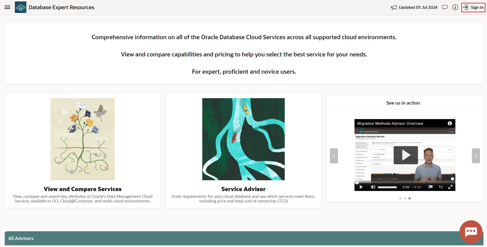
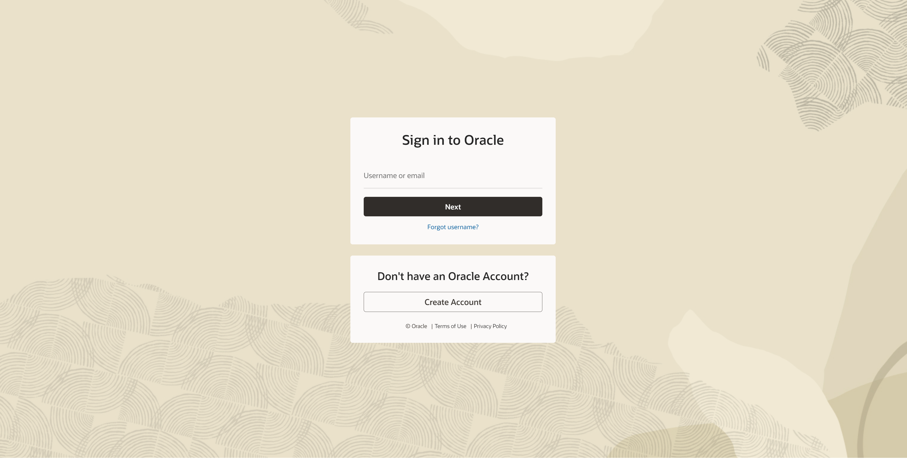

# Get started

## Introduction

[DBExpert](www.oracle.com/dbexpert) is an evergreen online tool suite to accelerate migrations and new Oracle Database Cloud Services deployments. 

Oracle Cloud is the industry's broadest and most integrated cloud provider, with deployment options ranging from the public cloud to your data center.

**Estimated Time: 2 minutes**

### **Objectives**

- Learn how to navigate DBExpert website
- Learn how to login via Oracle SSO for more features (optional) 

### **Prerequisites**
- Web Browser
- Oracle email & password (optional)

## Task 1: Navigate to DBExpert website

1. Open a web browser (e.g. [Chrome](https://www.google.com/chrome/browser-tools/) and/or [Firefox](https://www.mozilla.org/en-US/firefox/all/))

2. Navigate to [https://www.oracle.com/dbexpert](https://www.oracle.com/dbexpert)

    

## Task 2: Login for more features (optional)

1. On the homepage, click on the login button in the top right

    

2. Sign in with Oracle email and password

    

You may now **proceed to the next lab**.

## Acknowledgements
* **Author** - , 
* **Contributors** -  
* **Last Updated By/Date** - , 
