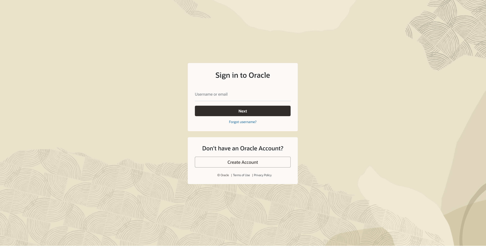
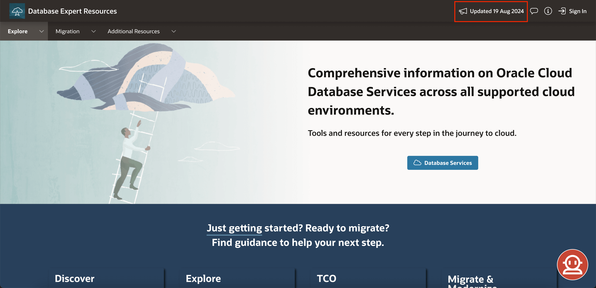
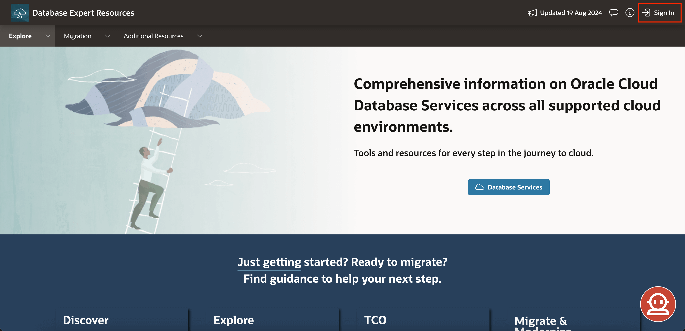
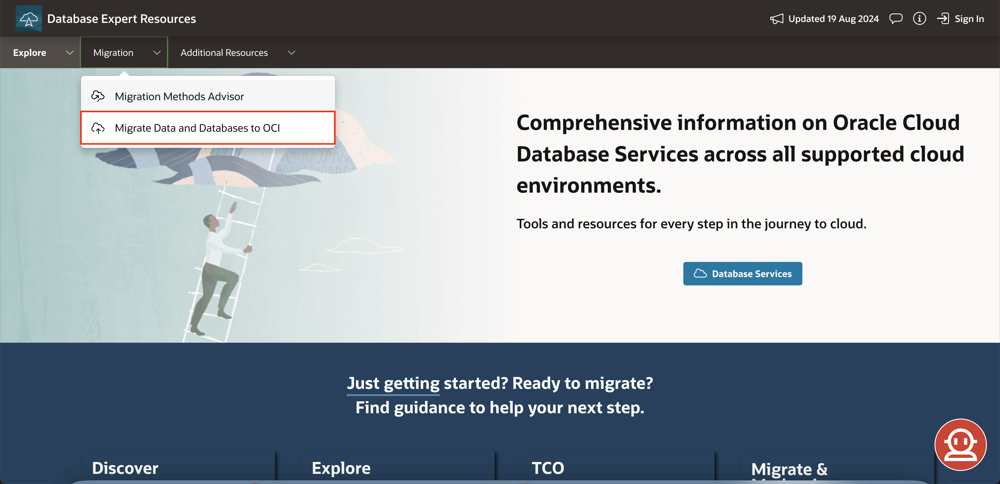
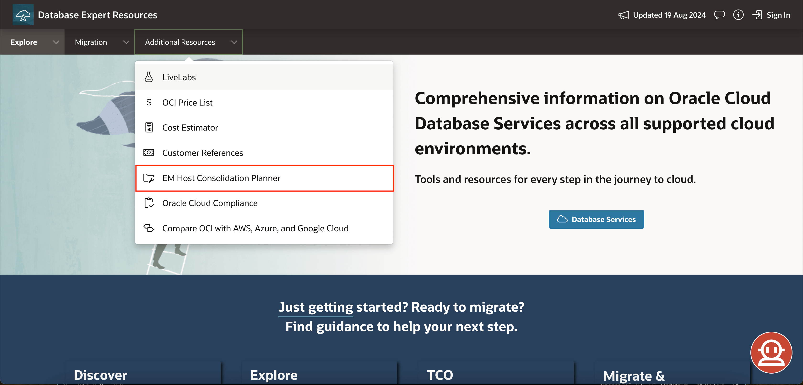
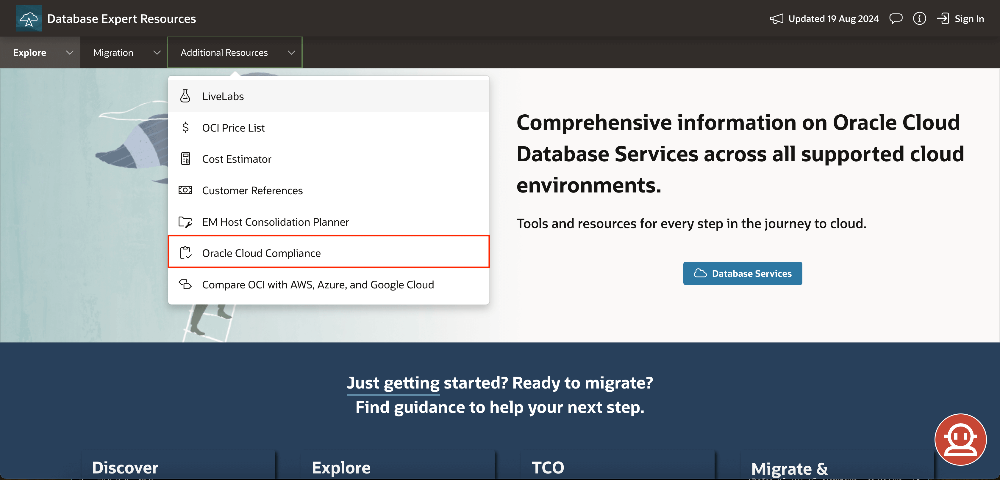
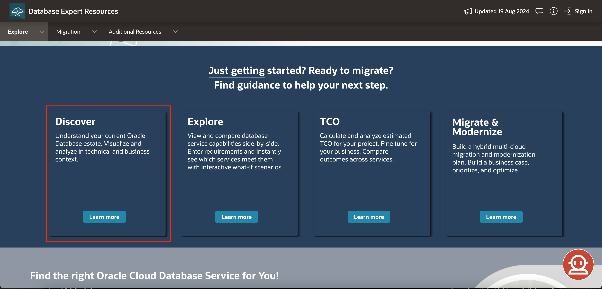
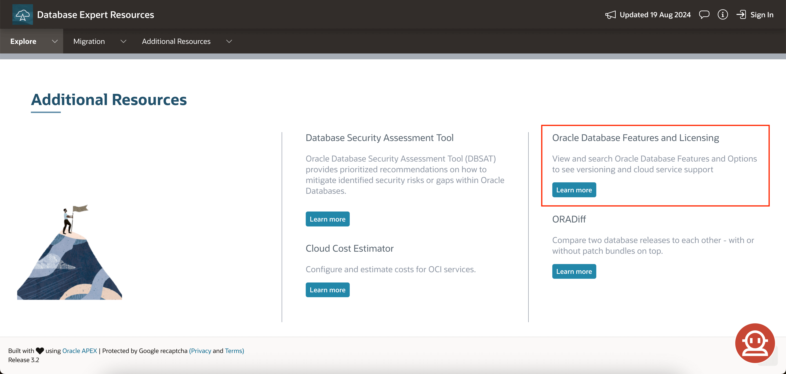
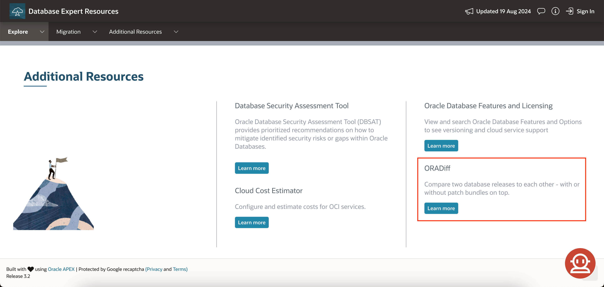

# Getting Started

## Introduction

[DBExpert](https://apexadb.oracle.com/ords/r/dbexpert/dbsn/home) is a suite of tools to accelerate migrations and new Oracle Cloud Database Services deployments.

**Estimated Time: 2 minutes**

### **Objectives**

- Learn how to navigate DBExpert website
- Overview of DBExpert
- Walkthrough the homepage
- Learn how to login via Oracle SSO for more features (optional) 

### **Prerequisites**
- Web Browser
- Oracle account (optional)

## Task 1: Navigate to DBExpert website

1. Open a web browser (e.g. [Chrome](https://www.google.com/chrome/browser-tools/) and/or [Firefox](https://www.mozilla.org/en-US/firefox/all/))

2. Navigate to [https://www.oracle.com/dbexpert](https://apexadb.oracle.com/ords/r/dbexpert/dbsn/home)

    

## Task 2: Overview of DBExpert

### Oracle DBExpert – an AI-powered expert resource web application ###

Oracle offers a comprehensive portfolio of database services, available to deploy in Oracle Cloud Infrastructure, in your location with Cloud@Customer, and in multi-cloud environments such as Oracle Database@Azure.   Choosing the best solution for your new deployment or migration project may involve many business and technical considerations, and collecting and evaluating all the information you need is not always a simple task.

As with many undertakings, the first step is often the hardest.  Where to start?  To assist you in taking the first step with a structured and guided discovery and evaluation process, our team created [DBExpert](https://apexadb.oracle.com/ords/r/dbexpert/dbsn/home), providing up-to-date, curated information covering Oracle's Database Management cloud services offerings.

The site’s main tools include:
- **Information Viewers** - quickly explore Oracle cloud service and database capabilities
- **Advisors** - enter your requirements and instantly see recommendations and estimated pricing
- **Downloadable tools** - analyze and report on your current Oracle estate
- **REST API endpoints** - information retrieval and exercise the advisors

The information viewers facilitate browsing and searching, while the advisors are user-driven interfaces that take inputs in pre-defined formats, such as select lists, radio buttons, and checkboxes, and provide appropriate guidance. These user experiences greatly simplify the process of selecting a service and deployment model.

## Task 3: Login for more features (Optional)

1. List of features 

    | Anonymous (no login) | General User Login | Oracle Employee Login |
    | -------- | --------- |  --------- |
    | Can use any tool                        | Can use any tool                  | Can use any tool  |
    | Access to most information              | Access to all information         | Access to all information  |
    | Session-based project (transient)       | Save projects (permanent)         | Save projects (permanent)  |
    |                                         | Share projects                    | Share projects |
    |                                         | Access to compliance data (email) | Compliance information enabled in Advisors |
    |                                         |                                   | 3rd party ISV certifications in Advisors |
    

2. On the homepage, click on the login button in the top right

    

3. Sign in with your Oracle account (or create an account if you don't have one!)

    

You may now **proceed to the next lab**.

## Appendix 1: DBExpert homepage walkthrough

Take our [homepage](https://www.oracle.com/dbexpert) for a spin or see below for a guided tour!

### **Webpage Header**
**Updates:** 
See what’s new with the DBExpert Toolsuite. Check out the Announcements Log or browse the Directory if you're looking for something specific.

**Feedback:** 
Let us know how your experience with Database Expert Resources was - your feedback helps us keep improving!

**About:** 
Visit our homepage to discover Oracle Cloud Database Services across different cloud environments.

**Sign In:** 
Use your Oracle email and password, or create an account if you don't have one yet.

---

### **Navigation Bar**
**Explore**
- **About:** Visit our homepage to explore Oracle Cloud Database Services across various cloud environments.

- **Compare DB Services:** Compare the key features of up to three services. Learn more in [Lab 1: View and Compare Services Tool](../../workshops/tenancy/index.html?lab=view-and-compare).

- **DB Features, Packs, and Options:** Get details on versioning and cloud service support.

- **Services Taxonomy:** Understand service groupings and SKU(s) for easy identification.

- **REST APIs for Service Details and Advisor:** Developers and PMs can access a single source of truth with these APIs. Keep up with changes via DBExpert Announcements.

**Migration**
- **Migration Methods Advisor:** Find the best migration methods for your needs and scale to the cloud. Discover more in [Lab 4: Migration Method Advisor](../../workshops/tenancy/index.html?lab=migration-advisor).

- **Migrate Data and Databases to OCI:** Everything you need for migrating Oracle Databases to OCI — from strategies to planning guides.

**Additional Resources**
- **LiveLabs:**  Dive into Oracle’s cutting-edge tools and technologies with hands-on labs and workshops covering a wide range of topics.

- **OCI Price List:** Keep your budget in check. View detailed pricing for vCPU, OCPU, and other compute-based products to avoid overpaying for services.

- **Cost Estimator:** Plan and predict your cloud costs with precision using the OCI Cost Estimator.

- **Customer References:** Discover how our customers are thriving with Oracle Cloud through their success stories.

- **EM Host Consolidation Planner:** Efficiently match managed sources to their ideal destinations for seamless consolidation.

- **Oracle Cloud Compliance:** Ensure your cloud deployments meet industry standards. Access third-party certifications, attestations, and advisories to assist in meeting your legal and regulatory compliance needs.

- **Compare OCI with AWS, Azure, and Google Cloud:** Simplify your migration process with a high-level comparison of services across cloud providers.

---

### **Landing Page**
Check out all cloud services and environments, or access [oracle.com/database](http://oracle.com/database) through the link in Database Services.

---

### **Value Areas**
**Discover:** 
Analyze your Oracle Database estate, explore TCO alternatives, and uncover migration possibilities with Oracle Estate Explorer.

**Explore:** 
Compare up to three services, ask questions in natural language, find the best Oracle Cloud Database services for you, and manage your projects.

**TCO:** 
Calculate estimated TCO for your project and compare different options.

**Migrate & Modernize:** 
Discover tools for a tailored hybrid multi-cloud migration and modernization plan.

---

### **Service Advisor Banner**
Use the banner to enter your basic requirements and click “See Recommendations” to access the Service Advisor tool. Learn how to use it in [Lab 3: Service Advisor](../../workshops/tenancy/index.html?lab=service-advisor).

---

### **Explore**
- **View and Compare:** Select and compare services to find the best fit for you. Learn more in [Lab 1: View and Compare Services Tool](../../workshops/tenancy/index.html?lab=view-and-compare).

- **Ask DBExpert:** Ask anything about Oracle Database Cloud services using natural language.

- **Service Advisor:** Map your needs to the right service for your business. Learn more in [Lab 3: Service Advisor](../../workshops/tenancy/index.html?lab=service-advisor).

- **Manage Projects:** Sign in to save, edit, and share your projects with Oracle credentials.

---

### **TCO Banner**
Enter your requirements, compare TCO across services, and download a summary. Sign in to save and revisit your project later.

---

### **Oracle Estate Explorer**
Get to know more about the OEE tool, build a business case, and optimize your Cloud Migration. Download slides and master it with [Lab 5: Oracle Estate Explorer](../../workshops/tenancy/index.html?lab=oracle-estate-explorer).

---

### **Migrate and Modernize**
- **Oracle Estate Explorer:** Access the OEE main page and get additional information. Learn more [Lab 5: Oracle Estate Explorer](../../workshops/tenancy/index.html?lab=oracle-estate-explorer).

- **Migration Methods Advisor:** Enter basic details about your source and destination databases to find the best cloud migration methods. Learn more in [Lab 4: Migration Method Advisor](../../workshops/tenancy/index.html?lab=migration-advisor).

- **Zero Downtime Migration:** Find solutions for migrating Oracle Databases to Oracle-owned infrastructure with minimal downtime.

- **OCI Database Migration:** Simplify migration with advanced orchestration and automation using an easy, low-cost tool.

---

### **Migration Advisor Banner**
Use the banner to set the source and destination for migration to the cloud and find the methods that suit your situation best.

---

### **Additional Resources**
- **Database Security Assessment Tool:** Get security risk mitigation recommendations.

- **Cloud Cost Estimator:** Estimate costs for OCI services.

- **Oracle Database Features and Licensing:** Explore database features and licensing options, including versions and cloud support.

- **ORADiff:** Compare database releases, with or without patch bundles.

---