## Header
### **Updates:** 
See what’s new with the DBExpert Toolsuite. Check out the Announcements Log or browse the Directory if you're looking for something specific.

### **Feedback:** 
Let us know how your experience with Database Expert Resources was - your feedback helps us keep improving!
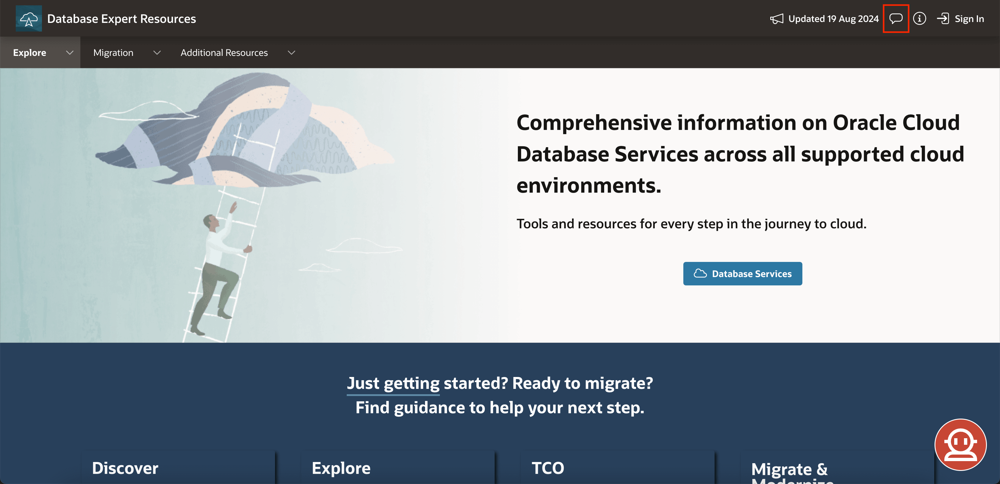

### **About:** 
Visit our homepage to discover Oracle Cloud Database Services across different cloud environments.

### **Sign In:** 
Use your Oracle email and password, or create an account if you don't have one yet.

---

## Navigation Bar
### **Explore**
- **About:** Visit our homepage to explore Oracle Cloud Database Services across various cloud environments.

- **Compare DB Services:** Compare the key features of up to three services. Learn more in [Lab 1: View and Compare Services Tool](https://oracle-dbexpert.github.io/database/db-expert-tool-suite/workshops/tenancy/index.html?lab=view-and-compare).

- **DB Features, Packs, and Options:** Get details on versioning and cloud service support.

- **Services Taxonomy:** Understand service groupings and SKU(s) for easy identification.
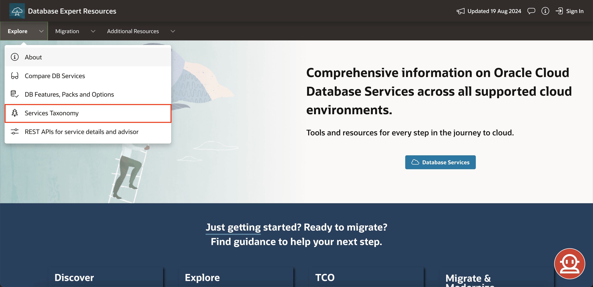

- **REST APIs for Service Details and Advisor:** Developers and PMs can access a single source of truth with these APIs. Keep up with changes via DBExpert Announcements.

### **Migration**
- **Migration Methods Advisor:** Find the best migration methods for your needs and scale to the cloud. Discover more in [Lab 4: Migration Method Advisor](https://oracle-dbexpert.github.io/database/db-expert-tool-suite/workshops/tenancy/index.html?lab=migration-advisor).

- **Migrate Data and Databases to OCI:** Everything you need for migrating Oracle Databases to OCI — from strategies to planning guides.

### **Additional Resources**
- **LiveLabs:**  Dive into Oracle’s cutting-edge tools and technologies with hands-on labs and workshops covering a wide range of topics.

- **OCI Price List:** Keep your budget in check. View detailed pricing for vCPU, OCPU, and other compute-based products to avoid overpaying for services.
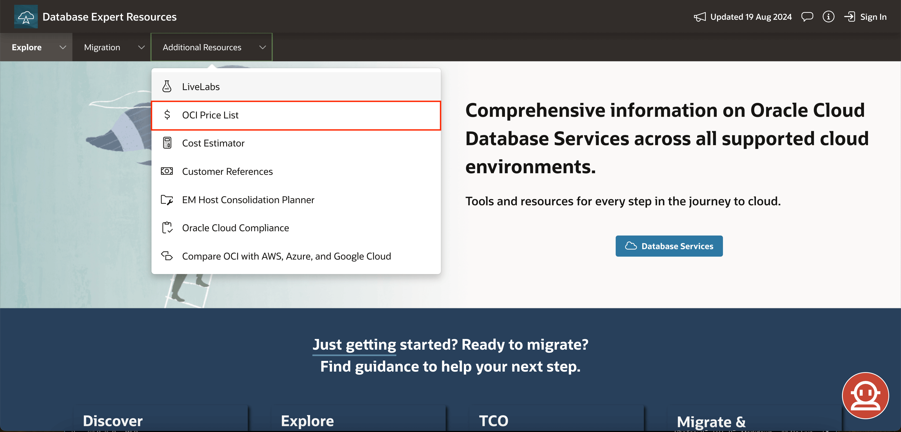

- **Cost Estimator:** Plan and predict your cloud costs with precision using the OCI Cost Estimator.
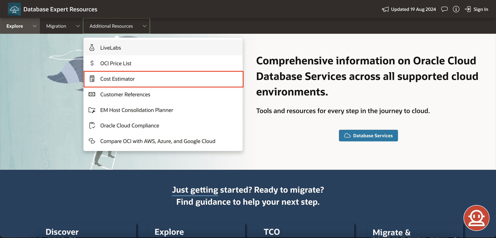

- **Customer References:** Discover how our customers are thriving with Oracle Cloud through their success stories.

- **EM Host Consolidation Planner:** Efficiently match managed sources to their ideal destinations for seamless consolidation.

- **Oracle Cloud Compliance:** Ensure your cloud deployments meet industry standards. Access third-party certifications, attestations, and advisories to assist in meeting your legal and regulatory compliance needs.

- **Compare OCI with AWS, Azure, and Google Cloud:** Simplify your migration process with a high-level comparison of services across cloud providers.
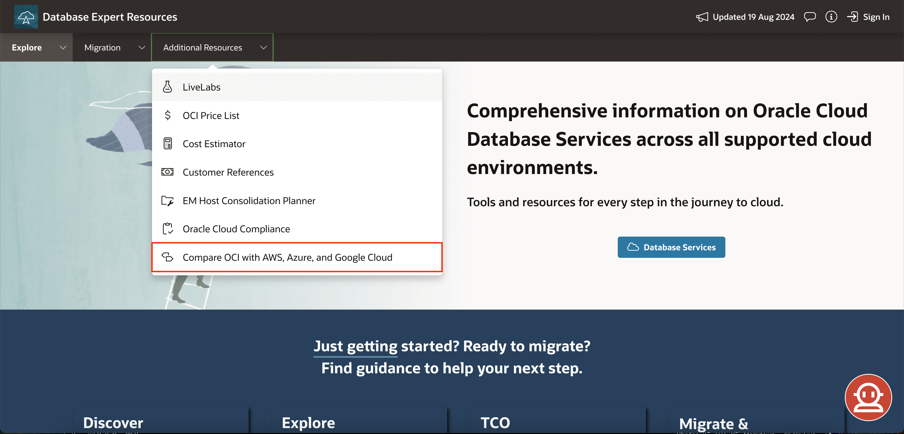

---

## Landing Page
Check out all cloud services and environments, or access [oracle.com/database](http://oracle.com/database) through the link in Database Services.
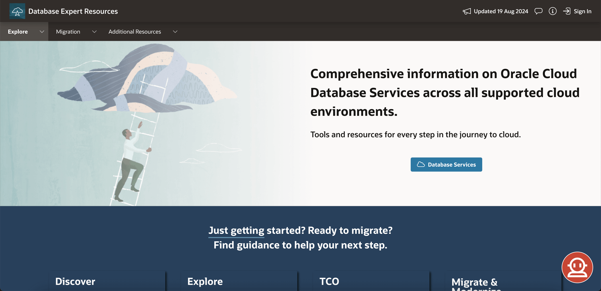

---

## Value Areas
### **Discover:** 
Analyze your Oracle Database estate, explore TCO alternatives, and uncover migration possibilities with Oracle Estate Explorer.

### **Explore:** 
Compare up to three services, ask questions in natural language, find the best Oracle Cloud Database services for you, and manage your projects.
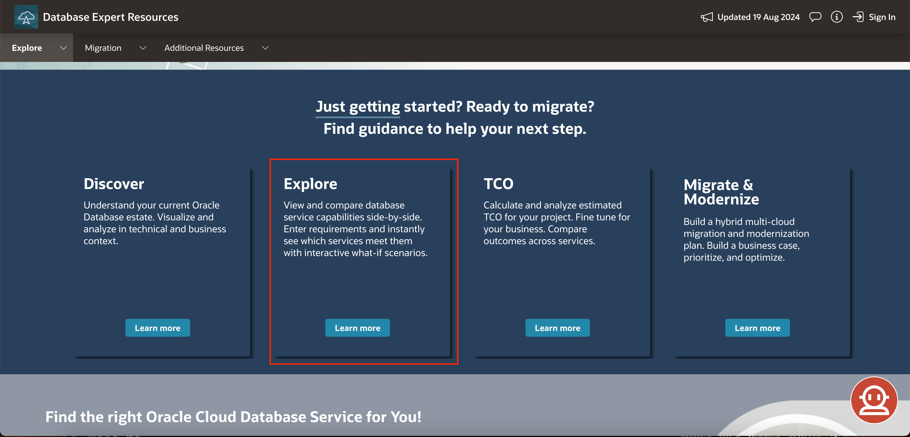

### **TCO:** 
Calculate estimated TCO for your project and compare different options.
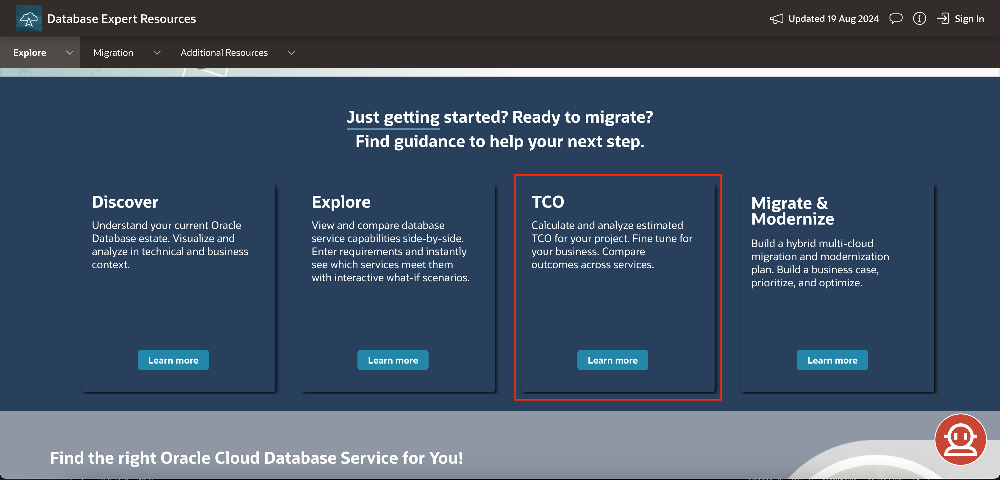

### **Migrate & Modernize:** 
Discover tools for a tailored hybrid multi-cloud migration and modernization plan.
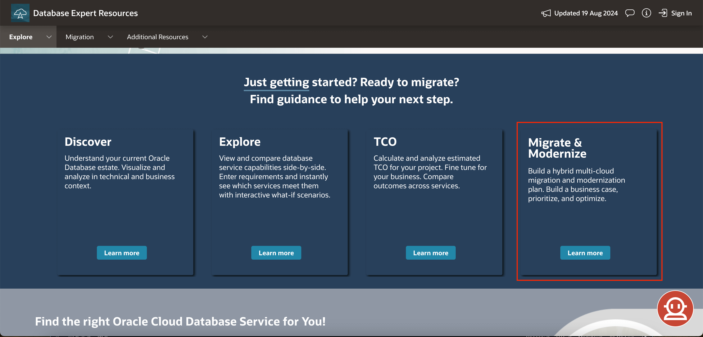

---

## Service Advisor Banner
Use the banner to enter your basic requirements and click “See Recommendations” to access the Service Advisor tool. Learn how to use it in [Lab 3: Service Advisor](https://oracle-dbexpert.github.io/database/db-expert-tool-suite/workshops/tenancy/index.html?lab=service-advisor).

---

## Explore
- **View and Compare:** Select and compare services to find the best fit for you. Learn more in [Lab 1: View and Compare Services Tool](https://oracle-dbexpert.github.io/database/db-expert-tool-suite/workshops/tenancy/index.html?lab=view-and-compare).
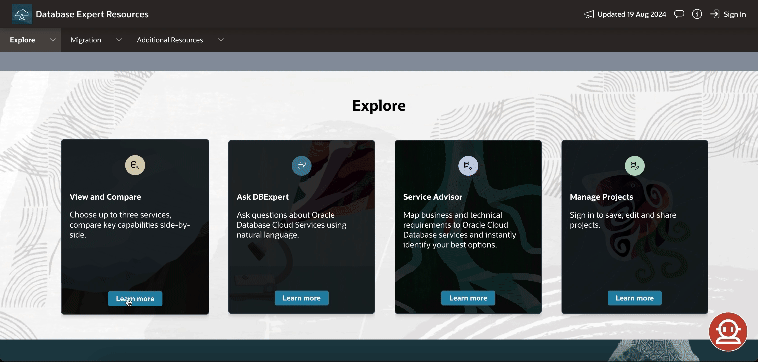

- **Ask DBExpert:** Ask anything about Oracle Database Cloud services using natural language.

- **Service Advisor:** Map your needs to the right service for your business. Learn more in [Lab 3: Service Advisor](https://oracle-dbexpert.github.io/database/db-expert-tool-suite/workshops/tenancy/index.html?lab=service-advisor).

- **Manage Projects:** Sign in to save, edit, and share your projects with Oracle credentials.
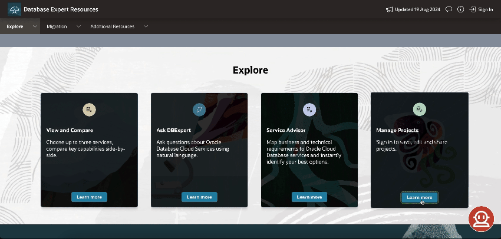

---

## TCO Banner
Enter your requirements, compare TCO across services, and download a summary. Sign in to save and revisit your project later.

---

## Oracle Estate Explorer
Get to know more about the OEE tool, build a business case, and optimize your Cloud Migration. Download slides and master it with [Lab 5: Oracle Estate Explorer](https://oracle-dbexpert.github.io/database/db-expert-tool-suite/workshops/tenancy/index.html?lab=oracle-estate-explorer).
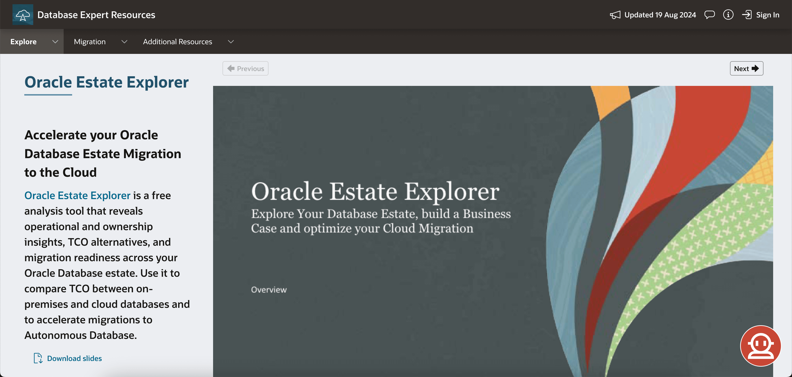

---

# Migrate and Modernize
- **Oracle Estate Explorer:** Access the OEE main page and get additional information. Learn more [Lab 5: Oracle Estate Explorer](https://oracle-dbexpert.github.io/database/db-expert-tool-suite/workshops/tenancy/index.html?lab=oracle-estate-explorer).

- **Migration Methods Advisor:** Enter basic details about your source and destination databases to find the best cloud migration methods. Learn more in [Lab 4: Migration Method Advisor](https://oracle-dbexpert.github.io/database/db-expert-tool-suite/workshops/tenancy/index.html?lab=migration-advisor).

- **Zero Downtime Migration:** Find solutions for migrating Oracle Databases to Oracle-owned infrastructure with minimal downtime.
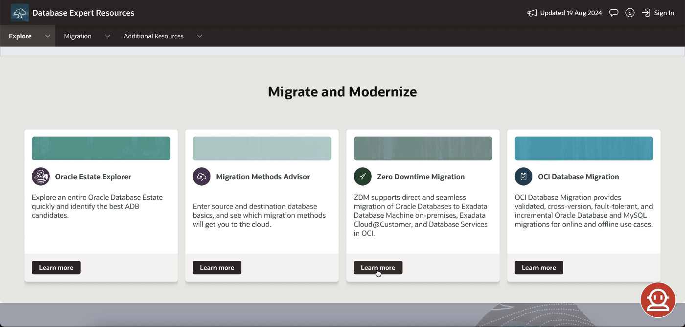

- **OCI Database Migration:** Simplify migration with advanced orchestration and automation using an easy, low-cost tool.
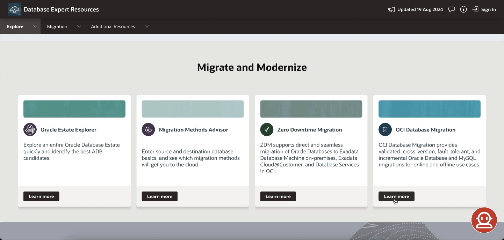

---

## Migration Advisor Banner
Use the banner to set the source and destination for migration to the cloud and find the methods that suit your situation best.

---

## Additional Resources
- **Database Security Assessment Tool:** Get security risk mitigation recommendations.
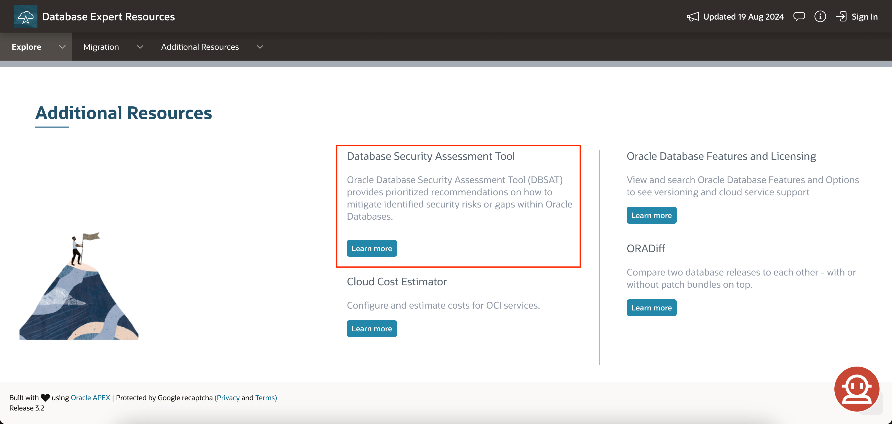

- **Cloud Cost Estimator:** Estimate costs for OCI services.
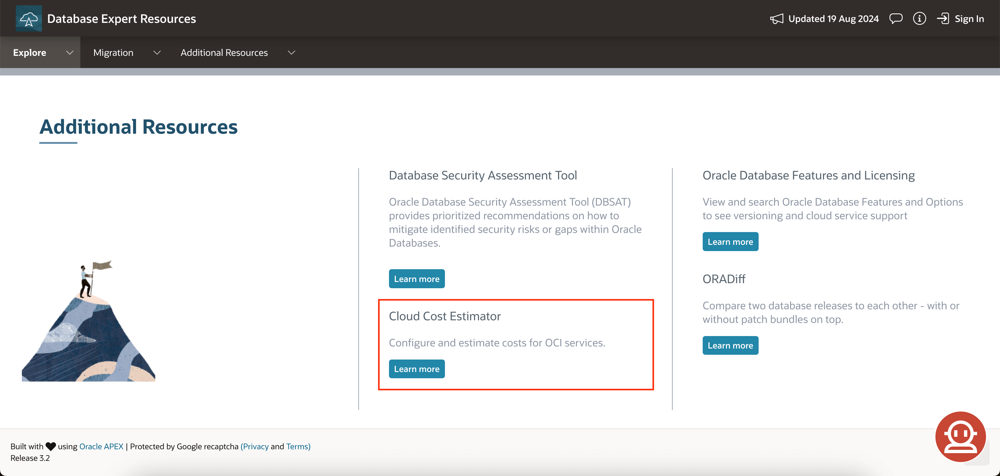

- **Oracle Database Features and Licensing:** Explore database features and licensing options, including versions and cloud support.

- **ORADiff:** Compare database releases, with or without patch bundles.

---