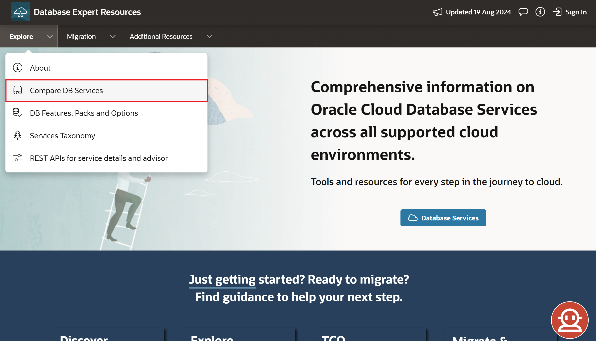
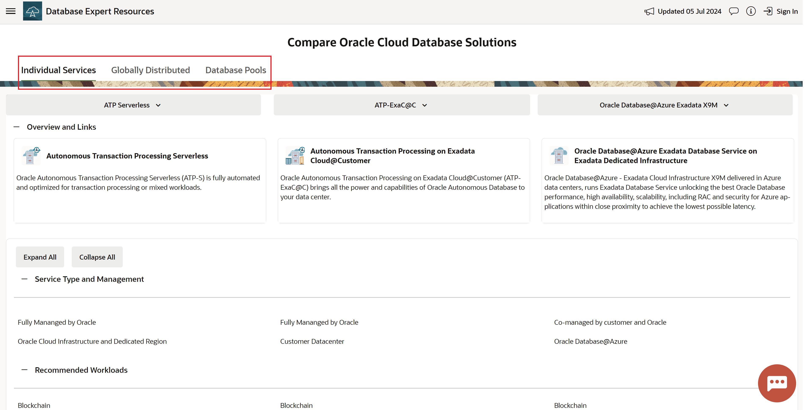
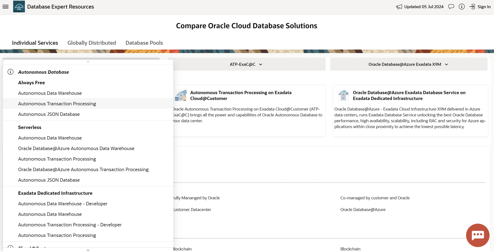
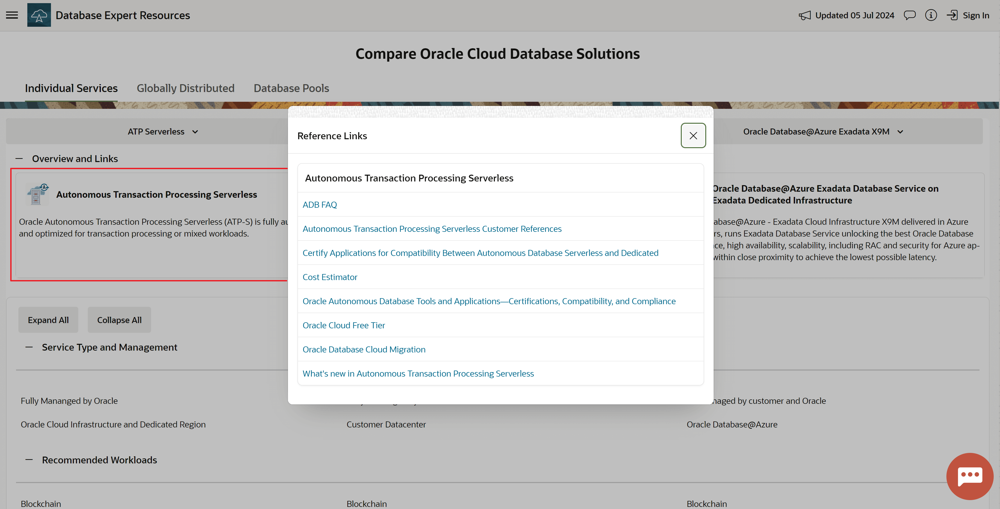
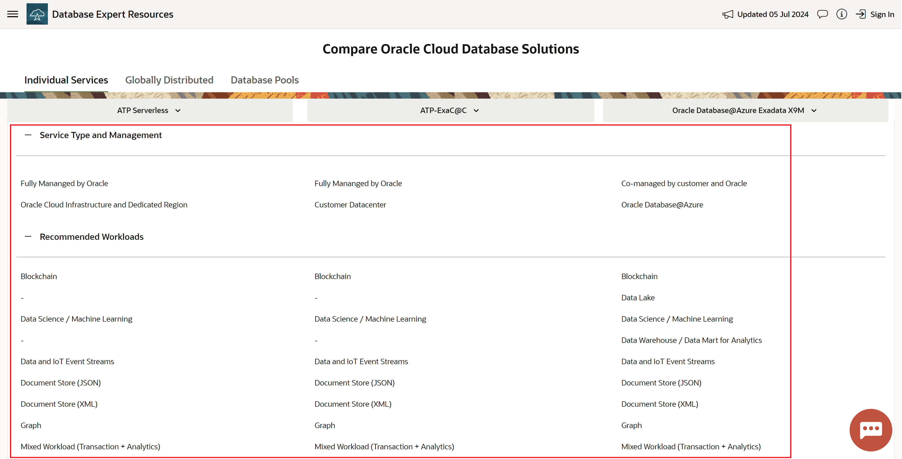

# Lab 1: View and Compare Services Tool

## Introduction

This lab walks you through how to use DBExpert's [View and Compare Services Tool](https://apexadb.oracle.com/ords/r/dbexpert/dbsn/compare-solutions). 

Our tool guides customers through Oracle’s Database service offerings and highlights key service information in a digestible way.

**Estimated Time: 5 minutes**

### **Objectives**

In this lab, you will:
* Easily compare Oracle Cloud database products to one another.
* Experience how the tool focuses on providing deep contextual information.
* Dive deep into feature comparisons (Workloads, Applications, and Capacity).

## Task 1: Navigate the View and Compare Services Tool

1. Navigate to [https://apexadb.oracle.com/ords/r/dbexpert/dbsn/compare-solutions](https://apexadb.oracle.com/ords/r/dbexpert/dbsn/compare-solutions) or click **Explore** then **Compare DB Services** on the navigation bar. 

    

## Task 2: Take the tool for a Test drive

  1. Determine the deployment type
    * **Single Database:** database hosted in single server or cluster
    * **Globally Distributed:** database distributed across regions, with each region hosting either a shard of the database or fully active (multi-write) instantiation
    * **Resource Pool:** multiple databases participate in a shared pool
  2. Select a deployment type by using the tabs on the top-left of the page (default: Individual Services)

      

  3. Choose 3 services to compare

    * At the top of the page, there are 3 Oracle services pre-selected: **ATP – Serverless**, **ATP-ExaC@C**, and **Oracle Database@Azure Exadata X9M** side-by-side, each with short descriptions of the service. 
    
      
    
    * Utilizing the dropdowns, any Oracle database services can be selected and compared to one another.
    
      
    
    * For more information about a specific service, the user can click on the card for a detailed list of resources.

      

  4. Scroll down to compare 9 key categories between the 3 selected services

    1. Service Type and Management
    2. Recommended Workloads
    3. Oracle Applications
    4. Oracle Database Options
    5. Database Versions
    6. Database Availability
    7. Capacity
    8. Available Added Capabilities
    9. Additional Features

    

You may now **proceed to the next lab**.
    
## Learn More

* [View & Compare OCI Data Management Services Overview (Video)](https://videohub.oracle.com/media/1_5a9man1g "View & Compare OCI Data Management Services Overview (Video)")
