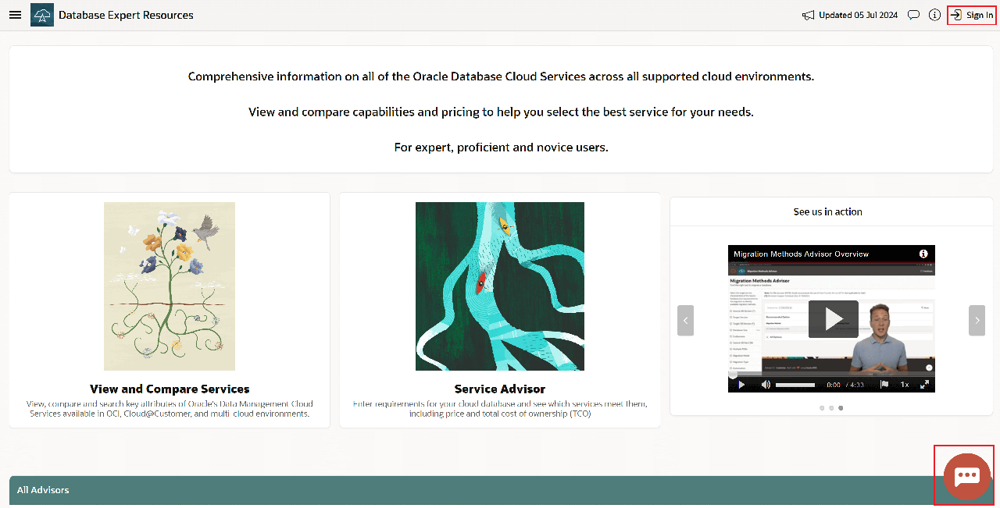
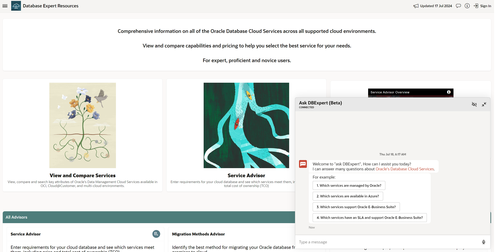
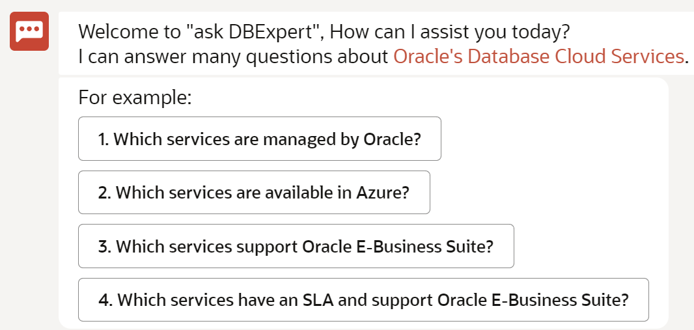
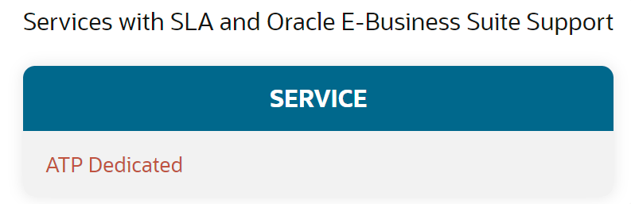
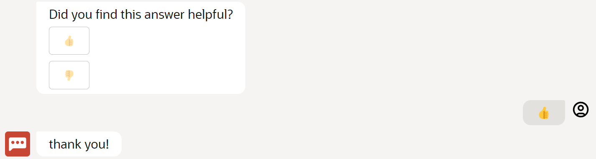
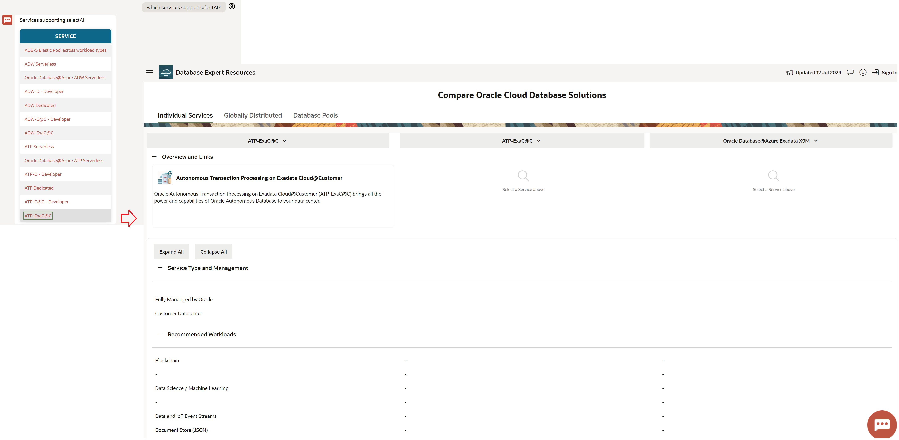
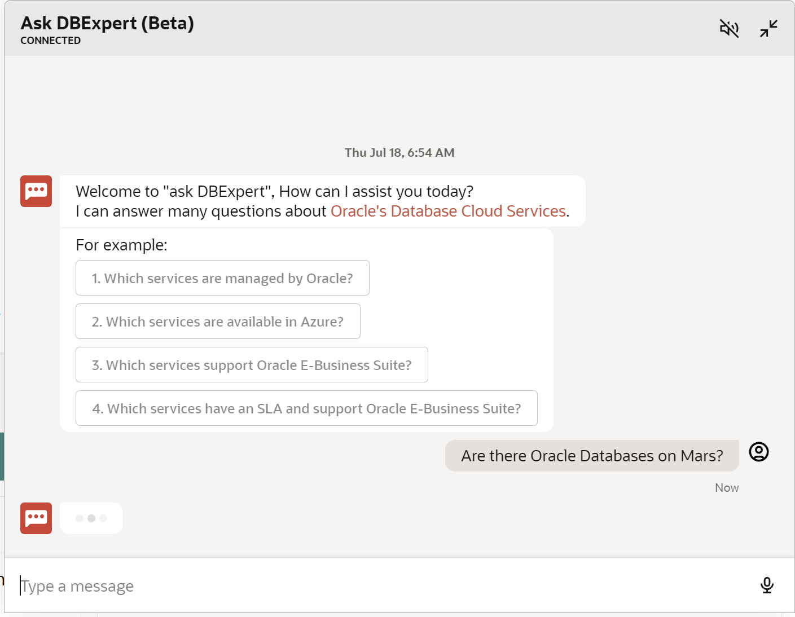

# Lab 2: Ask DBExpert - AI-Powered Digital Assistant

## Introduction

This lab walks you through how to use DBExpert's [Ask DBExpert - AI-Powered Digital Assistant](https://apexadb.oracle.com/ords/r/dbexpert/dbsn/home). 

Learn how users can ask complex questions about the Oracle Cloud Services using a natural language interface.
**Estimated Time: 5 minutes**

### **Objectives**

In this lab, you will:
* View a demonstration of Ask DBExpert
* Ask DBExpert questions

## Task 1: Navigate the Homepage

1. Navigate to [https://www.oracle.com/dbexpert](https://apexadb.oracle.com/ords/r/dbexpert/dbsn/home) and click on the red button on the bottom right 

    

2. Ask DBExpert is now ready for use

    

## Task 2: Demonstration of DBExpert

- 

1. Above we can see once Ask DBExpert is opened, it is easy to get started with the provided prompts

  

2. In the demo, the user selects `4. Which services have an SLA and support Oracle E-Business Suite?` and Ask DBExpert provides the answer (as of July 2024)

  

3. The user then selects a thumbs up because they believed the answer was satisfactory, this feedback helps improve the service

  

4. Ask DBExpert supports freeform natural language Q&A as well

  

5. The answers provides by Ask DBExpert link to more details

  

## Task 3: Ask DBExpert!

1. Ask DBExpert anything about Oracle Database Services! :)

  

## Learn More

* [View & Compare OCI Data Management Services Overview (Video)](https://videohub.oracle.com/media/1_5a9man1g)

## Acknowledgements
* **Author** - , 
* **Contributors** -  
* **Last Updated By/Date** - , 
