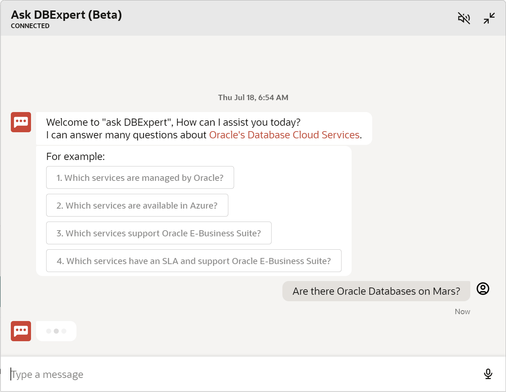

# Lab 2: Ask DBExpert - AI-Powered Digital Assistant

## Introduction

This lab walks you through how to use DBExpert's [Ask DBExpert - AI-Powered Digital Assistant](https://apexadb.oracle.com/ords/r/dbexpert/dbsn/home). 

Learn how users can ask complex questions about Oracle Cloud Database Services using a natural language interface.

**Estimated Time: 5 minutes**

### **Objectives**

In this lab, you will:
* View a demonstration of Ask DBExpert
* Ask DBExpert questions

## Task 1: Navigate to the homepage

1. Navigate to [https://www.oracle.com/dbexpert](https://apexadb.oracle.com/ords/r/dbexpert/dbsn/home) and click on the red button on the bottom right 

    

2. Ask DBExpert is now ready for use

    

## Task 2: Demonstration of Ask DBExpert

- 

1. Above we can see once Ask DBExpert is opened, it is easy to get started with the provided prompts

  

2. In the demo, the user selects `4. Which services have an SLA and support Oracle E-Business Suite?` and Ask DBExpert provides the answer (as of July 2024)

  

3. The user then selects a thumbs up because they believed the answer was satisfactory, this feedback helps improve the service

  

4. Ask DBExpert supports freeform natural language Q&A as well

  

5. The answers provides by Ask DBExpert link to more details

  

## Task 3: Ask DBExpert!

1. Ask DBExpert anything about Oracle Database Services! :)

  

You may now **proceed to the next lab**.

## Learn More
### Blogs
* [How DBExpert Quickly Learned to Talk using AI (and your app can too)](https://blogs.oracle.com/datawarehousing/post/how-dbexpert-quickly-learned-to-talk-using-ai-and-your-app-can-too)
