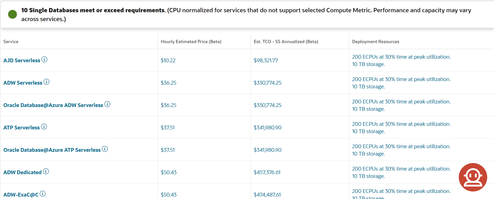
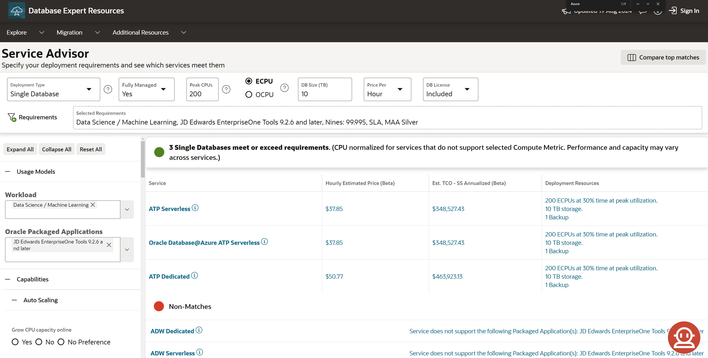

# Lab 3: Service Advisor
## Introduction

This lab walks you through how to use DBExpert's Service Advisor! 

Find the right Oracle Cloud Database Service for Your Needs!
* Enter a few basic requirements to get started
* Review recommendations, add and change business and technical requirements, explore what-if scenarios
* Compare prices and TCO, then download associated reports

**Estimated Time: 15 minutes**

### **Objectives**

In this lab, you will:
* Test drive how quick and easily it is to match requirements to database services
* Learn the anatomy of the Service Advisor, review recommendations, and explore what-if scenario
* Dive deep into TCO and download your TCO Summary

## Task 1: Provide the Service Advisor with basic requirements 

1. Navigate to [https://www.oracle.com/dbexpert](https://apexadb.oracle.com/ords/r/dbexpert/dbsn/home) and scroll down to the Service Advisor section
2. Fill in your basic requirements. In the example below, we are looking for a database service:
      1. That is used for data science / machine learning workloads
      2. That is fully managed by Oracle
      3. With 200 CPU and 10 TB capacity

    

## Task 2: Learn the Service Advisor's anatomy

1. In the image above, we can see that the Service Advisor is comprised of 3 main sections:
    1. In **green**, the header sections presents the user with the most commonly changed requirements and capacity options. Additional selected requirements (from section 2) are displayed for reference.
    2. In **yellow**, the side bar contains an additional 52+ requirements to choose from split into 3 different sections. To navigate them all, click the **Expand All** button.
    <!---->
    
    3. In **blue**, is the section where all the magic happens.
        * The first table displays rows of recommended matches based on the requirements that were selected, it looks like we have 10! 
        * Each column is clickable and provides in-depth information about the service when selected (we will dive deeper into this later).
        
        * To find non-matching services, superseded services, and their conflicts, scroll down.
        
 
## Task 3: Master the Service Advisor!

  1. Now that we are familiar with the Service Advisor, let's add all of our requirements and see what matches.
  2. Let's select these additional requirements from the side bar:
      * JD Edwards EnterpriseOne Tools 9.2.6 and later
      * 99.995%
      * SLA for the Database
      * MAA Silver
  3. Hit **Recalculate** button in the top right for the results!
    
  4. In the image below, there are 3 database services that match our requirements.
    
  5. Let's take a closer look at what each of the columns does for each respective service:
    * The **Service** column displays the name of the service and when clicked opens a modal with additional information (service summary, migration methods advisor integration (see [lab 4](../../workshops/tenancy/?lab=migration-advisor) for more details), and links).
    
    * The **[Hourly, Daily, Monthly, Yearly] Estimated Price (Beta)** column provides the price list pricing and when clicked opens a modal with service specific configurations & BoM details.
    * The **Deployment Resource** column summarizes the deployment details of the service and when clicked opens a modal with service specific configurations & BoM details.
    
    * The **Est. TCO - SS Annualized (Beta)** column provides an estimated TCO value per year based on 7 categories and when clicked opens a modal where the user can compare TCO between 3 services, edit 10 assumptions, and download a **TCO Summary**. Be sure check out the value of [Oracle Support Rewards](https://www.oracle.com/cloud/rewards/)!
     

You may now **proceed to the next lab**.

## Learn More

* [Service Advisor Overview (Video)](https://videohub.oracle.com/media/1_0klpfez6 "Service Advisor Overview (Video)")
