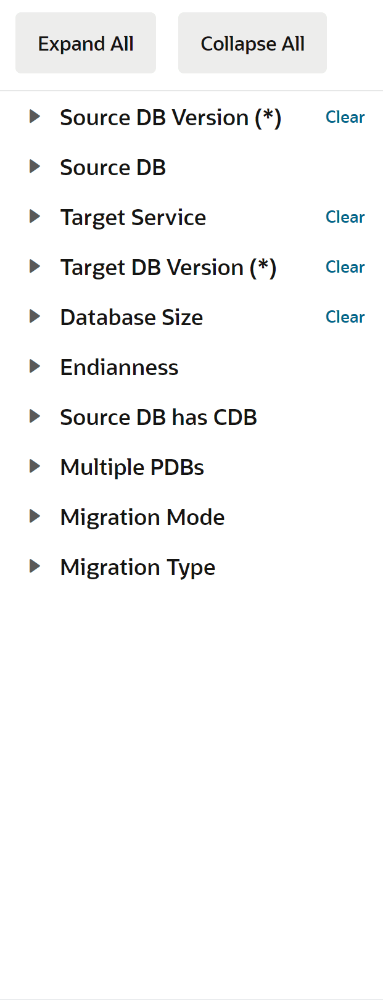

# Lab 4: Migration Method Advisor

## Introduction

Are you ready to migrate your on-premises Oracle Database to the cloud?

This lab walks you through how to use DBExpert's [Migration Methods Advisor](https://apexadb.oracle.com/ords/r/dbexpert/migration-methods/home).

**Estimated Time: 2 minutes**

### **Objectives**

In this lab, you will:
* Identify your options to migrate to Oracle Cloud or Oracle Database@Azure.

## Task 1: Provide the Migration Methods Advisor with source and target information 

1. Navigate to [https://www.oracle.com/dbexpert](https://apexadb.oracle.com/ords/r/dbexpert/dbsn/home) and scroll down to the Migration Methods Advisor section
2. Fill in your source and target. In the example below, we are migrating:
      * From: Oracle Version 12.2.0.1 & 20 TB
      * To: Autonomous Database Serverless & Oracle Version 19c 
3. With some basic information, the Migration Methods Advisor was able to provide 3 Automated Methods and 2 Manual Methods.
    
4. To refine your search add more information to the side bar!
    
    
## Learn More

* [View & Compare OCI Data Management Services Overview (Video)](https://videohub.oracle.com/media/1_5a9man1g)

## Acknowledgements
* **Author** - , 
* **Contributors** -  
* **Last Updated By/Date** - , 
