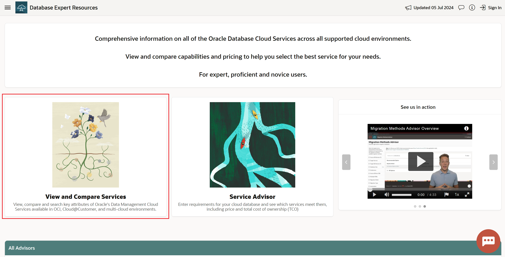

# Lab 5: Oracle Estate Explorer (Download)

## Introduction

Migrate an entire estate with [Oracle Estate Explorer](https://www.oracle.com/database/cloud-migration/estate-explorer/). 

Estate Explorer provides estate analysis, scores database readiness for Autonomous Database migrations, prioritizes least-effort database migrations, suggests remediation for premigration tasks, and provides TCO comparisons for target OCI Database environments.

**Estimated Time: 5 minutes**

### **Objectives**

In this lab, you will:
* Navigate to the Oracle Estate Explorer website
* Learn more about Oracle Estate Explorer at Oracle Cloud World or Online

## Task 1: Navigate to the Oracle Estate Explorer website and download the tool

1. Navigate to [https://apexadb.oracle.com/ords/r/dbexpert/dbsn/compare-solutions](https://apexadb.oracle.com/ords/r/dbexpert/dbsn/compare-solutions) or click on the **View and Compare Services** card 

    

## Task 2: Take the tool for a Test drive

## Learn More

* [View & Compare OCI Data Management Services Overview (Video)](https://videohub.oracle.com/media/1_5a9man1g)

## Acknowledgements
* **Author** - , 
* **Contributors** -  
* **Last Updated By/Date** - , 
