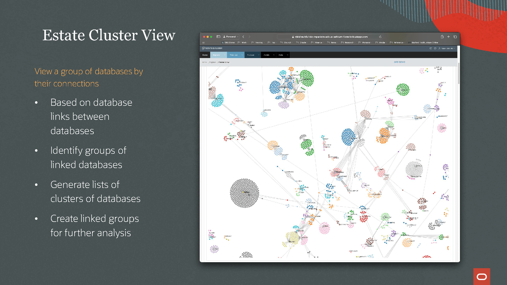

# Lab 5: Oracle Estate Explorer

## Introduction

### Accelerate your Oracle Database Estate Migration to the Cloud

[Oracle Estate Explorer](https://www.oracle.com/database/cloud-migration/estate-explorer/) is a free analysis tool that reveals operational and ownership insights, TCO alternatives, and migration readiness across your Oracle Database estate. Use it to compare TCO between on-premises and cloud databases and to accelerate migrations to Autonomous Database.

**Estimated Time: 10 minutes**

### **Objectives**

In this lab, you will:
* Learn about Oracle Estate Explorer's via presentation
* Dive deeper into Oracle Estate Explorer @ Oracle Database World or Online

## Task 1: Learn about Oracle Estate Explorer's via presentation

<a href="../../db-tutorials/5-oracle-estate-explorer/images/oee_pres.pdf">Download PDF version</a> 

<section typeof='http://purl.org/ontology/bibo/Slide'>

</section>

<section typeof='http://purl.org/ontology/bibo/Slide'>

</section>

<section typeof='http://purl.org/ontology/bibo/Slide'>

</section>

<section typeof='http://purl.org/ontology/bibo/Slide'>

</section>

<section typeof='http://purl.org/ontology/bibo/Slide'>

</section>

<section typeof='http://purl.org/ontology/bibo/Slide'>

</section>

<section typeof='http://purl.org/ontology/bibo/Slide'>

</section>

<section typeof='http://purl.org/ontology/bibo/Slide'>

</section>

<section typeof='http://purl.org/ontology/bibo/Slide'>

</section>

<section typeof='http://purl.org/ontology/bibo/Slide'>

</section>

<section typeof='http://purl.org/ontology/bibo/Slide'>

</section>

<section typeof='http://purl.org/ontology/bibo/Slide'>

</section>

<section typeof='http://purl.org/ontology/bibo/Slide'>

</section>

<section typeof='http://purl.org/ontology/bibo/Slide'>

</section>

<section typeof='http://purl.org/ontology/bibo/Slide'>

</section>

<section typeof='http://purl.org/ontology/bibo/Slide'>

</section>

<section typeof='http://purl.org/ontology/bibo/Slide'>

</section>

## Task 2: Dive deeper into Oracle Estate Explorer @ Oracle Database World or Online

### Database World Sessions

* [How a Financial Institution Moved Mission-Critical Systems to Autonomous (LRN3311) - Tuesday, Sep 10, 2:45 PM - 3:30 PM PDT ](https://reg.rf.oracle.com/flow/oracle/ocw24/catalog/page/catalog/session/1718035290111001wzBU)
* [Database Cloud Migration Best Practice to Oracle Autonomous Database (LRN3339) - Thursday, Sep 12, 9:00 AM - 9:45 AM PDT](https://reg.rf.oracle.com/flow/oracle/ocw24/catalog/page/catalog/session/1718035324669001wrdf)

### Links
* [Oracle Estate Explorer - Overview & Demonstration (55:39)](https://youtu.be/vXX1kFz1fDY?si=bgdz3jmx5Ho0vpc-)
* [Oracle Estate Explorer - Main website](https://www.oracle.com/database/cloud-migration/estate-explorer/)
* [Oracle Estate Explorer - FAQ](https://www.oracle.com/database/cloud-migration/estate-explorer/faq/)

You may now **proceed to the next lab**.

## Acknowledgements
* **Special Thanks** - The Oracle Estate Explorer Team
