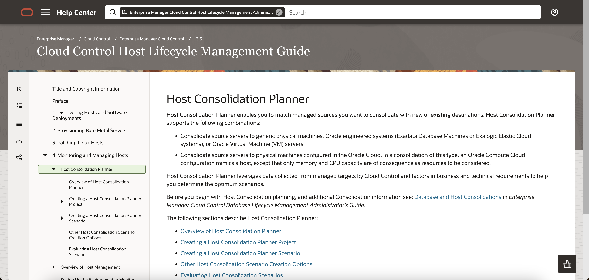

# Lab 6: Additional Resources
## Introduction

DBExpert offers two key areas where you can dive deeper into resources to ensure you're making the best decisions for your needs.
The first area is available in the header, alongside the Explore and Migration tabs.

You'll also find a second set of resources at the bottom of the page, right below the Migration Methods banner.

**Estimated Time: 1 minutes**

---

## Additional Resources Tab

### **LiveLabs**
Experience Oracle Cloud without any cost and build your skills without the need for an account. Each LiveLabs session gives you a fully isolated environment to explore a workshop hands-on.

### **OCI Price List**
Stay on top of your budget with Oracle Cloud Infrastructure's straightforward pricing. Our innovative tools help prevent unexpected costs, making your cloud journey as cost-efficient as possible.

### **Cost Estimator**
Use Oracle's Cost Estimator to predict your monthly spend on Oracle's Infrastructure and Platform Cloud services (IaaS/PaaS) before you commit.

### **Customer Success Stories**
Discover why businesses across various industries choose Oracle. Hear directly from our customers about their successes and why Oracle is the right partner for their growth.

### **EM Host Consolidation Planner**
The Host Consolidation Planner helps you efficiently match source servers you wish to consolidate with ideal new or existing destinations. It supports consolidating onto generic physical machines, Oracle’s engineered systems, or Oracle VM servers, and even onto physical machines in Oracle Cloud.

### **Oracle Cloud Compliance**
Oracle is dedicated to helping you navigate global operations and rapidly evolving regulatory demands. We offer the tools you need to stay compliant in a complex world.

### **Compare OCI with AWS, Azure, and Google Cloud**
Simplify your cloud migration by comparing Oracle Cloud Infrastructure (OCI) with similar services from AWS, Azure, and Google Cloud. 

---

## Additional Resources Section

### **Database Security Assessment Tool**
The Database Security Assessment Tool (DBSAT) from Oracle provides prioritized advice to mitigate security risks or gaps in your Oracle Databases. It evaluates your database’s current security and compliance status, covering configuration, sensitive data discovery, and more.
Get more info at [DBSAT LiveLab](https://livelabs.oracle.com/pls/apex/dbpm/r/livelabs/view-workshop?wid=699)

### **Cloud Cost Estimator**
Access the Cost Estimator here too. It calculates costs based on the Oracle Cloud service you select, its configurations, and the expected usage.

### **Oracle Database Features and Licensing**
Browse through Oracle Database features and licensing options to see what's available for different versions and services.

### **ORADiff**
With ORADiff, you can easily compare two different Oracle database releases, with or without any additional patches, to see what has changed.

