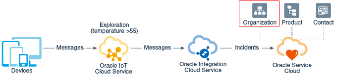

# Title of the Lab

## Introduction

*Describe the lab in one or two sentences, for example:* This lab walks you through the steps to ...

Estimated Lab Time: -- minutes

### About <Product/Technology> (Optional)
Enter background information here about the technology/feature or product used in this lab - no need to repeat what you covered in the introduction. Keep this section fairly concise. If you find yourself needing more than two sections/paragraphs, please utilize the "Learn More" section.

### Objectives

*List objectives for this lab using the format below*

In this lab, you will:
* Objective 1
* Objective 2
* Objective 3

### Prerequisites (Optional)

*List the prerequisites for this lab using the format below. Fill in whatever knowledge, accounts, etc. is necessary to complete the lab. Do NOT list each previous lab as a prerequisite.*

This lab assumes you have:
* An Oracle Cloud account
* All previous labs successfully completed


*This is the "fold" - below items are collapsed by default*

## Task 1: Concise Task Description

(optional) Task 1 opening paragraph.

1. Step 1

	

2. Step 2

  

4. Example with inline navigation icon  click **Navigation**.

5. Example with bold **text**.

   If you add another paragraph, add 3 spaces before the line.

## Task 2: Concise Task Description

1. Step 1 - tables sample

  Use tables sparingly:

  | Column 1 | Column 2 | Column 3 |
  | --- | --- | --- |
  | 1 | Some text or a link | More text  |
  | 2 |Some text or a link | More text |
  | 3 | Some text or a link | More text |

2. You can also include bulleted lists - make sure to indent 4 spaces:

    - List item 1
    - List item 2

3. Code examples

    ```
    Adding code examples
  	Indentation is important for the code example to appear inside the step
    Multiple lines of code
  	<copy>Enclose the text you want to copy in <copy></copy>.</copy>
    ```

4. Code examples that include variables

	```
  <copy>ssh -i <ssh-key-file></copy>
  ```

## Learn More

*(optional - include links to docs, white papers, blogs, etc)*

* [URL text 1](http://docs.oracle.com)
* [URL text 2](http://docs.oracle.com)

## Acknowledgements
* **Author** - <Name, Title, Group>
* **Contributors** -  <Name, Group> -- optional
* **Last Updated By/Date** - <Name, Month Year>
