# Modify a Containerized Application

## Introduction

This lab walks you through the steps to deploy an application, twitterfeed, that is stored in the hub.docker.com site under the account wvbirder. You will then run the rest client using an oracle database as the data source. You can share applications and make modifications in the container.

*TwitterFeed*: This java application provides static Twitter posts (via a JSON file) via REST calls. The AlphaOffice UI makes calls to this container and associates the twitter posts to products displayed in the UI.

*AlphaOfficeUI*: Node.js application container that displays data obtained via the TwitterFeed and ClientREST containers.

Estimated Lab Time: 15 minutes.

### Objectives

- In this lab you will deploy the remaining containers to support the AlphaOffice application.

### Prerequisites

* Create a docker hub [account](http://hub.docker.com)
* Successfully completed the labs
    - Setup Compute Instance
    - Docker Setup & Basic Concepts
    - Create an Oracle Database Container and Schema

## Task 1: Deploy application

In this section, you will deploy an application, twitterfeed, that is stored in the hub.docker.com site under the account wvbirder.  You will then run the rest client using an oracle database as the data source.

1. Login to the instance using ssh.

    ````
    ssh -i ~/.ssh/<sshkeyname> opc@<Your Compute Instance Public IP Address>
    ````

2.  Make sure you have exited out of the docker container.  Download the docker image, twitterfeed, extract it and run the container.  The download is from the wvbirder docker hub account where this application is staged.

    ````
    <copy>
    docker run -d --name=twitterfeed -p=9080:9080 wvbirder/twitterfeed
    </copy>
    ````

    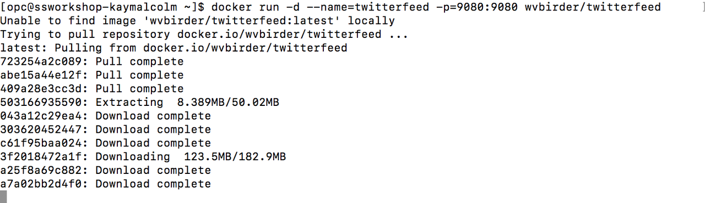

3.  Check to see which containers are running.

    ````
    <copy>
    docker ps
    </copy>
    ````

    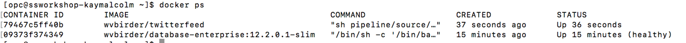

4.  Open up a broswer to see the application with the stream of texts.  http://Public IP address:9080/statictweets.  Expand to see the full json file.

    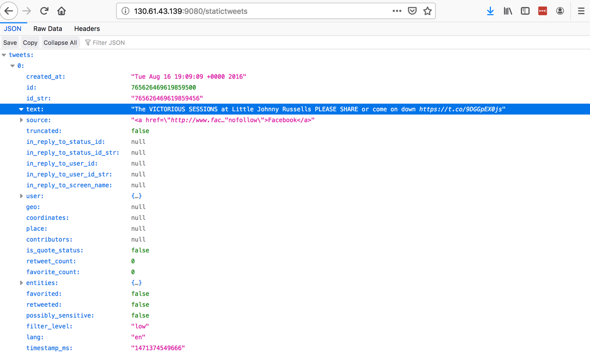

5.  Let's run the restclient with the Oracle Database as the datasource.

    ````
    <copy>
    docker run -d -it --rm --name restclient -p=8002:8002 --link orcl:oracledb-ao -e ORACLE_CONNECT='oracledb-ao/orclpdb1.localdomain' -e DS='oracle' wvbirder/restclient
    </copy>
    ````

6.  Go back to your broswer to see the application with the stream of texts.  *http://Public IP address:8002/products*

    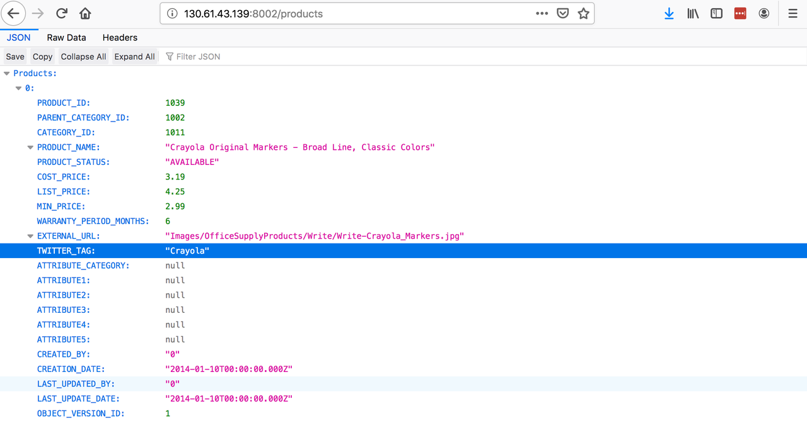

7.  An application called AlphaOfficeUI has been staged in the docker hub account, wvbirder.  Let's download it, extract and run it.  Later on in this lab you will push a modified application up to your docker account.

    ````
    <copy>
    docker run -d --name=alphaofficeui -p=8085:8085 wvbirder/alpha-office-ui-js
    </copy>
    ````

    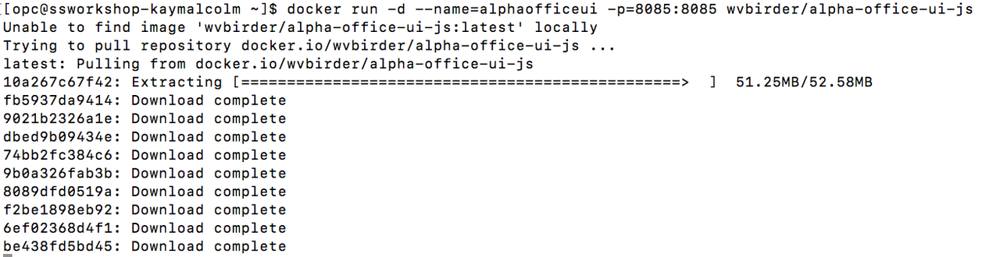

8.  Go back to your broswer to see the application running on port 8085.  http://Public IP address:8085.  Click on one of the products to see the details and the twitterfeed comments.

   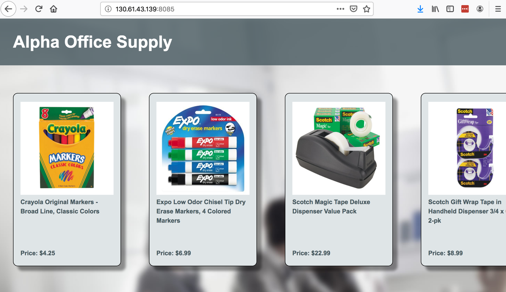

## Task 2: Change application (Container in place modifications)

This lab will show how you can share applications and make modifications in the container.

1. Copy a background image from your compute instance into the filesystem of the container.
    ````
    <copy>
    docker cp /home/opc/AlphaOfficeSetup/dark_blue.jpg alphaofficeui:/pipeline/source/public/Images
    </copy>
    ````

2.  wvbirder's container does not have vim (an editor) installed.  So you will configure it and use it to make changes to the css and html pages of the application.  First you need to login to the docker container using the command `docker exec`.

    ````
    <copy>
    docker exec -it alphaofficeui bash
    apt-get update
    apt-get install vim
    </copy>
    ````

    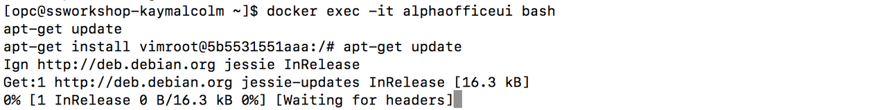

    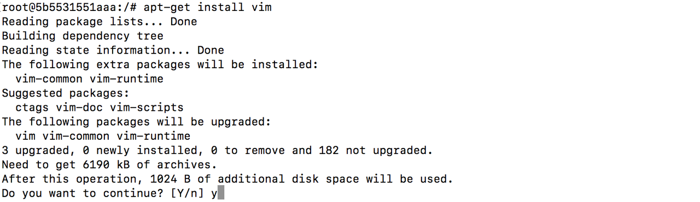

3.  Verify the dark_blue.jpg file is in the container and then use vim to edit the html file for the main page in your application.

    ````
    <copy>
    ls /pipeline/source/public/Images
    </copy>
    ````

4.  Use the vim editor to change the name of the application (between the H1 tags) to your name.

    ````
    <copy>
    vim /pipeline/source/public/alpha.html
    </copy>
    ````

    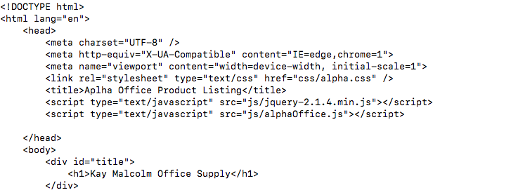

5.  Let's edit the css file as well and change the background color of the app.  Change the bg image to the dark_blue.jpg image you copied into the container.

    ````
    <copy>
    vim /pipeline/source/public/css/alpha.css
    exit
    </copy>
    ````

    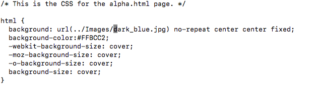

    *Old Version of File*

    

6.  Let's view the running application now.  Notice the name and the background has changed.

    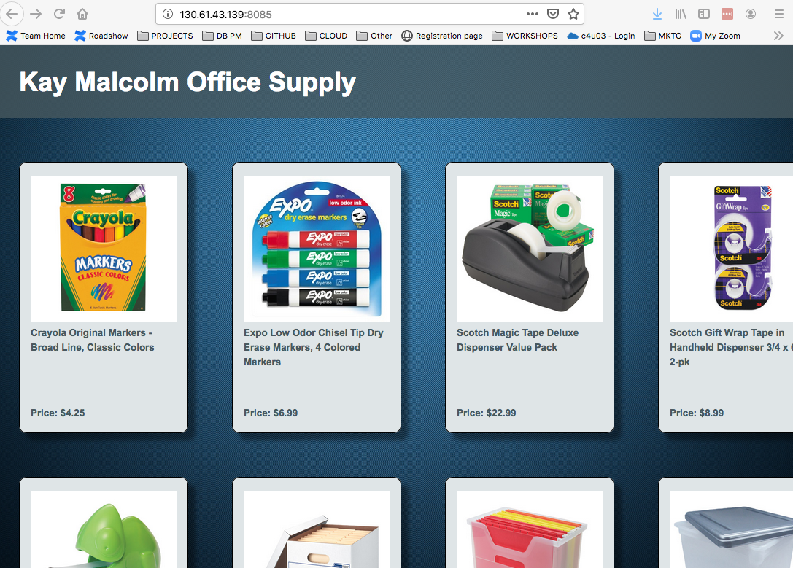

    *Old Version of Application*

    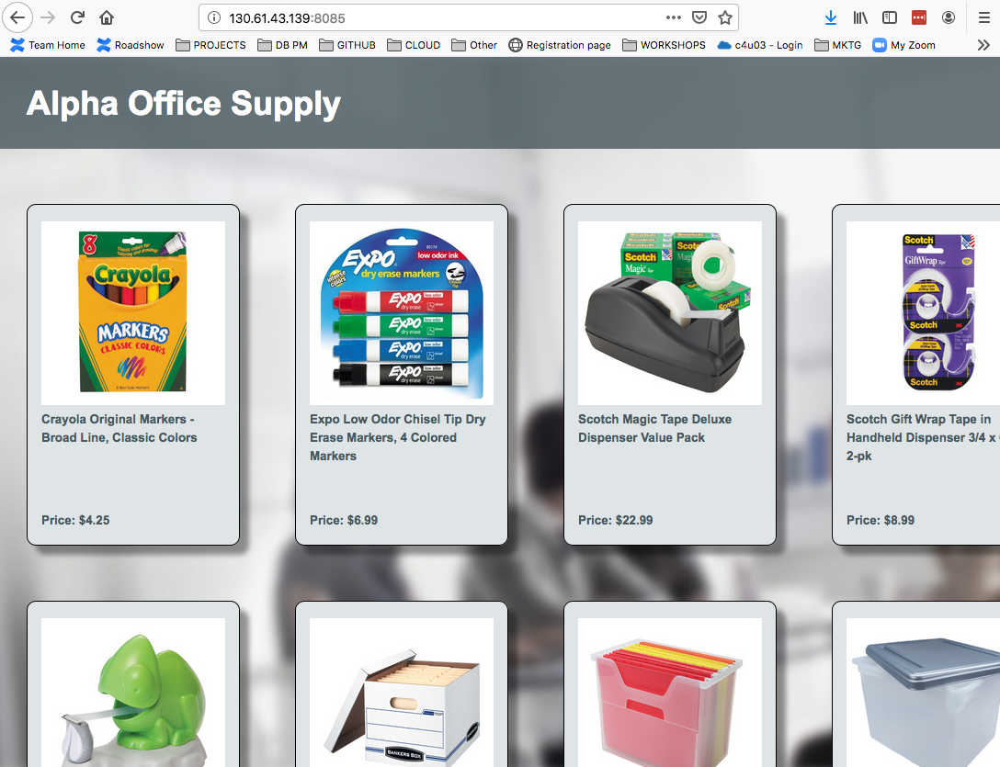

## Task 3: Updating an image to Docker Hub

1.  If you were working with a team and needed to get this updated online, you would commit it.  Let's commit this new docker image to your docker hub now.  Wvbirder thanks but we have our own Docker account.  Once commited, list the images.  Note that your image is now listed.

    ````
    <copy>
    docker commit alphaofficeui (your-dockerhub-account)/(image-name)
    docker images
    </copy>
    ````

    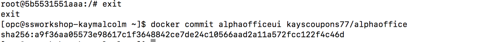

    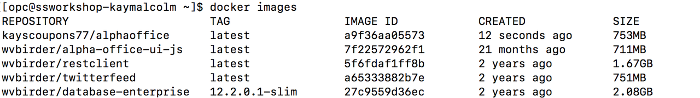

2.  Let's start a container based on your image.  First we need to stop the existing container.

    ````
    <copy>
    docker stop alphaofficeui
    docker rm alphaofficeui
    </copy>
    ````

    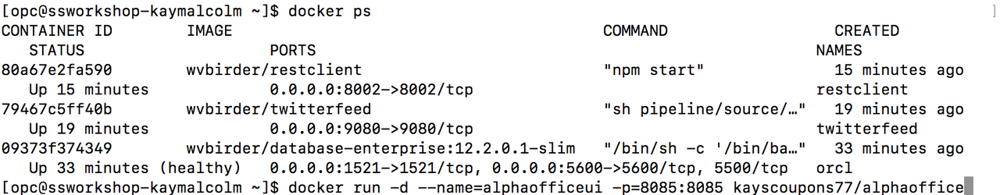

3.  Let's download, extract and install the new container from your docker account.

    ````
    <copy>
    docker run -d --name=alphaofficeui -p=8085:8085 (your-dockerhub-account)/(image-name)
    </copy>
    ````

    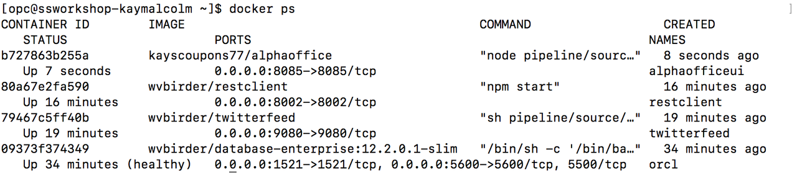

4. Go back to your broswer to view the application.  http://Public IP address:8085

5. Now let's push this image to your docker hub account

    ````
    <copy>
    docker push (your-dockerhub-account)/(image-name)
    </copy>
    ````

6.  Open up a new browswer tab and login to hub.docker.com.  Verify your new image was successfully pushed. 

Congratulations, this is the end of this lab.

## Acknowledgements
* **Author** - Oracle NATD Solution Engineering
* **Contributors** - Kay Malcolm, Director, Anoosha Pilli, Product Manager
* **Last Updated By/Date** - Anoosha Pilli, Product Manager, November 2020

