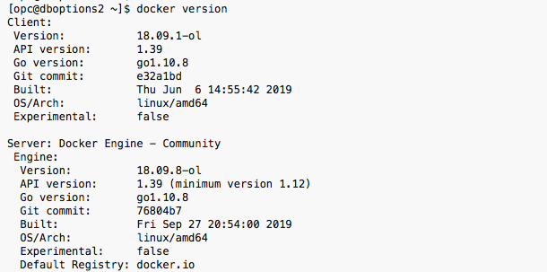
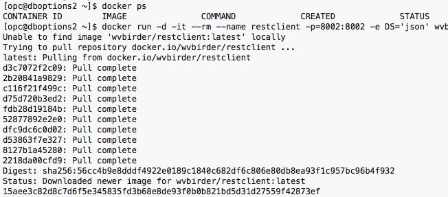
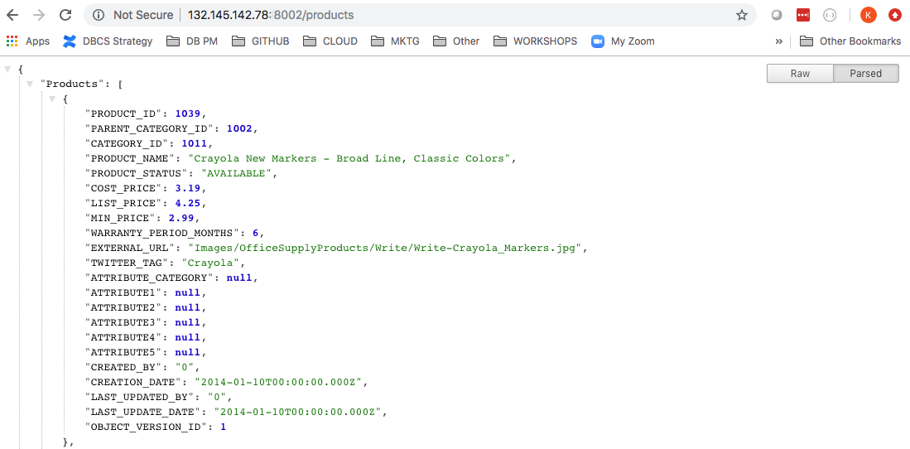
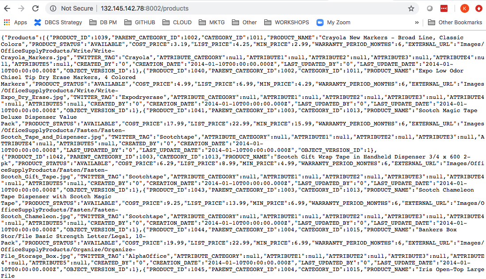
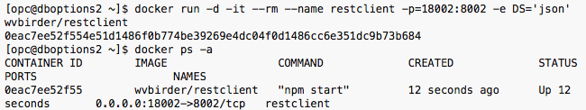
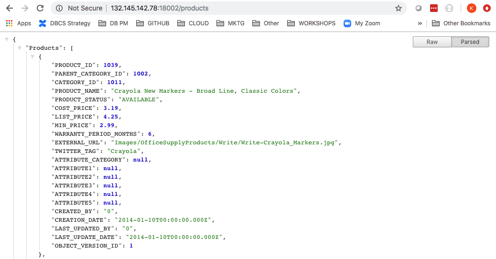
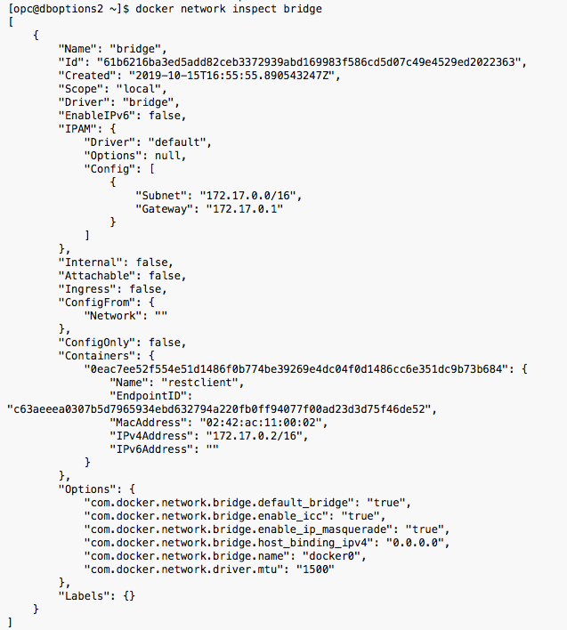

# Docker Setup and Basic Concepts

## Introduction

This lab walks you through the steps to start, stop, relocate and get information about the network of a Docker container.

Estimated Lab Time: 15 minutes.

### Docker Basic Commands

This lab will walk you through a few basic commands used in docker.  Here's a list of common commands for your reference.

- docker run – Runs a command in a new container.
- docker start – Starts one or more stopped containers
- docker stop – Stops one or more running containers
- docker build – Builds an image form a Docker file
- docker pull – Pulls an image or a repository from a registry
- docker push – Pushes an image or a repository to a registry
- docker export – Exports a container’s filesystem as a tar archive
- docker exec – Runs a command in a run-time container
- docker search – Searches the Docker Hub for images
- docker attach – Attaches to a running container
- docker commit – Creates a new image from a container’s changes

### Objectives

In this lab, you will:
- Install docker-engine on cloud instance
- Start, stop, relocate and get information about the network of a Docker container

### Prerequisites

* Chrome Browser (preferred)
* Install JSON Extension on Chrome Browser [click here](https://chrome.google.com/webstore/detail/json-formatter/bcjindcccaagfpapjjmafapmmgkkhgoa?hl=en)
* Successfully completed the lab - Setup Compute Instance

## Task 1: Setup Docker on compute instance

1. If you are not logged into you compute instance as an `opc` user, using the terminal of your choice (we recommend using the Oracle Cloud Shell) login to the instance you created using secure shell (ssh).

    ````
    ssh -i ~/.ssh/<sshkeyname> opc@<Your Compute Instance Public IP Address>
    ````

2.  Become a `root` user first, to install docker on compute instance

    ````
    <copy>
    sudo -s
    </copy>
    ````

3.  To install Docker on Oracle Linux 8, install the yum-utils package and enable all the required repositories.

    ````
    <copy>
    dnf install -y dnf-utils zip unzip
    dnf config-manager --add-repo=https://download.docker.com/linux/centos/docker-ce.repo
    </copy>
    ````

4. Run the below commands to install Docker on Oracle Linux 8.

    ```
    <copy>
    dnf remove -y runc
    dnf install -y docker-ce --nobest
    </copy>
    ```

5.  Grant Docker privileges to the `opc` user.

    ````
    <copy>
    usermod -aG docker opc
    </copy>
    ````

6. Enable and start the docker service

    ````
    <copy>
    systemctl enable docker
    systemctl start docker
    </copy>
    ````

7. Next, as the root user, we are going to install git using yum (package management tool for Linux). We will need git in the next lab. Enter `y` when prompted.

    ````
    <copy>
    yum install git
    </copy>
    ````

    

8. Verify the version by switching to the opc user.

    ````
    <copy>
    su - opc
    docker version
    docker images
    git --version
    </copy>
    ````

    

9. Place your server in permissive mode.

    ````
    <copy>
    exit
    setenforce 0
    sestatus
    </copy>
    ````

    

10. Switch back to the opc user and verify you are the `opc` user.

    ````
    <copy>
    su - opc
    whoami
    </copy>
    ````

## Task 2: Docker basic concepts

1. Check the version of docker.

    ````
    <copy>
    docker version
    </copy>
    ````

    

2. Start your application, restclient, in docker on port 8002 in json format and verify if containers are running.


    ````
    <copy>
    docker ps
    docker run -d -it --rm --name restclient -p=8002:8002 -e DS='json' wvbirder/restclient
    docker ps -a
    </copy>
    ````

    - "-d" flag runs the container in the background
    - "-it" flags instructs docker to allocate a pseudo-TTY connected to the container’s stdin, creating an interactive bash capable shell in the container (which we will use in a moment when we connect into the container)
    - "-h" We give the container a hostname "oracledb-ao" to make it easier to start/stop/remove, reference from other containers, etc
    - "-p" We map port 8002 from within the container to the same ports on the HOST for accessibility from outside of the container's private subnet (typically 172.17.0.0/16). This allows the container to be accessed from the HOST, for example. The default port for Oracle's tns listener is on port 1521 and port 5600 is used for HTTP access to Enterprise Manager Express
    - "--name" The name of the container will be "restclient"
    - "-v" This maps the directory where you downloaded the restclient setup.

    

3. Open up a browser on your laptop and go to your public URL on port 8002. Replace `Enter IP Address` with the Public IP of your compute instance you noted earlier in lab 2.

    ```
    http://Enter IP Address:8002/products
    ```

4. Depending on whether you have a JSON formatter, you should see the products in your application, in RAW or FORMATTED format.  `Note:  If you are on the VPN, disconnect.`

    

    

5. The `restclient` container was started earlier with the -rm option.  This means when stopping it will remove ALL allocated resources.  The `ps` command with the `-a` option shows the status of ALL containers that are running.  As you can see, there are no containers running.

    ````
    <copy>
    docker stop restclient
    docker ps -a
    </copy>
    ````

    

 6. Let's start another container on your compute instance's 18002 port.  Type the following command:

    ````
    <copy>
    docker run -d -it --rm --name restclient -p=18002:8002 -e DS='json' wvbirder/restclient
    docker ps -a
    </copy>
    ````

    

7. Go back to your browser and change the port to 18002.

    


## Task 3: Docker networking basics

Now that you know how to start, stop and relocate a container, let's see how to get information about the network.

1. Inspect the network bridge that docker created for you out of the box.  This shows network information about all the containers running on the default bridge. We see that our restclient container is assigned IP Address 172.17.0.2. You can ping that address from your compute instance.

    ````
    <copy>
    docker network inspect bridge
    </copy>
    ````

    

2. Ping that address for your restclient container from your compute instance.

    ````
    <copy>
    ping 172.17.0.2 -c3
    </copy>
    ````

3. Stop your restclient container.

    ````
    <copy>
    docker stop restclient
    </copy>
    ````

You may now proceed to the next lab.

## Acknowledgements
* **Author** - Oracle NATD Solution Engineering
* **Contributors** - Kay Malcolm, Director, Anoosha Pilli, Product Manager
* **Last Updated By/Date** - Anoosha Pilli, Product Manager, May 2021

