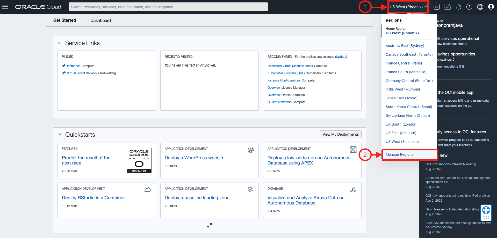
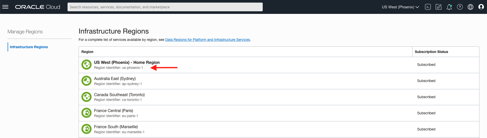

# Setup

## Introduction

In this lab, we will provision and setup the reference architecture.

In this reference architecture, Jenkins is hosted on Oracle Cloud Infrastructure to centralize build automation and scale the deployment by using Oracle Cloud Infrastructure Registry, Oracle Kubernetes and Oracle Converged Database. GitHub is used to manage source code. 

Estimated Time: XX minutes

### Objectives

* Clone the setup and microservices code
* Execute setup

<em><strong style="color: #C74634">We recommend that you create a notes page to write down all of the credentials you will need.</strong></em>


### Prerequisites

* Access to an OCI Tenancy

## Task 1: Launch the OCI Cloud Shell

Cloud Shell is a small virtual machine running a "bash" shell which you access through the Oracle Cloud Console. Cloud Shell comes with a pre-authenticated command line interface in the tenancy region. It also provides up-to-date tools and utilities.

1. Click the Cloud Shell icon in the top-right corner of the Console.

  

  > **Note:** Cloud Shell uses websockets to communicate between your browser and the service. If your browser has websockets disabled or uses a corporate proxy that has websockets disabled you will see an error message ("An unexpected error occurred") when attempting to start Cloud Shell from the console. You also can change the browser cookies settings for a specific site to allow the traffic from *.oracle.com

## Task 2: Fork and clone the Lab Repository

Open a browser and navigate to the Lab Repository Available <u><strong>[here](https://github.com/naberin/oracle.cloud.native.devops-oraoperator.git)</strong></u>. You can also find the link below if you would like to copy-paste the link instead on your browser.
``` bash
<copy>
https://github.com/naberin/oracle.cloud.native.devops-oraoperator.git
</copy>
```
Create a fork of `https://github.com/naberin/oracle.cloud.native.devops-oraoperator.git` into your own GitHub account. When forking, it is important to:
- Keep the repository the same
- Deselect Copy the `main` branch only (as we want to copy the `dev` branch)

With a working fork of the lab repository under your own account, clone the forked repository by running the below command 
```bash
<copy>
 git clone https://github.com/<username>/oracle.cloud.native.devops-oraoperator.git
</copy>
```
<strong style="color: #C74634">Note</strong>: Replace `<username>` above with your GitHub username.

## Task 3: Prepare for Terraform Provisioning
The first part of the setup process will require the following information below to provision resources. Retrieve these information and keep these in your notes (with _exception_ to the Jenkins Password  which does not have to retrieved). Click on the drop downs below for more information on how to retrieve these from the OCI Console.

1. __Region Identifier__ - a fixed identifier for the region to provision lab-related resources in (e.g. `us-phoenix-1`, `us-ashburn-1`, etc.). A full list can be found here: [https://docs.oracle.com/en-us/iaas/Content/General/Concepts/regions.htm](https://docs.oracle.com/en-us/iaas/Content/General/Concepts/regions.htm)

 ## How to Retrieve the Region Identifier
    On the top right, click on your Region [ US West (Phoenix) in the picture ] and select Manage Regions.

    

    In manage regions, you will find the Identifier to use for your current region under each region name. Use the region identifier for which region you are currently subscribed to (preferrably your Home Region).

    

2. __Tenancy OCID__ - Oracle Cloud ID for the tenancy to provision lab-related resources in

 ## How to Retrieve the Tenancy OCID

3. __Compartment OCID__ - Oracle Cloud ID for the compartment to provision lab-related resources in

 ## How to Retrieve the Compartment OCID
 You may choose to use an existing compartment or create a new one.

    To use an existing compartment, enter the OCID of the compartment.

    To create a new compartment, enter the name you would like to use.

    If you chose to create a new compartment, you will also be asked to enter the OCID of the parent compartment in which the new compartment is to be created.  Enter the parent compartment OCID or hit enter to use the root compartment of your tenancy.

    To get the OCID of an existing compartment, click on the Navigation Menu in the upper left of Cloud Console, navigate to **Identity & Security** and click on **Compartments**:

    

    Click on the link in the **OCID column** of the compartment, and click **Copy**:

    

4. __Jenkins Password__ - based on the user's input.

    <strong style="color: #C74634">Note</strong>: Keep your Jenkins Password credentials in your notes.

## Task 4: Run Setup for Terraform Provisioning
1. Execute the following sequence of commands to start the setup.  

    First, source the `source.env` file to register common lab-related environment variables;
    ```bash
    <copy>
    source ./oracle.cloud.native.devops-oraoperator/examples/cloudbank/source.env
    </copy>
    ```

    Then run the setup script to initiate the setup process.
    ```bash
    <copy>
    ./oracle.cloud.native.devops-oraoperator/examples/cloudbank/scripts/setup.sh
    </copy>
    ```
    The setup process will request the values which we prepared to provide in Task 2 to start the provisioning process with __Terraform__. Terraform will then run in the background and produce the following output on Cloud Shell:
    ```bash
    Terraforming Resources on OCI...
    Preparing terraform...DONE
    Running terraform provisioning in the background...DONE
    ```

## Task 5: Prepare other required information
The second part of the setup process will require the following information below for later purposes. Retrieve these information and keep these in your notes (with _exception_ to passwords which do not have to retrieved). Click on the drop downs below for more information on how to retrieve these from the OCI Console.

1. __Database Password__ - based on the user's input

2. __Frontend Login Password__ - based on the user's input

3. __User OCID__ - Oracle Cloud ID for the user to provision lab-related resources with

 ## How to Retrieve the User OCID
 The user OCID will look something like: `ocid1.user.oc1....<unique_ID>`

    Locate your menu bar in the Cloud Console and click the person icon at the far upper right. From the drop-down menu, select your user's name. Note, sometimes the name link is missing in which case select the **User Settings** link. Do not select the **Tenancy** link.

    

    Click Show to see the details and then click Copy to copy the user OCID to the clipboard, paste in the copied data in console.

    

4. __API Fingerprint__ - API Signing Key Fingerprint to authenticate provisioning Database resources with

 ## How to Create and/or Retrieve User Fingerprints

 ```bash
 [DEFAULT]
user=ocid1.user.oc1..
fingerprint=AA:BB:CC:DD:EE:FF:GG:HH:II:JJ:KK:LL:MM:NN:OO:PP
tenancy=ocid1.tenancy.oc1..
region=us-phoenix-1
key_file=<path to your private keyfile> # TODO
 ```


Once setup completes and you have provided the above information, there are a few more information and files to set that can only be done manually:
1. Create an __Oracle Account__
    
    <strong style="color: #C74634">Note</strong>: Keep your Oracle Account credentials in your notes. These will be referenced as `oracle-sso-email-address` and `oracle-sso-password` in __Lab 2__


 ## How to create an Oracle Account
 
    > Note: This step is required to authenticate later on through Docker and authorize pulling the Oracle Database Express Edition image from the official Oracle Container Registry. <strong>For other editions, like the Enterprise and Standard editions</strong>, please navigate to the specific edition and _accept the license agreement_. You can check out the Oracle Database images available [<strong>here</strong>](https://container-registry.oracle.com/ords/f?p=113:10:110127779464535:::::)

    An Oracle Account provides access to pull pre-built docker images from the official Oracle Container Registry.

    To create an account, navigate to the following link: [Create Oracle Account](https://profile.oracle.com/myprofile/account/create-account.jspx). Since we are using the Express Edition, there are no further actions to take. Once you have completed creating an account, you can return to the next step below.

2. Upload the API Signing Key's __Private Key__

 ## How to upload the Private Key

    The private key is used to authorize Database provisioning with the Oracle DB Operator with API Key Authentication.

    The Cloud Shell upload functionality will place the private key inside the root directory. You can then run the following:
    ```bash
    <copy>
    mv <private_key_filename> $CB_STATE_DIR/private.pem && chmod 400 $CB_STATE_DIR/private.pem
    </copy>
    ```

    <strong style="color: #C74634">Note</strong>: Replace `<private_key_filename>` above with the name of the private key file.

3. Set the __Java Version to 11__

 ## How to set the Java Version on Cloud Shell
 
    Cloud Shell offers a command to switch java versions. To do this, run the following command below. If `openjdk-11.0.16` is not a recognized version, you can run `csruntimectl java list` instead to view the available versions to set versions to, with which you can run `csruntimectl java set` with.

    ```bash
    <copy>
    csruntimectl java set openjdk-11.0.16
    </copy>
    ```

4. Create an __Auth Token__
 
  <strong style="color: #C74634">Note</strong>: Keep the Auth Token in your notes.

 ## How to create an Auth Token

    Auth tokens are used to authenticate with when logging on your tenancy's container registry to push the Lab's application container images.


## Task 6: Set up KubeConfig
This step requires the Kubernetes cluster (OKE cluster) to exist. You will have to wait for the Kubernetes cluster to complete this step if Terraform has not yet completely setup Terraform when you get to this step.

follow the instructions below

1. Navigate to Developer Services → Kubernetes Clusters (OKE) → Select `cloudbank`
2. Click on [Access Cluster]
3. Copy the `oci ce cluster create-kubeconfig` command, paste and run it on Cloud Shell.

Once the KubeConfig has been created, navigate to the lab directory `cbworkshop`.
```bash
<copy>
cd $CB_STATE_DIR
</copy>
```
From this directory, you can run the init script to initialize the cluster:
```bash
<copy>
./init-cluster.sh
</copy>
```

## Acknowledgements

* **Authors** - Norman Aberin, Developer Advocate; Irina Granat, Consulting Member of Technical Staff, Oracle MAA and Exadata; Paul Parkinson, Developer Evangelist; Richard Exley, Consulting Member of Technical Staff, Oracle MAA and Exadata
* **Last Updated By/Date** - Norman Aberin, August 2022;
