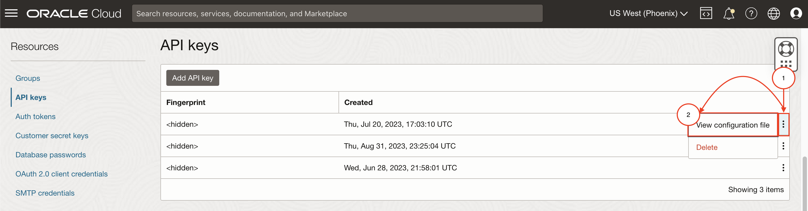

# Setup

## Introduction

In this lab, we will provision and setup the reference architecture.

In this reference architecture, Jenkins is hosted on Oracle Cloud Infrastructure to centralize build automation and scale the deployment by using Oracle Cloud Infrastructure Registry, Oracle Kubernetes and Oracle Converged Database. GitHub is used to manage source code. 

Estimated Time: 25 minutes

### Objectives

* Clone the setup and microservices code
* Execute setup

<em><strong style="color: #C74634">We recommend that you create a notes page to write down all of the credentials you will need.</strong></em>


### Prerequisites

* Access to an OCI Tenancy

## Task 1: Launch the OCI Cloud Shell

Cloud Shell is a small virtual machine running a "bash" shell which you access through the Oracle Cloud Console. Cloud Shell comes with a pre-authenticated command line interface in the tenancy region. It also provides up-to-date tools and utilities.

1. Click the Cloud Shell icon in the top-right corner of the Console.

  

  > **Note:** Cloud Shell uses websockets to communicate between your browser and the service. If your browser has websockets disabled or uses a corporate proxy that has websockets disabled you will see an error message ("An unexpected error occurred") when attempting to start Cloud Shell from the console. You also can change the browser cookies settings for a specific site to allow the traffic from *.oracle.com

## Task 2: Fork and clone the Lab Repository

Open a browser and navigate to the Lab Repository Available <u><strong>[here](https://github.com/oracle/oci-react-samples.git)</strong></u>. You can also find the link below if you would like to copy-paste the link instead on your browser.
``` bash
<copy>
https://github.com/oracle/oci-react-samples.git
</copy>
```
Since the lab will require you to make changes to the code, you will need to have a fork of the lab. To fork, 
1. Click on the Fork button at the top right. 
2. Select your account as the owner and keep the repository name the same.
3. Deselect `Copy the main branch only` (as the lab-related files exist only in another branch)
4. Finally, click on `Create fork`

    

With a working fork of the lab repository under your own account, clone the forked repository by running the below command. Remember to specify `--single-branch --branch cloudbank` as shown below, as this will only pull the files related to the lab:
```bash
<copy>
 git clone --single-branch --branch cloudbank https://github.com/<username>/oci-react-samples
</copy>
```
<strong style="color: #C74634">Note</strong>: Replace `<username>` above with your GitHub username. Your GitHub username will be located at the top right after clicking on your user icon.

  

## Task 3: Prepare for Terraform Provisioning
The first part of the setup process will require the following information below to provision resources. Retrieve these information and keep these in your notes (with _exception_ to the Jenkins Password  which does not have to retrieved) for Task 4, which will prompt you for these values. Click on the drop downs below for more information on how to retrieve these from the OCI Console:

<strong style="color: #C74634">Note</strong>: Keep the following information and credentials in your notes.

1. __API Key__ - API Signing Key to authenticate provisioning Database resources with

 ## How to Create an API Key
 
 Creating an API Signing Key Fingerprint will list some of the required values you will need to provide in the following prompts. To start, navigate to your OCI Console.

    On the top right, go to `User Settings` and create an API Key Resource.

    

    This will open the Add API Key screen in which you can either generate new keys or reuse old ones. Generate and download the keys and select `Add`.

    

    Once added, a similar output below will appear in the following screen. Copy these values into your notes. 
    - User will be your User OCID
    - Fingerprint will be your fingerprint
    - Tenancy will be your Tenancy OCID
    - Region will be your Region Identifier.

    ```bash
        [DEFAULT]
        user=ocid1.user.oc1..
        fingerprint=AA:BB:CC:DD:EE:FF:GG:HH:II:JJ:KK:LL:MM:NN:OO:PP
        tenancy=ocid1.tenancy.oc1..
        region=us-phoenix-1
        key_file=<path to your private keyfile> # TODO
    ```

 ## How to Retrieve an API Key's Configuration
    
    <strong style="color: #C74634">Note</strong>: Each user can have a maximum of three API signing keys. If you are planning to reuse a previous API Key, please make sure you have the corresponding keys used in generating the API Key.

    If you already have three or opt to reuse your API Keys. Open the options menu on the right side (3 dots) for a specific API Key and select `View Configuration file`. This option will show the same output as above listing your `User OCID, Tenancy OCID, Region Identifier` and `Fingerprint`

    


2. __Region Identifier__ - a fixed identifier for the region to provision lab-related resources in (e.g. `us-phoenix-1`, `us-ashburn-1`, etc.). A full list can be found here: [https://docs.oracle.com/en-us/iaas/Content/General/Concepts/regions.htm](https://docs.oracle.com/en-us/iaas/Content/General/Concepts/regions.htm)

    Use the region value from the API Key Configuration file.

3. __Tenancy OCID__ - Oracle Cloud ID for the tenancy to provision lab-related resources in

    Use the tenancy value from the API Key Configuration file

4. __Compartment OCID__ - Oracle Cloud ID for the compartment to provision lab-related resources in

 ## How to Retrieve the Compartment OCID
 You may choose to use an existing compartment or create a new one.

    To use an existing compartment, enter the OCID of the compartment.

    To create a new compartment, enter the name you would like to use.

    If you chose to create a new compartment, you will also be asked to enter the OCID of the parent compartment in which the new compartment is to be created.  Enter the parent compartment OCID or hit enter to use the root compartment of your tenancy.

    To get the OCID of an existing compartment, click on the Navigation Menu in the upper left of Cloud Console, navigate to **Identity & Security** and click on **Compartments**:

    

    Click on the link in the **OCID column** of the compartment, and click **Copy**:

    

5. __Jenkins Password__ - Enter a password

6. __Database Password__ - Enter a password (see below requirements)

    <strong style="color: #C74634">Note</strong>: The Autonomous Database sets minimum standards for passwords, and the default profile sets parameters to limit the number of failed login attempts. 

     * The password must be between 12 and 30 characters long and must include at least one uppercase letter, one lowercase letter, and one numeric character.
     * The password cannot contain the username.
     * The password cannot be one of the last four passwords used for the same username.
     * The password cannot contain the double quote (") character.
     * The password must not be the same password that is set less than 24 hours ago.

7. __Frontend Login Password__ - Enter a password 

8. __User OCID__ - Oracle Cloud ID for the user to provision lab-related resources with

    Use the tenancy value from the API Key Configuration file

 ## How to Retrieve the User OCID
    Another method of retrieving the user OCID is to simply go to User Settings. Locate your menu bar in the Cloud Console and click the person icon at the far upper right. From the drop-down menu, select your user's name. Note, sometimes the name link is missing in which case select the **User Settings** link. Do not select the **Tenancy** link.

    

    The user OCID will look something like: `ocid1.user.oc1....<unique_ID>`. Click Show to see the details and then click Copy to copy the user OCID to the clipboard, paste in the copied data in console.

    

8. __Fingerprint__ - The resulting fingerprint after generating an API Key

    Use the fingerprint value from the API Key Configuration file

## Task 4: Run Setup for Terraform Provisioning
Execute the following sequence of commands to start the setup.  

1. First, source the `source.env` file to register common lab-related environment variables;
    ```bash
    <copy>
    source ./oci-react-samples/cloudbank/source.env
    </copy>
    ```

2. Run the setup script to initiate the setup process.
    ```bash
    <copy>
    ./oci-react-samples/cloudbank/scripts/setup.sh
    </copy>
    ```
    The setup process will request the values which you have prepared in Task 2. Provide these values from your notes to start the provisioning process with __Terraform__. The script will then prompt you to confirm your previous inputs. If you have made an error, this allows you to fix it. Once confirmed, proceed by typing in `y`.

    ```bash
    Please confirm that the entered values are correct. Proceed with inputs? [y/N] <copy>y</copy>
    ```
    
    Terraform will then run in the background and produce the following output on Cloud Shell:
    ```bash
    Terraforming Resources on OCI...STARTED
    Preparing terraform...DONE
    Running terraform provisioning in the background...DONE
    ```

## Task 5: Prepare other required information
Once setup completes, you will need to run and setup the following manually for the labs.

<!-- 1. Create an __Oracle Account__
    
    <strong style="color: #C74634">Note</strong>: Keep your Oracle Account credentials in your notes. These will be referenced as `oracle-sso-email-address` and `oracle-sso-password` in __Lab 2__


 ## How to create an Oracle Account
 
    > Note: This step is required to authenticate later on through Docker and authorize pulling the Oracle Database Express Edition image from the official Oracle Container Registry. <strong>For other editions, like the Enterprise and Standard editions</strong>, please navigate to the specific edition and _accept the license agreement_. You can check out the Oracle Database images available [<strong>here</strong>](https://container-registry.oracle.com/ords/f?p=113:10:110127779464535:::::)

    An Oracle Account provides access to pull pre-built Database docker images from the official Oracle Container Registry.

    To create an account, navigate to the following link: [Create Oracle Account](https://profile.oracle.com/myprofile/account/create-account.jspx). Since you will be using the Oracle Database Express Edition, there are no further actions to take. Once you have completed creating an account, you can return to the next step below. -->

1. Upload the API Signing Key's __Private Key__

    This private key will be used to create a secret to authorize the DB operator for Kubernetes to do DB operations on your own OCI Tenancy.

 ## How to upload the Private Key
    To upload the Privey Key file, click on the Gear icon on the right of the screen when Cloud Shell is opened. 
    
    

    This will be open the form for uploading. Select your private key file and upload it. 

    <strong style="color: #C74634">Note</strong>: We recommend renaming the private key file to `private.pem` before uploading.

    
    
    The Cloud Shell upload functionality will place the private key inside the root directory. You can then run the following:
    ```bash
    <copy>
    (cd ~ ; mv <private_key_filename> $CB_STATE_DIR/private.pem && chmod 400 $CB_STATE_DIR/private.pem)
    </copy>
    ```
    or, if you renamed the private key file to `private.pem`, you can run the below command instead.
    ```
    <copy>
    (cd ~ ; mv private.pem $CB_STATE_DIR/private.pem && chmod 400 $CB_STATE_DIR/private.pem)
    </copy>
    ```

    <strong style="color: #C746-34">Note</strong>: Replace `<private_key_filename>` above with the name of the private key file.

2. Create or Provide a previous __Auth Token__


    Auth tokens are used to authenticate with when logging on your tenancy's container registry. This is required for pushing the lab's Cloudbank container images. If you are opting to reuse an auth token, do note that this information is only available upon creation.
 
  <strong style="color: #C74634">Note</strong>: Keep the Auth Token in your notes.

 ## How to create an Auth Token

    To create an Auth Token, navigate again to __User Settings__ on the top right of the OCI Console. From the user details page, under Auth Tokens, generate a new token.

    You can add any value for the description to help you identify and remember the use for this auth-token. You can for example set:

    ```
    <copy>
    cloudbank-livelab auth-token-for-docker-login
    </copy>
    ```

    

    After clicking `Generate Token`, make sure to copy the token before closing and add it to your notes.

    


## Task 6: Set up KubeConfig
This step requires the Kubernetes cluster (OKE cluster) to exist. You will have to wait for the Kubernetes cluster to complete this step if Terraform has not yet completely setup Terraform when you get to this step.

To setup your kubeconfig:

1. Navigate to Developer Services → Kubernetes Clusters (OKE)

    

2. Select the compartment you designated for the lab. In that compartment, select the provisioned `cloudbank` OKE Cluster.

    

2. Click on [Access Cluster]
3. Copy the `oci ce cluster create-kubeconfig` command

    

4. Paste the command on cloud shell and run it

    This will produce an output similar to:

    ```bash
    labuser@cloudshell:~ (us-phoenix-1)$ oci ce cluster create-kubeconfig --cluster-id ocid1.cluster.oc1.phx...<hidden> --file $HOME/.kube/config --region us-phoenix-1 --token-version 2.0.0  --kube-endpoint PUBLIC_ENDPOINT

    New config written to the Kubeconfig file /home/labuser/.kube/config
    ```


Once the KubeConfig has been created, navigate to the lab directory `cbworkshop`.
```bash
<copy>
cd $CB_STATE_DIR
</copy>
```
From this directory, you can run the init script to initialize the cluster and create a namespace, and secrets not related to the operator, but to the cloudbank application:
```bash
<copy>
./init-cluster.sh
</copy>
```

## Acknowledgements

* **Authors** - Norman Aberin, Developer Advocate; Irina Granat, Consulting Member of Technical Staff, Oracle MAA and Exadata; Paul Parkinson, Developer Evangelist; Richard Exley, Consulting Member of Technical Staff, Oracle MAA and Exadata
* **Last Updated By/Date** - Norman Aberin, August 2022;
