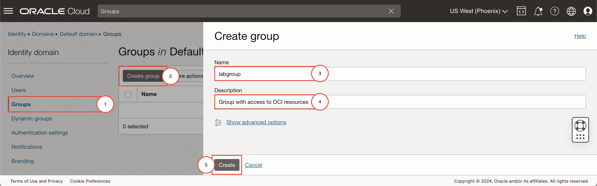
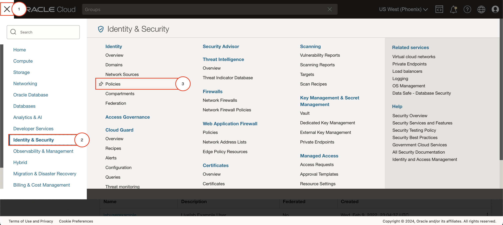
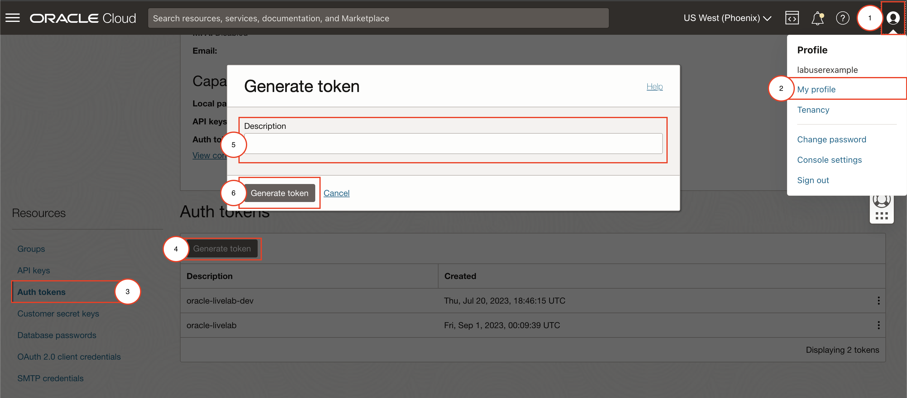
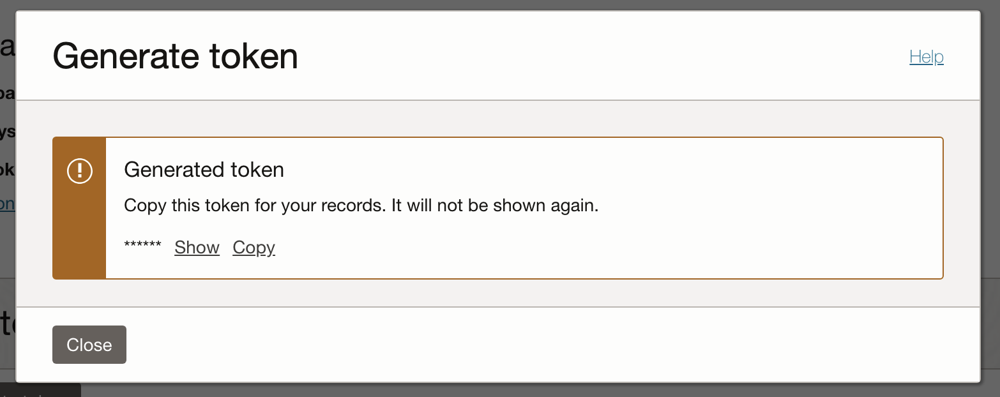
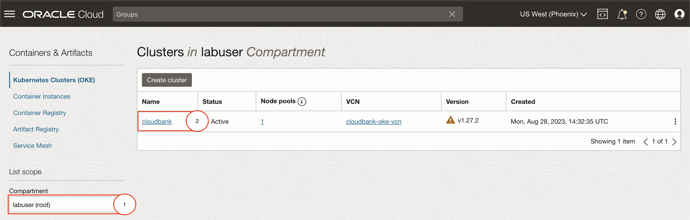

# Setup

## Introduction

In this lab, you will provision all lab-related resources (except for OKE-provisioned resources such as load balancers and Databases) by running a set of scripts. The setup script will create resources in your tenancy using Terraform. It will provision an OKE cluster and a Virtual Machine with Jenkins running. Do note however that this setup of Jenkins is not meant for production purposes.

Estimated Time: 25 minutes

### Objectives

* Create OCI group with the appropriate permissions to run the setup
* Fork and clone the lab repository
* Setup and provision lab resources
* Setup Kube Config

<em><strong style="color: #C74634">It is recommended that you keep all credentials and important information in your notes.</strong></em>


### Prerequisites

* Access to an OCI Tenancy


## Task 1: Create Group and Policies

[Policies](https://docs.oracle.com/en-us/iaas/Content/Identity/Concepts/policies.htm) determine what resources users are allowed to access and what level of access they have. You can create a group and add as many users as you like to that group.

If you are not the tenancy administrator, there may be additional policies you must have in your group to perform some of the steps for this lab. If you cannot create a group and add specific policies, please ask your tenancy administrator for the correct policies to follow along.

If your group already has the permissions listed in part 6 of this task you may skip to Task 2.

1. Navigate to Identity & Security

    

2. Create a New Group by clicking on the button `Create Group`.

3. Set the name and the description of the group to any name you can easily identify.

    

4. Add your user to the group that you have just created by selecting the name of the group you have created and selecting Add User to Group.

    

5. Navigate to Policies

    

6. Make sure you are in the __root__ compartment and click on Create Policy

    

7. Provide a meaningful name and description, and add the following policies under Policy Builder

    ```
    <copy>
    Allow group <group_name> to use cloud-shell in tenancy
    Allow group <group_name> to manage users in tenancy
    Allow group <group_name> to manage all-resources in tenancy
    </copy>
    ```
    If you named your groupName labgroup similar to the image above, you can use the following policies instead.

    ```
    <copy>
    Allow group labgroup to use cloud-shell in tenancy
    Allow group labgroup to manage users in tenancy
    Allow group labgroup to manage all-resources in tenancy
    </copy>
    ```

    

## Task 2: Launch the OCI Cloud Shell

Cloud Shell is a small virtual machine running a "bash" shell that you access through the Oracle Cloud Console. Cloud Shell comes with a pre-authenticated command line interface in the tenancy region. It also provides up-to-date tools and utilities.

1. Click the Cloud Shell icon in the top-right corner of the Console.

  

  > **Note:** Cloud Shell uses WebSockets to communicate between your browser and the service. If your browser has WebSockets disabled or uses a corporate proxy that has WebSockets disabled you will see an error message ("An unexpected error occurred") when attempting to start Cloud Shell from the console. You also can change the browser cookies settings for a specific site to allow the traffic from *.oracle.com


## Task 3: Fork and clone the Lab Repository 

Open a browser and navigate to the Lab Repository Available **[here](https://github.com/oracle/oci-react-samples.git)**. You can also find the link below if you would like to copy-paste the link instead on your browser:
```bash
<copy>
https://github.com/oracle/oci-react-samples.git
</copy>
```


Since the lab will require you to make changes to the code, you will need to have a fork of the lab. To fork the lab repository: 
1. Click on the Fork button at the top right. 
2. Select your account as the owner and keep the repository name the same.
3. Deselect `Copy the main branch only` (as the lab-related files exist only in another branch)
4. Finally, click on `Create fork`

    

With a working fork of the lab repository under your account, clone the forked repository by running the below command. Remember to specify the flags `--single-branch --branch cloudbank` as shown below. With the flags, the command will only pull the files related to the lab:
```bash
<copy>
 git clone --single-branch --branch cloudbank https://github.com/<username>/oci-react-samples
</copy>
```
> **Note:** Replace `<username>` above with your GitHub username. Your GitHub username will be located at the top right after clicking on your user icon.

  

## Task 4: Prepare for Terraform Provisioning
This part of the setup process will require the following information to provision resources. Retrieve the information and keep these in your notes (with exception of the Jenkins Password) for Task 4, which will prompt you for these values. Click on the drop downs below for more information on how to retrieve these from the OCI Console:

> **Note:** Keep the following information and credentials in your notes.

1. __API Key__ - used to authorize provisioning of Database resources with

 ## How to Create an API Key
 
  By creating an API Signing Key, OCI will provide you with a configuration file that contains some of the required information you will need to provide in the following prompts. To start, navigate to your OCI Console.

    On the top-right, go to `User Settings` and create an API Key Resource.

    

    This will open the Add API Key screen in which you can either generate new keys or reuse old ones. Generate and download the keys and select `Add`.

    

    Once added, a similar output below will appear in the following screen. Copy the fingerprint into your notes.

    ```bash
        [DEFAULT]
        user=ocid1.user.oc1..
        fingerprint=AA:BB:CC:DD:EE:FF:GG:HH:II:JJ:KK:LL:MM:NN:OO:PP
        tenancy=ocid1.tenancy.oc1..
        region=us-phoenix-1
        key_file=<path to your private keyfile> # TODO
    ```

 ## How to Retrieve an API Key's Configuration
    
    > **Note:** Each user can have a maximum of three API signing keys. If you are planning to reuse a previous API Key, please make sure you have the corresponding keys used in generating the API Key.

    If you already have three or opt to reuse your API Keys. Open the options menu on the right side (3 dots) for a specific API Key and select `View Configuration file`. This option will show the same output as above listing your `User OCID, Tenancy OCID, Region Identifier` and `Fingerprint`

    

1. __Compartment OCID__ - Oracle Cloud ID for the compartment to provision lab-related resources in

 ## How to Retrieve the Compartment OCID
 You may choose to use an existing compartment or create a new one.

    Navigate to Compartments on your OCI Console.

    
    
    To use an existing compartment, click on the OCID of the compartment you want to use and click copy.

    

    To create a new compartment instead, click on the Create Compartment button (emphasized above with dashes) and add the name and description. You will also have to place the compartment either under another compartment of your choice or the Parent Compartment. Click on Create Compartment to finalize the creation of the compartment.

    

    Once created, simply find the name of your lab from the list and copy the OCID shown in the 2nd image above.

5. __Jenkins Password__ - Enter a password

6. __Database Password__ - Enter a password (see below requirements)

    > **Note:** The Autonomous Database sets minimum standards for passwords, and the default profile sets parameters to limit the number of failed login attempts. 

     * The password must be between 12 and 30 characters long and must include at least one uppercase letter, one lowercase letter, and one numeric character.
     * The password cannot contain the username.
     * The password cannot be one of the last four passwords used for the same username.
     * The password cannot contain the double quote (") character.
     * The password must not be the same password that is set less than 24 hours ago.

7. __Frontend Login Password__ - Enter a password 

8. __Fingerprint__ - The resulting fingerprint after generating an API Key

    Use the fingerprint value from the API Key Configuration file

## Task 5: Run Setup for Terraform Provisioning
Execute the following sequence of commands to start the setup.  

1. First, source the `source.env` file to register common lab-related environment variables;
    ```bash
    <copy>
    source ./oci-react-samples/cloudbank/source.env
    </copy>
    ```

2. Run the setup script to initiate the setup process.
    ```bash
    <copy>
    ./oci-react-samples/cloudbank/scripts/setup.sh
    </copy>
    ```
    The setup process will request the values from Task 2. Provide these values from your notes to start the provisioning process with Terraform. The script will then prompt you to confirm your previous inputs. If you have made an error, this allows you to fix it. Once you have confirmed, proceed by typing in `y`.

    ```bash
    Please confirm that the entered values are correct. Proceed with inputs? [y/N] <copy>y</copy>
    ```
    
    Terraform will then run in the background and produce the following output on Cloud Shell:
    ```bash
    Terraforming Resources on OCI...STARTED
    Preparing terraform...DONE
    Running terraform provisioning in the background...DONE
    ```

## Task 6: Prepare other required information
Once setup completes, you will need to run and setup the following manually for the labs.

1. Upload the API Signing Key's __Private Key__

    This private key will be used to create a secret to authorize the DB operator for Kubernetes to do DB operations on your own OCI Tenancy.

 ## How to upload the Private Key
    To upload the Privey Key file, click on the Gear icon on the right of the screen when Cloud Shell is opened. 
    
    

    This will open the form for uploading. Select your private key file and upload it. 

    > **Note:** We recommend renaming the private key file to `private.pem` before uploading to OCI Cloud Shell.

    
    
    The Cloud Shell upload functionality will place the private key inside the root directory. You can then run the following:
    ```bash
    <copy>
    (cd ~ ; mv <private_key_filename> $CB_STATE_DIR/private.pem && chmod 400 $CB_STATE_DIR/private.pem)
    </copy>
    ```bash
    or, if you renamed the private key file to `private.pem`, you can run the below command instead.
    ```bash
    <copy>
    (cd ~ ; mv private.pem $CB_STATE_DIR/private.pem && chmod 400 $CB_STATE_DIR/private.pem)
    </copy>
    ```

    Replace `<private_key_filename>` above with the name of the private key file.

2. Create or Provide a previous __Auth Token__


    Auth tokens are used to authenticate when logging on to your tenancy's container registry. This is required for pushing the lab's Cloudbank container images. If you are opting to reuse an auth token, do note that this information is only available upon creation.

 ## How to create an Auth Token

    To create an Auth Token, navigate again to __User Settings__ on the top right of the OCI Console. From the user details page, under Auth Tokens, generate a new token.

    You can set the description to a value that will help you identify and remember the use of this auth-token. You can for example set:

    ```
    <copy>
    cloudbank-livelab auth-token-for-docker-login
    </copy>
    ```

    

    After clicking `Generate Token`, make sure to copy the token before closing and add it to your notes.

    

    > **Note:** Keep the Auth Token in your notes.


## Task 7: Set up KubeConfig
This task requires the Kubernetes cluster (OKE cluster) to exist. You will have to wait for the Kubernetes cluster to complete provisioning before this task if Terraform has not yet finished setting up your cluster when you reach this step.

To setup your kubeconfig:

1. Navigate to Developer Services → Kubernetes Clusters (OKE)

    

2. Select the compartment you designated for the lab. In that compartment, select the provisioned `cloudbank` OKE Cluster.

    

3. Click on [Access Cluster]
4. Copy the `oci ce cluster create-kubeconfig` command

    

5. Paste the provided oci-cli command on cloud shell and run it.

    This will produce an output similar to:

    ```bash
    labuser@cloudshell:~ (us-phoenix-1)$ oci ce cluster create-kubeconfig --cluster-id ocid1.cluster.oc1.phx...<hidden> --file $HOME/.kube/config --region us-phoenix-1 --token-version 2.0.0  --kube-endpoint PUBLIC_ENDPOINT

    New config written to the Kubeconfig file /home/labuser/.kube/config
    ```


6. Once the KubeConfig has been created, navigate to the lab directory `cbworkshop`.
    ```bash
    <copy>
    cd $CB_STATE_DIR
    </copy>
    ```
    From this directory, you can run the init script to initialize the cluster and create a namespace, and secrets not related to the operator, but the cloudbank application:
    
    ```bash
    <copy>
    ./init-cluster.sh
    </copy>
    ```

You may now **proceed to the next lab.**

## Acknowledgements

* **Authors** - Norman Aberin, Developer Advocate; Irina Granat, Consulting Member of Technical Staff, Oracle MAA and Exadata; Paul Parkinson, Developer Evangelist; Richard Exley, Consulting Member of Technical Staff, Oracle MAA and Exadata
* **Last Updated By/Date** - Norman Aberin, September 2022
