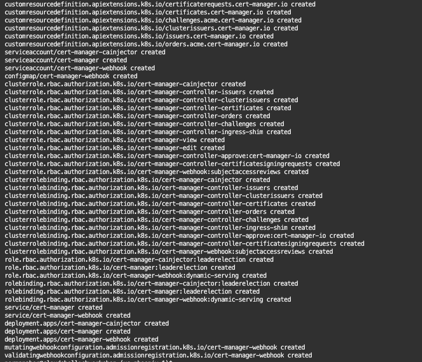
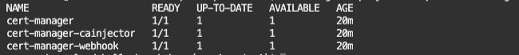
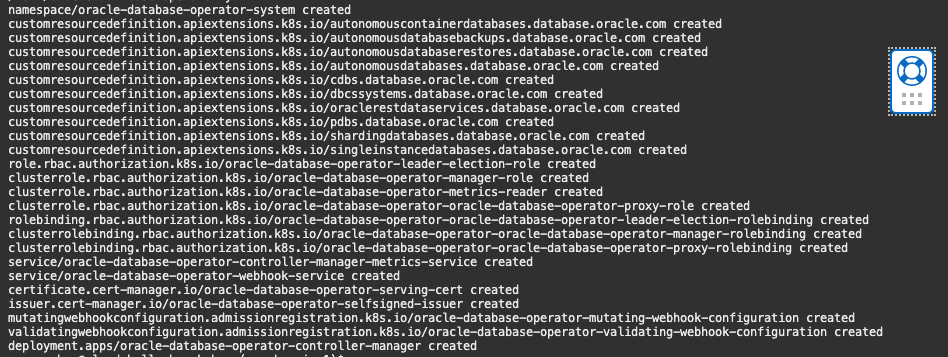
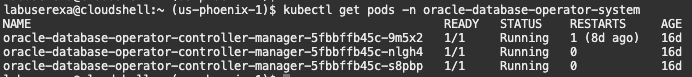
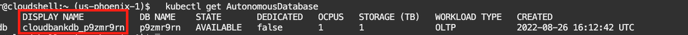
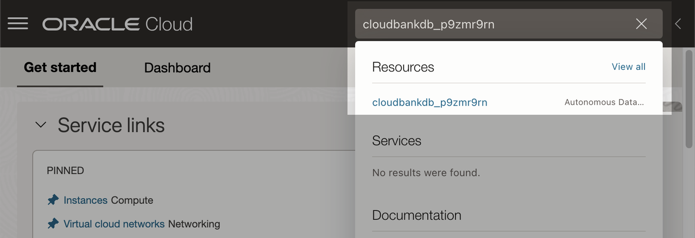

# Install the Database Operator

## Introduction
This lab will show you how to install the DB Operator Kubernetes (OraOperator), create an Autonomous Database (ADB) in your Kubernetes cluster, walk through its many functionalities and explain how it works.

Estimated Time:  10 minutes

### Objectives

* Install the DB Operator for Kubernetes
* Learn how the OraOperator works
* Provision an Autonomous Database
* Setup the Autonomous Database

### Prerequisites

* A fully provisioned OKE cluster from Lab 1

## Task 1: Install the DB Operator for Kubernetes

The operator uses webhooks for validating user input before persisting it in Etcd. Webhooks require TLS certificates that are generated and managed by a certificate manager.

1. Install the certificate manager with the following command:

    ```bash
    <copy>
    kubectl apply -f https://github.com/jetstack/cert-manager/releases/latest/download/cert-manager.yaml
    </copy>
    ```
    The command above will produce an output similar to the following image:

    

    After installing the certificate manager, check that the status of the cert-manager deployments is `Running` before moving on to Step 2:

    ```bash
    <copy>
    kubectl get deploy --namespace cert-manager
    </copy>
    ```


    

2. To install the operator in the cluster quickly, run the following command:

    ```bash
    <copy>kubectl apply -f https://raw.githubusercontent.com/oracle/oracle-database-operator/main/oracle-database-operator.yaml</copy>
    ```
    The command above will produce an output similar to the following image:

    

    Once the above has been executed, you can view the created pods that the DB operator is compromised of in your cluster:

    ```bash
    <copy>kubectl get pods -n oracle-database-operator-system</copy>
    ```

    

    ## Troubleshooting

    If you encounter the following error, wait a few seconds (not more than a minute) and try running the command again.

    ```bash
    Error from server (InternalError): error when creating "https://raw.githubusercontent.com/oracle/oracle-database-operator/main/oracle-database-operator.yaml": Internal error occurred: failed calling webhook "webhook.cert-manager.io": failed to call webhook: Post "https://cert-manager-webhook.cert-manager.svc:443/mutate?timeout=10s": EOF
    ```

    If you encounter the following error, check whether the cert-manager deployments are running.

    ```bash
    Error from server (InternalError): error when creating "https://raw.githubusercontent.com/oracle/oracle-database-operator/main/oracle-database-operator.yaml": Internal error occurred: failed calling webhook "webhook.cert-manager.io": failed to call webhook: Post "https://cert-manager-webhook.cert-manager.svc:443/mutate?timeout=10s": context deadline exceeded
    ```

## Task 2: Setup Secrets

With a working DB operator installed in your Kubernetes cluster, you can now provision Autonomous Databases (ADB), Single-Instance Databases (SIDB), Oracle On-Premises Databases, etc.

For this lab, you will use an Autonomous Database. To provision an Oracle Autonomous Database through the DB Operator for Kubernetes, you can use the below sample YAML file and configure it to your specific uses. More properties can be set and are shown in the official sample YAML file for ADB [<strong>here</strong>](https://github.com/oracle/oracle-database-operator/blob/main/config/samples/adb/autonomousdatabase_create.yaml).

> **Note:** As you go through creating the secrets and other Kubernetes resources, notice how the names of these resources correspond to the values in the below example YAML.


```yaml
# Copyright (c) 2022, Oracle and/or its affiliates. 
# Licensed under the Universal Permissive License v 1.0 as shown at http://oss.oracle.com/licenses/upl.
#
apiVersion: database.oracle.com/v1alpha1
kind: AutonomousDatabase
metadata:
  name: < kubernetes_adb_resource_name >
spec:
  details:
    compartmentOCID: < compartment_ocid >
    dbName: < unique_db_name >
    displayName: < oci_db_display_name >
    cpuCoreCount: 1
    adminPassword:
      k8sSecret:
        name: admin-password
    dataStorageSizeInTBs: 1
  ociConfig:
    configMapName: oci-cred
    secretName: oci-privatekey
```

With the Kubernetes Operator, you only need to configure a YAML file like the above and apply it to create databases, similar to the command below.

```bash
kubectl apply -f your-adb-configuration.yaml
```

To get started with creating an Oracle Autonomous Database, you will need to create the secrets and configmap above, which will have the same name as above (only per lab configuration; the names can be different for own your purposes).

1. Create the __config map oci-cred__

    This config map is used to authorize the operator with API signing key pair. To create it, run the following, which will retrieve the values for you from earlier in __Lab 1__. This configmap is referenced in the above example YAML file under `spec.ociConfig.configMapName`.

    ```bash
        <copy>
        kubectl create configmap oci-cred \
        --from-literal=tenancy=$(state_get .lab.ocid.tenancy) \
        --from-literal=user=$(state_get .lab.ocid.user) \
        --from-literal=fingerprint=$(state_get .lab.apikey.fingerprint) \
        --from-literal=region=$(state_get .lab.region.identifier)
        </copy>
    ```

2. Create the __secret oci-privatekey__

    This secret is used to authorize the operator with API signing key pair. To create this secret, run the following, which will use the private key file you uploaded and moved inside the cbworkshop directory earlier in  __Lab 1__. This secret is referenced in the above example YAML file under `spec.ociConfig.secretName`.

    ```bash
        <copy>
        (cd $CB_STATE_DIR ; kubectl create secret generic oci-privatekey --from-file=privatekey=./private.pem)
        </copy>
    ```

    > **Note:** This requires the private.pem file from Lab 1 Task 5.

3. Create the __secret admin-password__

    This secret is used to contain and provide the Admin password when the ADB is created. To create this secret, run the following, which will retrieve the default password set for the lab (per lab configuration; the password can be different for own your purposes). This secret is referenced in the above example YAML file under `spec.details.adminPassword.k8sSecret.name`.

    ```bash
    <copy>
          kubectl create secret generic admin-password --from-literal=admin-password=$(state_get .lab.fixed_demo_user_credential)
    </copy>
    ```


## Task 3: Provision an ADB

To provision an Autonomous Database (ADB), follow the steps below:

1. Run the following command to generate the lab-related YAML files to create the autonomous database.

    ```bash
    <copy>
    (cd $CB_STATE_DIR ; ./gen-adb-create.sh)
    </copy>
    ```

2. Apply the YAML file

    The `gen-adb-create.sh` script will produce an output similar to the one below on your terminal for applying the generated YAML file. Copy the last command: `kubectl apply ...` and run it.

    ```bash
    Retrieving Compartment OCID...DONE

    Generating YAML file...DONE
    Updating generated YAML file...DONE

    To apply:
    kubectl apply -f /home/labuserexa/cbworkshop/generated/adb-create.yaml
    ```

    You can also run the following command instead of copying from the instructions above:
  
    ```bash
    <copy>
    (cd $CB_STATE_DIR ; kubectl apply -f ./generated/adb-create.yaml)
    </copy>
    ```

    Applying the yaml file, you should get the following output

    ```bash
    autonomousdatabase.database.oracle.com/cloudbankdb created
    ```

3. View the ADB Resource

    With the OraOperator, you can now interact with your database through Kubernetes and the kubectl command. To get a list of AutonomousDatabases, you can run the following:

    ```bash
    <copy>
    kubectl get AutonomousDatabase
    </copy>
    ```

    This will produce an output similar to the below image. Once, the STATE becomes `AVAILABLE`, your Autonomous Database is ready.

    
    
    You can also view the created ADB on the OCI console. Navigate to the Databases page and check that you have a new AutonomousDatabase listed. To easily get the display name, you can run:

    ```bash
    <copy>
    kubectl get adb cloudbankdb -o='jsonpath={.spec.details.displayName}{"\n"}'
    </copy>
    ```

    Simply copy the Database display name onto the search bar on the OCI Console to navigate to the exact ADB resource.

    

    ## Troubleshooting

    If any problems occur with the provisioning, such as when the STATE is blank when you run `kubectl get adb`, you can check the logs of the deployment by running the following command:

    ```bash
    <copy>
    kubectl logs deployment/oracle-database-operator-controller-manager -n oracle-database-operator-system
    </copy>
    ```


## Task 4: Create a secret with the Autonomous Database Wallet

In the microservices application related to the lab, we have configured the back-end to connect to the database with a database wallet. The Oracle Database operator for Kubernetes provides means to generate a wallet and create a secret to enable you to inject it into deployments that need it. Below, the secret will be named `instance-wallet`.

> **Note:** As you go through creating the secrets and other Kubernetes resources, notice how the names of these resources correspond to the values in the below example YAML.

```yaml
# Copyright (c) 2022, Oracle and/or its affiliates.
# Licensed under the Universal Permissive License v 1.0 as shown at http://oss.oracle.com/licenses/upl.
apiVersion: database.oracle.com/v1alpha1
kind: AutonomousDatabase
metadata:
  name: cloudbankdb
  namespace: cloudbank
spec:
  details:
    autonomousDatabaseOCID: < autonomous_database_ocid >
    wallet:
      name: instance-wallet
      password:
        k8sSecret:
          name: instance-wallet-password
  ociConfig:
    configMapName: oci-cred
    secretName: oci-privatekey
```

Before creating the `instance-wallet`, make sure the autonomous database already exist before creating a secret for the wallet. Copy the below command and make sure the output is `AVAILABLE`.

```bash
<copy>
kubectl get adb cloudbankdb -o 'jsonpath={.status.lifecycleState}{"\n"}'
</copy>
```

1. To create the instance-wallet secret, you need a secret with the instance wallet password. Above, this is referenced as `instance-wallet-password`. Run the following command to create a secret for the wallet's password.

    ```bash
    <copy>
    kubectl create secret generic instance-wallet-password --from-literal=instance-wallet-password=$(state_get .lab.pwd.db_wallet)
    </copy>
    ```

2. To make things easier, you can run the following script to generate the lab-related YAML files to create the autonomous database wallet.
  
    ```bash
    <copy>
        (cd $CB_STATE_DIR ; ./gen-adb-wallet.sh)
    </copy>
    ```

    The `gen-adb-create.sh` script will produce an output similar to the one below for applying the generated YAML file.
  
    ```
    Retrieving Autonomous Database OCID...DONE

    Generating YAML file...DONE
    Updating generated YAML file...DONE

    To apply:
    kubectl apply -f /home/labuserexa/cbworkshop/generated/adb-wallet.yaml
    ```

3. Copy and run the `kubectl apply ...` command or simply apply the YAML file.

    ```bash
    <copy>
        (cd $CB_STATE_DIR ; kubectl apply -f ./generated/adb-wallet.yaml)
    </copy>
    ```

    Applying the YAML file should give an output similar to the below text:

    ```bash
    autonomousdatabase.database.oracle.com/cloudbankdb configured
    ```


4. View the `Autonomous Database wallet` secret created. There should be _two secrets listed_.

    ```bash
    <copy>
    kubectl get secrets | grep instance-wallet
    </copy>
    ```

    

## Task 5: Initialize the Autonomous Database

To begin initializing the database, simply run the following command below. This script will connect to the database to execute SQL scripts and initialize the Autonomous Database with lab-related database tables and create users.

1. Run the following script:

    ```bash
    <copy>
    (cd $CB_STATE_DIR ; ./init-database.sh)
    </copy>
    ```

## Task 6: Setup Secrets for SIDB (Used in Lab 4-6)

For Labs 4-6, you will be using Single-Instance Databases (SIDB) through Jenkins (you will not be provisioning any SIDB directly). To provision SIDBs through the DB Operator for Kubernetes, you can use the below sample YAML file and configure it for your specific uses. More types and properties can be found in the official sample YAML files for SIDB [<strong>here</strong>](https://github.com/oracle/oracle-database-operator/tree/main/config/samples/sidb).

> **Note:** As you go through creating the secrets and other Kubernetes resources, notice how the names of these resources correspond to the values in the below example YAML.

```yaml
# Copyright (c) 2022, Oracle and/or its affiliates.
# Licensed under the Universal Permissive License v 1.0 as shown at http://oss.oracle.com/licenses/upl.

apiVersion: database.oracle.com/v1alpha1
kind: SingleInstanceDatabase
metadata:
  name: < kubernetes_sidb_name >
  namespace: default
spec:
  edition: express
  adminPassword:
    secretName: sidb-admin-secret
  image:
    pullFrom: container-registry.oracle.com/database/express:latest
    prebuiltDB: true
  replicas: 1
```

1. Create the __secret sidb-admin-secret__
    
    This secret will be used to contain the Single Instance Database password. Note above that this secret is referenced in the above YAML example under `spec.adminPassword.secretName`.
    
    ```bash
    <copy>
    kubectl create secret generic sidb-admin-secret --from-literal=oracle_pwd=$(state_get .lab.fixed_demo_user_credential)
    </copy>
    ```
    The above command will produce the following output:
    ```
    secret/sidb-admin-secret created
    ```


You may now **proceed to the next lab.**

## Acknowledgements

* **Authors** - Norman Aberin, Developer Advocate
* **Last Updated By/Date** - Norman Aberin, September 2022
