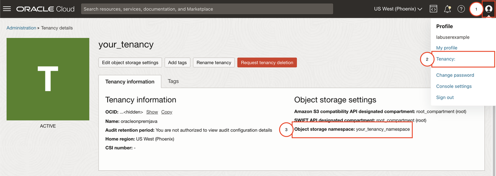
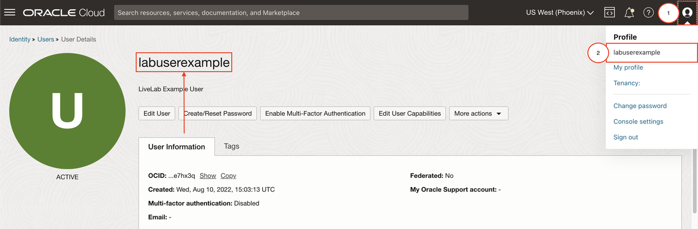
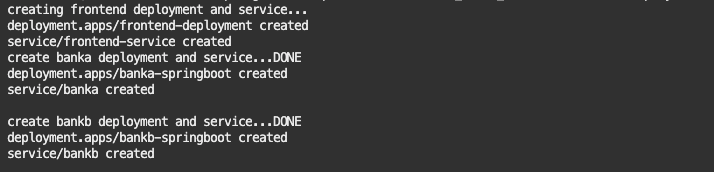
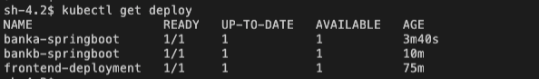
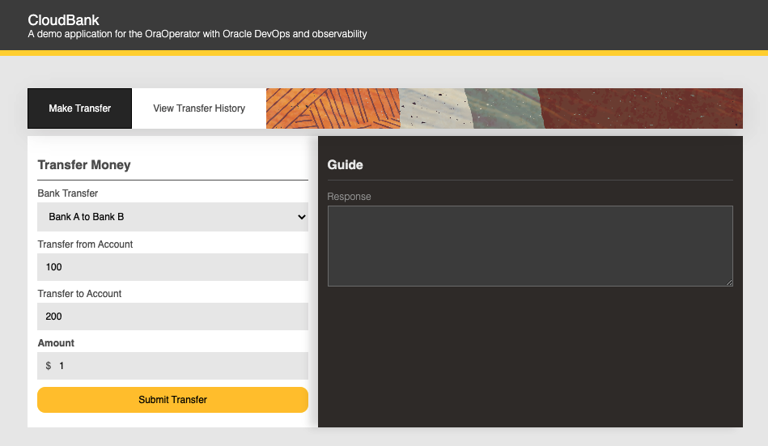
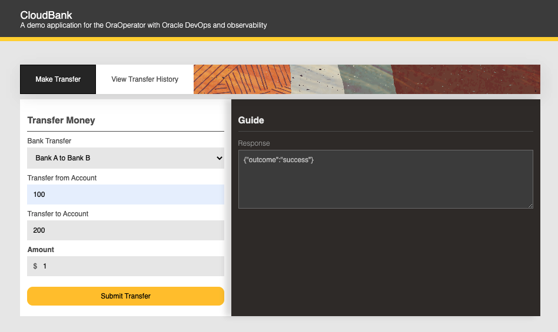

# Deploy the Microservices App

## Introduction
This lab will show you how to build and deploy the application used by the lab to your Oracle Kubernetes Engine (OKE) cluster. The application uses maven for build automation, react for front-end and spring-boot to connect to the database and serve requests and serve the frontend. More notably, the Spring Boot application leverages the Advanced Queueing capabilities of the database.

Estimated Time: 10 minutes

### Objectives

* Build and Push the application to OCI Container Registry
* Deploy the application to OKE
* Test the application

### Prerequisites

* This lab presumes you have already completed the earlier labs.
* Working Kubernetes cluster

## Task 1: Prepare for Application Deployment

1. Login to your tenancy's OCI Registry (OCIR) to authorize the pushing of application images to OCIR. For help on how to retrieve the information below on the console, click on the dropdown below. When prompted for the password, retrieve and provide from your notes the Auth token you copied earlier as the password.

    ```bash
    <copy>
    docker login <region-key>.ocir.io
    </copy>
    ```

    ```bash
    # Example Output
    docker login phx.ocir.io
    Username: your_tenancy_namespace/labuserexample
    Password: <auth-token>
    ...

    Login Succeeded
    ```

  ## How to get the region key
     
    The region key is a shortened form of your region. For example, the region us-phoenix-1 will have a region key of PHX; the region us-ashburn-1 will have a region key of IAD. You can view the list of regions and their keys [here](https://docs.oracle.com/en-us/iaas/Content/General/Concepts/regions.htm#About:~:text=and%20Availability%20Domains-,About%20Regions%20and%20Availability%20Domains,-Fault%20Domains). 

    Alternatively, you can also run the following command which leverages the OCI CLI on Cloud Shell:

    ```bash
    <copy>
    oci iam region list | jq -r --arg REGION $(state_get .lab.region.identifier) '.data[] | select (.name == $REGION) | .key '
    </copy>
    ```
    > **Note:** Region Keys should be lowercase when running `docker login.`

    ## How to get the tenancy namespace

    The tenancy namespace is not always the same as the tenancy name. To retrieve it, on the OCI Console, you can click on your Profile (top-right user icon) and navigate to `Tenancy: <your_tenancy>`. This will open the Tenancy page on the console, from which you can copy the Object Storage namespace.

    

    Alternatively, you can also run the following command which leverages the OCI CLI on Cloud Shell:

    ```bash
    <copy>
    oci os ns get | jq -r .data
    </copy>
    ```

    ## How to get your username
     
    To retrieve your username, on the OCI Console, click on your Profile (top-right user icon) and click on your username. Your username should then be displayed at the top.

    

    > **Note:** Your username will include oracleidentitycloudservice if you are logged in as a federated user. Include this part as your username along with the forward slash.

    Alternatively, you can also run the following command which leverages the OCI CLI on Cloud Shell:

    ```bash
    <copy>
    oci iam user get --user-id $(state_get .lab.ocid.user) | jq -r .data.name
    </copy>
    ```

2. Set the Java Version to 11

    Cloud Shell offers a utility to easily switch between any available Java versions that are supported by the service. You can switch versions by running:

    ```bash
    <copy>
    csruntimectl java set openjdk-11.0.16
    </copy>
    ```

## Task 2: Build and Deploy the applications

1. Build the front-end and back-end application by running the following command:

    ```bash
    <copy>
    (cd $CB_STATE_DIR ; ./cloudbank-build.sh)
    </copy>
    ```

    This command will install the dependencies, build the application and push to your OCI Registry.

2. Once the application successfully builds, deploy the application by running the following command:

    ```bash
    <copy>
    (cd $CB_STATE_DIR ; ./cloudbank-deploy.sh)
    </copy>
    ```

    This command will apply the deployment and service YAML files to run the application containers on your cluster. The following output is expected to appear:

    

3. View the application deployments by running:

    ```bash
    <copy>
    kubectl get deploy
    </copy>
    ```
    The above command will give an output similar to what is shown in the below image:

    

## Task 3: Navigate through the CloudBank Application

1. Retrieve the `EXTERNAL IP` by running the below command. This will show a table of values for the frontend-service of type LoadBalancer. Copy the value under `EXTERNAL-IP`.

    ```bash
    <copy>
    kubectl get svc frontend-service 
    </copy>
    ```

2. View the microservices app by navigating to the website with the IP address
   
    ```bash
    <copy>
    https://<ip-address>
    </copy>
     ```

    > **Note:** If you are using Chrome, you may encounter a warning that the connection is not private and no visible way to advance. This is because the certificate provided is self-signed and not a paid official certificate. As a workaround, type `thisisunsafe`.


3. You will be prompted by the application to log in. Use `cloudbank` as the username and the password you provided earlier on during setup. 

    Username: __`cloudbank`__
    Password: `<your-frontend-login-password>`

4. Try out the application by making a transfer request. Copy the following request

    

    Click on `Submit Transfer`. This will result in the following response you see on the right.
    
    

You may now **proceed to the next lab.**

## Acknowledgements

* **Authors** - Norman Aberin, Developer Advocate
* **Last Updated By/Date** - Developer Advocate, August 2022
