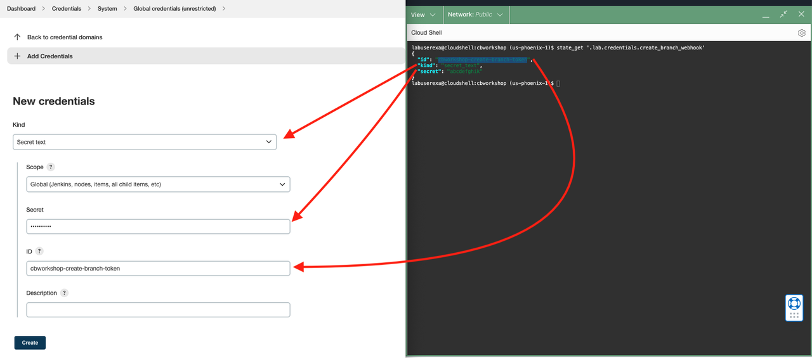
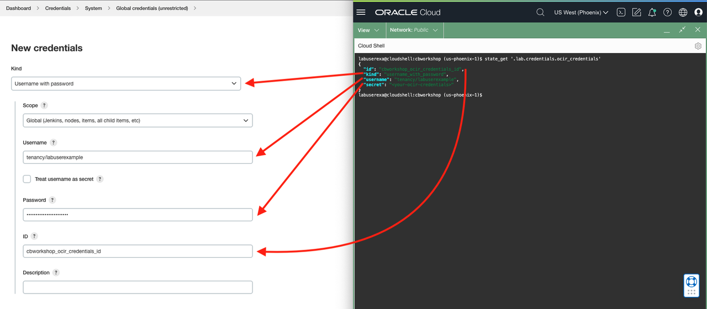

#  Preparing Jenkins and Configuring Webhooks

## Introduction

For this lab, you will create multiple pipelines in Jenkins that will run jobs for different scenarios. Currently, you have a working environment from Lab 3, the previous lab. You can call this environment your TEST environment, where your QA team can test all features, bugs and updates developed and fixed after a sprint and for review before merging to master and tagging. You will also have a DEV branch that should contain all completed features and fixes that the team worked on. For those features and fixes, you will be creating and committing those changes into feature branches - which will create and provide an isolated, shared and easily-replaceable environment (currently only a database to demonstrate usage of the Oracle Database operator for Kubernetes). Once DEV is ready, you will create a `release-1.0` branch, which will update the TEST environment.


<!-- This lab will walk you through CI/CD workflow using the pipeline built in the previous lab.

 -->

Estimated Time: XX minutes

### Objectives

* CI/CD Workflow Walkthrough
  
### Prerequisites

<!-- * Oracle Cloud Infrastructure Services, like OKE cluster, OCIR and the Autonomous Transaction Processing databases, GitHub, and Jenkins that you created and configured in earlier labs
* The latest version of Git, [GitHub Desktop] (https://desktop.github.com/) and your preferred editor, such as Visual Studio Code, or IntelliJ Idea installed locally on your computer.
* This lab presumes you will set up a workshop repository in your own GitHub account. -->

<!-- > **Note:** As this is a demonstration of Jenkins/GitHub integration for CI/CD, **you must use your own GitHub account to run it. Please fork or copy [Oracle Microservices GitHub repository](https://github.com/oracle/microservices-datadriven) into your own GitHub account**. -->

## Task 1: Generate a Github Access Token

To allow Jenkins to access your repository, a Jenkins credentials must be made with your GitHub credentials. It is highly recommended to generate a restrictive Personal Access Token, with which we can control how much access and for how long we want to provide.

1. On your GitHub account, click on your profile at the top right and select `Settings`.

   

2. From here, scroll down and go to `Developer Settings` on the left

   

3. Under Developer Settings, navigate to `Personal access tokens`, and click on `Generate new token`

   

4. Creating a new personal access token, you can add a Note to help you remember what the token is for. For example, you can set:
    ```
    <copy>
    repo-access-only
    </copy>
    ```
5. Under `Select scopes`, Select `repo`
      ```
      repo - Full control of private repositories
      ```

   

6. At the bottom of the page, click `Generate token` to complete the step and generate the token

<strong style="color: #C74634">Note</strong>: Copy and keep your Github Access Token in your notes.

## Task 2: Configure Jenkins Credentials
You will need to create some credentials in Jenkins to authorize access to both our Kubernetes cluster and GitHub, as well as webhook tokens.

To access the Jenkins Console, you will need to retrieve the IP address to visit on your browser. 

1. Run the following on __Cloud Shell__. This command retrieves the IP address from Terraform as one of the outputs

      ```bash
      <copy>
      terraform -chdir="$CB_STATE_DIR/terraform" output -json | jq -r .jenkins_public_ip.value
      </copy>
      ```
2. Login as `admin` with the `Jenkins password` you supplied earlier.
   
   Retrieve the password from your notes, which you provided during setup.

   

3. Navigate to the Jenkins credentials store to create credentials

      1. From the home page, click on Manage Jenkins
      2. From the Manage Jenkins page, Under Security, go to Manage Credentials
      3. Hover over (global), the domain for the Jenkins Store (under Stores scoped to Jenkins)
      4. Click on the dropdown
      5. Click on Add credentials

      
      

4. On __Cloud Shell__, run the following command to get a list of the credentials that need to be created. 

      ```bash
      <copy>
      ( cd $CB_STATE_DIR/tasks ; ./generate-credentials-help.sh )
      </copy>
      ```
      The below command should output the id, kind and the secret of credentials to be created. Copy the information as you create the credentials on Jenkins.

      ```json
      {
      "create_branch_webhook": {
         "id": "cbworkshop-create-branch-token",
         "kind": "secret_text",
         "secret": "<someToken>"
      },
      "delete_branch_webhook": {
         "id": "cbworkshop-delete-branch-token",
         "kind": "secret_text",
         "secret": "someToken"
      },
      "push_branch_webhook": {
         "id": "cbworkshop-push-token",
         "kind": "secret_text",
         "secret": "someToken"
      },
      "tenancy_namespace": {
         "id": "cbworkshop-tenancy-namespace",
         "kind": "secret_text",
         "secret": "tenancyNamespace"
      ...
      ```

      For example, below, on the right side of the screen is the output from the command and Jenkins credentials store on the left. Notice how each property value maps to the inputs for Jenkins credentials.
      
      

      

## Task 3: Configure the Create-Branch Pipeline
Once you have created the credentials, we can now move on to create the Jenkins pipelines that we will use and trigger on different parts of our DevOps workflow.


This first pipeline will be responsible for creating isolated environments when we have features to work on. In this first iteration, we will only provision and setup a Single Instace Database with scripts to initialize schemas and queues through the Kubernetes operator.

Create a new Pipeline by clicking on `+ New Item`

1. Enter an item name: `Create-Branch-Pipeline`
2. Select `Pipeline`
3. Click `OK`
4. Under Build Triggers, select `GitHub hook trigger for GITScm polling`
5. Under Pipeline, select `Pipeline script from SCM`
6. Under Pipeline > SCM, set `Git`
7. Set Repository HTTPS URL
8. Set the Credentials to your GitHub credentials created earlier, which should appear as `<github-username>/******`
9. Under Branch Specifier, change `*/master`  to 
      ```bash
      <copy>
      :^(origin/feature/|origin/release/|origin/dev$).*
      </copy>
      ```
10. Build Configuration, Script Path:
      ```bash
      <copy>
      examples/cloudbank/jenkins/create-dev-env/Jenkinsfile
      </copy>
      ```
11. Click `Save`

With our pipeline configured, we will need to build our pipeline initially to enable Jenkins to register our Pipeline parameters and settings

1. Click on `Build Now`

The Pipeline should **succeed**.

## Task 4: Configure the Delete-Branch Pipeline

This second pipeline will be responsible for tearing down our isolated environments when we no longer have a need for them after merging our work back to our main branch (test). In this first iteration, we will only destroy and clean up our database through the Kubernetes operator.

Create a new Pipeline by clicking on `+ New Item`

1. Enter an item name: `Cleanup-Branch-Pipeline`
2. Select `Pipeline`
3. Click `OK`
4. Under Build Triggers, select `GitHub hook trigger for GITScm polling`
5. Under Pipeline, select `Pipeline script from SCM`
6. Under Pipeline > SCM, set `Git`
7. Set Repository HTTPS URL
8. Set the Credentials to your GitHub credentials created earlier, which should appear as `<github-username>/******`
9. Under Branch Specifier, change `*/master` to
      ```bash
      <copy>
      :^(origin/feature/|origin/dev$).*
      </copy>
      ```
10. Build Configuration, Script Path:
      ```bash
      <copy>
      examples/cloudbank/jenkins/destroy-dev-env/Jenkinsfile
      </copy>
      ```
11. Click `Save`


## Task 5: Configure the Push-Branch Pipeline
This third pipeline will build and test the applications on push to dev and feature-branches.

Create a new Pipeline by clicking on `+ New Item`

1. Enter an item name: `Push-Pipeline`
2. Select `Multibranch Pipeline`
3. Under Branch Source, `Add source` , select `GitHub`
4. Set Credentials to your GitHub credentials
5. Set Repository HTTPS URL
6. Validate by clicking on `Validate` below the Repository HTTPs URL
7. Build Configuration, Script Path:
      ```bash
      <copy>
      examples/cloudbank/jenkins/push/Jenkinsfile
      </copy>
      ```
8. Under Scan Multribranch Pipeline Triggers, select `Scan by webhook`
9. Under Trigger token, set it to the secret you enterred earlier for `cbworkshop-push-token`.

   You can retrieve this quickly by running the following command and using the property value for `secret`:
      ```bash
      <copy>
      state_get .lab.tokens.push_branch_webhook
      </copy>
      ```

You should see Finished: Success under Scan Repository Log


## Task 6: Configuring GitHub Webhooks
Back on Github, you will need to create multiple webhooks which will send specific payloads and trigger the different pipelines you created from Task 3-5.

Run the following command to get a list of the webhooks that need to be created on your own fork of the lab repository.

```bash
   <copy>
   ( cd $CB_STATE_DIR/tasks ; ./generate-webhooks-help.sh )
   </copy>
```
The above command should provide a list with the Jenkins IP address and tokens pre-filled similar to this output below. Use this as a guide when creating GitHub Webhooks.
```json
{
  "create_branch_webhook": {
    "payload_url": "http://ipaddress/generic-webhook-trigger/invoke?token=token",
    "content_type": "application/json",
    "event": "Branch_or_tag_creation_only"
  },
  "delete_branch_webhook": {
    "payload_url": "http://ipaddress/generic-webhook-trigger/invoke?token=token",
    "content_type": "application/json",
    "event": "Branch_or_tag_deletion_only"
  },
  "push_branch_webhook": {
    "payload_url": "http://ipaddress/multibranch-webhook-trigger/invoke?token=token",
    "content_type": "application/json",
    "event": "Just_the_push_event"
  }
}
```

1. On GitHub, navigate to your own fork of the repository.
2. To create webhooks, navigate to Settings -> Webhooks then click on `Add webhook`

      

3. Map the properties from the output earlier to the fields on GitHub webhooks.

   For example, below, on the right side of the screen is the output from the command and the GitHub webhook form on the left. Notice how each property value maps to the inputs for GitHub webhook creation.

      

    <strong style="color: #C74634">Note</strong>: For webhooks `create_branch_webhook` and `delete_branch_webhook, make sure to deselect the Push event (as they are selected by default).

    After all three webhooks have been created, your repository's webhooks listing should appear similar to the ones in the image below.
   
   

## Acknowledgements

* **Authors** - Norman Aberin, Developer Advocate
* **Last Updated By/Date** - Norman Aberin, August 2022
