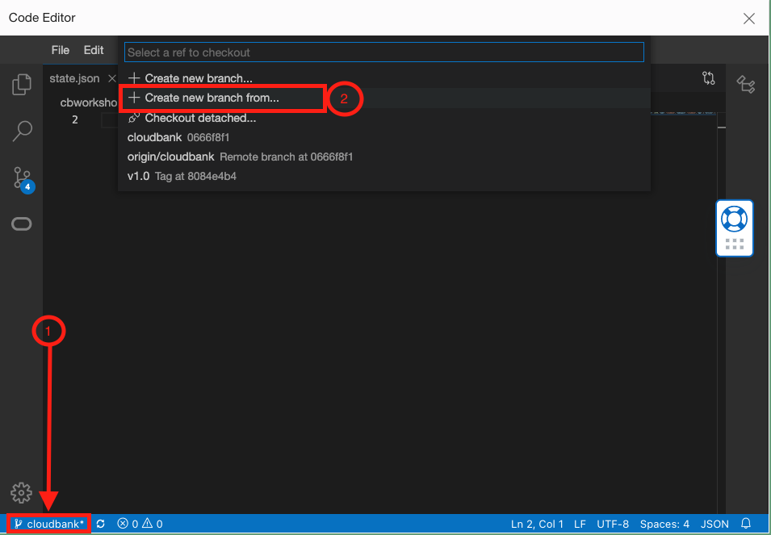
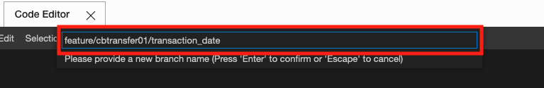
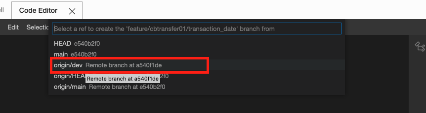
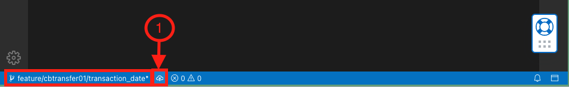
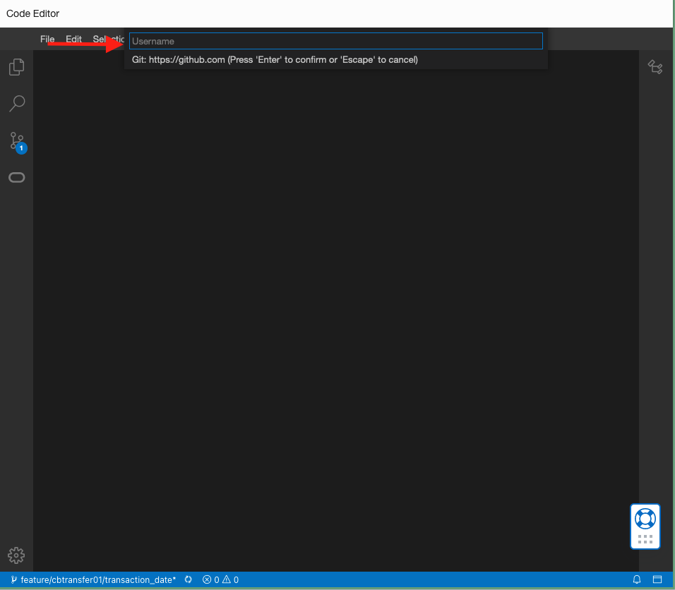
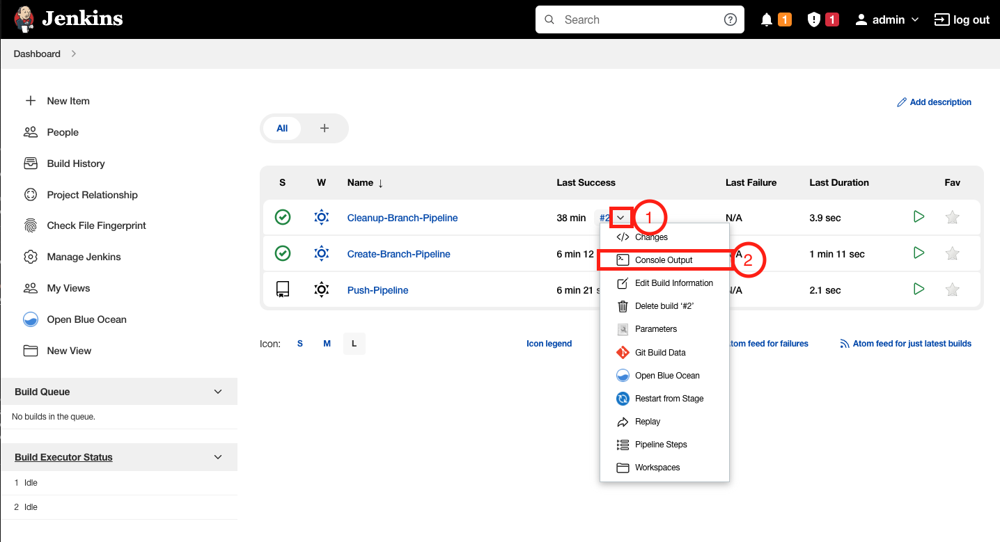
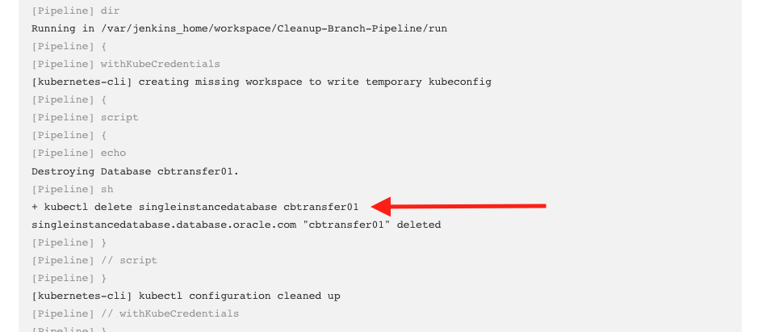

#  Making and Monitoring Application Changes

## Introduction

<!-- This lab will demonstrate how to integrate Jenkins and GitHub Repository using Github Branch Source Plugin for Liquibase with SQLcl Use Case. -->

Estimated Time:  15 minutes

### Objectives

<!-- * Execute GitHub Configuration
* Execute Jenkins Configuration
* Configure a Multibranch Pipeline -->
  
### Prerequisites

* This lab presumes you have already completed the earlier labs.
* As this is a demonstration of Jenkins/GitHub integration for CI/CD, **you must use your own GitHub account to run it.** We assume you completed this step in Setup lab.

## Task 1: Creating a feature branch

We have a new feature request to display the transaction date besides the outcome of the transfer. To implement this, you will be creating a new branch to start developing in. The changes have already been implemented in the database but have not yet been reflected in the backend application.

1. To get started, create a feature branch on GitHub, from the `dev` branch
     
     ```
     <copy>
     feature/cbtransfer01/transaction_date
     </copy>
     ```

     You can also create the branch straight from __OCI's Code Editor__. Follow the instructions below to learn how.

  ## Creating a Branch from the Code Editor

  To begin, open the Code Editor on the OCI Console. This will be the button on the top right between the OCI Cloud Shell icon and the Notifications (bell icon).

   ""

  You will see that we are currently on the main branch at the bottom left. Click on that button to open the drop-down to see a list of branches you can checkout (or switch to) as well as create branch options. Select `Create branch from`
  

  Set the name of the branch to the branch name above
   ""

  Then click on origin/dev to create it from `dev`
  

  To publish these changes, click on the cloud icon at the bottom and follow the prompts to authorize access to your fork.

  Then click on origin/dev to create it from `dev`
  

  This will prompt you to authenticate. Put in your GitHub username and your GitHub Personal Access token you generated from Lab 4 Task 1.
     

     


  With a simple creation of a feature branch (only branches named `feature/*`), our create-branch pipeline on Jenkins will be triggered and create an isolated environment.

## Task 2: Viewing the created isolated environment (Optional)

After the branch is created, you can go to your Fork's Settings -> Webhooks to view the payload/event sent by GitHub.

Once the isolated database environment is fully provisioned, you can retrieve the details to connect to your database.

```bash
kubectl get singleinstancedatabase cbtransfer01 -o jsonpath='{.status.pdbConnectString}'
```

You can also navigate back to Jenkins and view the create-branch Pipeline's Console Output.

## Task 3: Updating the Spring Boot application

With a feature branch, you can start developing the feature you are working on and connect it to the created development database for testing your back-end features extensively.

For this task,you can make use of the new Code Editor available on Cloud Shell. You can also do the same outside of OCI Code Editor (your local computer with an editor or IDE of your choice). However the following instructions will be using the Code Editor.

1. Open the `backend-springboot` directory on __Code Editor__.

 ## How to Navigate to the Back-end Application on Visual Studio Code

     On the toolbar at the top, click on `File` then `Open Workspace` to open the repository you cloned in Lab 1 Task 2.

     You can also use the shortcuts to open workspaces. 
     * `Option(⌥)+CMD(⌘)+W` on Mac
     * `CTRL+Alt+W` on Windows

    


     A directory tree will appear which will contain the directory of your fork. Select and open this directory by click on the Open Button:
     ```bash
     oracle.cloud.native.devops-oraoperator
     ```

     <strong style="color: #C74634">Note</strong>: If on the OCI Code Editor, you are still on the main branch, checkout the created feature branch now or revisit `Task 1: Creating a feature branch` where you can find not only how to create but also how to change branches. You can also run the following on the Terminal: 
     ```bash
     <copy>
     git checkout feature/cbtransfer01/transaction_date
     </copy>
     ```


2. The feature we have been asked to develop requires a change in the `TransferController.java` file inside the `backend-springboot` application. Navigate to this file through the __Explorer__ panel on the left side of the Code Editor.

     You can also use the shortcuts to open files. 
     - `CMD(⌘)+O` on Mac
     - `CTRL+O` on Windows

     Search for and open the file `TransferController.java`
          

3. Make development changes to the back-end codebase.

     The `TransferController.java` file has been prepared to minimize the amount of changes you have to make and reduce confusion. Therefore, this feature will only require a one-line change.

     On the `TransferController.java` file, scroll down to `Line 60`. You can also quickly jump to the line by pressing `CTRL+G` and typing `60`

     On __`Line 60`__, update the return statement into:
     ```java
     <copy>
     return new TransferOutcomeWithDateRecord("success", updated);
     </copy>
     ```

     

     

## Task 4: Testing the changes locally
Now that the tiny feature has been added, you can test our changes by running the application.

1. Navigate to the `backend-springboot` directory.

     Open the terminal by clicking on the top toolbar -> Terminal. You can also open a terminal through the shortcut <code>CTRL+`</code>

     

     Then navigate to the directory by running
     ```
     cd examples/cloudbank/backend-springboot
     ```
     <strong style="color: #C74634">Note</strong>: The relative path above will work if you opened the repository directory as a __workspace__. 


2. Build the application by running
          ```bash
          <copy>
               mvn clean package
          </copy>
          ```
     <strong style="color: #C74634">Note</strong>: Above we are using the maven CLI to run project lifecycles. OCI Code Editor comes with tools pre-installed, which includes `mvn` amongst many others. If you are testing locally, make sure you have maven installed.


3. Set environment variables
          ```bash
          <copy>
               . environment.sh
          </copy>
          ```

     The environment.sh script sets variables that the application expects such as Database connection details, specific users that application is currently running as, etc.

4. Run the application by running
          ```bash
          <copy>
               mvn spring-boot:run
          </copy>
          ```

5. You can run the curl command on __Cloud Shell__ or __Code Editor__, which will make a POST request to the `/transferfunds` endpoint and make a transfer from Bank A to Bank B of an amount of $1.00.

     On OCI Code Editor, open a new terminal by pressing <code>CTRL+`</code>.


     ```bash
          <copy>
          curl -X POST --location "http://localhost:8080/transferfunds" \
          -H "Content-Type: application/json" \
          -d "{
                    \"fromBank\": \"banka\",
                    \"toBank\": \"bankb\",
                    \"fromAccount\": \"100\",
                    \"toAccount\": \"100\",
                    \"amount\": 1
          }"
          </copy>
     ```

     Your output should resemble the below JSON response
     ```
     {"outcome":"success","transactionDate":"2022-08-11 00:45:06"}
     ```
     For now, this is the full scope of your feature. You can keep testing and running different payloads to the same endpoint by simply changing the body of the curl command. Your inserts are committed into an isolated, live and working Oracle database you can easily connect to and modify.

     
     You can now proceed to pushing these changes.


## Task 5: Pushing the changes
Once you are satisfied with your changes and manual testing, you can start checking your changes into GitHub. Since we are working and will be pushing from the CloudShell, we will need to login when we make a commit.

1. Run the following and replace the example email and the username with your GitHub email and GitHub username. This will set your identity for when you make commits and pushes.
     ```bash
     git config --global user.email "you@example.com"
     git config --global user.name "Your Name"
     ```
2. Add the changed file to stage, on a Code Editor terminal

     ```bash
     <copy>
     git add examples/cloudbank/backend-springboot/src/main/java/com/cloudbank/springboot/transfers/TransferController.java
     </copy>
     ```

3. Commit the changes

     ```bash
     <copy>
     git commit -m "Updated response with TransactionDate"
     </copy>
     ```

4. Push the changes upstream.

     The below command will prompt you to login again to authorize these pushing these changes similar to Task 1. Simply provide your GitHub username and the Personal Access Token you generated.

     ```bash
     <copy>
     git push -u origin feature/cbtransfer01/transaction_date
     </copy>
     ```

## Task 6: Merge to dev

Once you have made the updates to our branch and you are done with our features/fixes, you can merge the changes into dev. Navigate back to GitHub and you may see a notification for changes coming from your branch.

, you can click the above and

1. Navigate to Pull Requests and click on New pull request
2. Open a Pull Request from `feature/cbtransfer01/transaction_date` to `dev`.

     For both the base repository and head repository, select your own forked repository (contains your username). This will simplify the form to a PR from your feature branch to `dev` as shown below.

     

     For the title of the comment, simply add the following:
     ```
     <copy>
     cbtransfer01-transaction-date-feature
     </copy>
     ```

     Click on `Create Pull Request`.

3. Merge the feature branch
    
    Normally, the pull-requests will be assigned, reviewed, merged or auto-merged by someone in your team. In this part of the lab, you can proceed to Merge the Pull Request.

    

    You will be prompted to confirm the merge, click on Confirm merge to complete this step.
    
4. Delete the feature branch

     Finally, you are done with your feature branch and you no longer have a need for it and the isolated environment it is attached to. Simply click on __Delete branch__ and the environment will be deleted.


    


## Task 7: Check the deleted isolated environment (optional)

Once the feature branch has been removed. You can navigate back to Jenkins and see that the Cleanup-Branch-Pipeline was triggered and was successful.

You will see that the Last Build(#2), ran a few minutes ago from when we deleted the feature branch. __Hover__ over the #2 link, click on the dropdown icon and finaly go to Console Output.



     

In the output, you will notice that the environment is cleaned when this pipeline runs, or when feature branches are deleted.


     

     


## Task 8: Creating a Release Preview

Once we are done with our sprint, and we have the necessary features, fixes and changes all merged into `dev`, you can now create a release-branch from `dev` with which we can preview the updates with.

This will update the environment you have built from Lab 1-3.

1. __Create a release branch__ from __dev__

     Since you will no longer make application changes, in this Task, you can create the branch from GitHub instead.
          
     ```bash
          <copy>
          release/1.0
          </copy>
     ```

  ## How to Create a Branch from GitHub
     To create a branch from GitHub,
     
     1. Navigate to the `Code` tab of your Fork

     2. Click on the `main` (branch) button to view a dropdown of branches. Click on the `__dev__` branch.
     
          

     3. Once the page reloads, you will now see dev as you are viewing the repository in the dev branch. Click on`dev` again
     and type in the textfield the branch name and the option to create it will appear. Click on the Create branch option below (#3)

          


     Creating the above branch will trigger the Create-Branch pipeline and will update your TEST environment from LAB 1.

2. Check Jenkins Create-Branch-Pipeline

     Going back to Jenkins, you will notice that the pipeline Create-Branch-Pipeline also gets triggered upon creation of release branches, similar to feature branches.

     

          
     <strong style="color: #C74634">Note</strong>: To get to the Console Output, hover over #3 under Last Success in the image above and click on Console Output from the dropdown. (Check Task 7 for an example)

     If you navigate again to the Console Output, you will see that the release branch updates the Test environment and the deployments. You will also notice that the images took the release version __1.0__ as a tag.

     

     As branches, if there needs to be an update to releases, your team can fix forward and simply delete and prepare a new release without repercussions. Once completed, tested and approved, you can create the release tag on GitHub.


This completes the LiveLab. You may now **proceed to Teardown.**

## Acknowledgements

* **Authors** - Norman Aberin, Developer Advocate
* **Last Updated By/Date** - Norman Aberin, August 2022
