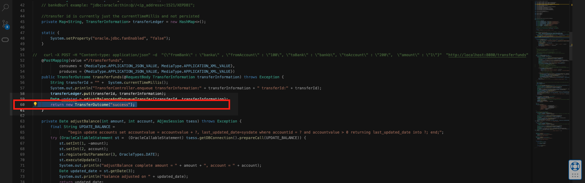

#  Making and Monitoring Application Changes

## Introduction

This lab will walk you through making changes in the code and propagating this change from development to release through automation. In this lab, you will trigger the different Jenkins pipelines to build, deploy and update your application from the previous lab.

Estimated Time: 20 minutes

### Objectives

* Make Application Changes
* Push Changes using Git
* View Application Changes
  
### Prerequisites

* This lab presumes you have already completed the earlier labs.
* As this is a demonstration of Jenkins/GitHub integration for CI/CD, **you must have a GitHub fork of the lab repository.** It is assumed you completed this step in Lab 1.

## Task 1: Create a feature branch

You have a new request to display the transaction date besides the outcome of the transfer. To implement this feature, you will be creating a new branch for development. The changes have already been implemented in the database but have not yet been reflected in the back-end application. Follow the instructions below to get started and create a new branch.

1. Navigate to your local clone of your fork
    
    ```bash
    <copy>
    cd $ROOT_DIR
    </copy>
    ```

2. Track the remote branch, `dev`. You can do this by running the following command on the Cloud Shell.
   
    ```bash
    <copy>
    git remote set-branches --add origin dev
    </copy>
    ```
    Then fetch the remote branch by running:

    ```bash
    <copy>
    git fetch origin dev:dev
    </copy>
    ```

3. Create a feature branch on GitHub, from the `dev` branch
     
    ```bash
    <copy>
    git checkout -b feature/cbtransfer01/transaction_date origin/dev
    </copy>
    ```

     > **Note:** Notice that the branch name follows the following pattern `<branch_group>/<uniqueId>/<short_description>` where the uniqueId is used as the identifier for any environment.

4. Publish the new branch to your remote (your fork)

    ```bash
    <copy>
    git push -u origin feature/cbtransfer01/transaction_date
    </copy>
    ```

    This will prompt you to authenticate this request to update and add a new branch to your fork, similar to the following:

    ```bash
    labuserexa@cloudshell:oci-react-samples (us-phoenix-1)$ git push -u origin feature/cbtransfer01/transaction_date
    Username for 'https://github.com': labuserexample
    Password for 'https://labuserexample@github.com': 
    ```

    With the creation of a feature branch, your create-branch pipeline on Jenkins will be triggered and create an isolated environment, which currently only consists of a single-instance database.

## Task 2: View the created isolated environment (Optional)

1. After the branch creation, return to your fork's Webhooks page on GitHub to view the payload/event sent to Jenkins. On your list of payloads, select the one with the `create` event and is most recent. You should see something similar to the image below, with the response body indicating that a job was triggered. 

    

2. Back on the OCI Cloud Shell, you can run the following and see that a new SIDB has been provisioned.

    ```bash
    <copy>
    kubectl get singleinstancedatabase
    </copy>
    ```

    > **Note:** Notice that the name of this new resource matches a part of the name of the branch you created earlier. This is because Jenkins is setup to use that to identify the environment.

3. Once the isolated database environment is fully provisioned, you can retrieve the details to connect to that specific environment's database:

    ```bash
    kubectl get singleinstancedatabase cbtransfer01 -o jsonpath='{.status.pdbConnectString}{"\n"}'
    ```

## Task 3: Update the Spring Boot application

With a feature branch, you can start developing the feature you are working on and connect it to the database for testing your back-end features extensively.

You can use the new Code Editor available on Cloud Shell. You can do the same outside of OCI Code Editor (your local computer with an editor or IDE of your choice). However, the following instructions will be making use of the Code Editor.

1. Open the Code Editor on the OCI Console. This will be the button on the top right between the OCI Cloud Shell icon and the Notifications (bell icon).

    


2. On the toolbar at the top, click on `File` then `Open Workspace` to open the repository you cloned in Lab 1 Task 2.

    You can also use shortcuts to open workspaces. 

    * `Option(⌥)+CMD(⌘)+W` on Mac
    * `CTRL+Alt+W` on Windows

    

    A directory tree will appear which will contain the directory of your fork. Select `oci-react-samples` and open your local clone of the repository by clicking on the Open Button:

    

3. Make changes in the `TransferController.java` file inside the `backend-springboot` application. Navigate to this file through the __Explorer__ panel on the left side of the Code Editor.

    You can also use shortcuts to open files. 

    - `CMD(⌘)+O` on Mac
    - `CTRL+O` on Windows

    Search for and open the file `TransferController.java`

    
          

4. Make development changes to the back-end codebase.

    The `TransferController.java` file has been prepared to minimize the number of changes you have to make and reduce confusion. Therefore, this feature will only require a one-line change. On the `TransferController.java` file, scroll down to `Line 60`.  You can also quickly jump to the line using the following shortcuts:

    * `CTRL+G` on Mac and Windows

    On __`Line 60`__, update the return statement into:

    ```java
    <copy>
    return new TransferOutcomeWithDateRecord("success", updated);
    </copy>
    ```

    

    

## Task 4: Test the changes locally

Now that the tiny feature has been added, you can test our changes by running the application.

1. Navigate to the `backend-springboot` directory.

    Open the terminal by clicking on the top toolbar -> Terminal. You can also open a terminal through the shortcut <code>CTRL+`</code>

    

    Then navigate to the directory by running `cd <path>`:

    ```bash
    <copy>
    cd cloudbank/backend-springboot
    </copy>
    ```

    > **Note:** The relative path above will work if you opened the repository directory as a __workspace__. 


2. Build the application by running
    
    ```bash
    <copy>
    mvn clean package
    </copy>
    ```

    > **Note:** Above we are using the maven CLI to run project lifecycles. OCI Code Editor comes with tools pre-installed, which includes `mvn` amongst many others. If you are testing locally, make sure you have maven installed.

    The command above should produce something similar to the following at the bottom of the output:
    
    ```
    [INFO] ---------------------------
    [INFO] BUILD SUCCESS
    [INFO] ---------------------------
    [INFO] Total time:  7.860 s
    [INFO] Finished at: 2022-09-06T19:15:40Z
    [INFO] ---------------------------
    ```

3. Set environment variables
    
    ```bash
    <copy>
         . environment.sh
    </copy>
    ```

     The environment.sh script sets variables that the application expects. These variables for example include Database connection details and the specific user that the application is currently running as, etc.

4. Run the application by running
   
    ```bash
    <copy>
    mvn spring-boot:run
    </copy>
    ```

5. Make a transfer from Bank A to Bank B with an amount of $1.00.

    On OCI Code Editor, open a new terminal by pressing <code>CTRL+`</code> or by clicking on <code>Terminal</code> and <code> New Terminal</code>.


    ```bash
    <copy>
    curl -X POST --location "http://localhost:8080/transferfunds" \
    -H "Content-Type: application/json" \
    -d "{
        \"fromBank\": \"banka\",
        \"toBank\": \"bankb\",
        \"fromAccount\": \"100\",
        \"toAccount\": \"100\",
        \"amount\": 1
    }"
    </copy>
    ```

    Your output should resemble the below JSON response

    ```
    {"outcome":"success","transactionDate":"2022-08-11 00:45:06"}
    ```
    
    For now, this is the full scope of your feature. You can keep testing and running different payloads to the same endpoint by changing the body of the curl command. Your inserts are committed into an isolated, live and, working Oracle Database you can easily connect to and modify.

     
    You can now push these changes.


## Task 5: Push the changes
Once you are satisfied with your changes and manual testing, you can start checking your changes on GitHub. Since you are working from CloudShell and will be pushing changes to your remote, you will need to log in when you make a commit.

1. Run the following and replace the example email and username with your GitHub email and GitHub username. Running this will set your identity for when you make commits and pushes.

    ```bash
    git config --global user.email "you@example.com"
    git config --global user.name "Your Name"
    ```

2. Add the changed file to stage, on a Code Editor terminal

    ```bash
    <copy>
    git add cloudbank/backend-springboot/src/main/java/com/cloudbank/springboot/transfers/TransferController.java
    </copy>
    ```

3. Commit the changes

    ```bash
    <copy>
    git commit -m "Updated response with TransactionDate"
    </copy>
    ```

    Committing the changes should produce the following output:
     
    ```
    labuserexa@cloudshell:oci-react-samples (us-phoenix-1)$ git commit -m "Updated response with TransactionDate"
    [feature/cbtransfer01/transaction_date 428ce8c] Updated response with TransactionDate
    1 file changed, 1 insertion(+), 1 deletion(-)
    ```

4. Push the changes upstream.

    The below command will prompt you to log in again to authorize these pushing the changes similar to Task 1. Provide your GitHub username and the Personal Access Token you generated.

    ```bash
    <copy>
    git push -u origin feature/cbtransfer01/transaction_date
    </copy>
    ```

## Task 6: Merge to dev

After finishing the feature, you can merge these changes back to `dev`. Navigate back to GitHub, and you may see a notification for changes from your feature branch. You can click on the button to `Compare & pull request` and start from Step 2 below.

   

1. Navigate to Pull Requests and click on New pull request

   
   
2. Open a Pull Request from `feature/cbtransfer01/transaction_date` to `dev`.

    > **Note:** When opening a pull request, you will be prompted to select which repositories branches and branches to use. For both the base repository and head repository, select your forked repository (which contains your username). This will simplify the form to a Pull Request merging changes from your feature branch to `dev` as shown below.

    

    For the title of the comment, simply add the following:
     
    ```
    <copy>
    cbtransfer01-transaction-date-feature
    </copy>
    ```

    Click on `Create Pull Request`.

3. Merge the feature branch
    
    Normally, the pull-requests will be assigned, reviewed, merged or auto-merged by someone in your team. In this part of the lab, you can proceed to Merge the Pull Request.

    

    You will be prompted to confirm the merge, click on Confirm merge to complete this step.
    
4. Delete the feature branch

    Now that the changes from the feature branch have been merged in, you no longer require your environment. Simply click on __Delete branch__ and the environment will be deleted.


    


## Task 7: Check the deleted isolated environment (optional)

Once the feature branch has been removed, return to Jenkins and see that the Cleanup-Branch-Pipeline was triggered and was successful.

You will see that the Last Build(#2) ran a few minutes ago from when you deleted the feature branch. __Hover__ over the #2 link, click on the dropdown icon and finally go to Console Output.


     

In the output, you will notice that the environment is cleaned when this pipeline runs, or when feature branches are deleted.


     
On your OCI Cloud Shell, running the same command earlier for listing all singleinstancedatabases will now return an empty list

```bash
<copy>
kubectl get singleinstancedatabase
</copy>
```

```bash
labuserexample@cloudshell:oci-react-samples (us-phoenix-1)$ kubectl get singleinstancedatabase
No resources found in cloudbank namespace.
```

## Task 8: Create a Release Preview

Once you are done with the sprint, and you have the necessary features, fixes, and changes all merged into `dev`, you can now create a release branch from `dev` with which you can preview the updates.

This will update the environment you have built from Lab 1-3.

1. Create a release branch from __dev__

    Since you will no longer make application changes, in this Task, you can create the branch from GitHub instead.
          
    ```bash
    <copy>
    release/1.0
    </copy>
    ```

    To create a branch from GitHub,
     
    1. Navigate to the `Code` tab of your Fork

    2. Click on the `main` (branch) button to view a dropdown of branches. Click on the `dev` branch.
     
        

    3. Once the page reloads, you will see dev as you are viewing the repository in the dev branch. Click on `dev` again and type in the text field the branch name, and the option to create it will appear. Click on the Create branch option below (#3)

        

        Creating the above branch will trigger the Create-Branch pipeline and will update your TEST environment from LAB 1.

2. Check Jenkins Create-Branch-Pipeline

    Going back to Jenkins, you will notice that the pipeline Create-Branch-Pipeline also gets triggered upon the creation of release branches, similar to feature branches.

    

          
    > **Note:** To get to the Console Output, hover over #3 under Last Success in the image above and click on Console Output from the dropdown. (Check Task 7 for an example)

    In the Console Output, you will see that the release branch updates the Test environment and the deployments. You will also notice that the images took the release version __1.0__ as a tag.

    

    As branches, if there needs to be an update to releases, your team can fix forward and replace the release with a new one without repercussions. Once completed, tested, and approved, you can create the release tag on GitHub.

3. Checking the application

    You can also navigate back to the web application and make another transfer request. The response output should reflect your changes and include the transaction date.

This completes the LiveLab. You may now **proceed to the next lab.**

## Acknowledgements

* **Authors** - Norman Aberin, Developer Advocate
* **Last Updated By/Date** - Norman Aberin, September 2022
