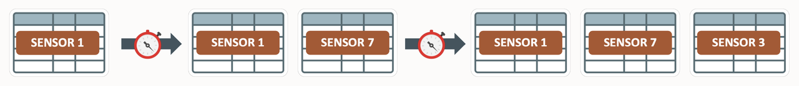
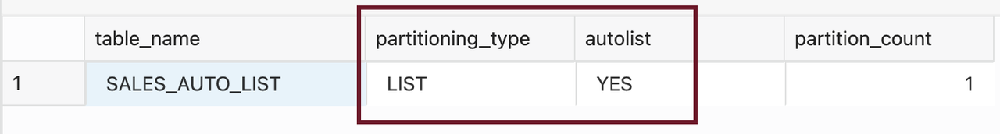
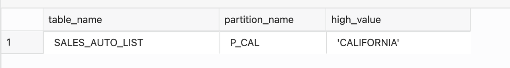
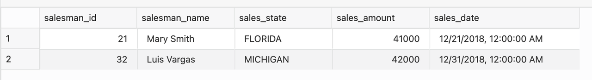
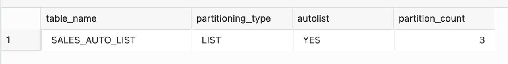
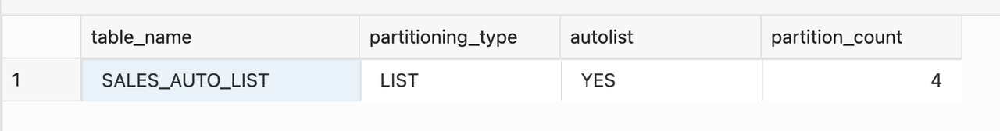
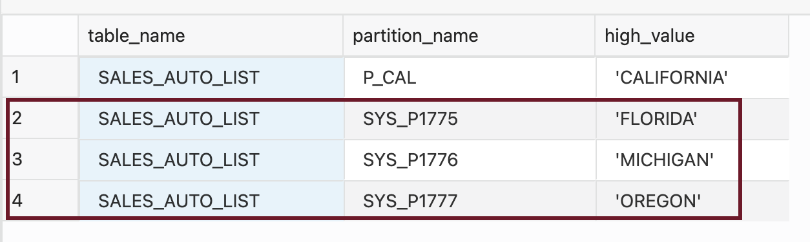
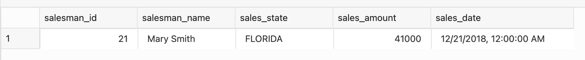

# Auto-list Partitioning 

## Introduction
 
The automatic list partitioning method enables list partition creation on demand. An auto-list partitioned table is similar to a regular list partitioned table, except that this partitioned table is easier to manage. You can create an auto-list partitioned table using only the partitioning key values that are known. As data is loaded into the table, the database automatically creates a new partition if the loaded partitioning key value does not correspond to any of the existing partitions. 
 
 

 Estimated Lab Time: 20 minutes

### About Auto-list Partitioning

 Auto list partitions are created on-demand automatically, and the auto-list partitioning method is conceptually similar to the current interval partitioning method. The CREATE and ALTER TABLE SQL statements are updated with an additional clause to specify AUTOMATIC or MANUAL list partitioning. An automatic list-partitioned table must have at least one partition when created. 

### Features

*  Partitions are created as data arrives automatically
*  Extension to LIST partitioning
*  System generated partition names for auto-created partitions
*  Only requirement is no DEFAULT partition


### Automatic list partitioning use case

A typical use case for automatic list partitioning is when a company currently deals with customers from the USA, UK, and Ireland. You want to partition your orders table based on the country. Another example is partitioning sensor data on IoT (Internet of Things) applications, such as humidity, temperature, climate, pressure and air quality changes. These sensors' measurement values change.
 
### Objectives
 
In this lab, you will:
* Create Auto-list Partitioning 

### Prerequisites
This lab assumes you have completed the following lab:

- Provision an Oracle Autonomous Database and Autonomous Data Warehouse has been created

## Task 1: Create Auto-list Partitioned Table

1. Create an automatic list partitioned table with one required partition:
 
      ```
      <copy>
      CREATE TABLE sales_auto_list  
      (  
         salesman_id   NUMBER(5)    NOT NULL,  
         salesman_name VARCHAR2(30),  
         sales_state   VARCHAR2(20) NOT NULL,  
         sales_amount  NUMBER(10),  
         sales_date    DATE         NOT NULL  
      )  
      PARTITION BY LIST (sales_state) AUTOMATIC  
      (PARTITION P_CAL VALUES ('CALIFORNIA')  
      );
      </copy>
      ```

2. View data in SALES\_AUTO\_LIST table
 
      ```
      <copy>
      SELECT TABLE_NAME, PARTITIONING_TYPE, AUTOLIST, PARTITION_COUNT FROM USER_PART_TABLES WHERE TABLE_NAME ='SALES_AUTO_LIST';
      </copy>
      ```

      

      ```
      <copy>
      SELECT TABLE_NAME, PARTITION_NAME, HIGH_VALUE FROM USER_TAB_PARTITIONS WHERE TABLE_NAME ='SALES_AUTO_LIST';
      </copy>
      ```

 

3. Insert data into SALES\_AUTO\_LIST table

      ```
      <copy>
      INSERT INTO SALES_AUTO_LIST VALUES(021, 'Mary Smith', 'FLORIDA', 41000, TO_DATE ('21-DEC-2018','DD-MON-YYYY'));
      INSERT INTO SALES_AUTO_LIST VALUES(032, 'Luis Vargas', 'MICHIGAN', 42000, TO_DATE ('31-DEC-2018','DD-MON-YYYY')); 
      </copy>
      ```

4. View data in SALES\_AUTO\_LIST table

      ```
      <copy>
      select * from SALES_AUTO_LIST;
      </copy>
      ```

      

5. View data in USER\_PART\_TABLES  

      ```
      <copy>
      SELECT TABLE_NAME, PARTITIONING_TYPE, AUTOLIST, PARTITION_COUNT FROM USER_PART_TABLES WHERE TABLE_NAME ='SALES_AUTO_LIST';
      </copy>
      ```

      

6. Insert data into SALES\_AUTO\_LIST table 

      ```
      <copy>
      INSERT INTO SALES_AUTO_LIST VALUES(015, 'Simone Blair', 'CALIFORNIA', 45000, TO_DATE ('11-JAN-2019','DD-MON-YYYY'));
      INSERT INTO SALES_AUTO_LIST VALUES(015, 'Simone Blair', 'OREGON', 38000, TO_DATE ('18-JAN-2019','DD-MON-YYYY'));
      </copy>
      ```

7. View data in USER\_PART\_TABLES   

      ```
      <copy>
      SELECT TABLE_NAME, PARTITIONING_TYPE, AUTOLIST, PARTITION_COUNT FROM USER_PART_TABLES WHERE TABLE_NAME ='SALES_AUTO_LIST';
      </copy>
      ```

      

8. View data in SALES\_AUTO\_LIST table and note down a partition name.


      ```
         <copy>
         SELECT TABLE_NAME, PARTITION_NAME, HIGH_VALUE FROM USER_TAB_PARTITIONS WHERE TABLE_NAME ='SALES_AUTO_LIST';
         </copy>
      ```

      

9. View data in SALES\_AUTO\_LIST table by partition name. Replace SYS\_P1775 in the below query with the partition name you noted earlier.

      ```
      <copy>
      select * from SALES_AUTO_LIST PARTITION(SYS_P1775);
      </copy>
      ```

      

## Task 2: Cleanup

1. Clean up the environment by dropping the table

      ```
      <copy>
      rem drop everything 
      drop table sales_auto_list purge;
      </copy>
      ```
  
You successfully made it to the end of the 'auto-list partitioning' Lab.

You may now *proceed to the next lab*.

## Learn More

* [Automatic List Partitioning](https://livesql.oracle.com/apex/livesql/file/content_HU7JYQY0PKB0PHLIGNXWWEYLO.html)
* [Database VLDB and Partitioning Guide](https://docs.oracle.com/en/database/oracle/oracle-database/21/vldbg/create-composite-partition-table.html#GUID-9ECF0F94-57BB-45F8-824F-48B320F23D9C)

## Acknowledgements

- **Author** - Madhusudhan Rao, Principal Product Manager, Database
* **Contributors** - Kevin Lazarz, Senior Principal Product Manager, Database  
* **Last Updated By/Date** -  Madhusudhan Rao, Feb 2022 
