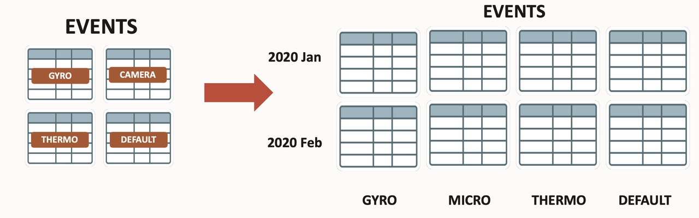
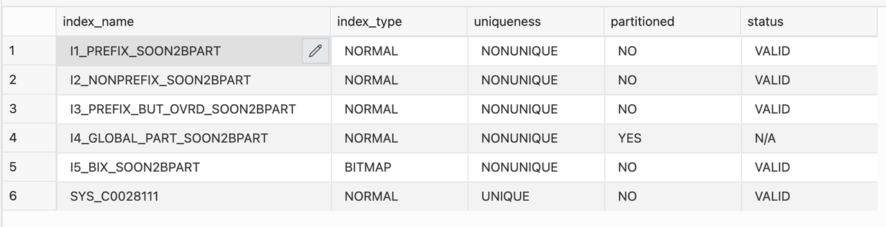
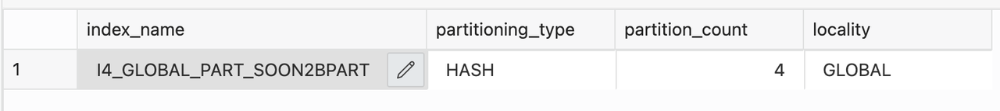
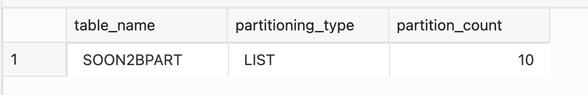
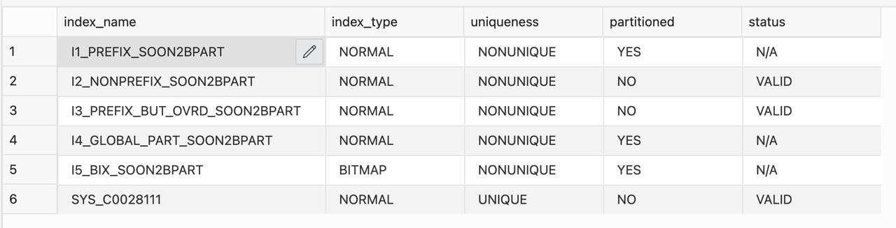
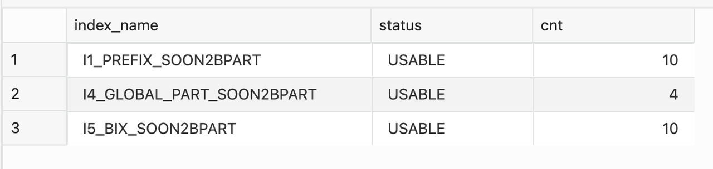

# Convert Non Partitioned Table into Partitioned Table 

## Introduction
 
Oracle Database provides a mechanism to move one or more partitions or to make other changes to the partitions' physical structures without significantly affecting the availability of the partitions for DML.  


 
Estimated Lab Time: 20 minutes

### Convert a Non Partitioned Table into Partitioned Table 
Convert a Non-Partitioned Table to a Partitioned Table with a MODIFY clause added to the ALTER TABLE SQL statement. In addition, the keyword ONLINE can be specified, enabling concurrent DML operations while the conversion is ongoing.

### Features

* Indexes are converted and kept online throughout the conversion.
* Default indexing rules to provide minimal to no access change behaviour.
* Local indexes stay local if any of the partition keys of the two dimensions is included
* Global prefixed partitioned indexes will be converted to local partitioned indexes.
 
### Objectives
 
In this lab, you will:
* Convert Non-partitioned Table to Partitioned Table

### Prerequisites
This lab assumes you have completed the following lab:

- Provision an Oracle Autonomous Database and Autonomous Data Warehouse has been created

## Task 1: Convert Non Partitioned Table to Partitioned Table

1. Let's Convert a non-partitioned table to a partitioned table

    ```
    <copy>
    rem sample nonpartitioned table
    create table soon2bpart (col1 number primary key, col2 number, col3 number not null, col4 number);
    insert /*+ append */ into soon2bpart 
    select rownum, mod(rownum,100), mod(rownum,1000), dbms_random.normal from dual connect by level <=10;
    commit;
    </copy>
    ```

2. Our sample table needs a couple of indexes, so let's create them

    ```
    <copy>
    rem create a bunch of different indexes on it
    rem some indexes, different shape and type
    create index i1_prefix_soon2bpart on soon2bpart(col2);
    create index i2_nonprefix_soon2bpart on soon2bpart(col4);
    create index i3_prefix_but_ovrd_soon2bpart on soon2bpart(col3, col2);
    create index i4_global_part_soon2bpart on soon2bpart(col3) global partition by hash(col3) partitions 4;
    create bitmap index i5_bix_soon2bpart on soon2bpart (col2,col3);
    </copy>
    ```

3. Let's see the index metadata for our table as it exists before the conversion.

    ```
    <copy>
    rem indexes in general
    select index_name, index_type, uniqueness, partitioned, status 
    from user_indexes
    where table_name='SOON2BPART'
    order by 1;
    </copy>
    ```

    

    ```
    <copy>
    rem partitioned index
    select index_name, partitioning_type, partition_count, locality 
    from user_part_indexes
    where table_name='SOON2BPART'
    order by 1;
    </copy>
    ```

    

4. The conversion is not an in-place conversion: one of the critical concepts of Oracle Partitioning is that data of individual partitions are, well, stored in individual physical segments. The non-partitioned table has data stored "wherever" in the table. You will need the extra space for the new table partition and index segments during the conversion. After the successful conversion,  Note that we are doing an online conversion. If you could spawn a second session that does DML against our table while the conversion is in place, you'd experience that all your DML will go through without being blocked. 

    ```
    <copy>
    rem do an online conversion
    rem - only one index will not use default conversion
    alter table soon2bpart modify
    partition by list (col2) automatic
    (partition p1 values (1)) online
    update indexes (i3_prefix_but_ovrd_soon2bpart global);
    </copy>
    ```

5. The table is now converted. Let's see the table partitioning metadata.

    ```
    <copy>
    rem partitioning metadata
    select table_name, partitioning_type, partition_count 
    from user_part_tables where table_name='SOON2BPART';
    select partition_name, high_value 
    from user_tab_partitions where table_name='SOON2BPART'
    order by partition_position asc;
    </copy>
    ```

    

6. Global partitioned indexes are untouched and retain their shape. Non-prefixed indexes will become global non-partitioned tables.
Prefixed indexes will become local partitioned indexes. Bitmap indexes will become local partitioned indexes. So let's check the indexed shape and their status.

    ```
    <copy>
    rem indexes general
    select index_name, index_type, uniqueness, partitioned, status 
    from user_indexes
    where table_name='SOON2BPART'
    order by 1;
    </copy>
    ```

7. You see that the conversion rules were applied as discussed, except index I1B\_SOON2BPART, which was defined as a global non-partitioned index as part of the conversion.

    ```
    <copy>
    rem partitioned indexes
    select index_name, partitioning_type, partition_count, locality 
    from user_part_indexes
    where table_name='SOON2BPART'
    order by 1;
    </copy>
    ```

    

8. All the index partitions are also in a valid state:

    ```
    <copy>
    rem status of partitioned index
    select ip.index_name, ip.status, count(*) cnt
    from user_ind_partitions ip, user_indexes i
    where i.index_name=ip.index_name and table_name='SOON2BPART'
    group by ip.index_name, ip.status
    order by 1;
    </copy>
    ```

    

## Task 2: Cleanup
 
1. Clean up the environment by dropping the table 
   
    ```
    <copy>
    rem cleanup of all objects
    drop table SOON2BPART purge; 
    </copy>
    ```

You successfully made it to the end of this Convert non-partitioned table into partitioned table lab.

## Learn More

* [Automatic List Partitioning](https://livesql.oracle.com/apex/livesql/file/content_HU7JYQY0PKB0PHLIGNXWWEYLO.html)
* [Database VLDB and Partitioning Guide](https://docs.oracle.com/en/database/oracle/oracle-database/21/vldbg/create-composite-partition-table.html#GUID-9ECF0F94-57BB-45F8-824F-48B320F23D9C)

## Acknowledgements

- **Author** - Madhusudhan Rao, Principal Product Manager, Database
* **Contributors** - Kevin Lazarz, Senior Principal Product Manager, Database  
* **Last Updated By/Date** -  Madhusudhan Rao, Feb 2022 
