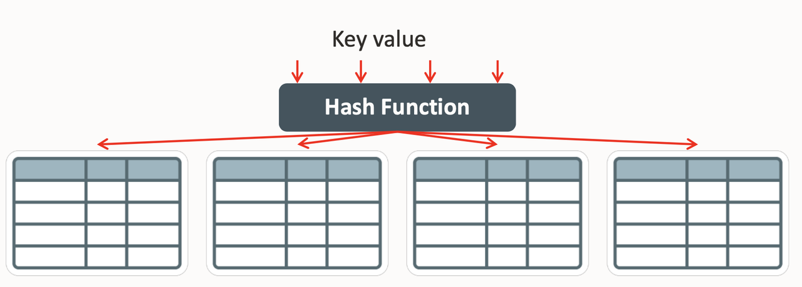
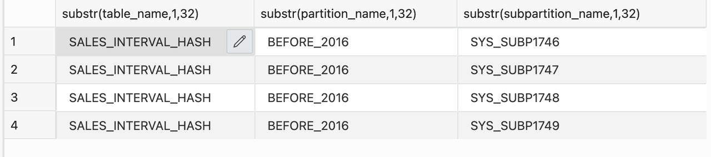
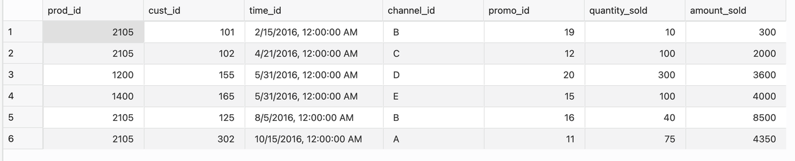
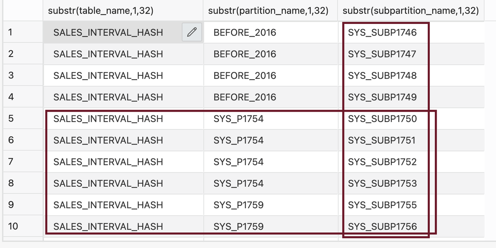

# Hash Partitioning 

## Introduction

Hash partitioning maps data to partitions based on Oracle's hashing algorithm to the partitioning key that you identify. The hashing algorithm evenly distributes rows among partitions, giving partitions approximately the same size. Composite hash-* partitioning enables hash partitioning along two dimensions. The composite hash-hash partitioning strategy has the most business value of the composite hash-* partitioned tables. This technique is beneficial to enable partition-wise joins along two dimensions.

 

Estimated Lab Time: 20 minutes

### About Hash Partitioning

Hash partitioning is the ideal method for distributing data evenly across devices. Hash partitioning is also an easy-to-use alternative to range partitioning, predominantly when the data partitioned is not historical or has no obvious partitioning key.

### Features

* Introduced with Oracle 8.1
* Hash Partition Is a single level partition
* Data is placed based on hash value of partition key
* Ideal for equal data distribution
* Number of partitions should be a power of 2 for equal data distribution


### Data partition based on product list or hash values 

In a regular E-Commerce website, Product listing, filtering and sorting determines how easy or difficult it is for customers to browse through product catalogues. During usability tests by UI experts, there is a very high chance of customers purchasing a product that is well organized and easy to find. Below is a simple example of how online store data can be hash partitioned for cricket sports gears where each of these (bat, ball etc.) are named tablespaces.   

```
<copy>
CREATE TABLE cricketset
     (id NUMBER,
      name VARCHAR2 (60))
   PARTITION BY HASH (id)
   PARTITIONS 7 
   STORE IN (bat, ball, stumps, wicket, gloves, pads, guards);
</copy>
```
 
### Objectives

In this lab, you will:
* Create Interval Hash Partitioned Table
  
### Prerequisites
This lab assumes you have completed the following lab:

- Provision an Oracle Autonomous Database and Autonomous Data Warehouse has been created
 
## Task 1: Create Interval Hash Partitioned Table

1. Let's Create interval hash partitioned table with customer id as a hash value, and data is partitioned before 2016 and after 2016.

      ```
      <copy>
      CREATE TABLE sales_interval_hash   
        ( prod_id       NUMBER(6)    
        , cust_id       NUMBER    
        , time_id       DATE    
        , channel_id    CHAR(1)    
        , promo_id      NUMBER(6)    
        , quantity_sold NUMBER(3)    
        , amount_sold   NUMBER(10,2)    
        )    
        PARTITION BY RANGE (time_id) INTERVAL (NUMTOYMINTERVAL(1,'MONTH'))    
        SUBPARTITION BY HASH (cust_id) SUBPARTITIONS 4    
        (
        PARTITION before_2016 VALUES LESS THAN (TO_DATE('01-JAN-2016','dd-MON-yyyy'))    
        );
      </copy>
      ```  

2. Display the partitions/sub partitions in the table with this SQL query. System generated names have been assigned to the partitions and sub partitions. Note that there are 32 sub partitions (4 x 8 = 32).
 
      ```
        <copy>
        SELECT SUBSTR(TABLE_NAME,1,32), SUBSTR(PARTITION_NAME,1,32), SUBSTR(SUBPARTITION_NAME,1,32) FROM USER_TAB_SUBPARTITIONS WHERE TABLE_NAME ='SALES_INTERVAL_HASH';
        </copy>
      ``` 

  

## Task 2: Insert Data and View Partitioned Data

1. Insert data into sales\_interval\_hash table

     ```
        <copy>
        INSERT INTO sales_interval_hash VALUES (2105, 101, '15-FEB-16', 'B', 19, 10, 300.00) ;
        INSERT INTO sales_interval_hash VALUES (2105, 102, '21-APR-16', 'C', 12, 100, 2000.00) ;
        INSERT INTO sales_interval_hash values (1200, 155, '31-MAY-16', 'D', 20, 300, 3600.00);
        INSERT INTO sales_interval_hash values (1400, 165, '31-MAY-16', 'E', 15, 100, 4000.00);
        INSERT INTO sales_interval_hash VALUES (2105, 125, '05-AUG-16', 'B', 16, 40, 8500.00);
        INSERT INTO sales_interval_hash VALUES (2105, 302, '15-OCT-16', 'A', 11, 75, 4350.00); 
        </copy>
     ``` 

2. Display the data in the table

     ```
        <copy>
        select * from sales_interval_hash;
        </copy>
     ```

     

3. Display the partitions and sub partitions in the table with this SQL query. Please note that the table's structure changed with new data. Each unique time\_id for 2016 generates a new partition with four sub partitions.

     ```
        <copy>
        SELECT SUBSTR(TABLE_NAME,1,32), SUBSTR(PARTITION_NAME,1,32), SUBSTR(SUBPARTITION_NAME,1,32) FROM USER_TAB_SUBPARTITIONS WHERE TABLE_NAME ='SALES_INTERVAL_HASH';
        </copy>
     ```

4. The highlighted rows and columns are system generated Partitions and Sub Partitions. Note down a partition name.

    

5. Insert a new record for year 2012 

     ```
        <copy> 
        INSERT INTO sales_interval_hash VALUES (2199, 302, '10-OCT-12', 'A', 11, 75, 4350.00);
        </copy>
     ``` 

6. View data in sales\_interval\_hash table by partition before 2016 

     ```
        <copy> 
        select * from SALES_INTERVAL_HASH PARTITION(BEFORE_2016); 
        </copy>
     ```

    

7. View data in sales\_interval\_hash table by system-generated partition. In the below example, SYS_P1754 is system generated partition name. Replace SYS\_P1754 in the below query with the partition name you noted earlier.

      ```
        <copy> 
        select * from SALES_INTERVAL_HASH PARTITION(SYS_P1754); 
        </copy>
      ```

      
 
## Task 3: Cleanup

1. Clean up the environment by dropping the table  

      ```
      <copy>
      rem drop everything 
      drop table sales_interval_hash purge;
      </copy>
      ``` 
 
You successfully made it to the end of this Hash partitioning lab.

You may now *proceed to the next lab*.  

## Learn More

* [Interval Hash Partitioning](https://livesql.oracle.com/apex/livesql/file/content_D08SNCFK262QXWD210YL8JLA0.html)
* [Database VLDB and Partitioning Guide](https://docs.oracle.com/en/database/oracle/oracle-database/21/vldbg/create-composite-partition-table.html#GUID-9ECF0F94-57BB-45F8-824F-48B320F23D9C)

## Acknowledgements

- **Author** - Madhusudhan Rao, Principal Product Manager, Database
* **Contributors** - Kevin Lazarz, Senior Principal Product Manager, Database  
* **Last Updated By/Date** -  Madhusudhan Rao, Feb 2022 
