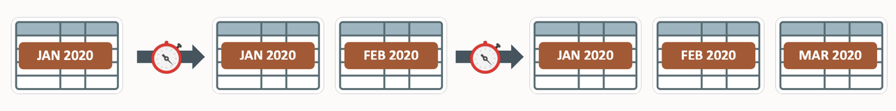
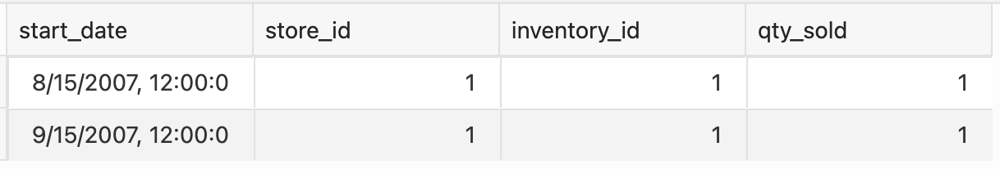
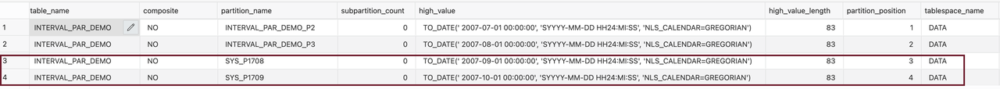
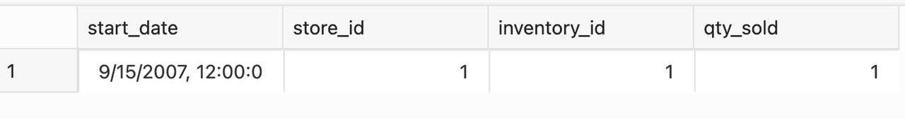

# Interval Partitioning 

## Introduction
Interval partitioning is an extension to range partitioning in which database table partition is done based on intervals rather than just date itself. The INTERVAL clause of the CREATE TABLE statement establishes interval partitioning for the table. You must specify at least one range partition using the PARTITION clause. The range partitioning key value determines the high value of the range partitions, called the transition point. The database automatically creates interval partitions for data beyond that transition point. The lower boundary of every interval partition is the non-inclusive upper boundary of the previous range or interval partition. 

 

 This Lab will teach you how to create interval partitioning.

 Estimated Lab Time: 20 minutes

### About Interval Partitioning

Interval partitioning is an extension of range partitioning that instructs the database to automatically create partitions of a specified interval when data inserted into the table exceeds all existing range partitions. You must specify at least one range partition. The range partitioning key value determines the high value of the range partitions, called the transition point. The database creates interval partitions for data with values beyond that transition point. The lower boundary of every interval partition is the non-inclusive upper boundary of the previous range or interval partition.

### Features

*	Introduced with Oracle 11g
*	Extension to range partitioning
*	Full Automation for equal-sized range partitions
*	Part of composite level partitioning 
*	Difference interval and range Partitioning 
*	System generated names for interval 
*	No need for any partition management

### Analyze Business Data at Various Intervals 

When Business Analysts want to view sales data based on daily, monthly, quarterly or yearly, for example, in Financial Services or Retail Industry, it is easier to partition data based on intervals. As the data grows, the partitions keep getting created automatically.  
 
### Objectives
 
In this lab:
* Let us Create interval partitioned table

### Prerequisites
This lab assumes you have completed the following lab:

- Provision an Oracle Autonomous Database and Autonomous Data Warehouse has been created
  
## Task 1: Create Interval Partitioned Table

1. Let's create interval partitioned table. The following example specifies two partitions with varying interval widths of one month.
 
      ```
      <copy>
      create table  
      interval_par_demo (  
      start_date        DATE, 
      store_id          NUMBER, 
      inventory_id      NUMBER(6), 
      qty_sold          NUMBER(3) 
      )  
      PARTITION BY RANGE (start_date)  
      INTERVAL(NUMTOYMINTERVAL(1, 'MONTH'))  
      (   
      PARTITION interval_par_demo_p2 VALUES LESS THAN (TO_DATE('1-7-2007', 'DD-MM-YYYY')), 
      PARTITION interval_par_demo_p3 VALUES LESS THAN (TO_DATE('1-8-2007', 'DD-MM-YYYY'))  
      );
      </copy>
      ```

## Task 2: Auto Generate Interval Partitions


1. Insert records
   
      ```
      <copy>
      insert into interval_par_demo (start_date, store_id, inventory_id, qty_sold)  
      values ( '15-AUG-07', 1, 1, 1); 
      insert into interval_par_demo (start_date, store_id, inventory_id, qty_sold)  
      values ( '15-SEP-07', 1, 1, 1);
      </copy>
      ```  

      view data in USER\_TAB\_PARTITIONS table

      ```
      <copy>
      SELECT  
         TABLE_NAME,  
         PARTITION_NAME,  
         PARTITION_POSITION,  
         HIGH_VALUE 
      FROM  
         USER_TAB_PARTITIONS  
      WHERE  
         TABLE_NAME='INTERVAL_PAR_DEMO' 
      ORDER BY  
         PARTITION_NAME;
      </copy>
      ```

2. Data in  interval\_par\_demo  table 

   

   Data in  USER\_TAB\_PARTITIONS 

   

   Note down the two partition names.

3. Here SYS\_P1708 and SYS\_P1709 are auto-generated partitions based on intervals. Let's verify data in newly created partitions. Note that the auto generated partition name might vary in your instance. Replace the SYS\_P1708 and SYS\_P1709 in the below queries with your partition names.

      ```
      <copy> 
      SELECT * FROM interval_par_demo PARTITION(SYS_P1708);
      </copy>
      ```
      

      ```
      <copy> 
      SELECT * FROM interval_par_demo PARTITION(SYS_P1709);
      </copy>
      ```
      

## Task 3: Cleanup

1. Clean up the environment by dropping the table 
 
      ```
      <copy>
      rem cleanup of all objects
      drop table interval_par_demo purge; 
      </copy>
      ```
   
You successfully made it to the end of this Interval Partitions lab.
   
You may now *proceed to the next lab*.

## Learn More

* [Interval Partitioning](https://livesql.oracle.com/apex/livesql/file/content_O2Q47KN64Y8T46UK19XX43LYR.html)
* [Database VLDB and Partitioning Guide](https://docs.oracle.com/en/database/oracle/oracle-database/21/vldbg/partition-create-tables-indexes.html)

## Acknowledgements

- **Author** - Madhusudhan Rao, Principal Product Manager, Database
* **Contributors** - Kevin Lazarz, Senior Principal Product Manager, Database  
* **Last Updated By/Date** -  Madhusudhan Rao, Feb 2022 
