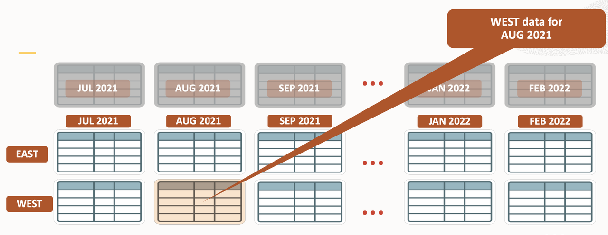
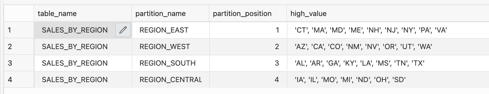
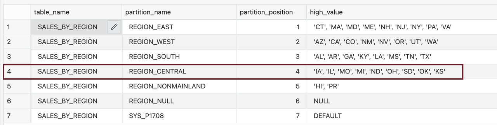
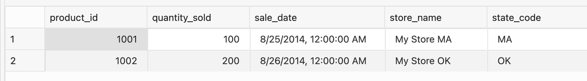
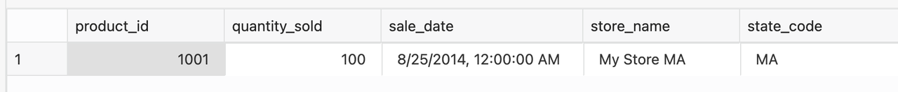

# List Partitioning 

## Introduction

List partitioning enables you to explicitly control how rows map to partitions by specifying a list of discrete values for each partitioning key in each partition's description. The advantage of list partitioning is that you can group and organize unordered and unrelated data sets. For a table with a region column as the partitioning key, the East Sales Region partition might contain New York, Virginia, and Florida values. The semantics for creating list partitions are similar to those for creating range partitions. 

The semantics for creating list partitions are similar to those for creating range partitions. You specify a PARTITION BY LIST clause in the CREATE TABLE statement to create list partitions. The partitioning key can be one or multiple column names from the table for list partitioning.

Estimated Lab Time: 20 minutes

### About List Partitioning

Unlike range partitioning, there is no apparent sense of order between partitions with list partitioning. You can also specify a default partition into which rows that do not map to any other partition are mapped. 

### Features

*	Introduced with Oracle 9.0
*	List Partition Is a single level partition  
*	Data is organized in lists of values
*	One or more unordered distinct values per list
*	Ideal for segmentation of distinct values, for example, region

### Weather forecasting or sales forecasting based on regional list

Weather forecasts are made by collecting quantitative data about the current atmosphere at a given place and using meteorology to project how the atmosphere will change. Weather forecasting is a part of the economy. For example, in 2009, the US spent approximately $5.1 billion on weather forecasting, producing benefits estimated at six times as much.
The volume of data keeps growing, and analyzing previous regional data can be performance intensive. Since the weather data has geographical location, date, changes in temperature and humidity, this is a good case for partitioning data based on a regional list of values or using List partitioning. Another good example would be partitioning sales data based on regions for business reporting purposes, as shown below task list.




This Lab will teach you how to List Partitioning. 
  
### Objectives
 
In this lab, you will:
* Create list partitioning

### Prerequisites
This lab assumes you have completed the following lab:

- Provision an Oracle Autonomous Database and Autonomous Data Warehouse has been created

## Task 1: Create List Partitioned Table

1. Let's create list partitioned table:
 
      ```
      <copy>
      CREATE TABLE sales_by_region ( 
         product_id     NUMBER(6), 
         quantity_sold  INTEGER, 
         sale_date      DATE, 
         store_name     VARCHAR(30), 
         state_code     VARCHAR(2) 
      ) 
      PARTITION BY LIST (state_code) 
      ( 
         PARTITION region_east 
            VALUES ('CT','MA','MD','ME','NH','NJ','NY','PA','VA'), 
         PARTITION region_west 
            VALUES ('AZ','CA','CO','NM','NV','OR','UT','WA'), 
         PARTITION region_south 
            VALUES ('AL','AR','GA','KY','LA','MS','TN','TX'), 
         PARTITION region_central 
            VALUES ('IA','IL','MO','MI','ND','OH','SD') 
      );
      </copy>
      ```

2. View the data in sales\_by\_region table

      ```
      <copy>
      SELECT TABLE_NAME,PARTITION_NAME, PARTITION_POSITION, HIGH_VALUE FROM USER_TAB_PARTITIONS WHERE TABLE_NAME ='SALES_BY_REGION';
      </copy>
      ```

      

## Task 2: Add New Partitions

1. Add a new partition to the table.

      ```
      <copy>
      ALTER TABLE sales_by_region ADD PARTITION region_nonmainland VALUES ('HI','PR');
      </copy>
      ```

2. Add a new partition to the table for NULL values.

      ```
      <copy>
      ALTER TABLE sales_by_region ADD PARTITION region_null VALUES (NULL);
      </copy>
      ```

3. Add a new partition to the table for values that do not map to any other partition.

      ```
      <copy>
      ALTER TABLE sales_by_region ADD PARTITION VALUES (DEFAULT);
      </copy>
      ```  

4. Display the partitions in the table after adding new partitions.

      ```
      <copy>
      SELECT TABLE_NAME,PARTITION_NAME, PARTITION_POSITION, HIGH_VALUE FROM USER_TAB_PARTITIONS WHERE TABLE_NAME ='SALES_BY_REGION';
      </copy>
      ``` 

      

5. Add new values to a list of partitioning keys.

      ```
      <copy>
      ALTER TABLE sales_by_region  MODIFY PARTITION region_central  ADD VALUES ('OK','KS');
      </copy>
      ``` 
 
6. Display the partitions in the table after modifying a partition.

      ```
      <copy>
      SELECT TABLE_NAME,PARTITION_NAME, PARTITION_POSITION, HIGH_VALUE FROM USER_TAB_PARTITIONS WHERE TABLE_NAME ='SALES_BY_REGION';
      </copy>
      ``` 

   

7. Insert values into the table.

      ```
      <copy>
      INSERT INTO sales_by_region VALUES (1001,100,'25-AUG-2014','My Store MA','MA');
      INSERT INTO sales_by_region VALUES (1002,200,'26-AUG-2014','My Store OK','OK');
      </copy>
      ``` 

8. Display all the data in the table.

      ```
      <copy>
      SELECT * FROM sales_by_region;
      </copy>
      ``` 

      

## Task 3: Partitioned Data by Partition Name

1. Display data from a specified partition in the table.  

      ```
      <copy>
      SELECT * FROM sales_by_region PARTITION(region_east);
      </copy>
      ``` 

      

## Task 4: Cleanup

1. Clean up the environment by dropping the table  

      ```
      <copy>
      rem drop everything succeeds
      drop table sales_by_region purge;
      </copy>
      ```

You successfully made it to the end of this 'read only partitions and sub partitions' lab. 
      
You may now *proceed to the next lab*.
 
## Learn More

* [Interval Partitioning](https://livesql.oracle.com/apex/livesql/file/content_EWT612PKY4EJZ4FEYTA52Q00.html)
* [Database VLDB and Partitioning Guide](https://docs.oracle.com/en/database/oracle/oracle-database/21/vldbg/partition-create-tables-indexes.html)

## Acknowledgements

- **Author** - Madhusudhan Rao, Principal Product Manager, Database
* **Contributors** - Kevin Lazarz, Senior Principal Product Manager, Database  
* **Last Updated By/Date** -  Madhusudhan Rao, Feb 2022 
