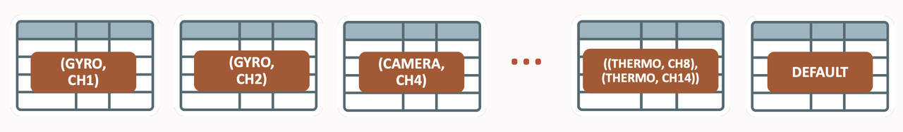
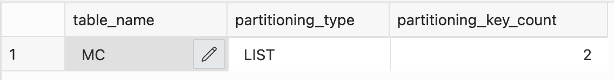
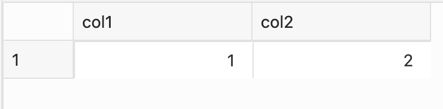
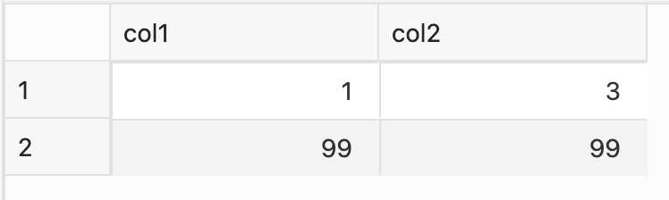

# Multi Column List Partitioning 

## Introduction
  
Multi-column list partitioning enables you to partition a table based on list values of multiple columns. Similar to single-column list partitioning, individual partitions can contain sets containing lists of values. Multi-column list partitioning is supported on a table using the PARTITION BY LIST clause on multiple columns of a table.



Estimated Lab Time: 20 minutes

### Multi Column List Partitioning 

Multi-column list partitioning enables you to partition a table based on the list values of multiple columns. A multi-column list-partitioned table can only have one DEFAULT partition. 

### Features

* Data is organized in lists of multiple values (multiple columns)
* Individual partitions can contain sets of multiple values
* Functionality of DEFAULT partition (catch-it-all for unspecified values)
* Ideal for segmentation of distinct value tuples, example (sensor_type, channel, ... )  

### Multi-Column List Partitioning Usecase

An excellent example for multi-column list partitioning is segregating sensor data and various channel data on IoT (Internet of Things) applications, such as humidity, temperature, climate, pressure and air quality changes. These sensors' measurement values keep changing constantly.
 
### Objectives
 
In this lab, you will:
* Create Multi Column List Partitioning 

### Prerequisites
This lab assumes you have completed the following lab:

- Provision an Oracle Autonomous Database and Autonomous Data Warehouse has been created

## Task 1: Create Multi Column List Partitioned Table

1. Create multi-column list partitioned table

    ```
    <copy>
    rem simple multi-column list partitioned table
    create table mc (col1 number, col2 number)
    partition by list (col1, col2)
    (partition p1 values ((1,2),(3,4)),
    partition p2 values ((4,4)),
    partition p3 values (default));
    </copy>
    ```

2. The metadata of this table is as follows. You can also identify multi-column list partitioning by looking at the number of partition keys in the table metadata.

    ```
    <copy>
    rem table metadata - number of partition keys
    select table_name, partitioning_type, partitioning_key_count 
    from user_part_tables where table_name='MC';
    </copy>
    ```
    
    ```
    <copy>
    rem metadata of individual partitions
    select partition_name, high_value
    from user_tab_partitions where table_name='MC';
    </copy>
    ```

    

3. Let us now insert some data into our previously created table and see where the data is actually stored.

    ```
    <copy>
    rem insert some sample data
    insert into mc values (1,2);
    insert into mc values (1,3);
    insert into mc values (99,99);
    commit;
    </copy>
    ```

4. Let's now check where the data. We will use first the partition extended syntax to point specifically to partition p1. We expect to see the only valid records with (1,2) or (3,4) as the partition key.
   
    ```
    <copy>
    rem content of partition p1 using partition extended syntax
    select * from mc partition (p1);
    </copy>
    ```

    


5. With multi-column partitioning you can also use the partition extended syntax with the FOR () clause. Point to a fully qualified record, meaning you have to specify a complete partitioning key criteria.

    ```
    <copy>
    rem content of DEFAULT partition using the partitioned extended syntax PARTITION FOR ()
    select * from mc partition for (1,3);
    </copy>
    ```

    


 6. Note that DEFAULT is not a value, so if you were to try to use it as "value" with the partitioned extended syntax you will get an error:
   
    ```
    <copy>
    rem wrong usage of partition extended syntax: DEFAULT is not a valid partition key value
    select * from mc partition for (default);
    </copy>
    ```

7. Let's do a standard partition maintenance operation. You will see that it behaves as it does for any other partitioning method; the only difference is that a fully qualified partition key now obviously consists of value pairs with values for all partition key columns.
   
    ```
    <copy>
    rem simple partition maintenance operation, demonstrating split
    alter table mc split partition p3 into (partition p3 values (1,3),partition p4) online;
    </copy>
    ```

8. Let's check the content of our "new" partition that we created by splitting the DEFAULT partition:

    ```
    <copy>
    rem content of partition p3 after split
    select * from mc partition (p3);
    </copy>
    ```

9. Let's quickly check the metadata of the table again to see what the split did:

    ```
    <copy>
    rem partition information for our table
    select partition_name, high_value
    from user_tab_partitions
    where table_name='MC'
    order by partition_position;
    </copy>
    ```

10. The new DEFAULT partition has all the rest of the records:

    ```
    <copy>
    rem content of partition p4 after the split, our new DEFAULT partition
    select * from mc partition (p4);
    </copy>
    ```

## Task 2: Cleanup

1. Clean up the environment by dropping the table 

    ```
    <copy>
    rem cleanup of all objects
    drop table mc purge; 
    </copy>
    ```

You successfully made it to the end of this 'multi-column list partitioning' lab.

You may now *proceed to the next lab*. 

## Learn More
 
* [Partitioning When Creating Tables and Indexes](https://docs.oracle.com/en/database/oracle/oracle-database/21/vldbg/partition-create-tables-indexes.html) 
* [Multi-column list Partitioning](https://livesql.oracle.com/apex/livesql/file/tutorial_EDVE861H5MO8DX16EGJ80HOTK.html)  

## Acknowledgements

- **Author** - Madhusudhan Rao, Principal Product Manager, Database
* **Contributors** - Kevin Lazarz, Senior Principal Product Manager, Database  
* **Last Updated By/Date** -  Madhusudhan Rao, Feb 2022 
