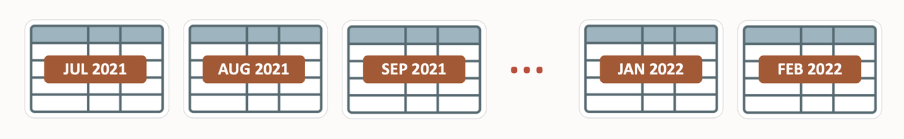
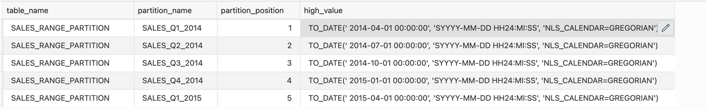
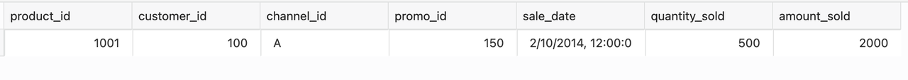
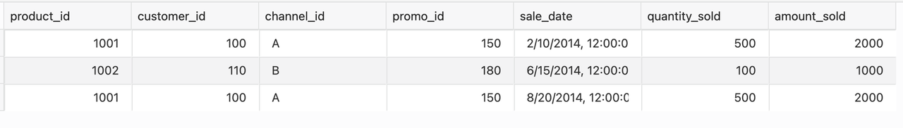

# Range Partitioning

## Introduction

Range partitioning maps data to partitions based on ranges of partition key values that you establish for each partition. It is the most common type of partitioning used with dates. For example, you might want to partition sales data into monthly partitions. The PARTITION BY RANGE clause of the CREATE TABLE statement specifies that the table or index is range-partitioned. The PARTITION clauses identify the individual partition ranges, and the optional subclauses of a PARTITION clause can select physical and other attributes specific to a partition segment.

Estimated Lab Time: 20 minutes

### About Range Partitioning

Range partitioning is the most common type of partitioning and is used with dates. For a table with a date column as the partitioning key, the January-2010 partition would contain rows with partitioning key values from 01-Jan-2010 to 31-Jan-2010.

Each partition has a VALUES LESS THAN clause that specifies a non-inclusive upper bound for the partitions. Any partitioning key values equal to or higher than this literal are added to the next higher partition. All partitions, except the first, have an implicit lower bound specified by the VALUES LESS THAN clause of the previous partition.

A MAXVALUE literal can be defined for the highest partition. MAXVALUE represents a virtual infinite value that sorts higher than any possible value for the partitioning key, including the NULL value.

### Features
 
*	Introduced with Oracle 8.0
*	Range Partition Is a single level partition
*	Ideal for chronological data 
*	Data can be Split and merged as necessary

### Sales data based on specific date range

Here are some interesting facts about the US Retail industry, Industry experts in US e-commerce project sales data to grow by double digits, up 17.9% in 2021 to $933.30 billion. Ecommerce penetration will continue to increase, more than doubling from 2019 to 23.6% in 2025. It means the growing volume of Customer and Sales Data and challenges with its manageability. The solution to managing such a vast volume of chronological or sales data would be to partition it based on date range or use Range partitioning.




This Lab will teach you how to create range partitioning. 

### Objectives
 
In this lab, you will:
* Create a range partitioned table  

### Prerequisites
This lab assumes you have completed the following lab:

- Provision an Oracle Autonomous Database and Autonomous Data Warehouse has been created
  
## Task 1: Create Range Partitioned Table

1. Let us Create range partitioned Table. The table is partitioned by range using the values of the sales\_date column. The partition bound is determined by the VALUES LESS THAN clause. 

    ```
    <copy>
    CREATE TABLE sales_range_partition ( 
        product_id       NUMBER(6), 
        customer_id      NUMBER, 
        channel_id       CHAR(1), 
        promo_id         NUMBER(6), 
        sale_date        DATE, 
        quantity_sold    INTEGER, 
        amount_sold      NUMBER(10,2) 
    ) 
    PARTITION BY RANGE (sale_date) 
    ( PARTITION sales_q1_2014 VALUES LESS THAN (TO_DATE('01-APR-2014','dd-MON-yyyy')), 
    PARTITION sales_q2_2014 VALUES LESS THAN (TO_DATE('01-JUL-2014','dd-MON-yyyy')), 
    PARTITION sales_q3_2014 VALUES LESS THAN (TO_DATE('01-OCT-2014','dd-MON-yyyy')), 
    PARTITION sales_q4_2014 VALUES LESS THAN (TO_DATE('01-JAN-2015','dd-MON-yyyy')) 
    );
    </copy>
    ```  

2. Display the partitions in the table with this SQL query.

    ```
    <copy> 
    SELECT TABLE_NAME,PARTITION_NAME, PARTITION_POSITION, HIGH_VALUE FROM USER_TAB_PARTITIONS WHERE TABLE_NAME ='SALES_RANGE_PARTITION';
    </copy>
    ```

3. Add a new partition to the table.

    ```
    <copy>
    ALTER TABLE sales_range_partition 
    ADD PARTITION sales_q1_2015 VALUES LESS THAN (TO_DATE('01-APR-2015','dd-MON-yyyy'));
    </copy>
    ```

4. Display the partitions in the table after adding the new partition.

    ```
    <copy>
    SELECT TABLE_NAME,PARTITION_NAME, PARTITION_POSITION, HIGH_VALUE FROM USER_TAB_PARTITIONS WHERE TABLE_NAME ='SALES_RANGE_PARTITION';
    </copy>
    ```

    

5. Insert values into the table.

    ```
    <copy>
    INSERT INTO sales_range_partition VALUES (1001,100,'A',150,'10-FEB-2014',500,2000);
    INSERT INTO sales_range_partition VALUES (1002,110,'B',180,'15-JUN-2014',100,1000);
    INSERT INTO sales_range_partition VALUES (1001,100,'A',150,'20-AUG-2014',500,2000);
    </copy>
    ```
  
6. Display data from a specified partition in the table. 

    ```
    <copy>
    SELECT * FROM sales_range_partition PARTITION(sales_q1_2014);
    </copy>
    ```

    

7. Display all the data in the table.

    ```
    <copy>
    SELECT * FROM sales_range_partition;
    </copy>
    ```

    8. Data in sales\_range\_partition table with and without Partition

    
    
      
## Task 2: Cleanup

1. Clean up the environment by dropping the table  
 
    ```
    <copy>
    DROP TABLE sales_range_partition; 
    </copy>
    ```
  
You successfully made it to the end of this Range Partitions lab.

You may now *proceed to the next lab*.

## Learn More

* [Range Partitioning](https://livesql.oracle.com/apex/livesql/docs/vldbg/partitioning/range-partitioning-example.html)
* [Database VLDB and Partitioning Guide](https://docs.oracle.com/en/database/oracle/oracle-database/21/vldbg/partition-create-tables-indexes.html)

## Acknowledgements

- **Author** - Madhusudhan Rao, Principal Product Manager, Database
* **Contributors** - Kevin Lazarz, Senior Principal Product Manager, Database  
* **Last Updated By/Date** -  Madhusudhan Rao, Feb 2022 
